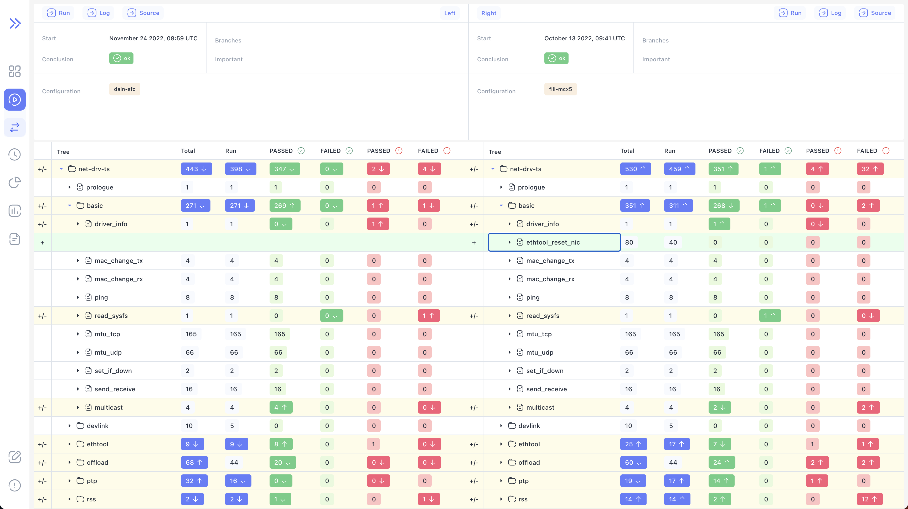
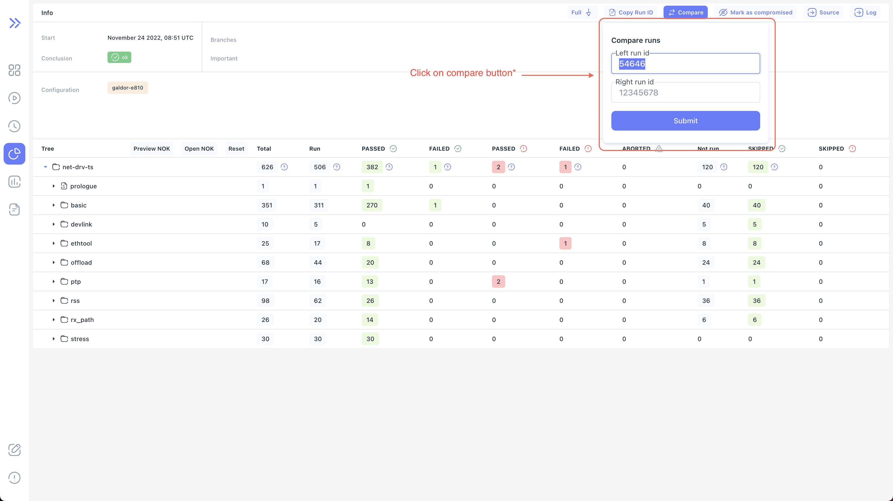
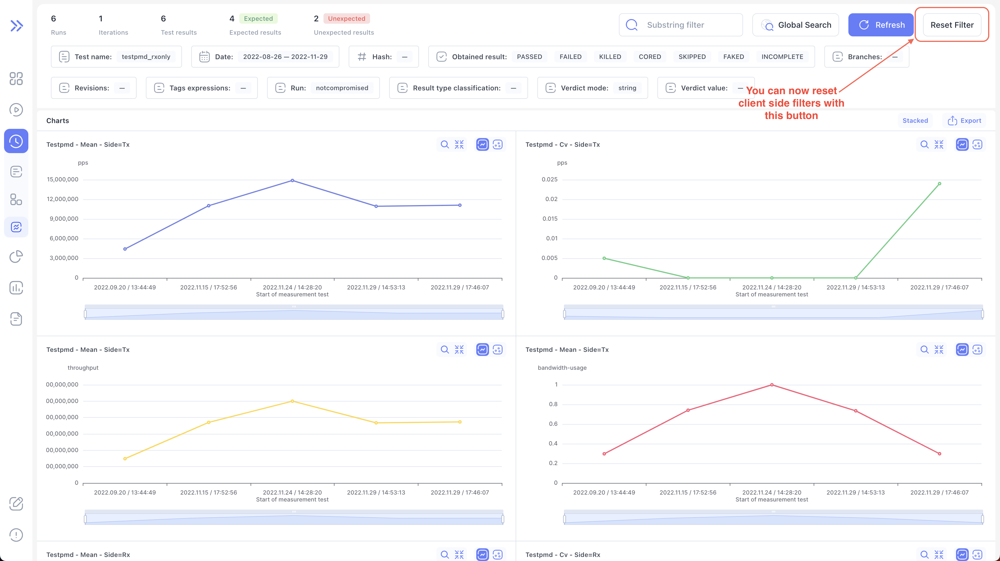
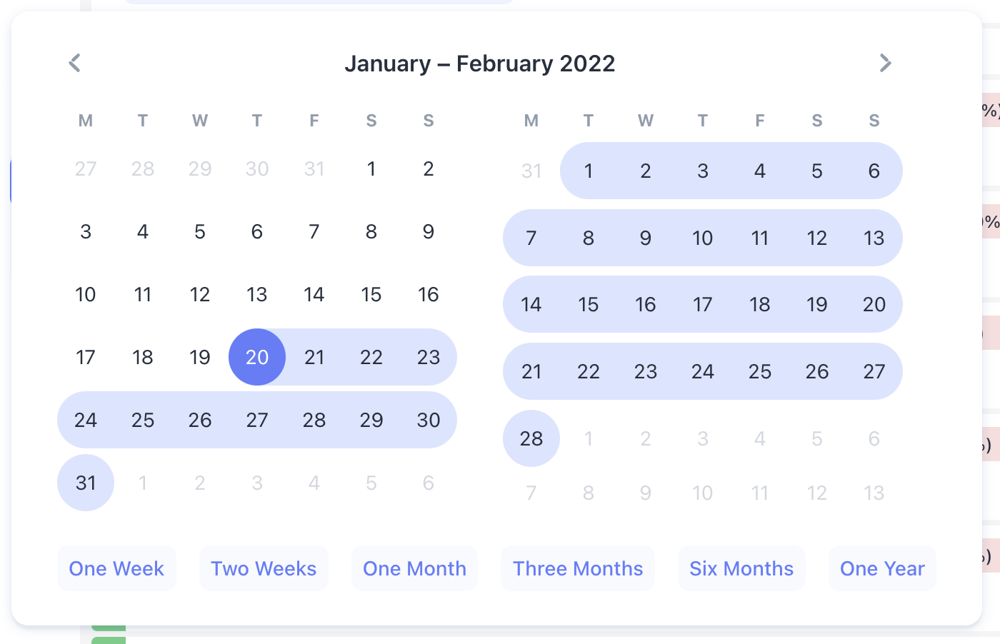

We are happy to announce **Bublik v0.1.1.**

We've added experimental support for comparing two runs, new datepicker component with better accessibility and keyboard navigation, new page mode for history where you can see values change over time and more.

<!--truncate-->

# Highlights

## Run Diff

:::caution

This feature is experimental and may not work as expected

:::``

### Diff view

In this release we've added experimental support for comparing two runs

### Access diff from runs page

You can now click on two run rows on runs page and select `Compare` button to compare them

### Access diff from run page

You can access this page via `Run` -> `Compare` button

---

## History

### Filter Reset

You can now reset client side filters in history page

:::info

Sometimes client side filters _(click search)_ may not work as expected. In this case you can reset them by clicking on `Reset filters` button

:::

### Measurements

We've also added a new page mode for history where you can see values change over time

#### Measurement Info

You can click on chart point to bring up modal with additional information as well as ability to jump directly to log/measurements/run

---

## New Date pickers

We've added new datepicker component with better accessibility and keyboard navigation

### Datepicker

### Date-range picker

---

## Changelog

### Frontend

#### 🚀 New Feature

- feat: add new datepicker component with better accessibility
- feat: add new datepicker range component with better accessibility
- feat(run): add URL state handling for run table
- feat(run): add ability to compare runs via form in run
- feat(run): add skeleton loading for run details state
- feat(run-diff): add initial run-diff page
- feat(measurements): add suspended ui and skeleton for history measurements
- feat(log): add skeleton loading to log tree
- feat(help): add better error message when couldn't fetch revisions
- feat(history): add reset client side filters button to history

#### 🐛 Bug Fix

- fix(run): `crtl + click` not applying filters to subtree
- fix(run-diff): change the way arrow direction is decided for run-diff
- fix(run-diff): improve package matching
- fix(help): tooltip with revision info not working
- fix(measurements): gap in value table column
- fix: enable horizontal scroll for badge input by default
- fix(measurements): export crashing on empty values
- refactor(runs): rewrite runs page with better architecture
- refactor(history): rewrite history page with better architecture

#### 💅 Polish

- fix(history): don't reset date range field in history global search
- feat(history): add history skeleton on no results found
- chore(history): add border around table rows
- feat(runs): add skeleton when no results found
- chore(runs): add border around table rows
- fix: badge rendering as button when no `onClick` handler passed

---

### Backend

#### 🚀 New Feature

- meta_categorization: change the approach of categorizing metas
- commands: add command to add tags extracted from the log

#### 🐛 Bug Fix

- measurements: change the json forwarded to the UI
- measurements: increase the speed of processing by using faster sorting and filtering methods for DB objects
- measurements: create proper objects in DB when handling measurements
- charts: add axises_config and axises titles to the json forwarded to the UI
- charts: combine chart that differ only in comments
- history: increase the speed by using proper filtration of test results, test runs, results and test
- importruns: change an option forwarded to rgt-log-bundle-get-original from TE since it has changed in TE itself
- importruns: change the handling of measurements import errors
- hash: the default hashing algorithm was changed to avoid creating duplicates in DB
- metas: add check for STATUS meta in `meta_data.json`
- metas: update metas even if the run is not completed
- cache: update cache after new meta categorization process
- celery: add option to specify number of task after completing which the worker will be reloaded
- run_diff: add execution sequence to the data provided to UI to show run_diff
- result_summary: return only summary values not the whole results

  #### Other changes

- coding_style: apply **black**, **flynt**, **unify** and **isort** to the whole project
