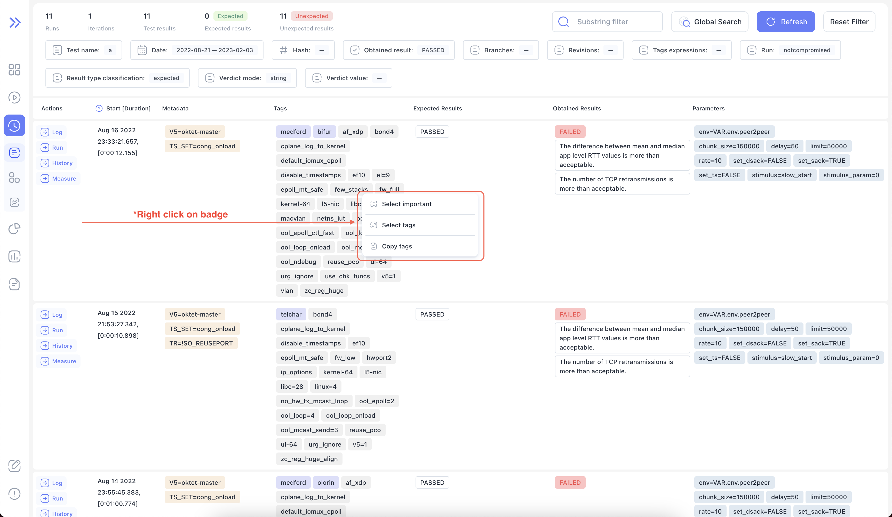
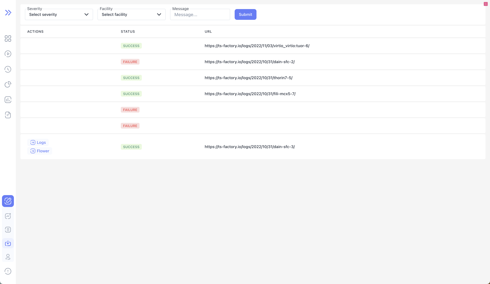

We are happy to announce **Bublik v0.1.2**

In this release we focused on more robust error experience, so you can have more context on what exactly went wrong.
Also, we added more self-describing tab names, so you can easily find what you are looking for.

<!--truncate-->

# Highlights

## Error details

### Example error

## History context menu

:::info
Selecting tags will apply filters and refetch the data.  
It works just like clicking refresh button

:::

## Tab names

### Example tab names

## Details diff

### Example diff

## Event logs

### Example event logs table

## Changelog

### Frontend

#### 🚀 New Feature

- feat(history): add reset button to history global filter form
- feat(history): add context menu to history linear/aggregation tables
- feat(help): bake frontend revisions into deploy-info component at build time
- feat(dev): add events table with celery task status and links to logs/flower
- feat(run-diff): [details] add diff for run info details

#### 🐛 Bug Fix

- fix(history): remove unnecessary requests if no test name is found
- fix(history): failing to parse URL search params on some requests
- fix(runs): add total percentage of expected runs
- fix(run-diff): don't show suspence loading spinner for run-diff page
- fix(dev): flower URL is incorrect in iframe
- fix(ui): [datepickers] wrong order of date segments and wrong literals

#### 💅 Polish

- style(history): add backdrop blur for dialogs
- style(history): place duration in column to save some space
- style(run): add empty state for run page
- chore(sidebar): move flower/import/tests links under dev menu

---

### Backend

#### 🚀 New Feature

- the table of import statuses is added to the dev section

#### 💾 DB changes

- added a new model - EventLog to log Bublik events

#### 🐛 Bug Fix

- parse and show plan info

#### ✏️ Other

- persistent option added to the Flower service to save Celery tasks after services restart
- changes applied to gunicorn and nginx to change max buffer and size of URIs
