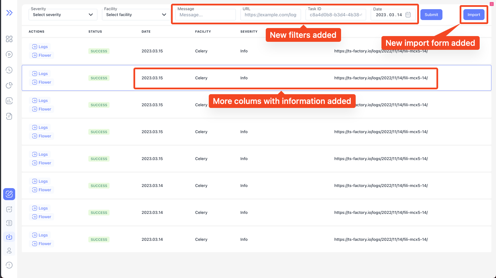
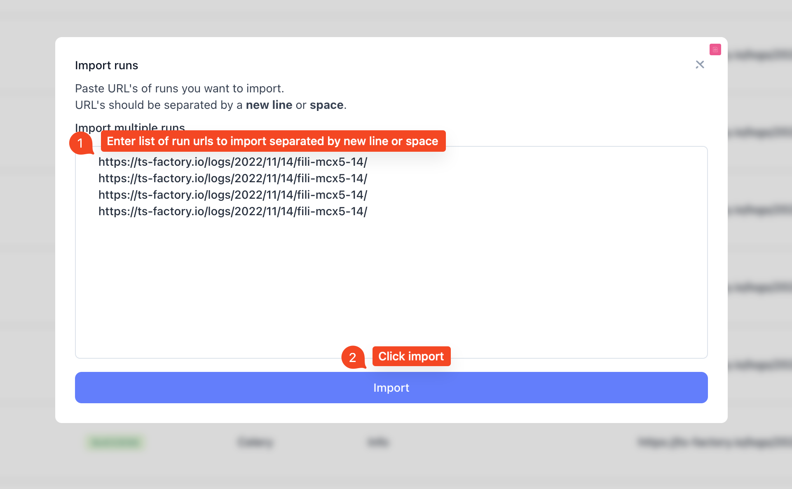

We are happy to announce **Bublik v0.1.3**

Added features, bugs and more!

<!--truncate-->

# Highlights

### New icon for skipped tests

### Added more data to import event table

### New form for importing multiple runs at once

## Changelog

### Frontend

#### 🚀 New Feature

- feat(dashboard): expand NOK result on link click for `unexpected`
- feat(import): add form for importing multiple runs at once
- feat(import): add filter by task id, error message, log URL to form
- feat(log): mark skipped tests with icon

#### 🐛 Bug Fix

- fix(import): fix sidebar not sticking when table overflows page

#### 💅 Polish

- style(import): fix header dissapearing on when error present
- style(import): overflowing table should be scrollable
- chore(history): format dates in header legend

---

### Backend

#### 🚀 New Feature

- change the error message structure
- add 'skipped' info to the iteration data forwarded to the UI
- add new endpoint /v2/importruns/source to make imports from import status table

#### 🐛 Bug Fix

- runs import without logs
- fix parsing and supporting result keys

#### ✏️ Other

- add facility, severity, timestamp and Error message to the import statuses table
- add filtration by Celery task ID, Error message, Log URI to the import statuses table
