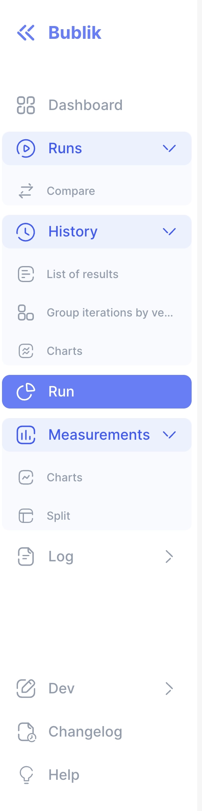
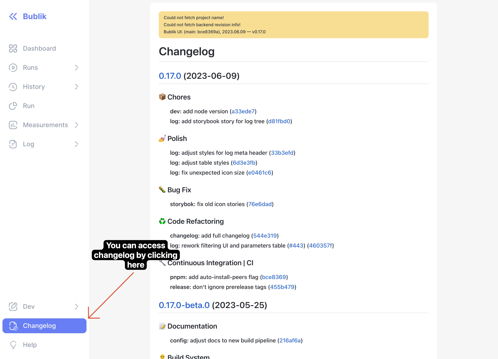
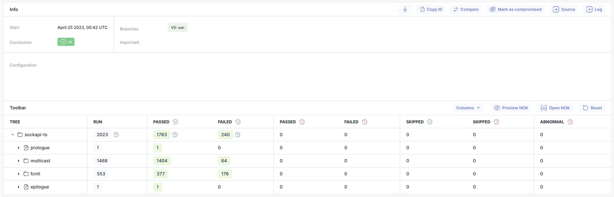
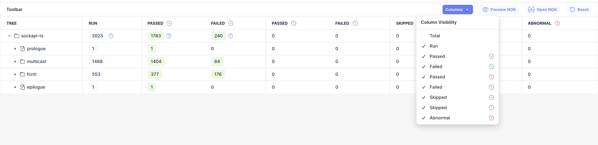
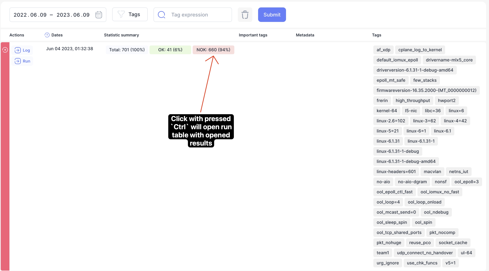
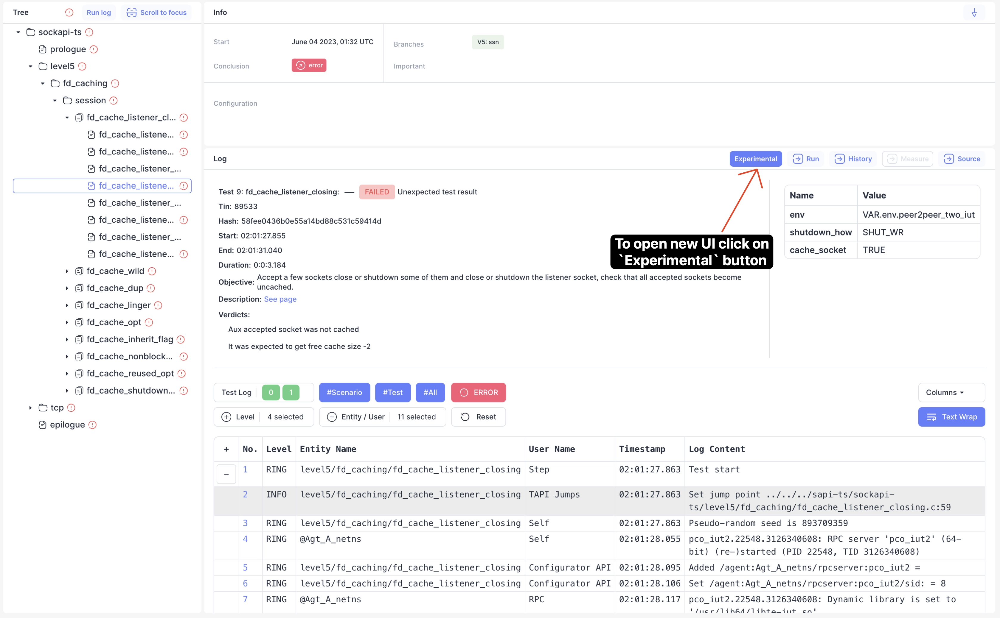

We are happy to announce **Bublik v0.1.5**
In this release we added initial support for new log UI. Added ability to open/collapse sidebar menus.
Many more style and internal changes

<!--truncate-->

# Highlights

### Reworked sidebar

We've added ability to show/hide collapsed menus inside sidebar at any time. Now you can jump back and forth between different pages

:::tip
Also you can now hide/show sidebar by pressing **`S`** on the keyboard
:::

### New changelog UI

We also added changelog

### Reworked run toolbar

We've moved toolbar with various buttons

Added ability to hide/show columns via dropdown menu

### Opening NOK results on link click

You can now go to run with opened results by clicking on NOK with `Ctrl+click`

### New log UI

:::warning
This is experimental feature and may not work as expected!
:::

In this release we started to integrate new log UI this is still work in progress.
We want to hear your feedback and features you maybe want :)

## Changelog

### Frontend

#### 📝 Documentation

- **config:** adjust docs to new build pipeline

#### 👷‍ Build System

- **size:** extract echarts chunk manulally to reduce size
- **vite:** add ability to specify remote JSON logs storage

#### 🔧 Continuous Integration | CI

- **build:** fix failing to parse passed args
- **build:** skip changelog for beta releases

#### ♻ Code Refactoring

- **icon:** convert all icons to `.svg`
- **run:** change displayed run columns
- **ui:** replace all skeletons with component

#### 🐛 Bug Fix

- **history:** lazy loading modules
- **log:** [frame] not saving line number on subsequent navigations
- **runs:** date range picker no label warning
- **runs:** importing from lazy loaded module

#### 💅 Polish

- **animation:** [dialog] add animation to dialog content
- **changelog:** add confetti explosion on new release
- **history:** add animation to context menu
- **history:** align reset buttons with close button
- **import:** fix overflow scrollbars
- **import:** make modal title bigger
- **run:** [table] add group columns with border
- **run:** add background on row hover
- **run:** uppercase table columns
- **tooltip:** change shadow

#### 🚀 New Feature

- **ci:** add changelog to the ui
- **faq:** add latest tag info
- **formatting:** convert formatting to use tabs
- **log:** add experimental support for JSON logs
- **log:** add initial support for displaying log content
- **log:** add pagination support to schema
- **log:** add pagination support to schema
- **run:** [results-table] add key list with URLs
- **run:** add column visibility toggle to run/diff pages
- **run:** add tooltips to details/toolbar buttons
- **sidebar:** add collapsible links
- **sidebar:** show/hide sidebar on `s` keypress
- **ui:** add dropdown menu component
- **ui:** add skeleton component

#### ⏪ Reverts

- **log:** [frame] not saving line number on navigations
- **run:** rollback renaming column ids for run table

#### ✅ Tests

- **ci:** fix lint command
- **e2e:** add playwright support
- **history:** add some snapshot tests to history
- **import:** fix snapshot for overflow table
- **import:** fix snapshot test for loading table state
- **log:** remove build target from lib
- **run:** fix div instead of button when no URL present
- **ui:** [clock] fix timezone issue in CI
- **ui:** [icon] fix svgr not loading in vitest

#### 📦 Chores

- **build:** migrate from webpack to vite
- **build:** upgrade vite to v4.3
- **changelog:** [modal] disable modal until checkbox is ready
- **changelog:** lazy load changelog
- **ci:** add new commit types
- **ci:** fix compare URL
- **ci:** update pipeline for manual releases
- **deploy:** adjust API for new JSON format
- **env:** move all env configs to bublik app config
- **log:** add run ID to tab title
- **log:** remove zod schema converting to JSON from production bundle
- **nx:** upgrade nx to 16.2.1
- **release:** v0.16.0
- **test:** update snapshots

### Backend

#### 💅 Polish

- update run stats structure
- reduce the number of requests when fetching the result details
- reduce the number of queries to the DB for retrieving metas and test arguments
- recalculate stats for the previously imported runs
- avoid measurement results dups after live import

#### 🚀 New Feature

- implement the new API to get JSON log URL
- add runtime to the import table
