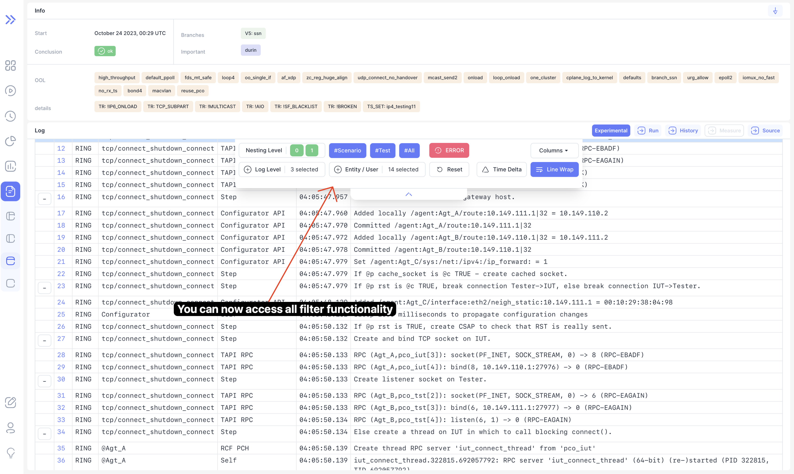
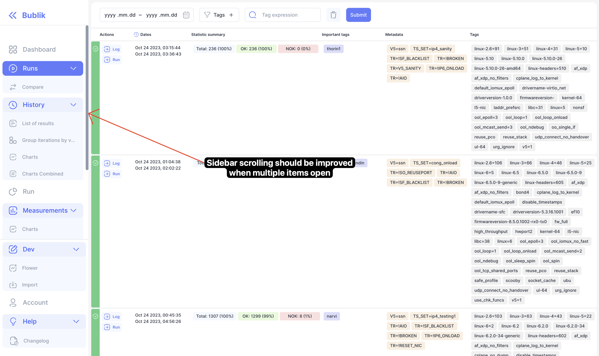
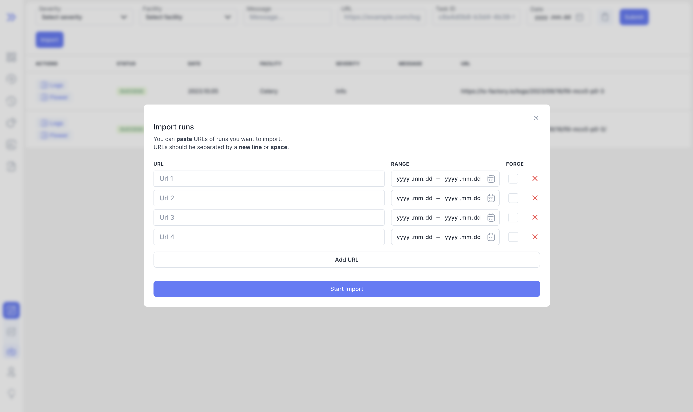

We are happy to announce **Bublik v0.1.10**.
In this release we focused mainly on improving existing pages and refining user experience

<!--truncate-->

# Highlights

### Floating log table filter toolbar

We've added toolbar floating toolbar at the top of log table to allow access to filters when scrolled after

### Log time

You can now see time delta relative to selected row if you enable "time delta mode"

### Improved sidebar scrolling

We improved sidebar scrolling

:::info
In collapsed state sidebar will expand links for active page only
:::

:::tip
You can press `S` on keyboard to open or collapse sidebar without clicking
:::

### Reworked import form

:::tip
You can paste multiple URLs separated by space or newline character to prefill the form faster
:::

## Changelog

### Frontend

## [0.26.0] (2023-10-20)

### 🚀 New Feature

- **router:** start loading whole app with spinner
- **ui:** [form-alert]: add form alert component
- **ui:** [sidebar] improve scrollbar behaviour for sidebar
- **log:** add floating toolbar

### 🐛 Bug Fix

- **import:** base query not adding prefix in queryFn
- **log:** animation not working for highlighting row
- **log:** properly handle errors from JSON API
- **diff:** improve error message when no ids selected
- **types:** remove runs config type from router
- **auth:** [login-form] display error when invalid credentials provided
- **run:** [page] not prefetching tree in log page

### 📦 Chores

- **changelog:** [confetti] remove changelog modal
- **import:** add 4 default rows for import
- **sidebar:** remove tests link from sidebar
- **log:** change title of log level
- **nx:** migrate to latest nx
- **ui:** fix some react keys logic
- cleanup old todos

### 💅 Polish

- **dashboard:** fix border-radius not being consistent in header
- **log:** fix floating button overlaying toolbar popovers
- **run:** add styles for sorted columns
- **log:** add partially expanded row color
- **log:** emphasize floating toolbar button styles
- **log:** fix styling for wrapped file block
- **log:** improve line breaking for pre-formatted elements
- **log:** improve word breaking
- **log:** move log bgs to css variables
- **ui:** [button] missing border in disabled state
- **vars:** change all colors to hsl and allow opacity change
- **vars:** fixs overlay opacity

### ♻ Code Refactoring

- **router:** remove all lazy loaded components
- **log:** expand log to level 1 by default
- **log:** extract pagination logic into hooks
- **log:** improve error messages for JSON logs
- **log:** re-arrange log levels via weight parameter

### ✅ Tests

- **ui:** update snapshot tests for new css vars
