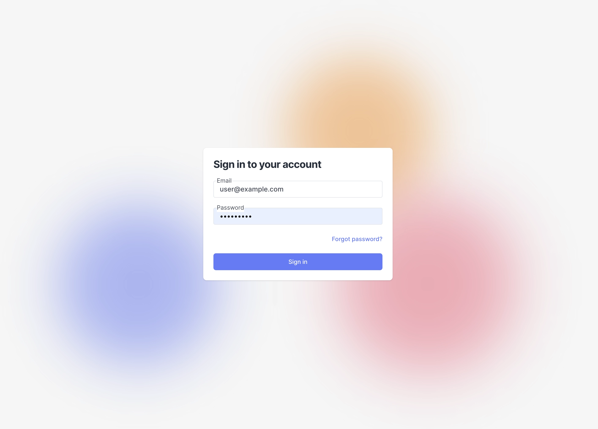
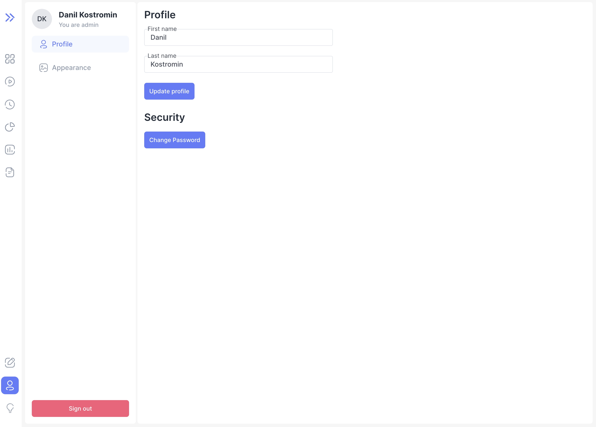
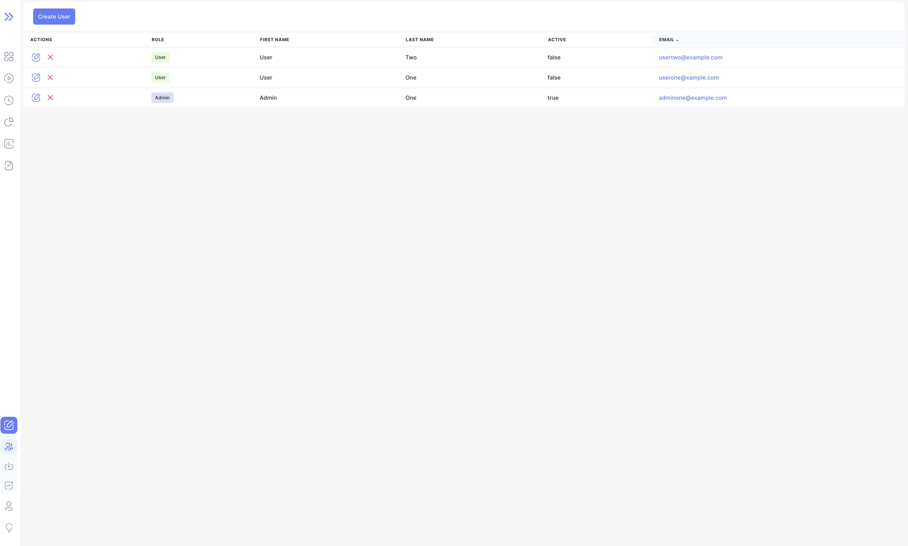
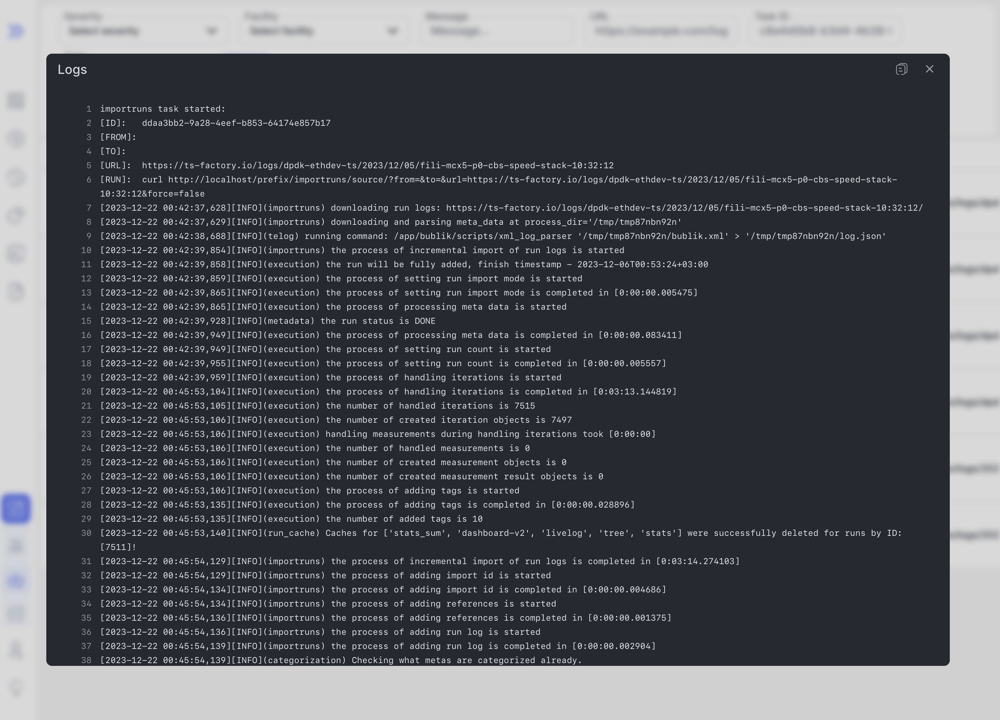

We are happy to announce **Bublik v0.2.1**.

<!--truncate-->

# Highlights

### Authentication Module

At the moment, the Bublik authentication module exists separately from the rest of the Bublik functionality. If you want to test its work, you can contact the developer of the Bublik.

:::info
The authentication module in the Bublik has nothing to do with authentication on the server. Thus, you cannot access the system using your server credentials. To access the system, you need to be registered directly in the Bublik authentication module.
:::

#### User

Registration
Users who are not project administrators are registered in the system by the administrator. After user registration, a verification link will be sent to the email address specified during registration. The user will be able to log in only after confirming the email address by clicking on the link from the incoming email.

Profile page

Features

- update your first and last name;
- change the password from your profile;
- reset the password via email.

#### Administrator

Admin management table

Registration
If you are the administrator of the project and want to be registered in the system, please contact the administrator of the Bublik.

Features

- update your first and last name;
- change the password from your profile;
- reset the password via email;
- view the list of users;
- create a user;
- change the user's first name, last name and password;
- deactivate the user.

:::info
Only one user can be registered to one email address.
In this release we've added authentication with access to profile and user management for admins
:::

### Runs

We've added new mode for runs page which contains various charts to get an easy overview of filtered runs

:::info
Some charts are clickable
:::

### History expressions

Added expression support for multiple history fields

### Import logs

Integrated import logs

## Changelog

### Frontend

#### 🚀 New Feature

- **dashboard:** add popover button with icon and comment if run is marked as compromised
- **dashboard:** add TV mode for dashboard for fullscreen viewing
- **auth:** add authentication
- **auth:** add user profile page
- **import:** integrate import logs inside bublik
- **history:** sync client filter state with search params

#### 💅 Polish

- **ui** improve scrollbar behaviour when main container is overflowing
- **ui** convert all colors to HSL with support of opacity
- **dashboard** replace dashboard mode icons with updated ones
- **dashboard** make dashboard errors to display properly

#### 🐛 Bug Fix

- **dashboard** failing recursively on dashboard fetch error
- **dashboard** not fetching dashboard when run is marked as compromised
- **history** changing date in form and closing not picking correct date
- **history** changing mode when no page exists returns 404

#### ♻ Code Refactoring

- **dashboard** refactor dashboard table as well as search params

#### 👷‍ Build System

- **ci** update ci/cd actions to latest versions

### Backend

#### 🚀 New Feature

- **import log** create API to return JSON import log
- **auth** add the ability to register users ([fb0a439](https://github.com/ts-factory/bublik/commit/fb0a4390ae22e4b6cdbcd3d29f89ea467a542195))
- **auth** add the ability to log in ([6428320](https://github.com/ts-factory/bublik/commit/6428320b4517603bd4f49e151658748a5d9a1f28))
- **auth** add the ability to get user info ([e438cc5](https://github.com/ts-factory/bublik/commit/e438cc5950966a8265a484a93c890e056a9ec643))
- **auth** add the ability to refresh access token ([8911464](https://github.com/ts-factory/bublik/commit/891146419ec10df9777147ec581b05f502fbc0d0))
- **auth** add the ability to log out ([ffb2c80](https://github.com/ts-factory/bublik/commit/ffb2c80079020347fc649ea9df633fa78cb82730))
- **auth** add the ability to reset password by email ([70f4c50](https://github.com/ts-factory/bublik/commit/70f4c50baf99ec8cc1bf226185216cfb064ea6c3))
- **auth** add the ability to reset password from the profile ([9d43203](https://github.com/ts-factory/bublik/commit/9d43203d9163536d56331ae982edb807725f0aff))
- **auth** add admin functions and admin verification ([e6a4e50](https://github.com/ts-factory/bublik/commit/e6a4e50d2ca8371d0225b5473fe54d60c6048cda))
- **auth** add the ability to update user info yourself ([30a0029](https://github.com/ts-factory/bublik/commit/30a0029ec585e57e159d77ae9bb2750d84271e9c))
- **history** separate expressions by meta types
- **history** add verdicts expression
- **history** add test arguments expression

#### 💾 DB changes

- **auth** add a custom User model

#### 🐛 Bug Fix

- **import** fix import from bublik.xml
- **urls** fix dashboard redirect to v2
- **log** check the ID and the page query parameter value
- **run stats** take into account DU value when calculating run conclusion
- **run stats** fix abnormal counter
- **history** change error reporting in filtering by expressions
- **history** fix filtering by expressions
- **history** fix a list of IDs of filtered runs generation

#### ✏️ Other

- **API v1 removal** move redirection to flower to other redirects
- **API v1 removal** move meta categorization web interface to API v2
- **API v1 removal** move import log web interface to API v2
- **API v1 removal** extend the functionality of the import via API v2
