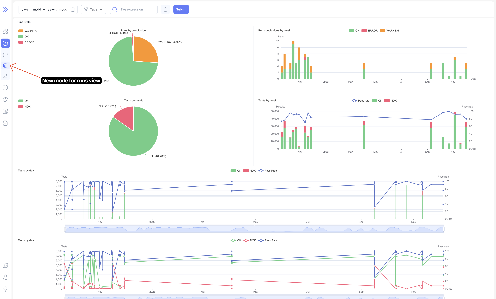
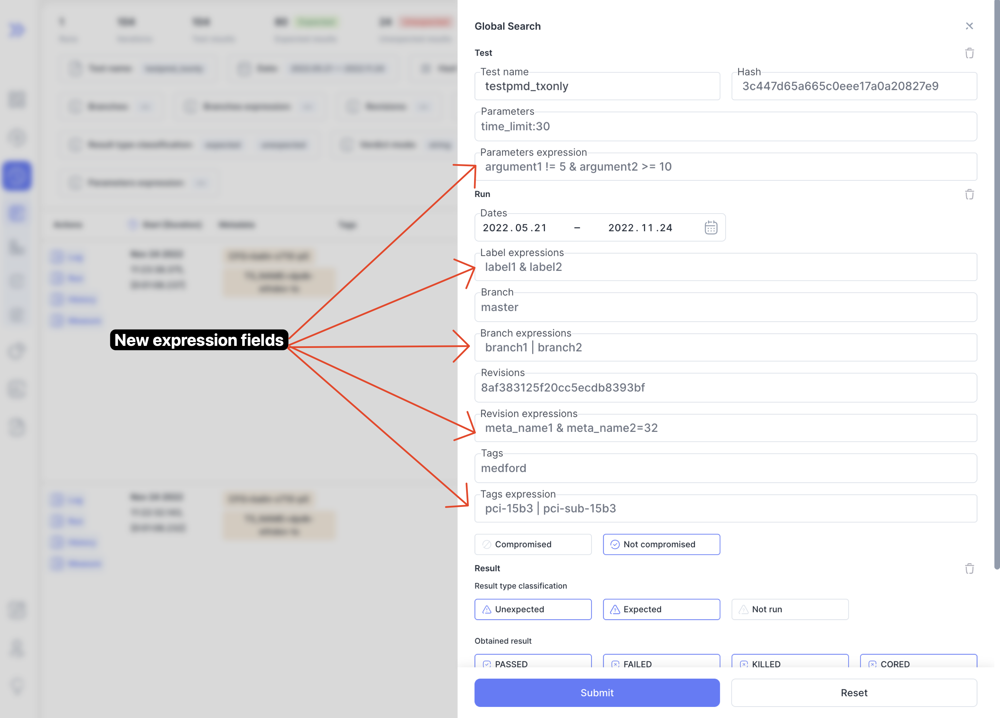
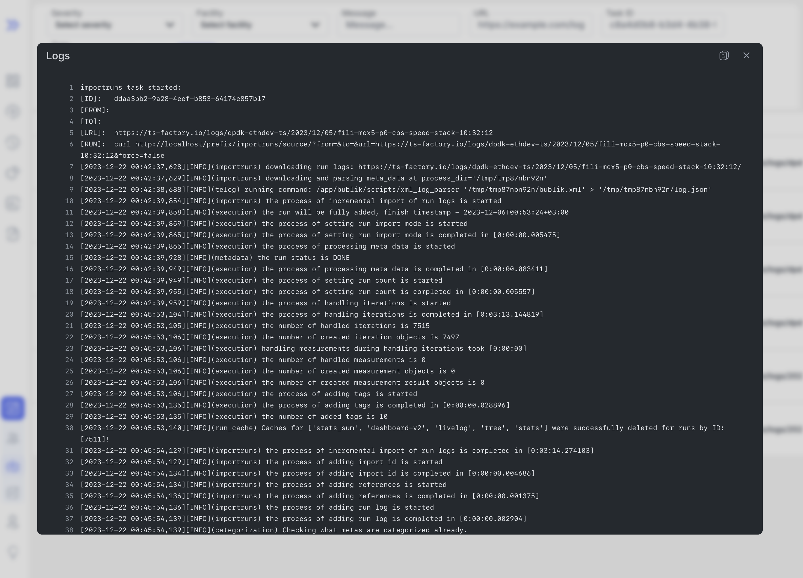

We are happy to announce **Bublik v0.2.1**.

<!--truncate-->

# Highlights

### Runs

We've added new mode for runs page which contains various charts to get an easy overview of filtered runs

:::info
Some charts are clickable
:::

### Authentication

In this release we've added authentication with access to profile and user management for admins

### Profile

Added initial profile page

### Admin

Admin management table

### History expressions

Added expression support for multiple history fields

### Import logs

Integrated import logs

## Changelog

### Frontend

#### 🚀 New Feature

- **dashboard:** add popover button with icon and comment if run is marked as compromised
- **dashboard:** add TV mode for dashboard for fullscreen viewing
- **auth:** add authentication
- **auth:** add user profile page
- **import:** integrate import logs inside bublik
- **history:** sync client filter state with search params

#### 💅 Polish

- **ui** improve scrollbar behaviour when main container is overflowing
- **ui** convert all colors to HSL with support of opacity
- **dashboard** replace dashboard mode icons with updated ones
- **dashboard** make dashboard errors to display properly

#### 🐛 Bug Fix

- **dashboard** failing recurcively on dashboard fetch error
- **dashboard** not refetching dashboard when run is marked as compromised
- **history** changing date in form and closing not picking correct date
- **history** changing mode when no page exists returns 404

#### ♻ Code Refactoring

- **dashboard** refactor dashboard table as well as search params

#### 👷‍ Build System

- **ci** update ci/cd actions to latest versions

### Backend

#### 🚀 New Feature

- importlog: create API to return JSON import log
- auth: add the ability to register users
- auth: add the ability to log in
- auth: add the ability to get user info
- auth: add the ability to refresh access token
- auth: add the ability to log out
- auth: add the ability to reset password by email
- auth: add the ability to reset password from the profile
- auth: add admin functions and admin verification
- auth: add the ability to update user info yourself
- history: separate expressions by meta types
- history: add verdicts expression
- history: add test arguments expression

#### 💾 DB changes

- auth: add a custom User model

#### 🐛 Bug Fix

- import: fix import from bublik.xml
- urls: fix dashboard redirect to v2
- log: check the ID and the page query parameter value
- runstats: take into account DU value when calculating run conclusion
- runstats: fix abnormal counter
- history: change error reporting in filtering by expressions
- history: fix filtering by expressions
- history: fix a list of IDs of filtered runs generation

#### ✏️ Other

- API v1 removal: move redirection to flower to other redirects
- API v1 removal: move meta categorization web interface to API v2
- API v1 removal: move import log web interface to API v2
- API v1 removal: extend the functionality of the import via API v2
