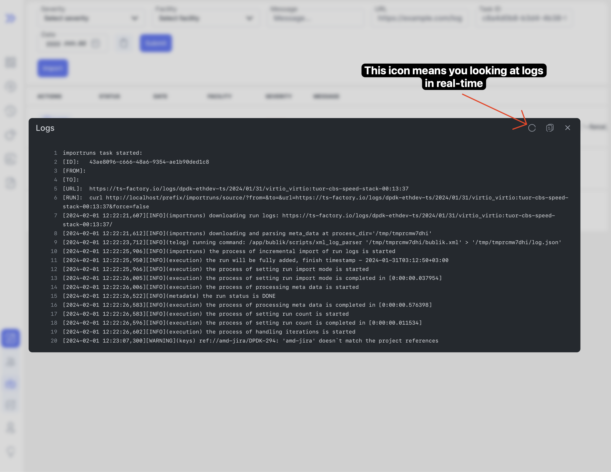

We are happy to announce **Bublik v0.2.2**.

<!--truncate-->

# Highlights

## Improved history speed

We have improved the speed of the history page by optimizing the backend SQL queries.

## Improved import logs

Now you can see logs of the import process in real-time while the import is running.

:::info
Logs updated every 5 seconds.
:::

## Changelog

### Frontend

#### 🔧 Continuous Integration | CI

- **release,ci:** fix formatting and pass env through global config ([03b1dab](https://github.com/ts-factory/bublik-ui/commit/03b1dab85d780bc0fd71b2277fd451c6a8a780bc))

#### 💅 Polish

- **import:** fix import table overflowing horizontally ([b66d49c](https://github.com/ts-factory/bublik-ui/commit/b66d49ce41918861f9425452610e9a213e8eca17))
- **ui:** [toaster] add colors for different states ([2955b94](https://github.com/ts-factory/bublik-ui/commit/2955b94a3611e6129b20fe19da71326fb25d9b6e))

#### 🚀 New Feature

- **import:** add live import logs via polling for changes ([75ab1b1](https://github.com/ts-factory/bublik-ui/commit/75ab1b1a51e548b86c4e4235b61de54f48516bd0))
- **run:** add tip for ctrl+click on run page ([5ca2912](https://github.com/ts-factory/bublik-ui/commit/5ca29124d42b79c8a76c662ee0dcad1a7fc2329c))

#### 📦 Chores

- **auth:** allow access to dev section for unauthenticated users ([b7f83f2](https://github.com/ts-factory/bublik-ui/commit/b7f83f26546526ce9d458c1860af967de82e35de))
- **nx:** upgrade nx and it's packages to latest versions ([ad45ca6](https://github.com/ts-factory/bublik-ui/commit/ad45ca634506812fdbcd8999f39852cd64f3f484))
- **storybook:** cleanup unused imports/types ([e1039f2](https://github.com/ts-factory/bublik-ui/commit/e1039f25d7dbaa75f2070909cd7f7134ca8e33e0))

#### 🐛 Bug Fix

- **build:** adjust release config to allow releases from branches other than `main` ([22a6f6b](https://github.com/ts-factory/bublik-ui/commit/22a6f6be3555e509f16ed7c1b0999dd2d98501d5))
- **import:** [import-form] allow empty URL ([33347a3](https://github.com/ts-factory/bublik-ui/commit/33347a30152a6faafb6b5fe9ee6d16a0485faef1))
- **log:** fix json log overflow scrolling not working ([537677c](https://github.com/ts-factory/bublik-ui/commit/537677cf6729cacb226645fc9fb905430bf2a535))

### Backend

#### 🔨 Issue Fix

- Error on measurement results processing during live import [#2](https://github.com/ts-factory/bublik/issues/2)
- Error in calculating detailed run statistics [#3](https://github.com/ts-factory/bublik/issues/3)
- Live import: incorrect call to the do\_nothing() function [#5](https://github.com/ts-factory/bublik/issues/5)
- "IndexError: list index out of range" on meta categorization request [#8](https://github.com/ts-factory/bublik/issues/8)
- Unclear logs message: no priority was specified, defaulting to 4 [#9](https://github.com/ts-factory/bublik/issues/9)
- Logs ticket service should not be restarted if Kerberos keytab is not configured [#12](https://github.com/ts-factory/bublik/issues/12)
- Revive and improve initial deploy script to simplify first time setup [#13](https://github.com/ts-factory/bublik/issues/13)

#### 🐛 Bug Fix

- **importruns:** fix sending failed mails ([bdc1ec0](https://github.com/ts-factory/bublik/commit/bdc1ec0c38e9f8fe4e852520e0e9614e7c48aa70))
- **importruns:** fix import log link ([0f177f4](https://github.com/ts-factory/bublik/commit/0f177f49f5d2967f51d88259dc584081c18ca6cc))

#### ⚡ Performance

- **history:** speed up history by optimizing DB queries ([1a767ec](https://github.com/ts-factory/bublik/commit/1a767ecb51d00774506979d2b5f01a01c0ca8601))

#### 🚀 New Feature

- **deploy:** add services stop option ([09082fd](https://github.com/ts-factory/bublik/commit/09082fd5abed4eee556736b4102ad85f28b7b02b))
- **deploy:** make services restart by default ([87f6501](https://github.com/ts-factory/bublik/commit/87f6501557fd6804b5c0fe42b0e5cf53db0f7e84))
- **deploy:** add the option to quietly restart services ([409066e](https://github.com/ts-factory/bublik/commit/409066e9d1f3fe0c8e646d3c43ea8cbac569317a))

#### 💾 DB Changes

- **models:** speed up history by speed up meta filtering ([4f94f7c](https://github.com/ts-factory/bublik/commit/4f94f7c84654b833d5497611357a177342bfc0d6))

#### 📦 Chores

- **auth:** unify response messages ([a8aeda6](https://github.com/ts-factory/bublik/commit/a8aeda68ac45df5b6c2dcaf61618fa0a3374bc2c))
- **cleanup:** unify quotes in error messages ([6d832cb](https://github.com/ts-factory/bublik/commit/6d832cbeb711bc9095b7f0340ade64279e2b3024))
- **deploy:** remove an extra duplicate function ([a681cab](https://github.com/ts-factory/bublik/commit/a681cab70bf9c3dd670039e8a41dbd93914d43ee))
