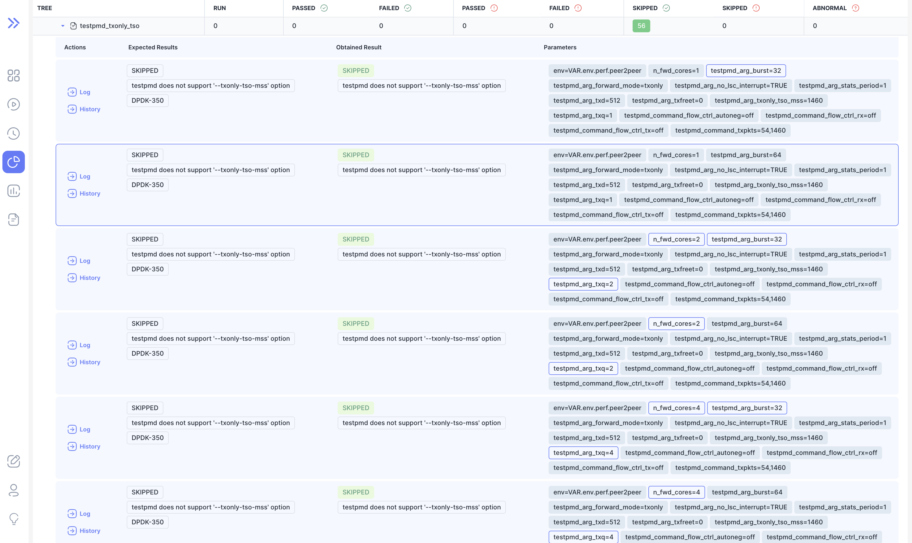

We are happy to announce **Bublik v0.2.3**.

<!--truncate-->

# Highlights

### User preferences

Now you can adjust some settings and default in user settings if you have an account

### Run results diff highlight

Now you can click on result row to highlight parameter difference relative to click row

### Performance regression

We've added simple form to catch regressions in speed
List of URLs can be configured via config options

## Changelog

### Frontend

#### 👷‍ Build System

* **docker:** add docker for easily bootstrapping dev env ([f0da04d](https://github.com/ts-factory/bublik-ui/commit/f0da04db315506a64d04e8932f265fc0be6d250f))

#### 🐛 Bug Fix

* **providers:** [tooltip] disable hoverable content ([dc6baf5](https://github.com/ts-factory/bublik-ui/commit/dc6baf5ee560c7ed9881802efde702607def69b4))
* **ui:** [checkbox] not updating on label click ([3475b01](https://github.com/ts-factory/bublik-ui/commit/3475b01081281b6766da0cd691df52d2c5aa1efc))

#### 🚀 New Feature

* **log:** make log page respect user preferences ([ef5ebe3](https://github.com/ts-factory/bublik-ui/commit/ef5ebe34c5c9954252dc0d3cebfe09af2a273c45))
* **performance:** add view for bublik performance self-testing ([2a3619b](https://github.com/ts-factory/bublik-ui/commit/2a3619b4dc8f3258459d84e3816fb5c5bd3060b9))
* **run:** add ability to highlight param difference ([b75d295](https://github.com/ts-factory/bublik-ui/commit/b75d2956820c99673e4516d7ffa9522cdcb7a205))
* **ui:** add radio group component ([aa27baa](https://github.com/ts-factory/bublik-ui/commit/aa27baa741f637dcdb39235b5233f1506c0653f8))
* **user:** [preferences] add user preferences form ([2ce58ce](https://github.com/ts-factory/bublik-ui/commit/2ce58cebce2e08bf884f2669e0fbb3aa57fa5ba3))

### Backend

#### 🐛 Bug Fix

- **history:** fix filtering by expressions ([e808026](https://github.com/ts-factory/bublik/commit/e808026a549b193e0caa66afcb64ffe370d4afd2))

#### 🚀 New Feature

- **performance:** add performance check ([d27a9fe](https://github.com/ts-factory/bublik/commit/d27a9fedd4875165ac3bea9dec3b0f15744b12d3))
