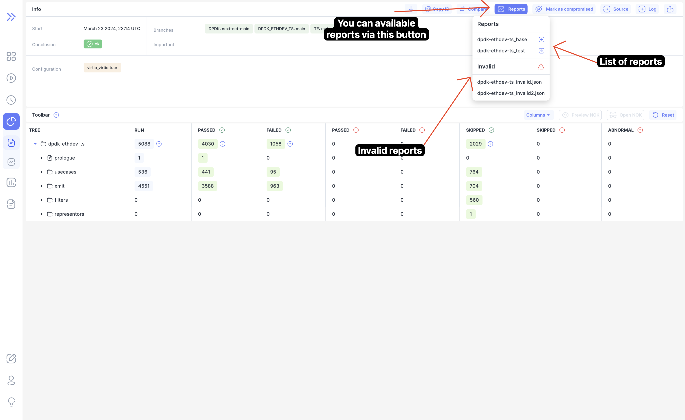
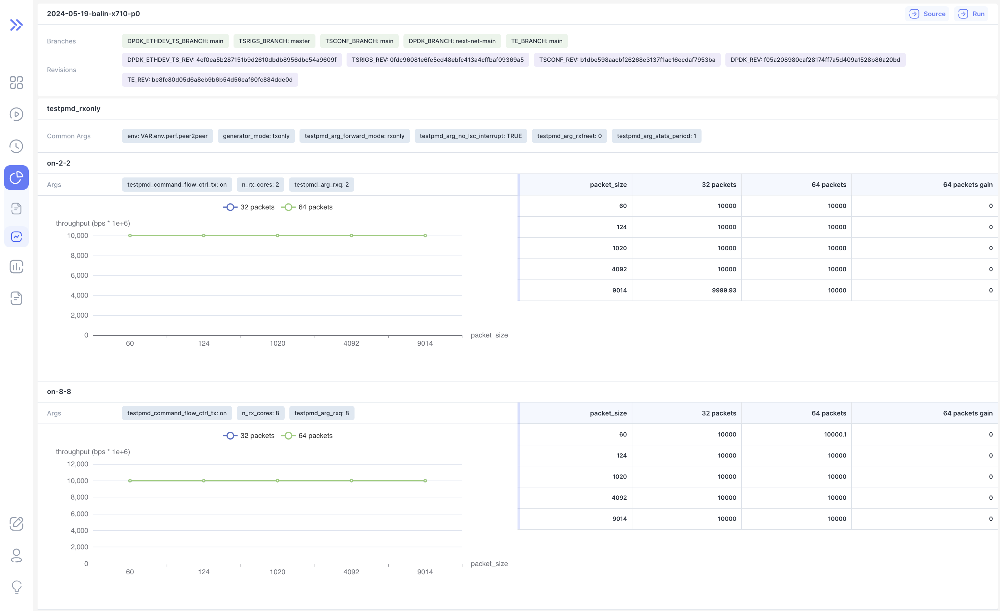
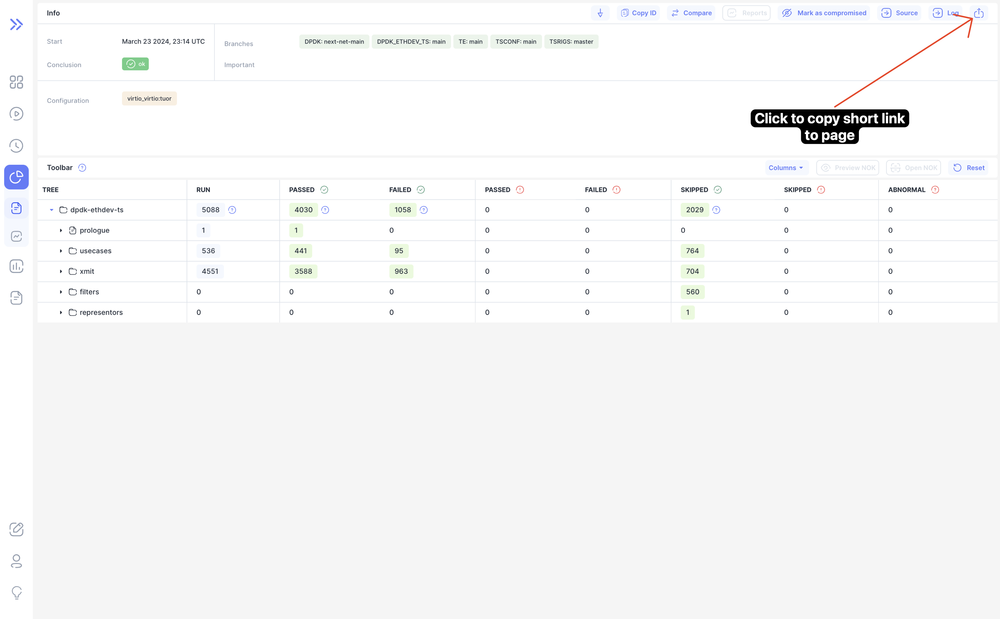
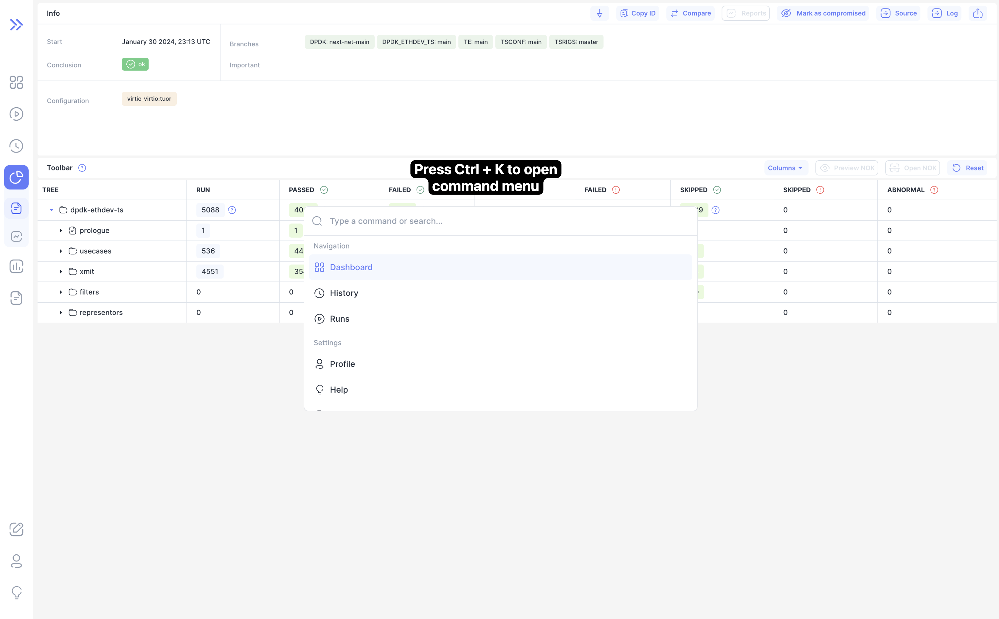

We are happy to announce **Bublik v0.3.0**.

<!--truncate-->

In this relaese we've added a new page featuring charts and tables to visualize and analyze run reports. Introduced a button that allows users to easily copy a short URL of the current page for sharing.
Added navigation shortcuts for quick access to pages, enhancing user experience.

## Highlights

### Run Reports

Now you can use Bublik for run reports building. To build a run report, an appropriate configuration is required. Information about the run report configuration format and its location can be found in [doc/wiki/reports.md](https://github.com/ts-factory/bublik/blob/main/doc/wiki/reports.md). An example of the run report configuration can be found in [doc/wiki/report_config.json](https://github.com/ts-factory/bublik/blob/main/doc/wiki/report_config.json).

You can find available reports on run page

### Copy Short Link

You can shortcut button to copy short link of the current page on right top corner

### Command Menu

We've added command menu with some shortcuts to common actions, pages

Also you can copy short link to current page from command menu

## Changelog

### Frontend

#### 🐛 Bug Fix

* **reports:** added missing dependency to useMemo hook for args calculation ([b67f56b](https://github.com/ts-factory/bublik-ui/commit/b67f56bf8378c5556eaedce4553f0f40cb99e7bb))
* **reports:** added missing dependency to useMemo hook for chart series calculation ([38b7682](https://github.com/ts-factory/bublik-ui/commit/38b7682b700d5ad82430219adfce7858d0009b40))
* **reports:** added rel="noreferrer" to external links ([8670993](https://github.com/ts-factory/bublik-ui/commit/867099344a49554f29899729860d032969e20aa7))
* **reports:** fixed build issues with tests ([d965e1b](https://github.com/ts-factory/bublik-ui/commit/d965e1b6692939c2b92775659cbb208df7c4d425))
* **reports:** fixed scroll to element id containing only numbers ([960d826](https://github.com/ts-factory/bublik-ui/commit/960d826842271495710927543bf0d46f2c0b948c))
* **reports:** prevent conditional calling of API query hook ([976998b](https://github.com/ts-factory/bublik-ui/commit/976998be71777a01290482fd0ffd50aca09d1ce1))

#### 💅 Polish

* **reports:** added underline on hover for revision link ([9dc8ab3](https://github.com/ts-factory/bublik-ui/commit/9dc8ab3ff464eeb72dc2675ed3cf8e8a0ce73b2a))
* **reports:** fixed styles for dropdown menu item ([89a7921](https://github.com/ts-factory/bublik-ui/commit/89a7921867a4be3710a06cbb4ee8f420d027257d))

#### 📦 Chores

* **copy-short-url:** upgraded cmdk package to latest version ([196d26b](https://github.com/ts-factory/bublik-ui/commit/196d26bddd609e802705f20a5cf5ace1b676a598))
* **icons:** added upload icon to icon library ([9ea35bb](https://github.com/ts-factory/bublik-ui/commit/9ea35bb226ba1c4b7b5812342bea7a771e7521d6))
* **reports:** extracted run-report test block ([17ac977](https://github.com/ts-factory/bublik-ui/commit/17ac97789e9b34e738761faa2d8bd93687eb2fb3))
* **reports:** generated library for run report ([c8fdf56](https://github.com/ts-factory/bublik-ui/commit/c8fdf56646407d7d9a0e7ef16205754bc26795ff))

#### 🚀 New Feature

* **copy-short-url:** added "copy short url" button to dashboard page ([5794f1b](https://github.com/ts-factory/bublik-ui/commit/5794f1bd990b99029ade8224ecdf6bdaf54f2be9))
* **copy-short-url:** added "copy short url" button to history page ([4f5aa78](https://github.com/ts-factory/bublik-ui/commit/4f5aa785eeb8d9268fba4757d2c80192fc2ea0c6))
* **copy-short-url:** added "copy short url" button to run page ([a661fed](https://github.com/ts-factory/bublik-ui/commit/a661fed0888727398fc44a304cdddd52f9baa501))
* **copy-short-url:** added "copy short url" to runs page ([6afdd3a](https://github.com/ts-factory/bublik-ui/commit/6afdd3a5bcf0896a00e0acab3b3be29438586f93))
* **copy-short-url:** added "copy-short-url" button to log page ([19b6ce1](https://github.com/ts-factory/bublik-ui/commit/19b6ce1316de6cf3c7aedcb3425602e4ab4af4bc))
* **copy-short-url:** added "copy-short-url" button to measurements page ([3aa5b5e](https://github.com/ts-factory/bublik-ui/commit/3aa5b5e7e89acbbb4ab90f8484da9ed1d11c521a))
* **copy-short-url:** added "copy-short-url" button to run page ([ba2ff97](https://github.com/ts-factory/bublik-ui/commit/ba2ff97a93a8961b02c36c9ef92d7f591a5f6105))
* **copy-short-url:** added button for copying short url to current page ([02af6f8](https://github.com/ts-factory/bublik-ui/commit/02af6f8ef0cacd95fef206a4cdba60f5106b08db))
* **copy-short-url:** added command component ([8c416c1](https://github.com/ts-factory/bublik-ui/commit/8c416c1e023585ec6c93d01c205b0489d4373caa))
* **copy-short-url:** added component for command to copy short url ([a5459d3](https://github.com/ts-factory/bublik-ui/commit/a5459d301a0b63059462b824633842e2043bde1a))
* **copy-short-url:** added endpoint for creating short url ([2fd89dd](https://github.com/ts-factory/bublik-ui/commit/2fd89ddf9f379861c29d4e15a45ceff101b1f923))
* **copy-short-url:** generated library for "copy short url button" ([04a0931](https://github.com/ts-factory/bublik-ui/commit/04a093141098c9f6c1cb856656aa81e699f5a3bd))
* **reports:** added dropdown for run configs links ([c5fb281](https://github.com/ts-factory/bublik-ui/commit/c5fb2811ffe8656714d499ef090df4ccd5e09fc6))
* **reports:** added initial report header ([dc1195c](https://github.com/ts-factory/bublik-ui/commit/dc1195c2471d0dbfc1c70d4fc07199d3187947eb))
* **reports:** added run report container component ([48591fc](https://github.com/ts-factory/bublik-ui/commit/48591fc4d874ddceb0bf614efa6c9de6e72d1ce4))
* **reports:** added sidebar link for run report ([bdc2f1c](https://github.com/ts-factory/bublik-ui/commit/bdc2f1c9aadd5892b65ea7c1ae614c341027bc68))
* **reports:** added table and chart components ([4e4d3a7](https://github.com/ts-factory/bublik-ui/commit/4e4d3a75d17c8c03f6b898265b65d4d4333fc42a))
* **reports:** added warnings popover ([46d983d](https://github.com/ts-factory/bublik-ui/commit/46d983dad714768c6f6676d1b4d1dba4c22c8dcd))
* **reports:** made revision links clickable ([41d50d8](https://github.com/ts-factory/bublik-ui/commit/41d50d8dbb44d47e1daf735d64ad0beedfe264e9))

### Backend

#### 🔨 Issue Fix

- Support Debian 12 [#17](https://github.com/ts-factory/bublik/issues/17)
- Add URL shortner [#26](https://github.com/ts-factory/bublik/issues/26)
- Add run reports support [#32](https://github.com/ts-factory/bublik/issues/32)

#### 📦 Chores

- **cleanup:** remove unnecessary logging ([32dadc6](https://github.com/ts-factory/bublik/commit/32dadc6cc862f3a7b38b8be4efa5cd9d90bb4a34))
- **cleanup:** remove unnecessary manage.py call ([4faeba9](https://github.com/ts-factory/bublik/commit/4faeba97b3763ed8ef1291ba2127e81be5f4a036))
