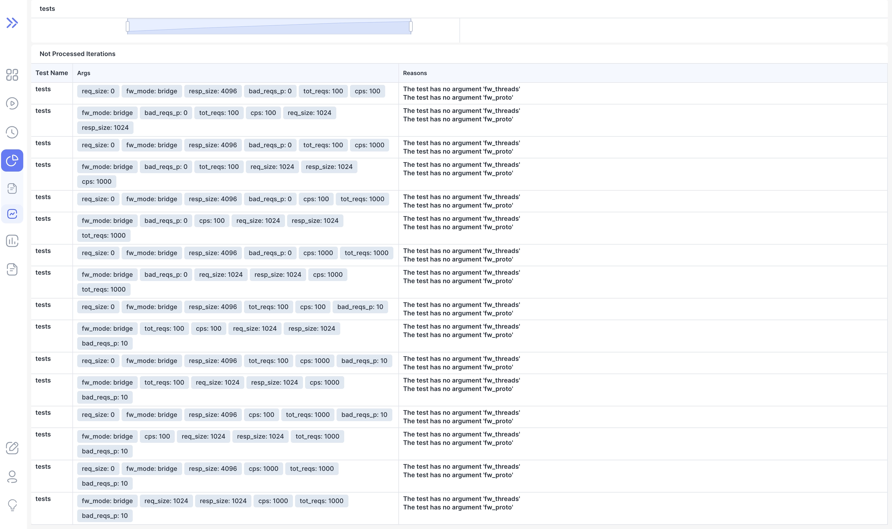
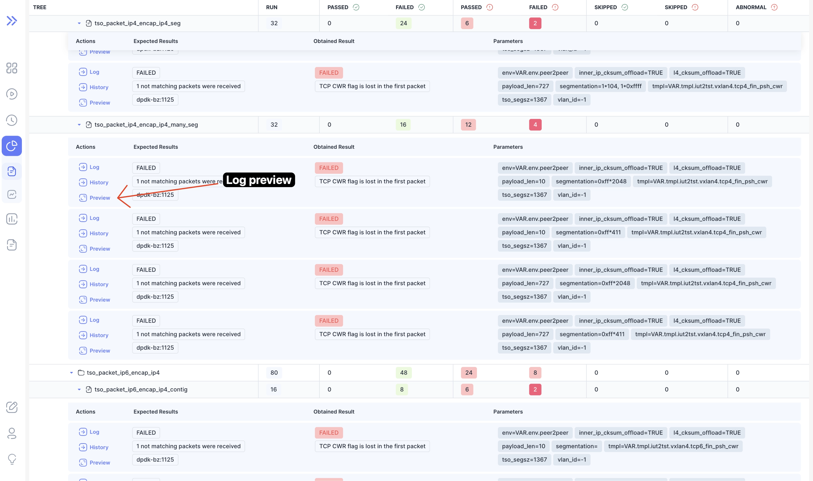
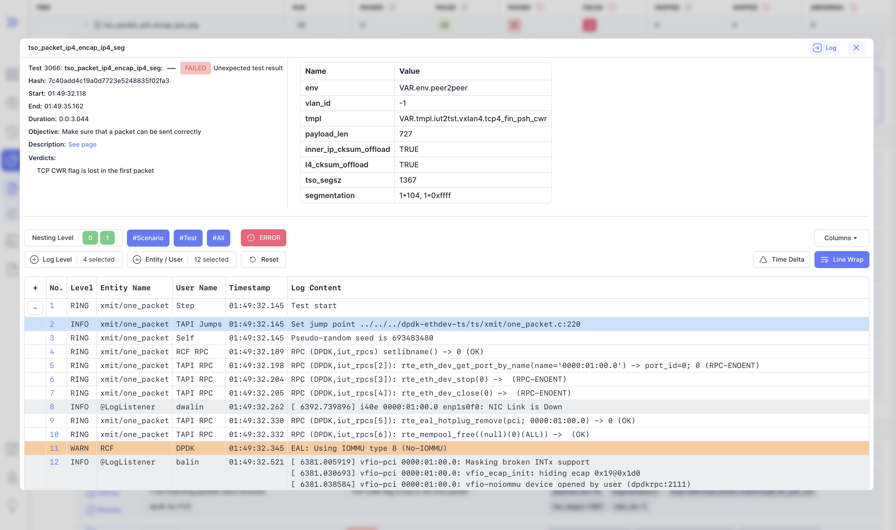

We are happy to announce **Bublik v0.3.3**.

<!--truncate-->

In this release, we've introduced several new features and improvements.
We've added conclusion reason hover cards to the dashboard, run details, and runs page, enhancing user information.
A new report data zoom functionality for plots has been implemented, along with a preview log modal for the run page.
We've also made various UI enhancements, including improved table column width distribution in reports and the addition of an align property to the hover-card component.
Bug fixes include resolving issues with broken links, error displays. Also the Bublik is now compatible with Ubuntu 24.04. The bugs related to importing from the source have also been solved.

## Highlights

### Specifying Measurements In Report Configuration

We have added the ability to specify several sets of measurement parameters in the configuration to make reporting more flexible. The list of possible measurement parameters has also expanded — it is now possible to specify a tool. An example of the run report configuration can be found in [doc/wiki/report_config.json](https://github.com/ts-factory/bublik/blob/main/doc/wiki/report_config.json).

> **Note!**
> Due to the above changes, **the configuration format has been changed**. See the example at the link above.

### Not Processed Iterations In Reports

### Log Preview

We've also added log preview to the run page so you have a quick glance of the log without having to go to the full log page.

## Changelog

### Frontend

#### 🔧 Continuous Integration | CI

- added formatting check ([c84a564](https://github.com/ts-factory/bublik-ui/commit/c84a564c2fadcc5748fa168d029b178fbaf5dd1c))
- run formatter on code base ([4da8c4b](https://github.com/ts-factory/bublik-ui/commit/4da8c4b96944aab2d466929968818435dc9ca38f))
- splitted and steps into different jobs ([8de0f52](https://github.com/ts-factory/bublik-ui/commit/8de0f52a62cd757caac831ff8b87048464f610c6))
- swapped to prettier for formatting checks ([8170886](https://github.com/ts-factory/bublik-ui/commit/81708860b7c363f3cbca1640318f351c0bc77c15))

#### 📦 Chores

- added vscode dir to gitignore ([6fe10f3](https://github.com/ts-factory/bublik-ui/commit/6fe10f31644c3956eb17dcc8a51558110c6343f0))
- **deps:** upgrade nx to latest version ([bdaa929](https://github.com/ts-factory/bublik-ui/commit/bdaa929350be5dc2acdb04aa807554c28937f0d2))
- **log,run:** changed option to show full run details by default ([f5257f0](https://github.com/ts-factory/bublik-ui/commit/f5257f0a2d73fd791076ce5cd4c15d75aaabe666))
- **storybook:** remove all mocked modules ([2f4ab3d](https://github.com/ts-factory/bublik-ui/commit/2f4ab3d3fa78532488ca10224d5a7bbb9c580c09))

#### 💅 Polish

- **report:** made table columns take even width ([8981192](https://github.com/ts-factory/bublik-ui/commit/8981192c72e0b8f7ddbf17dcf6f43d4b75245ec9))
- **ui:** [hover-card] added align prop ([95cf988](https://github.com/ts-factory/bublik-ui/commit/95cf9881306dfc90109bd2b31aa3f1bb54082539))

#### 🐛 Bug Fix

- **report:** fixed broken link to report section ([31f3004](https://github.com/ts-factory/bublik-ui/commit/31f3004f07271251e3b78244aedb8411b4817798))
- **report:** fixed not showing error if no config id or run id present ([810ea12](https://github.com/ts-factory/bublik-ui/commit/810ea12d8c160dd671277595c56850cf8eeb2035))
- **storybook:** fixed wrong location for vite config ([81d7cf2](https://github.com/ts-factory/bublik-ui/commit/81d7cf2da5aa9fbe159c674c15dcff39a9d8e0cd))
- **ui:** fixed typescript issues in tailwind-ui ([9d22183](https://github.com/ts-factory/bublik-ui/commit/9d221838ca11c85f08e58511bd5857fab2bd1364))

#### ♻ Code Refactoring

- **report:** added not processed points table ([b6c8025](https://github.com/ts-factory/bublik-ui/commit/b6c80250f37195fc6da044cf5d19bc9a70181d34))
- **report:** upgraded to latest changes ([113c4b6](https://github.com/ts-factory/bublik-ui/commit/113c4b6a50ff2b500a3ec33d0519c4465322504e))
- **run:** extracted conclusion badge to shared UI lib ([fa583d8](https://github.com/ts-factory/bublik-ui/commit/fa583d8ead7d9b00fa9552e8def819b667695174))

#### 🚀 New Feature

- **dashboard:** added conclusion reason hover card to dashboard ([390685b](https://github.com/ts-factory/bublik-ui/commit/390685b7e623db855ed54dde78a0a7849c0dadf7))
- **report:** added report data zoom to plot ([716a7ac](https://github.com/ts-factory/bublik-ui/commit/716a7ac7487f00dc4eb2f7b25493181414a9ab4b))
- **run:** added conclusion reason hover card to run details ([d7a6288](https://github.com/ts-factory/bublik-ui/commit/d7a628818f7ae6e0387618b8fc4d3a279679a879))
- **run:** added preview log modal ([5c4056c](https://github.com/ts-factory/bublik-ui/commit/5c4056c3e8565000d4c3d1f7fd308ed8a0c51d6a))
- **runs:** added conclusion reason hover card to runs page ([b3215c9](https://github.com/ts-factory/bublik-ui/commit/b3215c91692a0eab9182b42c1132f1838297c37a))
- **ui:** added conclusion hover card component to ui lib ([1183ee4](https://github.com/ts-factory/bublik-ui/commit/1183ee4427e8c5b20a15dfb9806fea82cf1caea8))

### Backend

#### 🔨 Issue Fix

- Error in calculating detailed run statistics [#3](https://github.com/ts-factory/bublik/issues/3)
- Error when trying to copy a short URL [#44](https://github.com/ts-factory/bublik/issues/44)
- Importruns: source page parsing error [#48](https://github.com/ts-factory/bublik/issues/48)

#### 🐛 Bug Fix

- **requirements:** update packages versions to pick up bug fixes ([87821b4](https://github.com/ts-factory/bublik/commit/87821b4146cc5316086f37b4d678b48d37d1bcfd))
- **flower:** fix no workers in flower after start ([b77a9d4](https://github.com/ts-factory/bublik/commit/b77a9d464af82dca7a705d3859ce831ef58325d0))
- **report:** fix empty percentage base value handling ([cbd8433](https://github.com/ts-factory/bublik/commit/cbd8433c88bb0fe6541e40f7e2b6fd5d0a19a7ad))
- **report:** fix invalid iterations handling ([fac211d](https://github.com/ts-factory/bublik/commit/fac211d8bdfaf13deeb927e47d35355b5757683c))

#### 🚀 New Feature

- **requirements:** fix incompatibility with Ubuntu 24.04 ([070a189](https://github.com/ts-factory/bublik/commit/070a1890ed86871121b965c1a783a34b4c821153))
- **readme:** update info about supported OS versions ([24c5daa](https://github.com/ts-factory/bublik/commit/24c5daae76db1019510a0df6639dd5b431aa1654))
- **run stats:** make the conclusion clearer ([8bf342c](https://github.com/ts-factory/bublik/commit/8bf342c77610d0e85525b2961422d5e3aad8fc68))
- **report:** expand possibilities of measurement setting ([ef359e3](https://github.com/ts-factory/bublik/commit/ef359e30cb3dc0b6a61b1af7382aac5ce3daf235))

#### 📦 Chores

- **deploy:** make deploy more flexible ([b11ce2e](https://github.com/ts-factory/bublik/commit/b11ce2edeb013bc8c97319ffff8c451c8e3aac65))
- **report:** update report content structure ([0ef4d8e](https://github.com/ts-factory/bublik/commit/0ef4d8e5c058650701dc27970fe0205ac14cd30a))
- **report:** ensure the uniqueness of IDs throughout the report ([bc15682](https://github.com/ts-factory/bublik/commit/bc15682c36f84fcbf0bd6e2f009bb00e25754aa6))

#### ♻ Code Refactoring

- **settings:** fix import of settings ([12b04f6](https://github.com/ts-factory/bublik/commit/12b04f6652ecd2072d2a3e416ce8df3024546327))
- **auth:** remove dup of getting user by access token ([f2e563e](https://github.com/ts-factory/bublik/commit/f2e563e9ff5e2ca38ff1ff76eaba6a416d318fa5))
- **auth:** decompose admin verification for readability ([2643347](https://github.com/ts-factory/bublik/commit/264334715a63d75520747340b96fd77b4d024ee5))
- **auth:** unify authentication and admin verification ([352bb06](https://github.com/ts-factory/bublik/commit/352bb0618542adf6ee214bab93c6fd5afd210014))
- **auth:** move auth funcs for consistency ([9bb9300](https://github.com/ts-factory/bublik/commit/9bb9300fa33bb5d5593d5ddedf6aa011ca822983))
