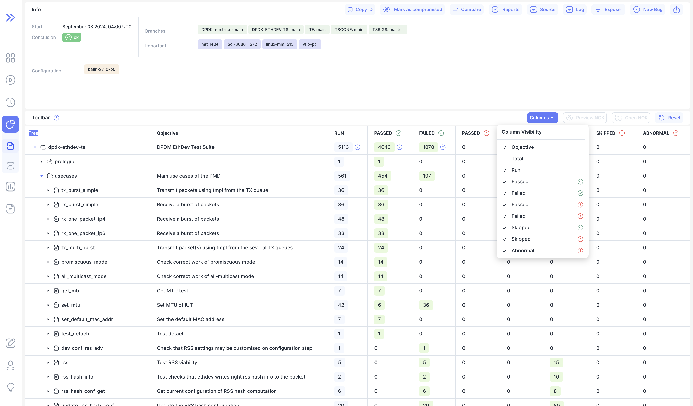
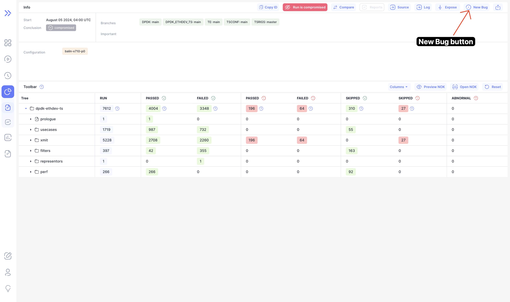

We are happy to announce **Bublik v0.3.6**.

<!--truncate-->

In this release we've added objective column for tests on the run page. You can access it via "Columns" menu in the toolbar.
We've also added "New Bug" button where you copy prefilled markdown

## Highlights

### Objective

You can toggle objective column inside column visibility menu

### New Bug

## Changelog

### Frontend

#### ♻ Code Refactoring

- **run:** added labels to toggle button for full/short run details ([9431427](https://github.com/ts-factory/bublik-ui/commit/9431427e972aa5e87be7beb7c6e8246e3c96948e))
- **run:** disabled uppercase all headers by default ([0b87b4e](https://github.com/ts-factory/bublik-ui/commit/0b87b4e351c163cf1b1cfd43db30441524e68887))

#### 🚀 New Feature

- **log:** added full path to test in new bug modal ([60bbe17](https://github.com/ts-factory/bublik-ui/commit/60bbe171e3580825b1e070e1beceaf9c984ef9b0))
- **log:** added new bug button for log page ([458f871](https://github.com/ts-factory/bublik-ui/commit/458f871a2e4adedc6164b06fb799e0992a298884))
- **run:** added new bug button to run page ([875f366](https://github.com/ts-factory/bublik-ui/commit/875f366ace180e19b33b0dded633a5f98315f88b))
- **run:** added objective column to run table ([7814984](https://github.com/ts-factory/bublik-ui/commit/7814984329c9557234f646cc298bbd9ced4ff58f))
- **ui:** added issue icon to library ([00ee4a5](https://github.com/ts-factory/bublik-ui/commit/00ee4a5bf2d25390af71d67c5276c8518251c55d))
- **ui:** added new bug component ([1175af4](https://github.com/ts-factory/bublik-ui/commit/1175af4a403d5af8708a70cc6921e70fe8bc6a87))

#### 🐛 Bug Fix

- **log:** removed redundant query param from bug link ([8bbcd58](https://github.com/ts-factory/bublik-ui/commit/8bbcd58e7bd2d8ab0daa5753a31eab3acf2ec0ab))
- **run:** remove redundant rowState query param ([69ae6cf](https://github.com/ts-factory/bublik-ui/commit/69ae6cfca2bbb319304ebb47c513c4f818711785))

### Backend

#### 🚀 New Feature

- **importruns:** store objectives in the database ([7dd33a6](https://github.com/ts-factory/bublik/commit/7dd33a65f47a6fc4b11d53bf99b3a44eac38507c))
- **run stats:** make detailed stats more informative ([c3c987b](https://github.com/ts-factory/bublik/commit/c3c987beb55fe0e1928958c1800b8e7196af20db))
