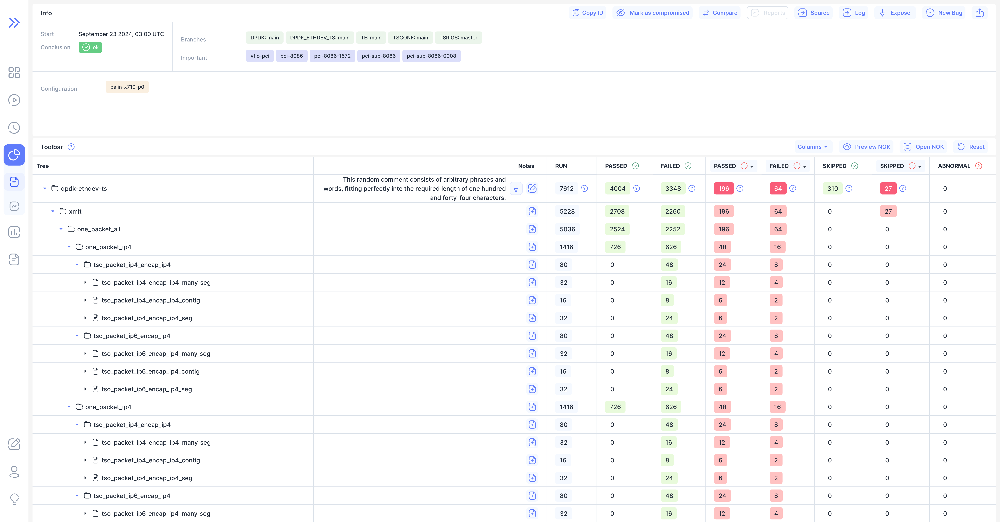
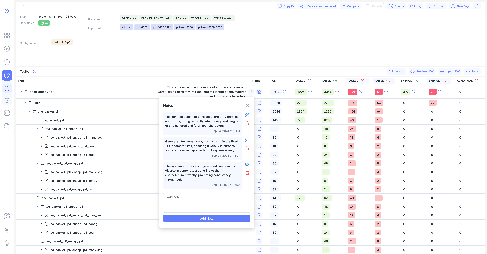
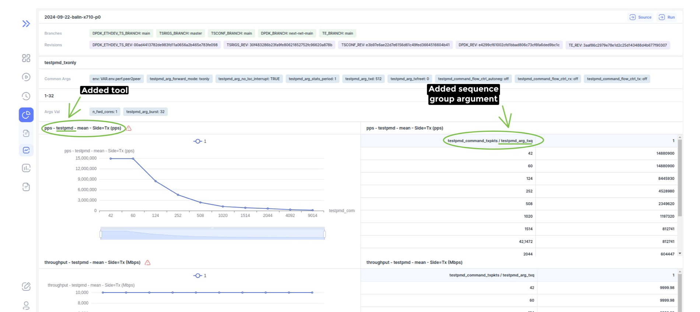

We are happy to announce **Bublik v0.3.9**.

In this release we've added UI for creating and editing notes for tests on the run page. We've also fixed some small styling issues on the run page and also fixed errors and improved the information content of the reports page.

<!--truncate-->

### Key Features:

1. **UI for Creating and Editing Test Notes**:  
   Adds an interface for creating and editing test run notes, improving documentation and tracking.
2. **Borders for Notes and Objectives**:  
   Enhances the visual clarity of the `Notes` and `Objective` columns by adding borders.
3. **More Informative Report Page**:  
   Increasing the information content of record headers and table headers.
4. **More Flexible Report Configuration Structure**:  
   Allows partial filtering of records by arguments.

### Fixes and Minor Enhancements:

1. **Sorting UI Adjustments**:  
   Resolves an issue where sorting controls appeared on non-sortable columns.
2. **Number Alignment Fix**:  
   Corrects the alignment of "0" in table columns.
3. **Some Report Fixes**:  
   Fix filtering by measurements and not processed points handling.

## Highlights

### Table with notes

### Editing Note

:::tip
By default, comment management is available only to administrators. To remove this restriction, you need to add `NOT_PERMISSION_REQUIRED_ACTIONS = ['manage_test_comments']` to your project configuration (*per_conf.py*).
:::

### All Notes Popover

### Editing Note Inside Popover

### More Informative Report Records Headers

### 

## Changelog

### Frontend

#### 📦 Chores

- **runs:** [table] removed unnecessary import ([c3dc7ca](https://github.com/ts-factory/bublik-ui/commit/c3dc7ca92d142458fb8f29635aea5d8733675595))

#### 🐛 Bug Fix

- **run:** [table] display sorting ui only for sortable columns ([97827d0](https://github.com/ts-factory/bublik-ui/commit/97827d09cd4e1c6ad6f004ed97b8c028d0d36aa2))

#### 🚀 New Feature

- **run:** [table] added UI for creating/editing test notes ([6e3b470](https://github.com/ts-factory/bublik-ui/commit/6e3b470711d9a4955e791b59c098b83f7a327ff5))
- **run:** added endpoints to handle note CRUD for test ([6e34438](https://github.com/ts-factory/bublik-ui/commit/6e34438bd09e0ce4f9eb0fe0b2e6789fabdf6f9e))
- **ui:** [button] added variant for destruction-secondary styles ([8c75174](https://github.com/ts-factory/bublik-ui/commit/8c7517476ddba8fb011c2cb2dffab2244b562561))
- **ui:** added file plus icon ([1e5eae0](https://github.com/ts-factory/bublik-ui/commit/1e5eae03ef81b028db446971eaac43dab8c2a973))

#### 💅 Polish

- **run:** [table] added borders for and columns ([f5d94ee](https://github.com/ts-factory/bublik-ui/commit/f5d94ee075784bf55eb3a506573935c6321de29b))
- **run:** [table] fixed number alignment for 0 ([23023e6](https://github.com/ts-factory/bublik-ui/commit/23023e640533952a85ec703df8a670f3cdd848ca)), closes [#130](https://github.com/ts-factory/bublik-ui/issues/130)
- **run:** [table] lower opacity to indicate pending state ([dfa74f9](https://github.com/ts-factory/bublik-ui/commit/dfa74f923d9bfc41af8bc5308c6607de93db2a2e))
- **ui:** [alert] added dialog overlay by default to alert dialog ([e7e860e](https://github.com/ts-factory/bublik-ui/commit/e7e860e6a3ec6399c25d235225aad563fd84050e))

### Backend

#### 🐛 Bug Fix

- **report:** fix filtering by measurements ([4bde173](https://github.com/ts-factory/bublik/commit/4bde17356cd2a34d2adff026423f68335a7335a0))
- **report:** fix format of filtering result by measurement ([202e6c8](https://github.com/ts-factory/bublik/commit/202e6c85732defecb6dca1c92da1a24e6ed34483))
- **report:** fix display of sequence group arg of not processed points ([098d7b8](https://github.com/ts-factory/bublik/commit/098d7b8fb678c4e7362f2d180620b7f005a59b43))
- **report:** fix not processed points handling ([a52d376](https://github.com/ts-factory/bublik/commit/a52d3763b89d1bff96b23542b5b6e99b22d5fa38))

#### 🚀 New Feature

- **auth:** add action permission сheck function ([f564599](https://github.com/ts-factory/bublik/commit/f5645997d5d5eb8820e4ad9398f764893a4c2ac1))
- **test comments:** add data validation and preprocessing ([19ef66e](https://github.com/ts-factory/bublik/commit/19ef66e0bf82d78d196260495fcfc9bea4be7e52))
- **test comments:** add API for management ([8aeea91](https://github.com/ts-factory/bublik/commit/8aeea91e47cd789fb058807d7e2c0051ae83031b))
- **run stats:** make detailed stats more informative ([9e7d7fb](https://github.com/ts-factory/bublik/commit/9e7d7fbf5d6203d3359a682406a51ca8aff9563a))

#### 💾 DB Changes

- **test comments:** add tests and metas relationship model ([e9bc750](https://github.com/ts-factory/bublik/commit/e9bc7506d23ff227cd36c248b0f423314c68442f))
- **models:* fix help text of Meta model type field ([cabbf1b](https://github.com/ts-factory/bublik/commit/cabbf1b19d5e58cc8ac20dcab8e37a4baed408b8))

#### 💅 Polish

- **report:** make displayed error message more informative ([a8c40a0](https://github.com/ts-factory/bublik/commit/a8c40a01532d599a298183f6d9b7c74b013ac0fa))
- **report:** make y-axis label more informative ([7043caa](https://github.com/ts-factory/bublik/commit/7043caa09b7c1f37e75c65b45372634430fd99f7))
- **report:** make table header more informative ([2a5b623](https://github.com/ts-factory/bublik/commit/2a5b6232da3c1309d333050a700d8307915a5410))
- **report:** change missing results corresponding to the config handling ([c4803aa](https://github.com/ts-factory/bublik/commit/c4803aaba39b0a594c369af211cbffd83b5e7750))
- **report:** make not processed points data more informative ([bd6bc4d](https://github.com/ts-factory/bublik/commit/bd6bc4dbc2d8669ae9f633d83e4df160a66d6c50))

#### 📦 Chores

- **cleanup:** apply linter to report services ([925f1f1](https://github.com/ts-factory/bublik/commit/925f1f17a78a868d85c761368481360937625c93))
- **report:** make report config more flexible ([84d0636](https://github.com/ts-factory/bublik/commit/84d0636f3d7525cd8c29f7353b3a44b85872e6ae))
- **cleanup:** format code using linter ([a5df1a7](https://github.com/ts-factory/bublik/commit/a5df1a775c96988c47a8ae1aea51726965a88100))
- **cleanup:** fix reprs of models objects using f-strings ([6ddf4d8](https://github.com/ts-factory/bublik/commit/6ddf4d8f3bf64e385943c19b6f219522ee83659a))
- **cleanup:** add typing of class variables ([7ddbcb3](https://github.com/ts-factory/bublik/commit/7ddbcb31808e0d285586ca76e929e57fc72dd7eb))
