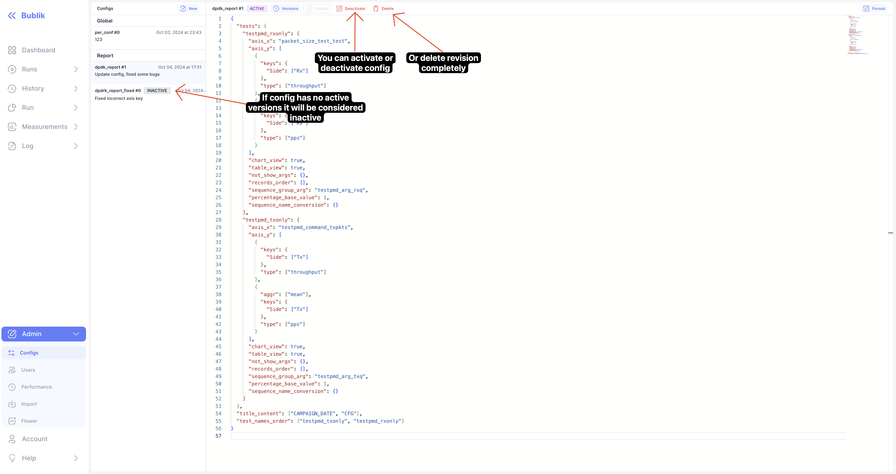
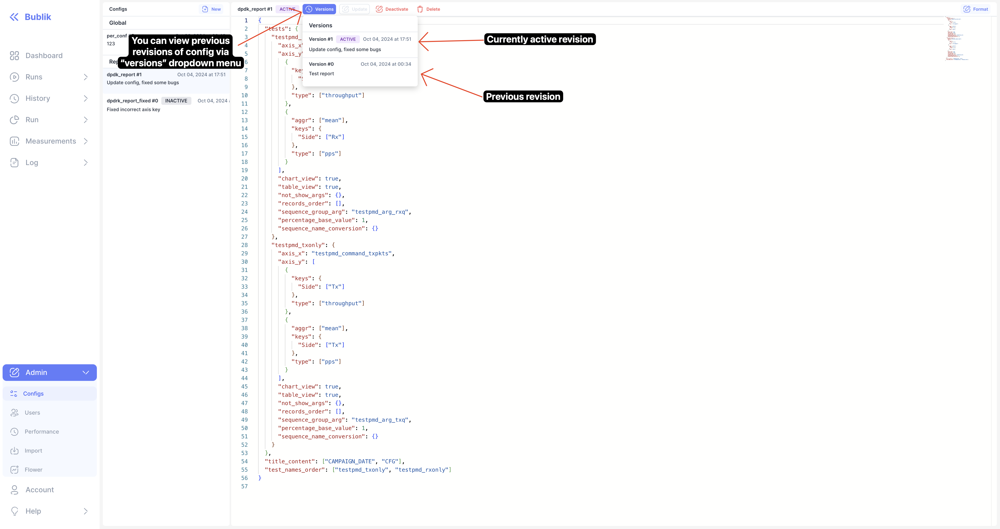

We are happy to announce **Bublik v0.4.1**.

In this we release we've added **config management UI** and added **table of contents** for reports

<!--truncate-->

### Key Features

- **Config Management UI:**
  - Introduced UI page for managing configurations, providing more flexibility in managing settings.
- **Report Enhancements:**
  - Added a Table of Contents to the report view for easier navigation.

### Improvements and Fixes

- **UI Polish:**

  - Improved readability of alert dialogs.
  - Fixed double borders in report labels, enhancing visual clarity.

### Code Refactoring and Chores

We hope these changes improve your experience, and we look forward to your feedback!

## Highlights

### Config manager

### Inactive Configs

### New Config Dropdown Menu

### New Config Modal

### Update Config

### Versions Modal

### Report Table Of Contents

### Reports

## Changelog

### Frontend

#### 🚀 New Feature

- **configs:** added API endpoints for config management ([1aa6673](https://github.com/okt-limonikas/bublik/commit/1aa6673326283f6dfebd28d11fecf29364829db8)), closes [#141](https://github.com/okt-limonikas/bublik/issues/141)
- **configs:** added config management page ([613ce46](https://github.com/okt-limonikas/bublik/commit/613ce4638dd1a096a8266881f801dab56218ed9e)), closes [#141](https://github.com/okt-limonikas/bublik/issues/141)
- **report:** added table of contents to report ([7667a0e](https://github.com/okt-limonikas/bublik/commit/7667a0ec0066fc300b48aae20b4041199f4a5667)), closes [#143](https://github.com/okt-limonikas/bublik/issues/143)

#### 💅 Polish

- **report:** fixed double borders for report labels ([d4fd924](https://github.com/okt-limonikas/bublik/commit/d4fd924860e87fd7d946de0d4185abc2b8d3be5d))
- **ui:** [alert-dialog] improve readability for dialog ([ce9f12f](https://github.com/okt-limonikas/bublik/commit/ce9f12f0e70271a45e7e5810025a8d8560a1c20e)), closes [#141](https://github.com/okt-limonikas/bublik/issues/141)

#### 🐛 Bug Fix

- **build:** correct proxying to derive API path from URL_PREFIX ([1f62c82](https://github.com/okt-limonikas/bublik/commit/1f62c82bf36ca1d058b63b940782da39ae2b5759))
- **build:** skip package scripts to optimize dev build ([0f12745](https://github.com/okt-limonikas/bublik/commit/0f1274563c1742f27f3e870e5c251b9fd5e92a71))
- **report:** fixed incorrect scrolling on mount ([f4b284b](https://github.com/okt-limonikas/bublik/commit/f4b284b25300e5fb9cfd896efe2cea9b9774b2b3)), closes [#143](https://github.com/okt-limonikas/bublik/issues/143)

#### ♻ Code Refactoring

- **run:** [reports] adjusted types and components for config changes ([b3eb33a](https://github.com/okt-limonikas/bublik/commit/b3eb33a4f87f238c0aa79016b3b4b951f85e4c85)), closes [#141](https://github.com/okt-limonikas/bublik/issues/141)
- **ui:** [card-header] allow passing react node as label ([5aac339](https://github.com/okt-limonikas/bublik/commit/5aac3390e0b519189b7bf2757721979730892f58))

#### 📦 Chores

- added react-monaco-editor dependency ([b5e858a](https://github.com/okt-limonikas/bublik/commit/b5e858a7e462b1ad75c51825f06549d914c02321)), closes [#141](https://github.com/okt-limonikas/bublik/issues/141)
- **report:** updated components for new type changes ([f05977c](https://github.com/okt-limonikas/bublik/commit/f05977c327ebd97801310f581dd9ac43785d875f)), closes [#143](https://github.com/okt-limonikas/bublik/issues/143)
- **types:** updated report types to API changes ([34ed7e9](https://github.com/okt-limonikas/bublik/commit/34ed7e99defa4e7472e6f6fa2732dc828c33f45b)), closes [#143](https://github.com/okt-limonikas/bublik/issues/143)
