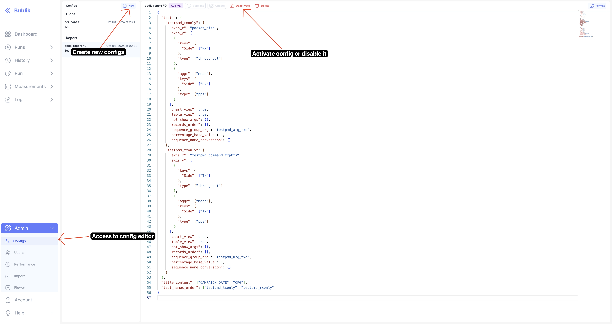
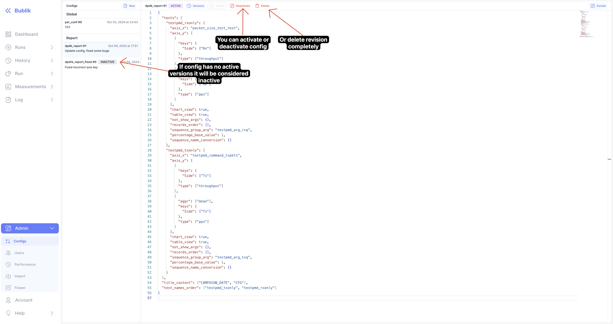
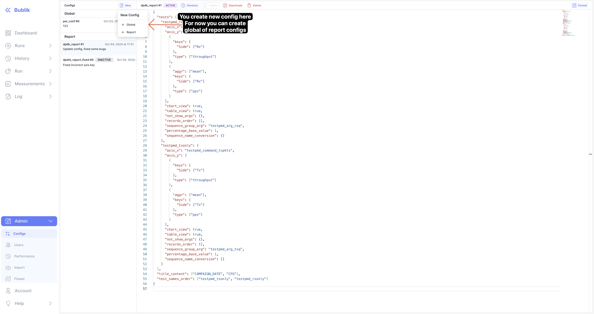
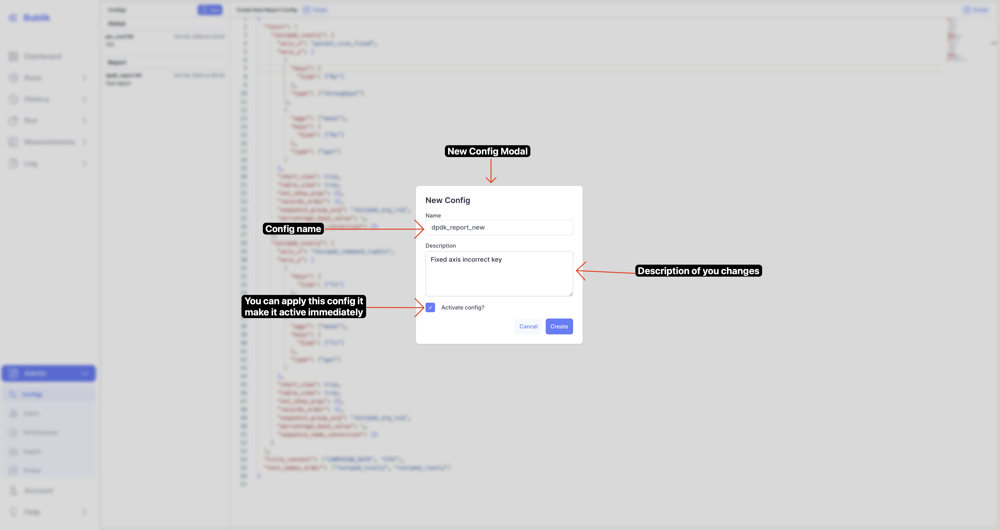
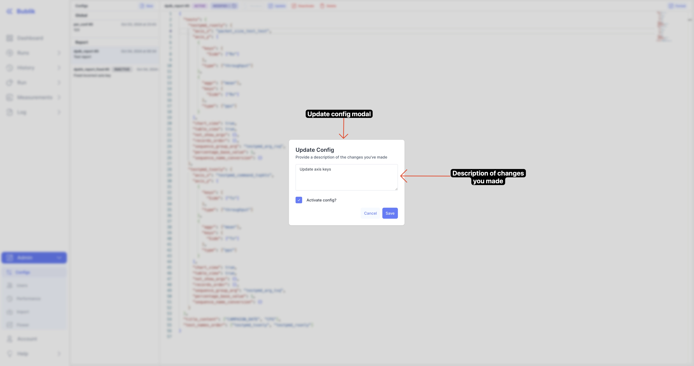
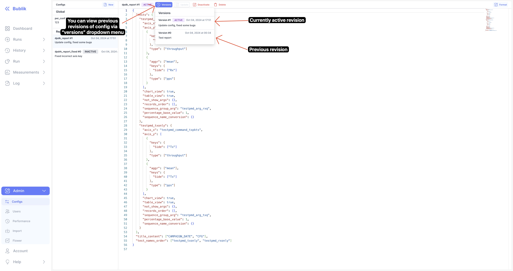
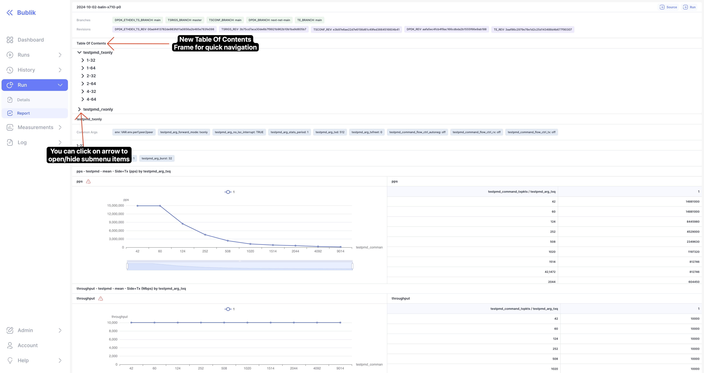
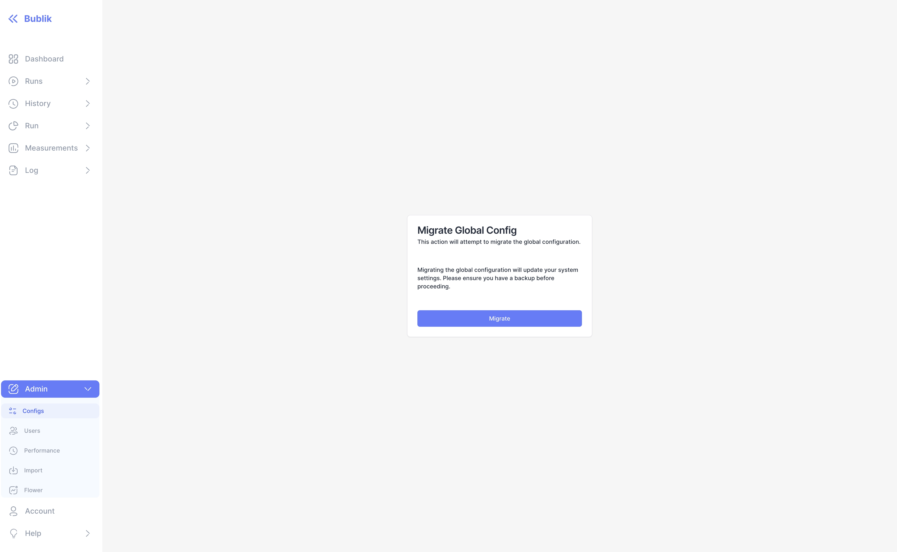

We are happy to announce **Bublik v0.4.3**.

In this we release we've added **config management UI** and added **table of contents** for reports

<!--truncate-->

### Key Features

- **Config Management UI:**
  - Introduced UI page for managing configurations, providing more flexibility in managing settings.
- **Report Enhancements:**
  - Added a Table of Contents to the report view for easier navigation.

### Improvements and Fixes

- **UI Polish:**

  - Improved readability of alert dialogs.
  - Fixed double borders in report labels, enhancing visual clarity.

### Code Refactoring and Chores

We hope these changes improve your experience, and we look forward to your feedback!

## Highlights

:::info
Configuration management is available only to administrators.
:::

### Config manager



### Inactive Configs



### New Config Dropdown Menu



### New Config Modal



### Update Config



### Versions Modal



### Report Table Of Contents



## Admin Section

### Update Steps

Deployment: `./scripts/deploy --steps pip_requirements django_settings migrate_db run_services`

:::danger
When upgrading to this version, you need to migrate the main configuration of the Bublik instance to the database:


:::

If you don't have a Bublik account, create one by the following steps:

1. Activate the virtual environment: `source .env/bin/activate`
2. Initiate the creation of a superuser: `python manage.py createsuperuser`

### Important Info

:::warning
Django's configurable settings still use _per_conf.py_. This will be fixed soon.
:::

## Changelog

### Frontend

#### 🚀 New Feature

- **configs:** added API endpoints for config management ([1aa6673](https://github.com/okt-limonikas/bublik/commit/1aa6673326283f6dfebd28d11fecf29364829db8))
- **configs:** added config management page ([613ce46](https://github.com/okt-limonikas/bublik/commit/613ce4638dd1a096a8266881f801dab56218ed9e))
- **report:** added table of contents to report ([7667a0e](https://github.com/okt-limonikas/bublik/commit/7667a0ec0066fc300b48aae20b4041199f4a5667))

#### 💅 Polish

- **report:** fixed double borders for report labels ([d4fd924](https://github.com/okt-limonikas/bublik/commit/d4fd924860e87fd7d946de0d4185abc2b8d3be5d))
- **ui:** [alert-dialog] improve readability for dialog ([ce9f12f](https://github.com/okt-limonikas/bublik/commit/ce9f12f0e70271a45e7e5810025a8d8560a1c20e))

#### 🐛 Bug Fix

- **build:** correct proxying to derive API path from URL_PREFIX ([1f62c82](https://github.com/okt-limonikas/bublik/commit/1f62c82bf36ca1d058b63b940782da39ae2b5759))
- **build:** skip package scripts to optimize dev build ([0f12745](https://github.com/okt-limonikas/bublik/commit/0f1274563c1742f27f3e870e5c251b9fd5e92a71))
- **report:** fixed incorrect scrolling on mount ([f4b284b](https://github.com/okt-limonikas/bublik/commit/f4b284b25300e5fb9cfd896efe2cea9b9774b2b3))

#### ♻ Code Refactoring

- **run:** [reports] adjusted types and components for config changes ([b3eb33a](https://github.com/okt-limonikas/bublik/commit/b3eb33a4f87f238c0aa79016b3b4b951f85e4c85))
- **ui:** [card-header] allow passing react node as label ([5aac339](https://github.com/okt-limonikas/bublik/commit/5aac3390e0b519189b7bf2757721979730892f58))

#### 📦 Chores

- added react-monaco-editor dependency ([b5e858a](https://github.com/okt-limonikas/bublik/commit/b5e858a7e462b1ad75c51825f06549d914c02321))
- **report:** updated components for new type changes ([f05977c](https://github.com/okt-limonikas/bublik/commit/f05977c327ebd97801310f581dd9ac43785d875f))
- **types:** updated report types to API changes ([34ed7e9](https://github.com/okt-limonikas/bublik/commit/34ed7e99defa4e7472e6f6fa2732dc828c33f45b))

### Backend

#### 🐛 Bug Fix

- **history:** fix filtering by expressions ([649bca0](https://github.com/ts-factory/bublik/commit/649bca067862421d70091b4321a8481ca22b9a2b))
- **config:** fix the main configuration JSON schema ([38ef39e](https://github.com/ts-factory/bublik/commit/38ef39e3ce4b144c387c1db9f0184befe80b4721))
- **config:** fix the main config migration ([d60bc81](https://github.com/ts-factory/bublik/commit/d60bc81d5b5dd2d74fea177eafffc8637ab15de3))
- **report:** fix unprocessed iters handling ([45ebf10](https://github.com/ts-factory/bublik/commit/45ebf104568f3cfaf7426f0a885596e1e252d0da))

#### 💾 DB Changes

- **models:** add model to store configurations ([74f56d2](https://github.com/ts-factory/bublik/commit/74f56d22cda53da219a07e118d9ac11ff8dd8107))

#### 🚀 New Feature

- **config:** add data validation and preprocessing ([b178cd1](https://github.com/ts-factory/bublik/commit/b178cd1811712a70e189aaf2d221ab32d8d57c39))
- **config:** add API for management ([77da58c](https://github.com/ts-factory/bublik/commit/77da58c562c07b1dbacd1a2ba090658fe10fb526))
- **per_conf:** change the source of attributes getting ([2556ec0](https://github.com/ts-factory/bublik/commit/2556ec0929a98d3fc0eae3e617396ee2f897e8ba))
- **report:** change the source of config getting ([d714815](https://github.com/ts-factory/bublik/commit/d714815aff12e53c5aac2174677d2014dc100d1e))

#### 📦 Chores

- **report:** update report content structure ([4abe460](https://github.com/ts-factory/bublik/commit/4abe4604f69d0c186a649b3873a4564395f4f89c))
- **report:** make reports more flexible ([51a5a48](https://github.com/ts-factory/bublik/commit/51a5a48f7426ea9d556c2b315ccd56ca6298b8e2))
- **report:** make record title more informative ([1ed43e4](https://github.com/ts-factory/bublik/commit/1ed43e48f7017ca6ef238746c27d2f046589ae28))
- **cleanup:** fix report function documentation ([a8b80d2](https://github.com/ts-factory/bublik/commit/a8b80d219c9dbaa116d258ffad2eac7ffec2db29))
- **config:** refactor JSON schema getting ([9e04f2a](https://github.com/ts-factory/bublik/commit/9e04f2a741785c1fc5b6fc976bc3f35694a8a620))

```

```
