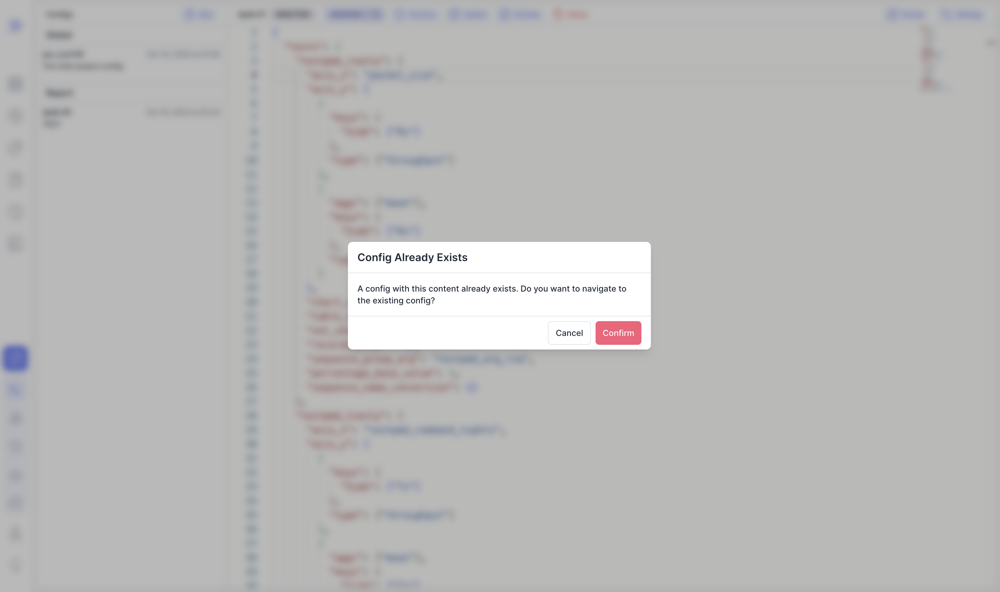

import video from './video/output.mp4';

We are happy to announce **Bublik v0.5.0**.

In this we release we've added **sticky stacked headers** for reports and fixed some bugs for configs also added config font size settings

<!--truncate-->

## Highlights

### Sticky Stacked Headers

<video controls width="100%" height="100%">
  <source src={video} />
</video>

### Config Font Size

### Config Exists

## Admin Section

## Changelog

### Frontend

#### 🚀 New Feature

- **configs:** [editor] added setting to change font size ([53ef50e](https://github.com/ts-factory/bublik-ui/commit/53ef50e029270879fc73d9010998d17b51e0af06)), closes [#145](https://github.com/ts-factory/bublik-ui/issues/145)
- **configs:** added shortcut to trigger autocomplete in editor `ctrl+\` ([e5f6078](https://github.com/ts-factory/bublik-ui/commit/e5f6078a60f0b6ee38e1e36bd7da3a634e058ade)), closes [#144](https://github.com/ts-factory/bublik-ui/issues/144)
- **report:** added button to copy link for currently open report ([83f5c63](https://github.com/ts-factory/bublik-ui/commit/83f5c6337f21a48d515c57959d926205b7c45c8a)), closes [#152](https://github.com/ts-factory/bublik-ui/issues/152)
- **report:** added link to config used for generation current report ([3f606cc](https://github.com/ts-factory/bublik-ui/commit/3f606cc063c7305fdb9648542781d3e407c86cb3)), closes [#151](https://github.com/ts-factory/bublik-ui/issues/151)
- **report:** added sticky-stacked headers for all levels ([f0ce3af](https://github.com/ts-factory/bublik-ui/commit/f0ce3af9ac834a547591ddcdaeec76eed27145be)), closes [#147](https://github.com/ts-factory/bublik-ui/issues/147)

#### 💅 Polish

- **history:** [plots] moved links for plot point to modal header ([38d8221](https://github.com/ts-factory/bublik-ui/commit/38d822197ba8cc2c0bc751214680f14a0de9c9e2))
- **log:** fixed button for log filters being shown on top of the new bug modal ([8fd958b](https://github.com/ts-factory/bublik-ui/commit/8fd958bd10515163c8eb9d2c6acb76d05b0a74ed))
- **report:** fixed missing border in case `multiple_sequences` is `false` ([46d2b14](https://github.com/ts-factory/bublik-ui/commit/46d2b14bb6934787cf16913bd7af56fe42f9559a))

#### 🐛 Bug Fix

- **configs:** added modal to show "navigate to existing config" if it exists ([4639f21](https://github.com/ts-factory/bublik-ui/commit/4639f2127d6963406cb54d134c626b5c43bd3ad4))
- **configs:** allowed partial updates for config ([7b8150d](https://github.com/ts-factory/bublik-ui/commit/7b8150d76f9724b8191a76e99487eb27ba42dd9e))
- **log,run:** fixed parameters incorrectly cutting off "=" ([b6d2032](https://github.com/ts-factory/bublik-ui/commit/b6d2032255ae3c8918f93891d0d055a95d674583)), closes [#137](https://github.com/ts-factory/bublik-ui/issues/137)

#### ♻ Code Refactoring

- **build:** adjusted release config to sort sections ([9d1affc](https://github.com/ts-factory/bublik-ui/commit/9d1affc83e4e5ba6374c227db3da7c50bf62f6bc)), closes [#138](https://github.com/ts-factory/bublik-ui/issues/138)
- **configs:** extracted all components to improve readability ([df9cbc3](https://github.com/ts-factory/bublik-ui/commit/df9cbc3c7b92d04d5c37d69dffdcfaac2555d220))

#### 📦 Chores

- **sidebar:** moved history and measurements links to the bottom ([b480074](https://github.com/ts-factory/bublik-ui/commit/b48007433f5679d642eab3884abb47d3d4f3315d)), closes [#139](https://github.com/ts-factory/bublik-ui/issues/139)
