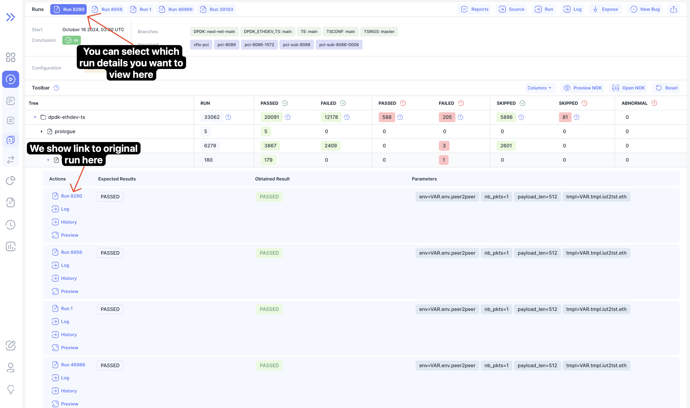
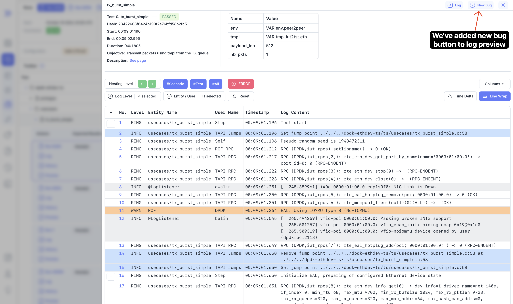
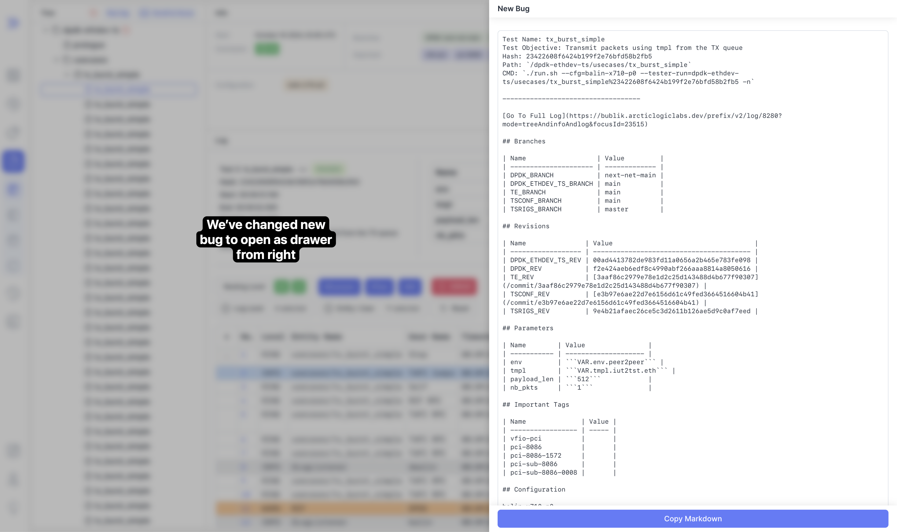
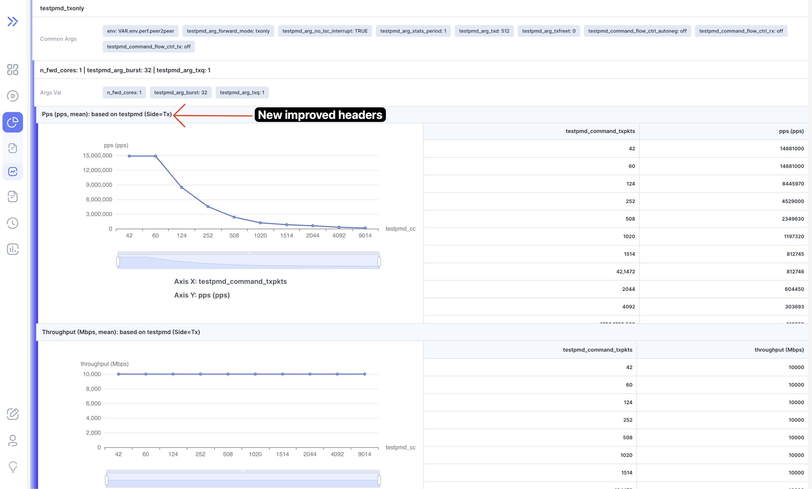

We are happy to announce **Bublik v0.6.2**.

This release introduces an experimental multiple runs stats page, enabling users to view multiple runs on the same page. We have also expanded the headings in the reports and made them more understandable.

**Highlights**
- Multiple Runs Page: Explore and multiple merged results on a single page.
- Reports Button: Access reports directly from the log page.
- Log Preview: Redesigned log preview with a new bug button for easier access.

<!--truncate-->

## Highlights

### Multiple Runs Page

:::info
  This is experimental feature
:::

#### Selection

####  Page

### Reports Button

### Log Preview

We've made small redesign adjustment and also added new bug button to preview

### New Bug

Small redesign to match new log preview style

### Updated Report Headers

## Admin Section

### Update Steps

Deployment: `./scripts/deploy --steps run_services`

## Changelog

### Frontend

#### 🚀 New Feature

* **log,run:** added new bug button to log preview ([f2a37ca](https://github.com/ts-factory/bublik-ui/commit/f2a37cae13f1848f95bdd9030e79142379a169ea))
* **log:** added link to reports from log page ([5227387](https://github.com/ts-factory/bublik-ui/commit/52273874e2ed12d04d71848e78fea280a053a1cb)), closes [#185](https://github.com/ts-factory/bublik-ui/issues/185)
* **run:** [multiple] added endpoint for merging multiple runs ([73902e5](https://github.com/ts-factory/bublik-ui/commit/73902e58e613f6affb409e3a52b7e56991cbb04b))
* **run:** [result-table] added prop to show link to result run ([7950f3c](https://github.com/ts-factory/bublik-ui/commit/7950f3cc748d9b241010ceb242e88871767563f8))
* **run:** added initial multiple runs page ([91bee3d](https://github.com/ts-factory/bublik-ui/commit/91bee3d88d06e139c3eadb966de35d09c0365bdf))
* **run:** added link to multiple run page from runs selection popover ([de98aea](https://github.com/ts-factory/bublik-ui/commit/de98aeaa64cfae42fea6c728913a4e172005ab16))
* **run:** added link to multiple runs in sidebar ([70c983e](https://github.com/ts-factory/bublik-ui/commit/70c983e558a36267093490078a55e41bb2c37103))

#### 💅 Polish

* **log:** [new-bug] made new bug appear as drawer content from right ([10b034f](https://github.com/ts-factory/bublik-ui/commit/10b034f44679a1e23be01f6394be9637cd382915))
* **run:** [details] removed unnecessary padding from list label ([94a7017](https://github.com/ts-factory/bublik-ui/commit/94a70173683f052f13b74b764555d79105059e6f))
* **run:** [log] show log preview as drawer from right side ([15cee82](https://github.com/ts-factory/bublik-ui/commit/15cee823ecf3ec497a13710a202280cb7b24d7d5))

#### 🐛 Bug Fix

* **log:** [new-bug] added test path for generated `CMD` ([bf03de0](https://github.com/ts-factory/bublik-ui/commit/bf03de0118d2b6d674a496aa64c0eee27cff6719)), closes [#173](https://github.com/ts-factory/bublik-ui/issues/173)
* **run:** fixed run compromise status invalidation for runs/dashboard pages ([64d0a71](https://github.com/ts-factory/bublik-ui/commit/64d0a71fb7789a0852dec32968a53521bd0a8633))
* **runs:** [charts] fixed clicking on bar plot not redirecting to run ([6969fc3](https://github.com/ts-factory/bublik-ui/commit/6969fc3a350e555c2b2fb2efe73cf06b606cd02c))

#### ♻ Code Refactoring

* **log:** [new-bug] added function to get new bug props to remove boilerplate ([be5a89f](https://github.com/ts-factory/bublik-ui/commit/be5a89fcf4d192247ec7c2d308e78f5ed7be063d))
* **log:** [new-bug] simplified log-feature component logic ([1763d4f](https://github.com/ts-factory/bublik-ui/commit/1763d4f75d819dfe065d4ca06fd224b1d202e16f))
* **run:** [result-table] added support for merged results ([b358be9](https://github.com/ts-factory/bublik-ui/commit/b358be99fe7f02da78be2ec84e75e1260cb5cae5))
* **run:** added support for merged runs in run table ([36f7389](https://github.com/ts-factory/bublik-ui/commit/36f7389166731820bded8f8b7b53c2bee3b455db))
* **run:** adjusted run tab title generation for multiple runs ([d12c8c1](https://github.com/ts-factory/bublik-ui/commit/d12c8c1f45aa2db2f40674ccf358081f574fef68))
* **run:** sort results by iteration id ([d9fc3d1](https://github.com/ts-factory/bublik-ui/commit/d9fc3d16db2923908b9700c788cdc84c00698bd5))

#### 📦 Chores

* **log:** [new-bug] fixed typo for successful copy message ([30bbc34](https://github.com/ts-factory/bublik-ui/commit/30bbc3421a4b838020581247fd6cd087f43783f5))
* **report:** fixed formatting ([6271f19](https://github.com/ts-factory/bublik-ui/commit/6271f19ac205e6579551a2e72ecc79f507f7ebfc))

### Backend

#### 🐛 Bug Fix

* **importruns:** fix iteration date parsing ([14c983e](https://github.com/ts-factory/bublik/commit/14c983e61bd72e1ac789ff47aef1ba40381872be))

#### 💅 Polish

* **report:** make iteration headers clearer ([9fd1b82](https://github.com/ts-factory/bublik/commit/9fd1b820fd7a28769b1c68dadf9a7c35a4080b84))
* **report:** make y-axis labels more informative ([969ce93](https://github.com/ts-factory/bublik/commit/969ce9365ddae8a7ea3669d123886f01b864dd11))
* **report:** make measurement chart label more informative ([475553d](https://github.com/ts-factory/bublik/commit/475553d111b8c38396f79516ff32b459b7858120))

#### ♻ Code Refactoring

* **cleanup:** fix typo ([15d640d](https://github.com/ts-factory/bublik/commit/15d640d659f36a3dea014487e92cf1ee16225bd2))
* **cleanup:** apply linter to report components ([1da72cb](https://github.com/ts-factory/bublik/commit/1da72cb2c015a00c951c42062c0ec7912a424b93))
