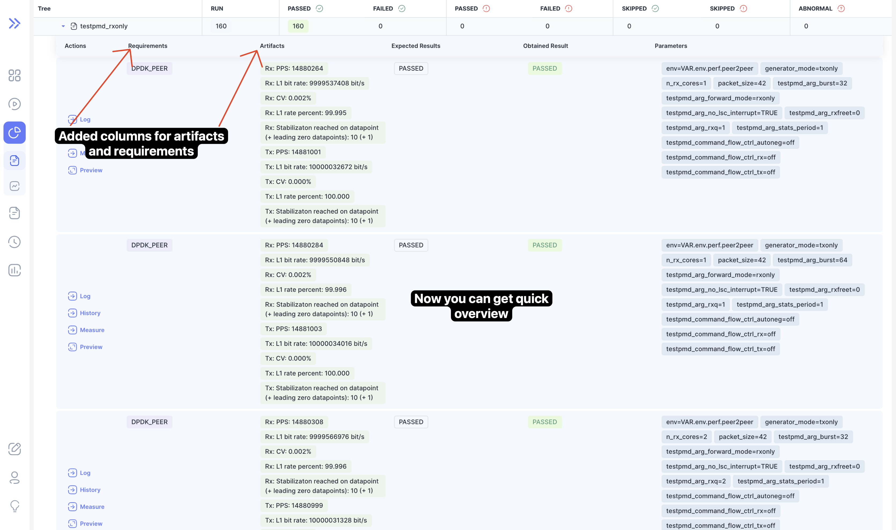
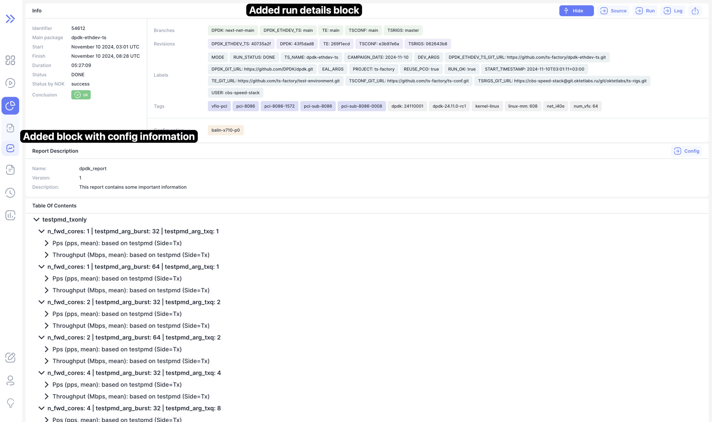

We are excited to announce **Bublik v0.7.0**!

This release brings several improvements and new features, including better pagination, enhanced configuration handling,
and new options for viewing run results.
The log functionality has been refined, with the addition of scroll-to-top behavior.
We’ve also introduced a more flexible report system with detailed configuration and run information and fixed getting valid configurations, as well as incorrect links to the run source.

<!--truncate-->

## Highlights

### Result Requirements & Artifacts

### Log Verdicts & Artifacts

### Report Description

## Admin Section

### Update Steps

Deployment: `./scripts/deploy --steps run_services`

## Changelog

### Frontend

#### 🚀 New Feature

* **report:** added link from report to log page ([d2c63cb](https://github.com/ts-factory/bublik-ui/commit/d2c63cba37d7310f8c1fbaaab458c2115d3fb0b2)), closes [#214](https://github.com/ts-factory/bublik-ui/issues/214)
* **report:** added run details to report ([70b0b25](https://github.com/ts-factory/bublik-ui/commit/70b0b25c4fefacf644fc112ce00ac84d7295ef88))
* **run:** [results] added artifacts and requirements to results ([a00d9bc](https://github.com/ts-factory/bublik-ui/commit/a00d9bc72e5ec5d5aaa0efb51d521c687157311b))
* **run:** added endpoint to get verdicts and artifacts for iteration ([551352d](https://github.com/ts-factory/bublik-ui/commit/551352d79050a3c1b74d7278a628181325f392c2))

#### 💅 Polish

* **log:** [details] removed minimum height for details block ([e0c4fd9](https://github.com/ts-factory/bublik-ui/commit/e0c4fd931800bce66dd06de51331727bbeadee35))
* **run:** [details] removed minimum height for details block ([3d76aac](https://github.com/ts-factory/bublik-ui/commit/3d76aac5542de1072b0921a9115bf4adfc662165))

#### 🐛 Bug Fix

* **config:** [update] added handling for error when config with same name exists ([00296f8](https://github.com/ts-factory/bublik-ui/commit/00296f89120e70c543cc160c7991b05b503ee9f5))
* **log:** added scroll to top on page change ([9b479e8](https://github.com/ts-factory/bublik-ui/commit/9b479e835893f551fda5ea1f1fa39e99caa580a3))
* **run, log:** disable source link on URL retrieval failure ([ed3c420](https://github.com/ts-factory/bublik-ui/commit/ed3c420619c4dcb77ddf53d9edf8cc0cc128d1a8)), closes [#216](https://github.com/ts-factory/bublik-ui/issues/216)
* **run:** [results] added handling for results in progress ([932773a](https://github.com/ts-factory/bublik-ui/commit/932773aafe80b2ce9a9a18f507f12a9b1770b785))

#### ♻ Code Refactoring

* **config:** added name field to update config form ([5148e56](https://github.com/ts-factory/bublik-ui/commit/5148e5677be5c80d4bce5d3072e27553adeed8f4))
* **config:** adjusted logic for activating/deactivating config ([673dc0c](https://github.com/ts-factory/bublik-ui/commit/673dc0c7a64c9e8eb464fea1aaacf3a63471bc5d))
* **config:** adjusted types to allow renaming configs ([b26fd97](https://github.com/ts-factory/bublik-ui/commit/b26fd97456ae69eb5a6a4ac74e513cd9928967ae))
* **log:** [new-bug] try to get configuration from `special_categories` ([49875f9](https://github.com/ts-factory/bublik-ui/commit/49875f9eab060797269d29228c9ad97755153285))
* **log:** get artifacts and verdicts from API and merge them into log ([fc38cca](https://github.com/ts-factory/bublik-ui/commit/fc38ccaa9ee68d7be25ffeef815ea6c70954a9e6))
* **log:** made pagination look the same top and bottom ([67374a9](https://github.com/ts-factory/bublik-ui/commit/67374a9b0c81d6a1d1023de824152793d86d354b))
* **report:** added report description frame with config and warnings ([4421048](https://github.com/ts-factory/bublik-ui/commit/442104867afc7f5af522b4c80b7f3e33bfd9df29))

#### 🔧 Continuous Integration | CI

* **build:** added check to ensure code is buildable ([86166a5](https://github.com/ts-factory/bublik-ui/commit/86166a52b25a8fd76eab83f0e7b1f1326a3aa9b6))

#### 📦 Chores

* **config:** adjusted alert dialog description for activation of the config ([9b69d74](https://github.com/ts-factory/bublik-ui/commit/9b69d74ecd05529cc3458fe8ee585f95e2a05c2f))
* **config:** removed redundant endpoint ([b810389](https://github.com/ts-factory/bublik-ui/commit/b810389f258d431abc2f8274ade5bc045da9206d))
* **log:** removed redundant prop ([6bd37aa](https://github.com/ts-factory/bublik-ui/commit/6bd37aacb340a6c87c5f2d6ec23837119d354957))
* **log:** removed redundant type ([48d17a5](https://github.com/ts-factory/bublik-ui/commit/48d17a53c41140881bb593616a7755736bf8b970))
* **log:** simplified logic for redirect to legacy ([e390fe7](https://github.com/ts-factory/bublik-ui/commit/e390fe72920a267a2dd4af132c7a79a4f93752ec))
* **run:** [results] renamed badly named variables ([724a688](https://github.com/ts-factory/bublik-ui/commit/724a6884044cc8f2599370dbcf8d9d3651176b53))

### Backend

#### 🐛 Bug Fix
- **bugfix:** fix passing arguments in response ([52dbe74](https://github.com/ts-factory/bublik/commit/52dbe74cc168c82095f4cf99157832fd48d6d49e))
- **urls:** fix run source link building ([a8a406e](https://github.com/ts-factory/bublik/commit/a8a406e2f4b99069b4d0ed939055ba22b7d23bd7))
- **report:** fix getting the applicable configs ([6b45fcc](https://github.com/ts-factory/bublik/commit/6b45fcc9a8c7a3c7af5d09455c8208ccc85553c3))

#### 🚀 New Feature
- **results:** add endpoint to get result verdicts and artifacts ([beabf15](https://github.com/ts-factory/bublik/commit/beabf15767af4b068d7e84deb1e4467fdea641de))
- **config:** make it possible to rename configs ([375b701](https://github.com/ts-factory/bublik/commit/375b701a493d0fc1dce4f7db245ca8f53cea5046))
- **importruns:** import information about requirements ([afe99a2](https://github.com/ts-factory/bublik/commit/afe99a2310360a3fa7559fab119c4a2b55048e27))
- **importruns:** store test iter reqs in the database ([1fb0fc9](https://github.com/ts-factory/bublik/commit/1fb0fc938d704e67f46ff00f91975d6890734af9))
- **run stats:** make result details more informative ([b418ea9](https://github.com/ts-factory/bublik/commit/b418ea996be429f707349b904eace16d0b87b0b9))
- **run stats:** make result details more informative ([74a66c6](https://github.com/ts-factory/bublik/commit/74a66c6d3c4a9323e3a103b26c26d593e2b933b0))
- **report:** update the data to display ([67cfc96](https://github.com/ts-factory/bublik/commit/67cfc967a0029c44ddf668b1f8ccede1e1c8a0ba))

#### 📦 Chores
- **config:** unify configuration updates ([945f0d8](https://github.com/ts-factory/bublik/commit/945f0d8616eef8a01cc87280ae8b93788308a655))

#### ♻ Code Refactoring
- **config:** refactor retrieval of all versions ([7bcfd73](https://github.com/ts-factory/bublik/commit/7bcfd733ad882d2cd40ab9f2b476d2c94cde04fa))
- **config:** refactor activation ([ff3d394](https://github.com/ts-factory/bublik/commit/ff3d394acca2ac74a1df3f3f03a3ff6201dbf5b6))
- **config:** refactor deletion ([5345b00](https://github.com/ts-factory/bublik/commit/5345b00ef6d35088cfbbb62bea5a8ee02b91d471))
- **cleanup:** remove unused class import ([dfc9ff2](https://github.com/ts-factory/bublik/commit/dfc9ff2cb49ce1a434e4a51e8e02122482957dc0))

