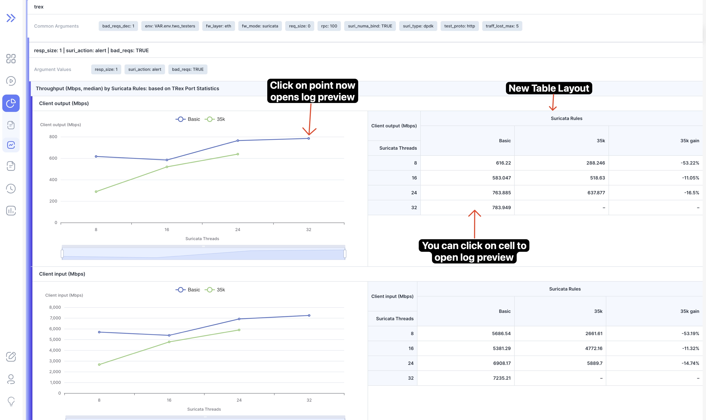
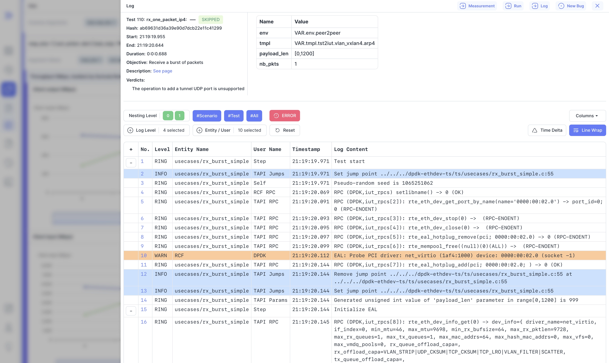
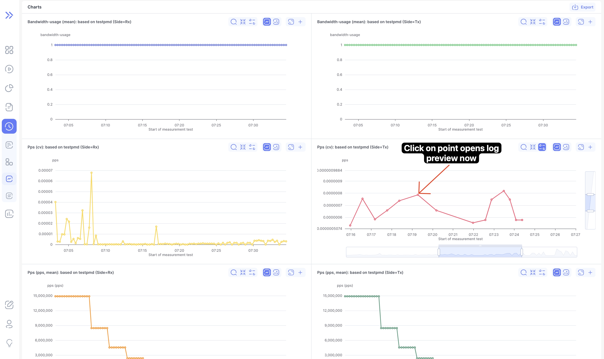
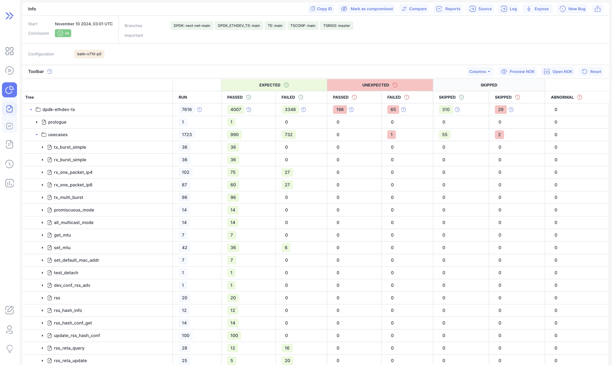
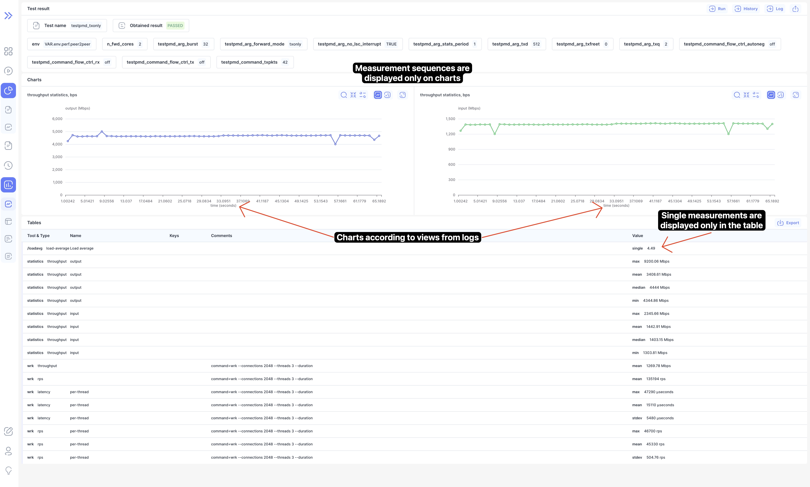

🎉 **We are thrilled to announce Bublik v1.0.2!** 🎉

This release brings mainly internal changes with some enhancements to report and measurements views.

🔍 **Key Highlights**:

- **Log Preview**: Easily open the log preview by clicking on a report table cell or a chart point.
- **Run Header Group Labels**: Added labels for expected and unexpected results to make columns easier to understand and reduce confusion.
- **Import Performance**: The speed of importing runs with streaming measurements has increased 3.5 times.
- **Measurements**: All measurement results are displayed, with the format adapted to views and their specific context.

<!--truncate-->

## Highlights

### Report Table & Chart

:::info
Press `Ctrl` to scroll inside table or zoom chart
:::

### Report Log Preview

### History Preview

### Run Header Groups

### Measurement Results

## Admin Section

:::tip
Before starting the update, create a database backup to ensure data safety in case of any unexpected issues during the process.
:::

### Backend Update

#### Base Steps

1. `cd bublik`
2. `git remote update`
3. `git checkout v1.0.2`
4. `./scripts/deploy --steps pip_requirements migrate_db django_settings run_services`

#### Additional Steps

:::tip
Since data migration can take a long time, stop side services to avoid potential disruptions or conflicts during the migration process: `./scripts/deploy --steps run_side_servers` + `stop`. Restart them once the process is complete: `./scripts/deploy --steps run_side_servers` + `start`.
:::

:::tip
During the update, use `tmux` or `screen` to keep your session running in the background, ensuring it won’t be interrupted if the connection is lost.
:::

1. Activate the virtual environment: `source .env/bin/activate`
2. Call the configuration reformatting command: `python manage.py reformat_configs`
   :::warning
   Configurations whose automatic formatting has failed will not be supported by Bublik. Either reformat them manually or delete.
   :::
3. Call the database cleanup command: `python manage.py cleanup_db`

### Frontend Update

1. Trigger the workflow in your frontend repository.
2. Synchronize the mirrors.
3. `cd bublik-ui`
4. `git remote update`
5. `git checkout v1.0.2`

### Additional

:::danger
It is necessary to re-import runs that was imported when Bublik was using versions v0.6.0 to v1.0.0 to avoid potential errors in statistical calculations and charts in history.
:::

:::danger
Avoid reverting to earlier versions after upgrading to v1.0.\*, as this could lead to irreversible data loss.
:::

## Changelog

### Frontend

#### 🚀 New Feature

- **measurements:** added endpoint and types for single measurement plot ([3b8df42](https://github.com/ts-factory/bublik-ui/commit/3b8df42ec891fab6b79d03753b94268c3cee6085))
- **measurements:** added new chart component ([68f68c5](https://github.com/ts-factory/bublik-ui/commit/68f68c5be72bbaa6b0dc513ad78491e5e0fa52f9))
- **measurements:** added new stacked chart component ([513d581](https://github.com/ts-factory/bublik-ui/commit/513d5812575adda43befa13cecf06b23bdacc57d))
- **report:** [chart] open point info dialog when clicking on point ([840d9f9](https://github.com/ts-factory/bublik-ui/commit/840d9f9a90859f7c50ac2aaa0d515931a1c56507))
- **report:** [table] open point info dialog when clicking on table cell ([a1c8dcb](https://github.com/ts-factory/bublik-ui/commit/a1c8dcb6e8cf9744eb4546cba09aeddc4774ceab))
- **report:** added drawer with point information component ([c8c9450](https://github.com/ts-factory/bublik-ui/commit/c8c9450371d8b60bf62da361b356d4be5b1acbbe))
- **run:** added header groups to show difference between columns ([505d798](https://github.com/ts-factory/bublik-ui/commit/505d798b82843075b4f26ed49d8be1a0c98da20a)), closes [#175](https://github.com/ts-factory/bublik-ui/issues/175)
- **run:** added screen reader only label for "add note" button ([9ba0120](https://github.com/ts-factory/bublik-ui/commit/9ba01208a6cca5ed5b5650280cfb6c5a6dcc3e69))
- **ui:** [chart] allowed to override default options for chart ([bd65b92](https://github.com/ts-factory/bublik-ui/commit/bd65b92df0a6eefd25a64b204fb6271f7969bbf9))
- **utils:** added controllable state hook ([dc885dd](https://github.com/ts-factory/bublik-ui/commit/dc885ddb4b5b5e91f90b772030a1429472636c80))
- **utils:** added platform specific ctrl key hook ([3e92144](https://github.com/ts-factory/bublik-ui/commit/3e92144c76159513f4e8c6a511d7d9e49ecffaf1))

#### 💅 Polish

- **report:** [chart] made chart take as much space as possible ([74df1e5](https://github.com/ts-factory/bublik-ui/commit/74df1e52d89436cd740233dfa81176f9e0e2abee))
- **report:** [table] made columns take 50% of width when only have one series ([b04ce9b](https://github.com/ts-factory/bublik-ui/commit/b04ce9b81ed5f36785f3fcddb706d68891005dfc))
- **run:** adjusted offset for sticky rows ([bf47f87](https://github.com/ts-factory/bublik-ui/commit/bf47f87fb3d0d1f11fc1f007dae3bf20f43f0ed5))

#### 🐛 Bug Fix

- **history:** fixed history chart resetting zoom when releasing modifier key ([a8c47ca](https://github.com/ts-factory/bublik-ui/commit/a8c47cad6c461f1c0a52789324fc83dd6c4711f6))
- **log:** fixed crash when failing to retrieve node name ([5cf78e9](https://github.com/ts-factory/bublik-ui/commit/5cf78e924fc308257086e826447176bd51cafe61))
- **report:** [chart] added margin between legend and grid ([cda1f19](https://github.com/ts-factory/bublik-ui/commit/cda1f195f8bcaa732d6266134bf200e0ec10a0a3))
- **report:** [chart] display y_axis label when `series_label` is `null` ([567b059](https://github.com/ts-factory/bublik-ui/commit/567b05900a22adb7c90bf01982a6f73a3ae83bc7))
- **report:** [chart] don't show legend when series label is `null` ([f96bcc4](https://github.com/ts-factory/bublik-ui/commit/f96bcc48d3944ced1621440f1ea35e211c66a23e))
- **report:** [chart] fixed incorrect values on x axis ([1ee4da5](https://github.com/ts-factory/bublik-ui/commit/1ee4da5c75189e3535f895c82871f00c9971764f))
- **report:** [chart] fixed zoom reset on ctrl + scroll ([fbb976b](https://github.com/ts-factory/bublik-ui/commit/fbb976bf300866a9555e26dfdf25ef3004fb0de2))
- **report:** [table] incorrect table first series name ([55d576c](https://github.com/ts-factory/bublik-ui/commit/55d576cb4e2004b9066c048b45b67f48fa48b70b))
- **run:** fixed text comment popover being on partially shown ([e803cd9](https://github.com/ts-factory/bublik-ui/commit/e803cd9e8589ba5b042cfb598fb6601acaf1e6ed))

#### ♻️ Code Refactoring

- **history:** adjusted history for new data, types and components ([38b2aab](https://github.com/ts-factory/bublik-ui/commit/38b2aab81aa23c90798f8cb3536fad0392a22e81))
- **history:** changed to new log preview for stacked charts ([a3d00d3](https://github.com/ts-factory/bublik-ui/commit/a3d00d3204c766610a272b7d10ae2fb6b1abd55e))
- **history:** swap for new preview drawer modal ([6e40b79](https://github.com/ts-factory/bublik-ui/commit/6e40b79522bc1d40445488b21e66ffa87a955fbc))
- **history:** use new stacked chart for history stacked mode ([1734d69](https://github.com/ts-factory/bublik-ui/commit/1734d698e896eb3c18944f5eb0e04df309850a77))
- **log:** extracted log preview component to separate lib ([89007fb](https://github.com/ts-factory/bublik-ui/commit/89007fb3b78dccdd0cdf2b00b592e87c1c266e12))
- **measurements:** adjusted export logic for new types and data ([ea2e5a4](https://github.com/ts-factory/bublik-ui/commit/ea2e5a42b270b732882eec444072a89a913ade60))
- **measurements:** adjusted getting chart name ([9d94e70](https://github.com/ts-factory/bublik-ui/commit/9d94e70a9ae371bba8f569b9b6bd0963be209f6e))
- **measurements:** adjusted measurement charts for new types and data ([4687d47](https://github.com/ts-factory/bublik-ui/commit/4687d47b57d00e657fd677e2b2de0ed5633f9832))
- **measurements:** adjusted measurements page for new data and types ([20bc843](https://github.com/ts-factory/bublik-ui/commit/20bc843a2d8672283ec02418e81f804b418da104))
- **measurements:** adjusted table for new data and types ([245e370](https://github.com/ts-factory/bublik-ui/commit/245e37033f11658a65e2959452a8305c850d1d36))
- **measurements:** use new stacked chart component for overlay mode ([343abce](https://github.com/ts-factory/bublik-ui/commit/343abce62608a3cf0f707920de34881edbea7148))
- **report:** [chart] allow zoom only when metaKey is pressed ([d3e7fe0](https://github.com/ts-factory/bublik-ui/commit/d3e7fe0b24662b41cf906d53f9a0362c9c907cc8))
- **report:** [chart] updated chart for API changes ([b427854](https://github.com/ts-factory/bublik-ui/commit/b427854469a28ed2d4cb5f5fa9ae7e7628a89207))
- **report:** [table] allow scroll only when ctrl or meta key is pressed ([0451a1f](https://github.com/ts-factory/bublik-ui/commit/0451a1f566d802ea3c7eb98ba2a939f9611539aa))
- **report:** adjusted logic for determining labels ([0193a07](https://github.com/ts-factory/bublik-ui/commit/0193a07051372b4b467c55820c2257cd4a89f36e))
- **report:** adjusted props to chart and table ([ba47278](https://github.com/ts-factory/bublik-ui/commit/ba47278b888932ca5da501280d2a00304a40e33b))
- **report:** changed location of warnings hover cards ([154d577](https://github.com/ts-factory/bublik-ui/commit/154d577cfeadd4f93ab41dce14e600cbac3b113d))
- **report:** use shared drawer dialog for log preview ([03f4d05](https://github.com/ts-factory/bublik-ui/commit/03f4d05b8babca7555bd8e881323548092e9396b))

#### 📦 Chores

- **history:** removed old plot point dialog ([5613e2f](https://github.com/ts-factory/bublik-ui/commit/5613e2faf081e68a8770a2ecfb1357830bdcd359))
- **measurements,history:** remove old dead code and types ([fc20033](https://github.com/ts-factory/bublik-ui/commit/fc200338d2cf08c8c2426642bb775d18c7d8b939))
- **report:** adjusted report types for new API changes ([b58ed3b](https://github.com/ts-factory/bublik-ui/commit/b58ed3b18d9ce93132cb4b12713afba67a095e34))
- **report:** changed labels for list of arguments ([69ababb](https://github.com/ts-factory/bublik-ui/commit/69ababb263794ab628cb4fd56f10b11d88f13186))
- **report:** display spinner when loading report ([2833e2e](https://github.com/ts-factory/bublik-ui/commit/2833e2e405a47b3f0cc6ed0c30458307f11a2247))
- **report:** removed old point dialog drawer component ([c27c225](https://github.com/ts-factory/bublik-ui/commit/c27c22583811e95d02c4002696b83f10ad816aea))

### Backend

#### 🔨 Issue Fix

- Add API spec docs (OpenAPI Specification v3.x) [#38](https://github.com/ts-factory/bublik/issues/38)
- Report: add navigation from points [#74](https://github.com/ts-factory/bublik/issues/74)
- Measurements: improve the processing and storage of sequences of results [#79](https://github.com/ts-factory/bublik/issues/79)
- Measurements: update the structure of data to display [#80](https://github.com/ts-factory/bublik/issues/80)
- Update the requirements [#90](https://github.com/ts-factory/bublik/issues/90)

#### 🐛 Bug Fix

- **importruns:** fix iteration end date calculation ([2b82dea](https://github.com/ts-factory/bublik/commit/2b82deaa26f6fa518c28f2ff7a4b4d0274cc088b))
- **importruns:** fix iteration start and end dates calculation ([56d7bd2](https://github.com/ts-factory/bublik/commit/56d7bd21f7d5e0a30e99c5fde523e784da36be9e))
- **importruns:** fix views saving ([d2ee1ab](https://github.com/ts-factory/bublik/commit/d2ee1abd1fc0f7273d1aa2ff2c557386b7d187d7))
- **importruns:** fix views handling ([7b94b98](https://github.com/ts-factory/bublik/commit/7b94b98e524f539b131ecd1c34b5e237cbf3592a))
- **measurements:** fix response for the case of an error ([4133a7e](https://github.com/ts-factory/bublik/commit/4133a7ee477e022f48993f36f12552e4683c4fc8))
- **report:** fix the calculation of percentages ([0601f1b](https://github.com/ts-factory/bublik/commit/0601f1b68d848ac01e1674b1ab937f488390e22f))
- **report:** fix f-string quotes error ([0acb5d9](https://github.com/ts-factory/bublik/commit/0acb5d937816e7790128850d344045165be1532f))
- **measurements:** fix dynamic chart points order ([7707006](https://github.com/ts-factory/bublik/commit/770700601d06c4a677ce0d4e4aac561edde25e58))
- **auth:** fix password reset ([6917826](https://github.com/ts-factory/bublik/commit/69178269221812e819be0e1fc6f3a8c9aa63301f))
- **management:** fix mmr sequences migration ([a9a1527](https://github.com/ts-factory/bublik/commit/a9a152746d83c0615b908d085866e4e7f829dc48))
- **measurements:** fix charts merging ([0659b59](https://github.com/ts-factory/bublik/commit/0659b5956911d66a27b93ea06c13a00e9dea2270))
- **results:** fix measurement chart building ([46817d8](https://github.com/ts-factory/bublik/commit/46817d8b4e7ebb149e720ad81c8a3211ba24a603))
- **report:** fix x-axis value retrieval ([7f21b95](https://github.com/ts-factory/bublik/commit/7f21b952852d1ab8b87979962b85f45a313929e7))
- **report:** fix chart data preparation ([28485ab](https://github.com/ts-factory/bublik/commit/28485ab0897af6e8c63948b913747821ddba07db))
- **report:** fix result merging by measurements ([1749bcb](https://github.com/ts-factory/bublik/commit/1749bcbd23be89584afe54da7c92b9c35d9917b3))
- **results:** fix measurement chart rendering without views ([c6862be](https://github.com/ts-factory/bublik/commit/c6862be8926db1052bb223d6bccce28b51448cdd))
- **importruns:** fix measurement results processing ([49be0d6](https://github.com/ts-factory/bublik/commit/49be0d6903f8765fec9b5bf845e7436b58d58bd4))
- **settings:** fix dynamic settings retrieval ([719912f](https://github.com/ts-factory/bublik/commit/719912f45720c3dbf5d69fc534f984fe7b41bee2))
- **management:** fix creation of invalid mmrls during migration ([f87e59f](https://github.com/ts-factory/bublik/commit/f87e59f1c0194ba94b0f2b27015977ed8eb7b1b4))
- **management:** fix memory overload error during migration ([fec86cd](https://github.com/ts-factory/bublik/commit/fec86cdda5757038086ea157de8e5a742696dd12))
- **run stats:** fix test comments addition to detailed statistics ([38c43cd](https://github.com/ts-factory/bublik/commit/38c43cd2394cbae9b61180a61c809f6d93996636))

#### ⚡ Performance

- **report:** simplify points grouping ([8062a5a](https://github.com/ts-factory/bublik/commit/8062a5ac88ac4847e3b14f7bf5342666745fa44e))
- **management:** optimize incorrect objects deletion ([43c8682](https://github.com/ts-factory/bublik/commit/43c8682ddbc2c3196b682047be4128e7f2725534))
- **management:** optimize duplicate deletion ([127d72a](https://github.com/ts-factory/bublik/commit/127d72a901611a33815bfe8fb97edef62a8a0c86))
- **management:** optimize mmr sequences migration ([3358f3f](https://github.com/ts-factory/bublik/commit/3358f3f5d712958c93a03cf5c3656739c77b8ef0))

#### 🚀 New Featire

- **management:** update reformat configs command ([637b55b](https://github.com/ts-factory/bublik/commit/637b55b4e686d8318cf43df594ecdc0d9b4c2b42))
- **docs(rest):** add dependencies for OpenAPI schema generation ([a0aeea0](https://github.com/ts-factory/bublik/commit/a0aeea016aba085238e91f94fce7da3cbc821e83))
- **management:** update the database cleanup command ([dced068](https://github.com/ts-factory/bublik/commit/dced0684bd71a825b3b8db7b094165181a91adcc))

#### ♻️ Code Refactoring

- **auth:** change the source of the main config ([47a4b22](https://github.com/ts-factory/bublik/commit/47a4b22a3b928e2c1740ca20f0814311e0666ad6))
- **settings:** change the source of dynamic settings ([bdf03fa](https://github.com/ts-factory/bublik/commit/bdf03fa8a5efda7e8e45b566b10eced551419c11))
- **management(refactor):** improve reformat configs command ([2a8e737](https://github.com/ts-factory/bublik/commit/2a8e737c7c9fc16b5a39722d8b2943c27e8c4f32))
- **importruns:** refactor measurement results saving ([57db67c](https://github.com/ts-factory/bublik/commit/57db67c81c47d602d761eca9a3d8e24a26e40f9a))
- **importruns:** refactor measurement result saving ([81a2a62](https://github.com/ts-factory/bublik/commit/81a2a6245f69b4897bc66b02ef12004db6e64055))
- **results:** separate the plotting of different views ([d5f4671](https://github.com/ts-factory/bublik/commit/d5f46716ccf9d03441725b4a412059debc1770cf))
- **measurements:** unify getting of iterations mmrs ([8b34711](https://github.com/ts-factory/bublik/commit/8b3471146f9e7030b08059c7e7b14bb5e7692bd2))
- **measurements:** make results repr func more universal ([34082f7](https://github.com/ts-factory/bublik/commit/34082f7b07f92ef84bca0160f53391eb86571a1c))
- **refactor(report):** simplify the grouping by args key ([352ae56](https://github.com/ts-factory/bublik/commit/352ae5664c48e89891efb42ea1a089cca6b8ff76))
- **refactor(report):** update unprocessed iters processing ([c870104](https://github.com/ts-factory/bublik/commit/c870104f2e6c08f99e27e3ea48597f7eeee80a0e))
- **management:** ensure data integrity during mmr migration ([8e40382](https://github.com/ts-factory/bublik/commit/8e40382913085c2503fbf717810fe37c8e35a483))
- **measurements:** unify result merging by measurements ([8088ac9](https://github.com/ts-factory/bublik/commit/8088ac9e346f07e8eba281b609ef35575197c150))
- **management:** reduce cleanup transaction time and contention ([0816fd6](https://github.com/ts-factory/bublik/commit/0816fd68fb44797ca65817bf01370a4d5ac09d34))

#### 💅 Polish

- **measurements:** fix chart subtitles ([db66571](https://github.com/ts-factory/bublik/commit/db665717fdbbf2a80149987f1efc69eb9aaf5889))
- **measurements:** fix incorrect naming of iteration result IDs ([fa3afc0](https://github.com/ts-factory/bublik/commit/fa3afc0b77608a61ce6149a14551547ae6276d84))

#### 🧹 Cleanup

- **requirements:** ensure consistent sorting in dependencies ([6da2665](https://github.com/ts-factory/bublik/commit/6da26655331b8e49c22bdab27124794dbefb3989))
- **cleanup:** add typing of class variables ([98144d6](https://github.com/ts-factory/bublik/commit/98144d69c5bd03cff99801bb8fec81725466259f))
- **cleanup(report):** clarify comments and remove unused logging ([3a3a24f](https://github.com/ts-factory/bublik/commit/3a3a24f7d7c7eb0d984078107b88bdadecdbad97))
- **management:** fix DB cleanup log formatting ([b596b59](https://github.com/ts-factory/bublik/commit/b596b59ea002a7c0c4e4ad8142fb1ce678a10183))
- **cleanup(measurements):** improve code quality ([24ae37a](https://github.com/ts-factory/bublik/commit/24ae37a51f9439c464ecb5a4e3a122c8e2a3874a))
- **cleanup:** improve measurement models maintainability ([554dbac](https://github.com/ts-factory/bublik/commit/554dbacb1e30f973400305b5c89a679aa9084aa9))
- **cleanup:** improve report components readability ([eae822f](https://github.com/ts-factory/bublik/commit/eae822ff9cd2af5e447f00cdb2cb04fcc1054fec))
- **cleanup:** improve readability of retrieved test comments ([dc25cb8](https://github.com/ts-factory/bublik/commit/dc25cb859ac0bab8228951bdcf66612683da1821))
