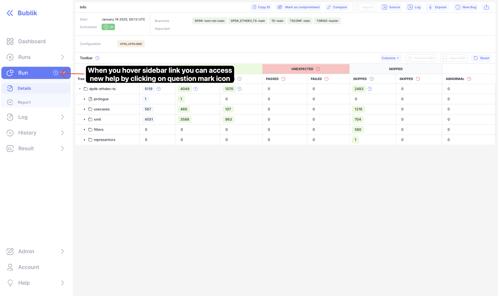
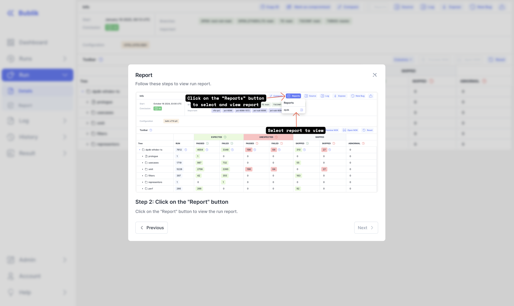

🎉 **Exciting Updates in the Latest Release!** 🎉

This release introduces several new features, design improvements, and bug fixes, with a special focus on enhancing the log experience and sidebar usability.

🔍 **Key Highlights**:

- **Log Enhancements**:

  - Added a loading skeleton for log loading to improve user experience during wait times.
  - Introduced a scroll-to-top button on the log page for easier navigation.
  - Reworked the log header and table design, including a new nested log tree indicator and improved toolbar functionality.

- **Sidebar Improvements**:

  - Added help dialogs for sidebar links, making it easier for users to access guidance directly from the sidebar.
  - Included a tip on how to access the help dialog from the sidebar, enhancing user onboarding.

- **Import Functionality**:

  - Added links to flower, run, and log from the import log, streamlining navigation.
  - Allowed URL links to specific logs, improving accessibility and sharing capabilities.
  - Improved the styling of the import table and form for a more polished look.

- **Bug Fixes & Performance**:
  - Fixed various caching issues to ensure data is up-to-date and accurate.
  - Addressed UI inconsistencies, such as missing separator borders and overflowing content in tables.

These updates aim to provide a smoother, more intuitive user experience, with particular attention to the log and sidebar interactions.

<!--truncate-->

## Highlights

### Updated Log Design

### New Help Messages

## Admin Section

:::tip
Before starting the update, create a database backup to ensure data safety in case of any unexpected issues during the process.
:::

### Backend Update

#### Base Steps

1. `cd bublik`
2. `git remote update`
3. `git checkout v1.1.0`
4. `./scripts/deploy --steps pip_requirements migrate_db django_settings run_services`

#### Additional Steps

:::tip
Since data migration can take a long time, stop side services to avoid potential disruptions or conflicts during the migration process: `./scripts/deploy --steps run_side_servers` + `stop`. Restart them once the process is complete: `./scripts/deploy --steps run_side_servers` + `start`.
:::

:::tip
During the update, use `tmux` or `screen` to keep your session running in the background, ensuring it won’t be interrupted if the connection is lost.
:::

### Frontend Update

1. Trigger the workflow in your frontend repository.
2. Synchronize the mirrors.
3. `cd bublik-ui`
4. `git remote update`
5. `git checkout v1.1.0`

---

## Changelog

### Frontend

#### 🚀 New Feature

- **docs:** add docs link to sidebar under help section ([f366807](https://github.com/ts-factory/bublik-ui/commit/f3668075b372a5012ab5e82f9c7751a8b76bd683))
- **help:** add tip on how to access help dialog from sidebar ([a2aceef](https://github.com/ts-factory/bublik-ui/commit/a2aceeff45af59c1bcbc71d951d89a2f9f8f788f))
- **import:** add links to flower, run, log from import log ([6897567](https://github.com/ts-factory/bublik-ui/commit/6897567658fdc8b76f941c2efe44befe5dabae55))
- **import:** allow url links to specific logs ([ef7210a](https://github.com/ts-factory/bublik-ui/commit/ef7210a707544bd06f58d9936553271369aec6ed))
- **import:** invalidate import events table on submit ([6dfdcf8](https://github.com/ts-factory/bublik-ui/commit/6dfdcf8c5f984a6137fc0ec5981f7af8d1c71fbe))
- **log:** add loading skeleton for log loading ([f367cd0](https://github.com/ts-factory/bublik-ui/commit/f367cd070fbaae3e3f9f11ba90ecc44dd8a319ca))
- **log:** add scroll to top button on log page ([45ae4a2](https://github.com/ts-factory/bublik-ui/commit/45ae4a27ccca84e6e159957caf05939af4a5fc52))
- **run:** [objective] add popover with full content ([63abe5a](https://github.com/ts-factory/bublik-ui/commit/63abe5ad8484f2f7fe252d4c8a0ff16c439e7c92))
- **sidebar:** add help dialogs for sidebar links ([2c8e162](https://github.com/ts-factory/bublik-ui/commit/2c8e162fdf92802de6a42072ba14d6c12b039f5f))

#### 💅 Polish

- **layout:** fix sidebar and drawer height on tablets ([b59056d](https://github.com/ts-factory/bublik-ui/commit/b59056db8da6b83f18ea69276ec194a409f7b65c))
- **log:** [header] fix wrap for multiline objective ([ee4a066](https://github.com/ts-factory/bublik-ui/commit/ee4a06655d0b24ced80fe5f2a5499937c0c8dc64))
- **log:** [table] change font size to 13px ([e40d089](https://github.com/ts-factory/bublik-ui/commit/e40d0890e7848702daf0dd476eca5168e732d7c3))
- **log:** [table] make colors dimmer ([ef17d40](https://github.com/ts-factory/bublik-ui/commit/ef17d4038ce82e8a289d40241853ce085e1811cd))
- **log:** add Geist Mono font as default monospace ([4277aac](https://github.com/ts-factory/bublik-ui/commit/4277aac70696c7bcfa09fe6ed10249837dd5d4d7))
- **log:** reduce margin bottom and set mono font for log ([93f637c](https://github.com/ts-factory/bublik-ui/commit/93f637c3a574c1da98c86b79ba837ce1974b84b6))
- **run:** [table] make cell padding smaller ([9929dba](https://github.com/ts-factory/bublik-ui/commit/9929dba7b23d0db97d41269a1dc5ae39f9337a81))
- **runs:** [charts] add better separation between different charts ([8524131](https://github.com/ts-factory/bublik-ui/commit/852413199eed648db16a662d577ddc620e227c25))
- **runs:** add icon for submit and change button order ([3f6c712](https://github.com/ts-factory/bublik-ui/commit/3f6c71294977adb3036facd12134796397d1edf4))

#### 🐛 Bug Fix

- **build:** add `.nx` and `dist` folders to `.dockerignore` ([902e27c](https://github.com/ts-factory/bublik-ui/commit/902e27c3dc52e73910df9406800d8fe2202b22ac))
- **dashboard:** refetch dashboard on mount and bypass browser cache ([c665f8e](https://github.com/ts-factory/bublik-ui/commit/c665f8eedb5c7096d631462980ce808980f9fdb7))
- **history:** invalidate cache on submit click ([328130c](https://github.com/ts-factory/bublik-ui/commit/328130c2c72466d6b1ee09f49096dae6bf57e73d)), closes [#90](https://github.com/okt-limonikas/bublik/issues/90)
- **import:** bypass browser cache when polling logs ([e8dc121](https://github.com/ts-factory/bublik-ui/commit/e8dc121093006437ce208ea73e2cd0fcab482833))
- **import:** fix import log events table caching ([5c79e7b](https://github.com/ts-factory/bublik-ui/commit/5c79e7b29ee30cc4684a35d977e3010218208909))
- **log:** [table] include #T: Verdict in scenario filter ([e6847df](https://github.com/ts-factory/bublik-ui/commit/e6847dfc7db34d5a3075d70cddfa785918286683))
- **log:** don't use custom redirect for JSON logs in development ([6e03bf0](https://github.com/ts-factory/bublik-ui/commit/6e03bf01ceadfe04f291a443c39d14509d52b856))
- **run:** fix test row overflowing results when objective too big ([566a518](https://github.com/ts-factory/bublik-ui/commit/566a518b281f722a3d807c15cfb7094f06edad7e)), closes [#251](https://github.com/okt-limonikas/bublik/issues/251)
- **runs:** [table] invalidate cached data on submit ([1ea7a3c](https://github.com/ts-factory/bublik-ui/commit/1ea7a3c6afd71fcd2c5cd9021cff1c621edbcf88)), closes [#90](https://github.com/okt-limonikas/bublik/issues/90)
- **runs:** refetch runs list on mount and bypass browser cache ([ca9c984](https://github.com/ts-factory/bublik-ui/commit/ca9c98412bf5b0aa39cf77ddddb51bdf2d5cdf64))
- **ui:** missing separator border ([4c13552](https://github.com/ts-factory/bublik-ui/commit/4c13552e5ec947373db170c010344c1126cbe100))

#### ♻ Code Refactoring

- **import:** improve styling of import table and form ([b1aa6d3](https://github.com/ts-factory/bublik-ui/commit/b1aa6d37e6ac55a1101fb7297acb79b098142296))
- **log:** [header] full refactor of log meta ([50ce8d9](https://github.com/ts-factory/bublik-ui/commit/50ce8d9a911616c64d3c4d14e740ab5508a5e1d2))
- **log:** [table] add log tree nest indicator, integrate toolbar ([83453f6](https://github.com/ts-factory/bublik-ui/commit/83453f63598d3f4f703ec1da8d15a56b18db791e))
- **log:** [toolbar] fix bugs with toolbar scrolling and jumping ([fde2d21](https://github.com/ts-factory/bublik-ui/commit/fde2d21fcde62d59c8ebd05a485aba98a61487fe))
- **log:** display packages test lists as table ([1c528f6](https://github.com/ts-factory/bublik-ui/commit/1c528f6994cc878998ae333b5950aa37cb01e1fb))
- **ui:** allow greater composability for scroll to top component ([26d84e1](https://github.com/ts-factory/bublik-ui/commit/26d84e185179c8a34413beecb414e1dbb963f971))

#### 📦 Chores

- **build:** bump docker images to node 22.13-alpine LTS ([49285b8](https://github.com/ts-factory/bublik-ui/commit/49285b8ccde4a9ede0d1dacb8b3f8e259550093f))
- **docs:** remove changelog from react app ([4423025](https://github.com/ts-factory/bublik-ui/commit/4423025d12bfde034299d27ab3b84d3605184fc2))
- **log:** add `requirements` to log header schema ([a426c29](https://github.com/ts-factory/bublik-ui/commit/a426c2977ded408277637c89663db8209b7561f0))
- **log:** apply format ([0786e4d](https://github.com/ts-factory/bublik-ui/commit/0786e4dc3693ca35b3d96b2475ceac97f9e5cd98))
- **log:** remove toast with delta anchor line information ([f7f3162](https://github.com/ts-factory/bublik-ui/commit/f7f316276c3d2123909af3a3c65f6be771d08276))
- **sidebar:** change labels for history, measurements for clarity ([d29c428](https://github.com/ts-factory/bublik-ui/commit/d29c4287a338813ccf750b0bc2cddc9588588843)), closes [#259](https://github.com/okt-limonikas/bublik/issues/259)

---

### Backend
