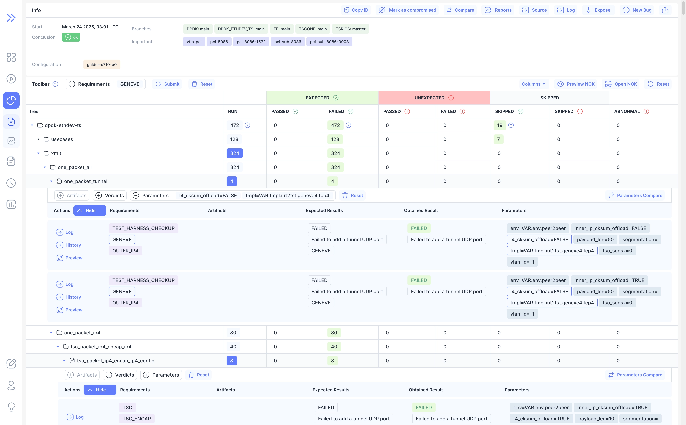
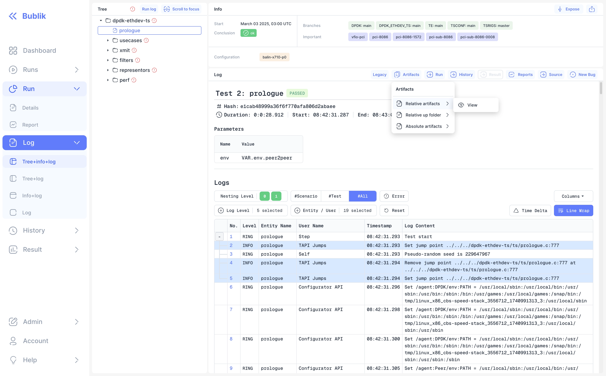

This release introduces key improvements, including enhanced run page filtering capabilities, requirements filtering.
It also includes UI polish and various code refactoring changes.

## 🔍 What's New?

### 🚀 New Feature

- **Requirements Filter**: Added new filtering capabilities for run requirements
- **Log Artifacts**: Added log artifacts dropdown menu to log page and log preview

<!--truncate-->

## Highlights

### New Run Page Filtering

We've added new filtering capabilities for run requirements and columns for results table.



### Log Artifacts

We've enhanced the log viewing experience by adding a new dropdown menu for artifacts on both the log page and log preview. <br />
This feature allows you to easily access and manage custom test artifacts. <br />
For the start we provide a way to just open the artifacts in the browser, but in the future we will support multiple artifact types and ways to view them.



#### Adding Artifacts

To include artifacts in your logs:

1. Create an `artifacts.json` file
2. Place it at `/artifacts/node_<id>/artifacts.json` in your log structure
3. Format it according to our [schema](https://github.com/okt-limonikas/bublik-log-viewer/blob/main/internal/command/schemas/artifact.json)

#### Validating Artifacts

You can validate your `artifacts.json` file using the [Bublik Log Viewer tool](https://github.com/okt-limonikas/bublik-log-viewer):

```bash
blv validate --type artifacts <path/to/artifacts.json_or_folder>
```

Read more about artifacts in our [documentation](/publish/artifacts).

## Admin Section

### Backend Update

1. `cd bublik`
2. `git remote update`
3. `git checkout v1.6.1`
4. `./scripts/deploy --steps pip_requirements django_settings run_services`

### Frontend Update

1. Trigger the workflow in your frontend repository.
2. Synchronize the mirrors.
3. `cd bublik-ui`
4. `git remote update`
5. `git checkout v1.6.1`

---

## Changelog

### Frontend

#### 🚀 New Feature

- add query delimiter to global config ([d7d8fae](https://github.com/ts-factory/bublik-ui/commit/d7d8fae798ce279687f3e83f9c287237aeca3bd9))
- **run:** add global url requirements filter provider ([22b1201](https://github.com/ts-factory/bublik-ui/commit/22b120125d7edab39156cceb18f6f15a9b35aff3))
- **run:** add requirements filter ([c54fcab](https://github.com/ts-factory/bublik-ui/commit/c54fcabe677b98a54b29730c83e0638d91dc451c))
- **run:** re-enable parameters diff mode ([9c7da00](https://github.com/ts-factory/bublik-ui/commit/9c7da003f45cd61ef1ca7204ed024c6813a29f42))
- **config:** get available config types from rest api ([86ccf09](https://github.com/ts-factory/bublik-ui/commit/86ccf095eacfe66c3d55fb42c98bb1af3dca7ac4))
- **history:** [measurements] mark results with `has_error` with green/red marks ([a3321ef](https://github.com/ts-factory/bublik-ui/commit/a3321ef9ed7a16e881d6b1e71b21d27ef9b65ea6))
- **log:** add artifacts dropdown menu to log page and log preview ([2e7a4ee](https://github.com/ts-factory/bublik-ui/commit/2e7a4eeb3b99b429ab1891d38f6a91e4c3edb40c))
- **log:** add endpoint to fetch `artifacts.json` ([0565219](https://github.com/ts-factory/bublik-ui/commit/0565219a8e5f4b3226755196b2d7edfdf830808e))
- **log:** add log-artifacts dropdown menu component ([3353a06](https://github.com/ts-factory/bublik-ui/commit/3353a0683594e6462fef1183bb6ad2621c0c6ade))
- **ui:** add icon for download ([3b38881](https://github.com/ts-factory/bublik-ui/commit/3b38881a10de1a8c29ae2308d9fbe790db76fa4a))

#### 🐛 Bug Fix

- **history:** [linear] reset filters on "Preview" button click ([ed2304b](https://github.com/ts-factory/bublik-ui/commit/ed2304b1a26224b68ee74ed98f351ebb8fa769d4))
- **import:** don't modify response from API ([aa96896](https://github.com/ts-factory/bublik-ui/commit/aa968966c797c11def219b0c14b8b14b184023e9))

#### 💅 Polish

- **run:** adjust offsets for results table toolbar ([65c95c1](https://github.com/ts-factory/bublik-ui/commit/65c95c184cc576261e1ee76bb6f69331ef49908c))
- **run:** change button style to show result filters toolbar ([a3f0a78](https://github.com/ts-factory/bublik-ui/commit/a3f0a78912d02f06b4f424eb2962c42a4fd0fb4a))
- **measurements:** remove red and green colors from theme for lines ([ffc8aa9](https://github.com/ts-factory/bublik-ui/commit/ffc8aa94c2e456632b37513cfc167aac865c535f))
- **report:** chart use empty circle for results without `has_error` ([5ad1d2b](https://github.com/ts-factory/bublik-ui/commit/5ad1d2b191a4069942e31a08c88ae1e925202099))

#### ♻ Code Refactoring

- **api:** change API for fetching runs ([12851cc](https://github.com/ts-factory/bublik-ui/commit/12851cc07cbc5a7a5f59605eff186f8a5909b7ae))
- **run:** add `abnormal` to unexpected columns for expansion ([a4ffac0](https://github.com/ts-factory/bublik-ui/commit/a4ffac048a07cf22aa9da6b09e8d97bcfdebb452))
- **run:** add migration for url query expanded state ([0b9f3b6](https://github.com/ts-factory/bublik-ui/commit/0b9f3b6ff77a1e7442cb9fce415cf8ee47aeb7a4))
- **run:** adjust getting row id ([9fbd4a3](https://github.com/ts-factory/bublik-ui/commit/9fbd4a3f3160e50c8e1ad622183829758dbb9b4d))
- **run:** show filter options based on filtered data ([c3c66b1](https://github.com/ts-factory/bublik-ui/commit/c3c66b11aaea1a164357c8eb17661098a1e336a5))

#### 📦 Chores

- **run:** fix types and some style changes ([04e7977](https://github.com/ts-factory/bublik-ui/commit/04e7977b4cc91afd5935475fefc9d35a4e83f889))
- **types:** adjust incorrect types ([81b167f](https://github.com/ts-factory/bublik-ui/commit/81b167faeb88e2b1efc91b5d8952fdbbb983d807))
- **ui:** extract data table faceted filter to shared lib ([0e977a4](https://github.com/ts-factory/bublik-ui/commit/0e977a482d87bbbb6b56783f24852ae5cfebf887))
- **log:** change button label for viewing legacy log ([057e3db](https://github.com/ts-factory/bublik-ui/commit/057e3dbf890cde3f701979a52053cf621265f7f3))
- **log:** generate log-artifacts library ([9ace68a](https://github.com/ts-factory/bublik-ui/commit/9ace68a2b8ebc4f85c40498123540b9e23d10370))

---

### Backend

#### 🐛 Bug Fix

- **run stats:** fix issue link building ([f4bcbdc](https://github.com/ts-factory/bublik/commit/f4bcbdc13095d4f342243461f363f9d2741e3559))
- **requirements:** update packages versions to pick up bug fixes ([b286900](https://github.com/ts-factory/bublik/commit/b2869000ec8e9e0ae03eb6d32bcc45c79e0a8149))
- **history:** fix filtering by test arguments ([9492e25](https://github.com/ts-factory/bublik/commit/9492e2591e34d668c0b23ea36f803ccaa2b90186)), closes [#115](https://github.com/ts-factory/bublik/issues/115)
- **event:** sort the list of events ([1214b62](https://github.com/ts-factory/bublik/commit/1214b62636117aaccd2ba4e8d1bf096eaf4198dd))
- **requirements:** update packages versions to pick up bug fixes ([9f4974c](https://github.com/ts-factory/bublik/commit/9f4974c4ea89ef97ec1ef73465785e2a09eef2d3))
- **requirements:** update packages versions to pick up bug fixes ([7bb17eb](https://github.com/ts-factory/bublik/commit/7bb17eb27da7d4cf8d851bedfbffa42c1ecadc27))
- **importruns:** fix the date format mismatch ([04fa978](https://github.com/ts-factory/bublik/commit/04fa978da81f4c9e43df9d9f72b2d4f315d50bf8))
- **deploy:** fix requirements install ([a7a7ce1](https://github.com/ts-factory/bublik/commit/a7a7ce102fd8ee40a8cbb2b70824a864f623b3b5))
- **deploy:** fix logilab-astng install ([3f611c5](https://github.com/ts-factory/bublik/commit/3f611c5d04331c88206c6fadc645cb644762f07f))
- **event:** fix event list sorting ([5361db0](https://github.com/ts-factory/bublik/commit/5361db0dbcafdb22e977ab999d5850f174a97378))

#### 🚀 New Feature

- **measurements:** update dynamic charts points data ([acbf692](https://github.com/ts-factory/bublik/commit/acbf692af780df2b85066f554807cb149ccf631e)), closes [#139](https://github.com/ts-factory/bublik/issues/139)
- **run stats:** add filtering by requirements ([7342459](https://github.com/ts-factory/bublik/commit/73424594273c964df81cba5081312a6c7dec0180)), closes [#138](https://github.com/ts-factory/bublik/issues/136), [#156](https://github.com/ts-factory/bublik/issues/156)
- **run stats:** add endpoint to retrieve run requirements ([d1a5f2c](https://github.com/ts-factory/bublik/commit/d1a5f2c9726bb937af377cd5031a1a0ac81ea2de)), closes [#155](https://github.com/ts-factory/bublik/issues/155)
- **config:** add endpoint to retrieve available types and names ([cd73f1a](https://github.com/ts-factory/bublik/commit/cd73f1a5a66dd2beacf1b098638ce11293195c80)), closes [#144](https://github.com/ts-factory/bublik/issues/144)
- **event:** enable event list sorting ([ec5d105](https://github.com/ts-factory/bublik/commit/ec5d105a8526c67cce78c0279b13e9895890bf01)), closes [#132](https://github.com/ts-factory/bublik/issues/132)
- **log:** ensure support for displaying test artifacts ([5b09d61](https://github.com/ts-factory/bublik/commit/5b09d6178e3b83d9374678430a2cd3d3fe90ad13)), closes [#157](https://github.com/ts-factory/bublik/issues/157)
- **config:** add the schedule config type ([4a9c923](https://github.com/ts-factory/bublik/commit/4a9c923f3d27944e5b40c326e701c946f9268366)), closes [#161](https://github.com/ts-factory/bublik/issues/161)

#### ⚡ Performance

- **event:** optimize event list retrieval ([2fcfba9](https://github.com/ts-factory/bublik/commit/2fcfba979d3df5653af79ed5a2ec512f975975bd)), closes [#132](https://github.com/ts-factory/bublik/issues/132)

#### ♻️ Code Refactoring

- **config:** centralize global configs names and descriptions ([c864b4f](https://github.com/ts-factory/bublik/commit/c864b4fa736e7b2eedb33df46f2645d4d796fedc))
- **config:** update global configs descriptions source ([d1cb6a2](https://github.com/ts-factory/bublik/commit/d1cb6a22014fd411e6b5a937de0e8441c043a16b))

#### 🧹 Cleanup

- **history:** improve code style and maintainability ([7dab2bd](https://github.com/ts-factory/bublik/commit/7dab2bdddd9fd0e2a99ca01e76f683b25f21fdef))
- **cleanup:** ensure correct type annotations ([64ce40f](https://github.com/ts-factory/bublik/commit/64ce40f2d59d113bc7d492be608a89a4fa1dedb4))
- **results:** remove unused pagination ([d2983b7](https://github.com/ts-factory/bublik/commit/d2983b713bf3f8f98b4d97d72b72e04714c86142))
- **cleanup:** fix imported modules order ([61ae528](https://github.com/ts-factory/bublik/commit/61ae528b3a716f05f6aee0cb4a21f1d3e2ca4c70))
- **deploy:** cleanup DB packages to install ([4325516](https://github.com/ts-factory/bublik/commit/4325516bd78372a58dcdf9b8e98606bcbcc474c1)), closes [#136](https://github.com/ts-factory/bublik/issues/136)
- **deploy:** cleanup server packages to install ([597a3fb](https://github.com/ts-factory/bublik/commit/597a3fb5e6a9e6fe0b0622b632f9fb9b65fbeee6)), closes [#136](https://github.com/ts-factory/bublik/issues/136)
- **importruns:** reduce technical debt ([0046da6](https://github.com/ts-factory/bublik/commit/0046da6e155c9d79b34d9c789b38e724c71e8d70))
- **urls:** fix typo ([831e564](https://github.com/ts-factory/bublik/commit/831e56438bb8e1303488bb4edf5d61355a3f18be))
- **urls:** fix URL shortener docstring ([b1cd2bb](https://github.com/ts-factory/bublik/commit/b1cd2bb2145367822a0c1255e16a4653b2ecfa7f))
- **urls:** make splitting result predictable ([2cd56ad](https://github.com/ts-factory/bublik/commit/2cd56adf437f992c597b29f33c126f4c22e5c2b6))
