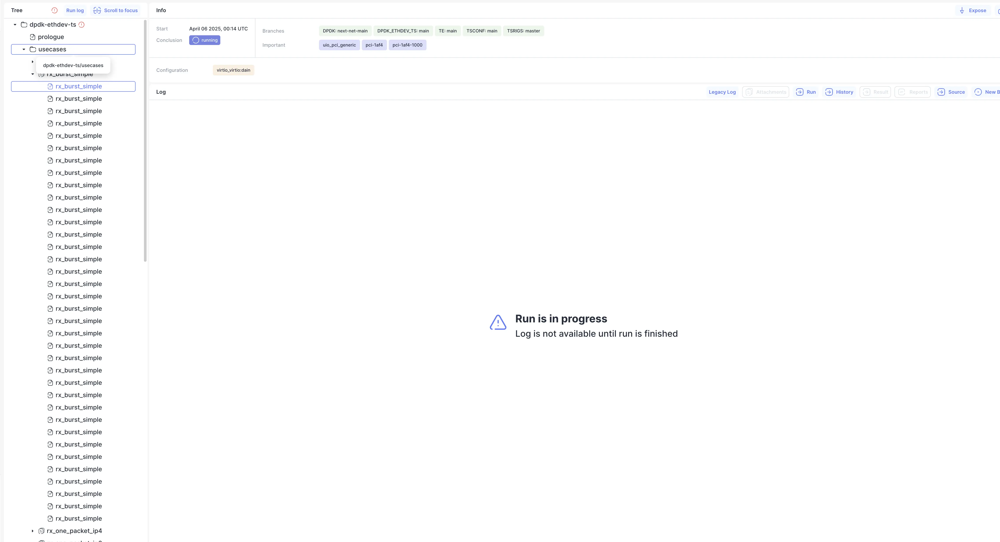

In this release we've added scenario from log to new bug modal and date range picker with duration based selection to runs page.  
Also fixed some small issues with charts and run page sorting and source button.
Added new config option to allow reading configs without admin permissions.

<!--truncate-->

## 🔍 What's New?

#### Flexible Permissions For Reading Configs

It is now possible to allow configuration reading without requiring admin permissions. To enable this, include the `read_configs` action in the `NOT_PERMISSION_REQUIRED_ACTIONS` list in the main configuration.

#### Log Filters

#### Date Range Picker

#### Run In Progress

## Admin Section

### Backend Update

1. `cd bublik`
2. `git remote update`
3. `git checkout v1.8.0`
4. `./scripts/deploy --steps run_services`

### Frontend Update

1. Trigger the workflow in your frontend repository
2. Synchronize the mirrors
3. `cd bublik-ui`
4. `git remote update`
5. `git checkout v1.8.0`

### Documentation Update

1. Trigger the workflow in your frontend repository
2. Synchronize the mirrors
3. `cd bublik-docs`
4. `git remote update`
5. `git checkout v1.8.0`

### Docker Instance Update

1. `task pull`
2. `task up`

---

## Changelog

### Frontend

#### 🚀 New Feature

- **log:** [new-bug] add log filters for scenario and verdict ([c1a7827](https://github.com/ts-factory/bublik-ui/commit/c1a7827b1346fcf100cf5b86463397c13d25dbdd)), closes [#246](https://github.com/ts-factory/bublik-ui/issues/246)
- **result:** [measurements] add selection popover for combined charts ([0d29de3](https://github.com/ts-factory/bublik-ui/commit/0d29de320d457b42467f5c78b1174570a83140da))
- **runs:** add ability to select dates based on duration ([0fb0dbe](https://github.com/ts-factory/bublik-ui/commit/0fb0dbe7b7ea90924da6fe65a1bbef95c997905a))
- **runs:** add scroll to top on page change ([c8a91ef](https://github.com/ts-factory/bublik-ui/commit/c8a91ef15b7670dadee08b49c5401d98d3501b3a))
- **ui:** [date-range-picker] add mode for selection dates based on duration ([627c361](https://github.com/ts-factory/bublik-ui/commit/627c3614bd79c0ecbe8af6eb4eff108d694888a0))
- **ui:** [date-range-picker] make range buttons select sliding window ([81bd2dd](https://github.com/ts-factory/bublik-ui/commit/81bd2ddcd9364f5bf3406c751057530dbcaf0ee5))
- **utils:** add function to parse ISO8601 duration format ([112d73b](https://github.com/ts-factory/bublik-ui/commit/112d73b98ab8730ee12e15391b51e352cfdf7876))

#### 💅 Polish

- **result:** [measurement] fix selection popover overlap with table header ([f9d4f46](https://github.com/ts-factory/bublik-ui/commit/f9d4f4663f1e548311fe715a8c9588f8973f6022))
- **run:** change padding for all popovers ([255d6e1](https://github.com/ts-factory/bublik-ui/commit/255d6e15b5a9c917b00b5e300abd3b611e3703fe))
- **runs:** align "Name" and "Start" labels vertically in list item ([466a349](https://github.com/ts-factory/bublik-ui/commit/466a349b92607d35587367c0cb6d3b33802ec41e))
- **ui:** [date-range-picker] fix hover styles for cells ([b2e50ea](https://github.com/ts-factory/bublik-ui/commit/b2e50ea2814a68a9e071f07f9783f8ea107bdcb4))
- **ui:** [date-range-picker] prevent jumping when changing mode ([c172c68](https://github.com/ts-factory/bublik-ui/commit/c172c6893f41dd3676f6ce06b2cc541f94cb4d82))

#### 🐛 Bug Fix

- **ci:** ignore `.pnpm-store` while checking formatting ([19fd7f4](https://github.com/ts-factory/bublik-ui/commit/19fd7f48f767a9dfc874f5f9d072ab620169f47c))
- **configs:** [editor] prevent monaco editor getting source from CDN ([0969059](https://github.com/ts-factory/bublik-ui/commit/09690597175663d56a2345044e112687e9850a37))
- **log:** [mi] ensure last data point is included in chart ([72742dd](https://github.com/ts-factory/bublik-ui/commit/72742dd433109b2855c41a13a627da255eecffe4))
- **log:** [mi] fix incorrect distance proportion between points ([e00d6f7](https://github.com/ts-factory/bublik-ui/commit/e00d6f7ab9d740b1f9381be9db8dfb3b1e2cdcce))
- **log:** [new-bug] escape `|` in log to properly format markdown table ([bbaf57d](https://github.com/ts-factory/bublik-ui/commit/bbaf57d63bbffc46c292d8f18525a0516858e4f7))
- **report,result:** [chart] incorrect distance proprtions in charts ([13b7592](https://github.com/ts-factory/bublik-ui/commit/13b7592e2170e1b70fa7841ae7b8536d9c57b95f))
- **report:** missing tab title when reloading page ([c1a1e19](https://github.com/ts-factory/bublik-ui/commit/c1a1e19d0b18aa54e1b4e8dde3cfd03d0f8847e6)), closes [#321](https://github.com/ts-factory/bublik-ui/issues/321)
- **run,log:** disable link in case no URL for source available ([973689c](https://github.com/ts-factory/bublik-ui/commit/973689c8a71c26b306d80c6b534e9e29d4355878)), closes [#243](https://github.com/ts-factory/bublik-ui/issues/243)
- **run:** remove auto-sort on "Preview NOK" button click ([e8bbb8f](https://github.com/ts-factory/bublik-ui/commit/e8bbb8fca3b0df2d59b9768f45d89ef56bd0a35c)), closes [#320](https://github.com/ts-factory/bublik-ui/issues/320)
- **run:** use correct endpoint for getting bug storage url ([fc9f8b0](https://github.com/ts-factory/bublik-ui/commit/fc9f8b028f3f6e44811d7339a2935fb138449468))

#### ♻ Code Refactoring

- **history:** [measurements] use selection state popover from shared lib ([727aaad](https://github.com/ts-factory/bublik-ui/commit/727aaadc4115ac6eef16cc7b5af60d6e2a6e5f97))
- **log:** allow dynamically to get initial filter options ([c7cf020](https://github.com/ts-factory/bublik-ui/commit/c7cf0207448f21d932a50b57fb3037af172332eb))

#### 📦 Chores

- **log:** [attachments] improve filename generation ([57f1ec8](https://github.com/ts-factory/bublik-ui/commit/57f1ec82158db81b936d5e29afaaa268b78aebc1))
- **log:** delete duplicated code for log source button component ([0a2f7fb](https://github.com/ts-factory/bublik-ui/commit/0a2f7fb394c1ded7cd65be5c97584bb2984193c3))
- **log:** extract new bug button component ([5dd6e8e](https://github.com/ts-factory/bublik-ui/commit/5dd6e8e1967c14b1da5bf6fe94087a1757c99ac8))
- **log:** remove duplicated new bug button component usage ([4de5b28](https://github.com/ts-factory/bublik-ui/commit/4de5b286d6eb6fb340db13aff7bac1da098b8f5a))
- **log:** remove new bug button component ([2708628](https://github.com/ts-factory/bublik-ui/commit/2708628092af43ed62c302e84e6a6d6ad651ca61))
- **measurements:** extract selection popover for charts to shared lib ([5867d11](https://github.com/ts-factory/bublik-ui/commit/5867d11caad7022e6ef0dc8acf061a7be0505ad4))
- **redux:** upgrade redux and zod to latest ([54be9d1](https://github.com/ts-factory/bublik-ui/commit/54be9d132b65ee65ffc6aba84402c41a501de059))
- **runs:** remove max selection limit to view merged runs ([27ef3c1](https://github.com/ts-factory/bublik-ui/commit/27ef3c17e9cfaa06c52fa22fa9b48936a69131b0))
- **ui:** [date-range-picker] adjust types for duration picker ([e442a0b](https://github.com/ts-factory/bublik-ui/commit/e442a0bcef0de69773eeb5e730716b8dca34c2eb))
- **ui:** [date-range-picker] extract shared constants and types ([35e8a63](https://github.com/ts-factory/bublik-ui/commit/35e8a63bd5824b6732bd86ac5d09fe13aa088148))
- **ui:** [icons] add gear icon ([2c958bd](https://github.com/ts-factory/bublik-ui/commit/2c958bdf35fc0e112dfcb823b59571c32b1e68df))

---

### Backend

#### 🐛 Bug Fix

- **run stats:** fix revision references retrieval ([2e49c3c](https://github.com/ts-factory/bublik/commit/2e49c3c256ebef627b7fedd2cf0fbcf2a4b2c3b3))
- **run stats:** fix marking runs as compromised ([f1e2bae](https://github.com/ts-factory/bublik/commit/f1e2bae2921cdad3a785ac04a37c8889498fc4dc))

#### 🚀 New Feature

- **config:** make config read permission check configurable ([8a16aba](https://github.com/ts-factory/bublik/commit/8a16abad35f00a9767772073b46c8cb5a7af37b7))

#### 📦 Chores

- **ci:** fix deprecation warning for ruff ([19ef6e2](https://github.com/ts-factory/bublik/commit/19ef6e24270903cbe45b004fc4e720e193122a0c)), closes [#125](https://github.com/ts-factory/bublik/issues/125)
- **ci:** add code quality check workflow ([d465813](https://github.com/ts-factory/bublik/commit/d4658134b59642b731b21c8c80d5b60700bb213d))
- **config:** clarify main config expectations in schema ([b74636b](https://github.com/ts-factory/bublik/commit/b74636bc45dedb5a701217c34aab71bafed7f021))
