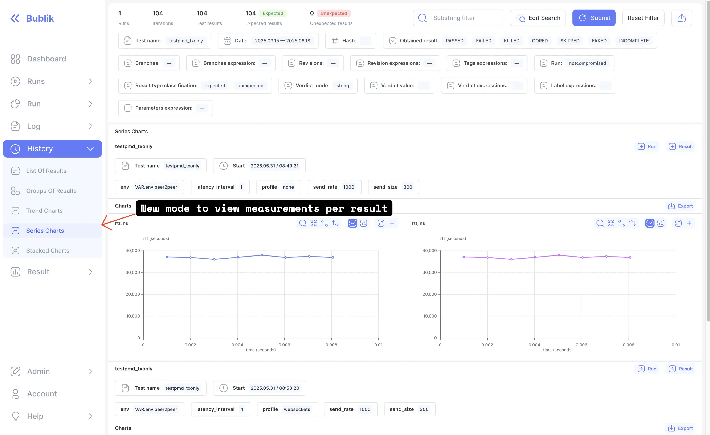
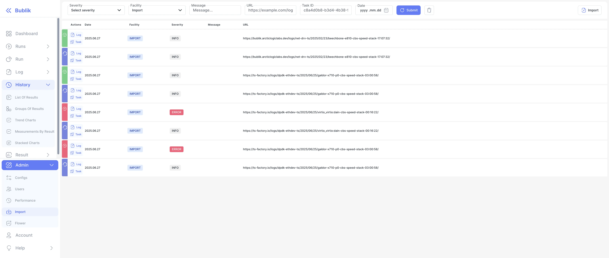

In this release we've added new "Series Charts" mode to history and some UI imporvements for import events page

<!--truncate-->

## Highlights

### History Series Charts Mode

New mode to view measurements per result

### Improved Import

Added "RECIEVED" and "STARTED" import event types support

## Admin Section

Bublik can now import logs from _bublik.json_ generated by TE.

:::warning
This version is compatible with TE versions 1.45 and 1.47, but **incompatible with version 1.46**
:::

### Backend Update

1. `cd bublik`
2. `git remote update`
3. `git checkout v1.10.0`
4. `./scripts/deploy --steps run_services`

### Frontend Update

1. Trigger the workflow in your frontend repository
2. Synchronize the mirrors
3. `cd bublik-ui`
4. `git remote update`
5. `git checkout v1.10.0`

### Documentation Update

1. Trigger the workflow in your frontend repository
2. Synchronize the mirrors
3. `cd bublik-docs`
4. `git remote update`
5. `git checkout v1.10.0`

### Docker Instance Updatee

1. `task backup:create`
2. `task pull`
3. `task up`

---

## Changelog

### Frontend

#### 🚀 New Feature

- **history:** [charts] add new mode for measurements by result ([d17f7d5](https://github.com/ts-factory/bublik-ui/commit/d17f7d572957d0e9eae6a8dac7f21780e873f714))
- **history:** [charts] add new section with measurement series chart data ([07a027c](https://github.com/ts-factory/bublik-ui/commit/07a027cf9e06109498e2b59d7ae07adf18ffbdc7))
- **history:** [charts] add selected group in search params for persistence ([b2e6b6d](https://github.com/ts-factory/bublik-ui/commit/b2e6b6d8f828d9744c1a0cfbd8566a269a76a756))
- **history:** add help for "Series Charts" history mode ([ee98b3a](https://github.com/ts-factory/bublik-ui/commit/ee98b3aec3aa59cb7686702489aa8ec2e61aff81))
- **history:** adjust history measurements API for new response type ([031b2e1](https://github.com/ts-factory/bublik-ui/commit/031b2e1e04ede39ee4570f563b276699face081e))
- **import:** handle `RECEIVED` and `STARTED` statuses ([1a82e3c](https://github.com/ts-factory/bublik-ui/commit/1a82e3cdc4549f070dfe886fe49ab2f3e36309da)), closes [#347](https://github.com/ts-factory/bublik-ui/issues/347)
- **report,measurements:** add toggle to limit min/max values for plot ([c0e2cc6](https://github.com/ts-factory/bublik-ui/commit/c0e2cc659915dfd0ec83b876a54adcc138d3887f)), closes [#350](https://github.com/ts-factory/bublik-ui/issues/350)
- **report:** allow empty `series` and `series_labels` ([0efffbf](https://github.com/ts-factory/bublik-ui/commit/0efffbf61a25b651a0e9cb76e308ed566e997ba4)), closes [#349](https://github.com/ts-factory/bublik-ui/issues/349)

#### 🐛 Bug Fix

- **history:** [series] show only results which have measurements ([1698f25](https://github.com/ts-factory/bublik-ui/commit/1698f254dd90149eaba045eebb34c80ebb1e30cd))

#### ♻ Code Refactoring

- **history,run:** [results] allow multiple `expected_results` ([6cc385c](https://github.com/ts-factory/bublik-ui/commit/6cc385c2597062cd37065d2bc73db26f8a4652c3))
- **measurements:** allow empty values and add `start` for result info block ([8da566d](https://github.com/ts-factory/bublik-ui/commit/8da566db73629fc95d02d3598ab7ff43518e4b94))

#### 📦 Chores

- **history,measurements:** cleanup ([02af5da](https://github.com/ts-factory/bublik-ui/commit/02af5dacf898ada8ea3037a9a25ade035d57421a))
- **report:** add missing parameter to dependency effect array ([c2c2cf6](https://github.com/ts-factory/bublik-ui/commit/c2c2cf66c0d6fd7871ec341ee365ee9e5311f785))
- **report:** remove deprecated `nonscrict` call ([5de3b95](https://github.com/ts-factory/bublik-ui/commit/5de3b95cd944f3e2aa6d7efa372f1f12b29ee98f))

---

### Backend

#### 🐛 Bug Fix

- **importruns:** fix task parameter validation logic ([59c06cb](https://github.com/ts-factory/bublik/commit/59c06cb6ee9656438bf7dc1320935d69bd83b3b9))

#### 🚀 New Feature

- **middleware:** auto-categorize metas on config update ([772a45b](https://github.com/ts-factory/bublik/commit/772a45b180e7028602c3a1a0dcea3a08322fcb25))
- **event:** update import events list with recieved and started events ([5eedec9](https://github.com/ts-factory/bublik/commit/5eedec9c5069800bee18efb63f2c818aba29120c)), closes [#130](https://github.com/ts-factory/bublik/issues/130), [#131](https://github.com/ts-factory/bublik/issues/131)
- **report:** improve visualization of single-series data ([50dc807](https://github.com/ts-factory/bublik/commit/50dc80752052044b13614d27e60cfb43420bdbd2)), closes [#111](https://github.com/ts-factory/bublik/issues/111)
- **measurements:** add API for per-result series measurement charts ([91d66be](https://github.com/ts-factory/bublik/commit/91d66becb36b8e444e4572c60d2800405e3dd074))
- **importruns:** update run log JSON structure ([ab6c242](https://github.com/ts-factory/bublik/commit/ab6c242cdeba2e87eb337e07a2f8abf54a5901ba))
- **importruns:** add JSON log import ([f587231](https://github.com/ts-factory/bublik/commit/f587231c66db8e8821feb529f052cd437e709b61))
- **results:** extend data structure for multiple expected results ([6c02225](https://github.com/ts-factory/bublik/commit/6c0222513f0eda98d05bb87dc0665107b8f87dac))

#### ♻️ Code Refactoring

- **event:** improve semantic clarity ([14b5c69](https://github.com/ts-factory/bublik/commit/14b5c691f609a6a444d0b389d736dc467a93c90d))
- **event:** improve event queryset flexibility ([3fed724](https://github.com/ts-factory/bublik/commit/3fed72488de616075bcc7f10812b66c28db0a281))
- **event:** make import event list retrieval cleaner and DRY ([4e36e17](https://github.com/ts-factory/bublik/commit/4e36e17999d941c9c2d79b44134447fe81869a75))
- **measurements:** encapsulate measurement charts generation for reuse ([7a7cb58](https://github.com/ts-factory/bublik/commit/7a7cb58c14d1638c9f640092f19f40c29b70e4c3))
- **measurements:** rename trend chart data endpoint for semantic accuracy ([17828c1](https://github.com/ts-factory/bublik/commit/17828c1b0c94693dbc9e4eb9cfe432ac3516aee8))
- **importruns:** reduce nesting for clearer logic ([5819e29](https://github.com/ts-factory/bublik/commit/5819e2999ac3b9b8951dfc7b3c3d56aafbe48da4))
- **results:** unify the expected result structure ([b34a158](https://github.com/ts-factory/bublik/commit/b34a1581d6ca79e117488d0a000f34b5bb2fbcc9))
- **results:** ensure naming consistency ([b0a0435](https://github.com/ts-factory/bublik/commit/b0a0435d4ff700ede1eaac320bf89df0f2564ae1))

#### 🧹 Cleanup

- **event:** clean up error messages ([74271a5](https://github.com/ts-factory/bublik/commit/74271a523866a2527c6f78e5b608a95098afc4ca))
- **core:** fix imported modules order ([6c47fa7](https://github.com/ts-factory/bublik/commit/6c47fa7099b60db553625ac1e40151a9a9058934))
- **core:** reduce technical debt ([880664b](https://github.com/ts-factory/bublik/commit/880664b05c4b345fc89e0218b775affe543afe08))
- **importruns:** format long function call for readability ([a861caf](https://github.com/ts-factory/bublik/commit/a861caf9f5a580bee185c012f360823f4460f73b))
- **history:** improve code style ([3ab3911](https://github.com/ts-factory/bublik/commit/3ab391126bb4fa074694792f28cd74d0966d6b62))

#### 📦 Chores

- **importruns:** improve traceability of downloaded logs ([68e93f3](https://github.com/ts-factory/bublik/commit/68e93f350b3cc9cc80ec05e522b1b4b26ce03908))
