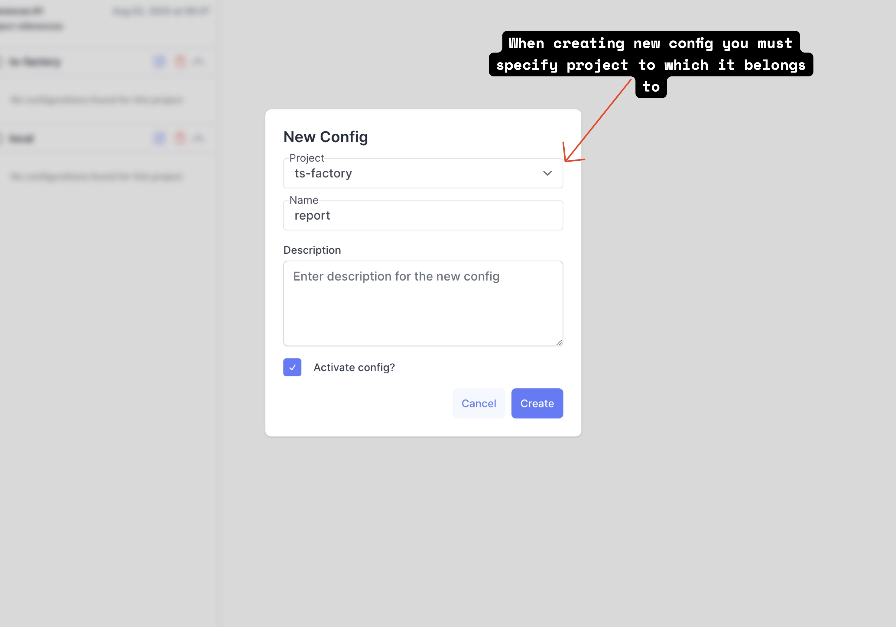
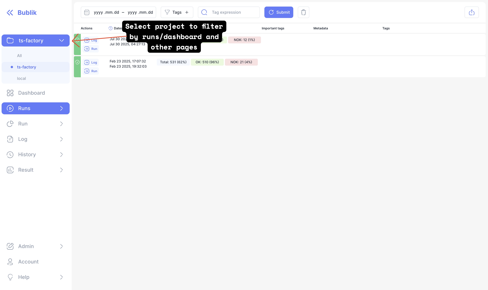
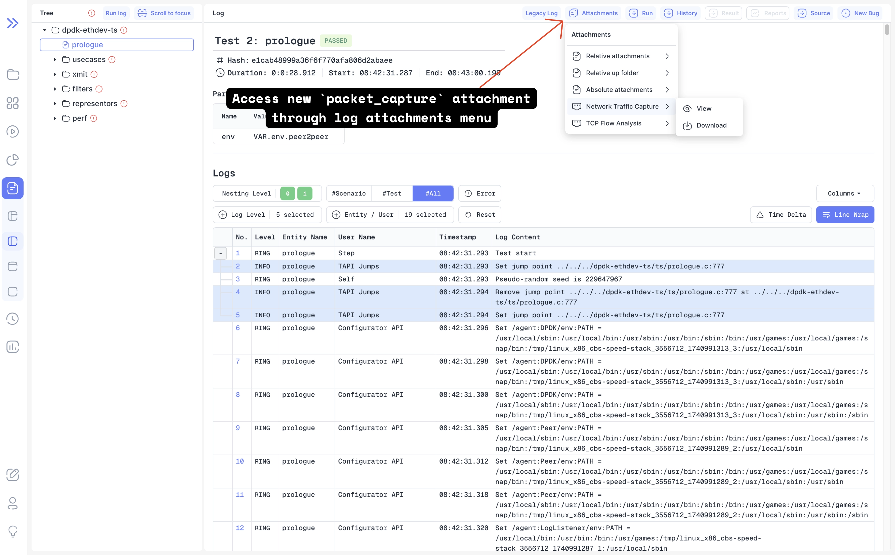
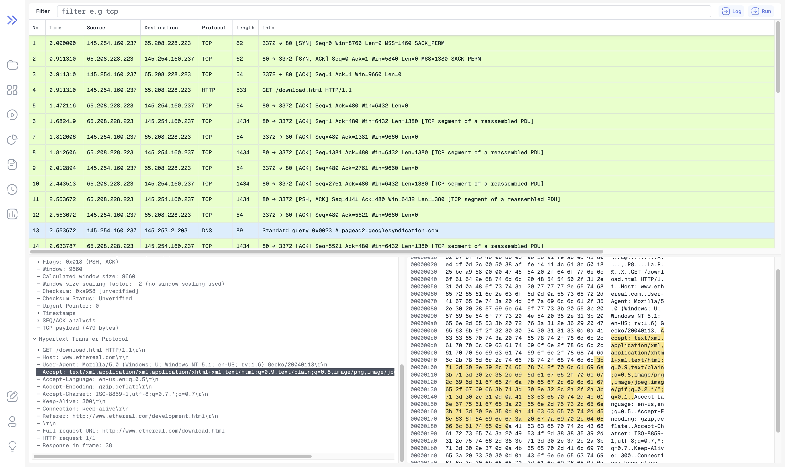
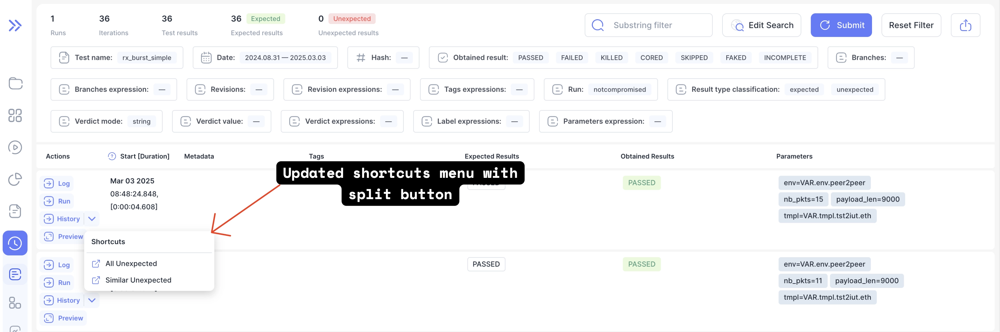
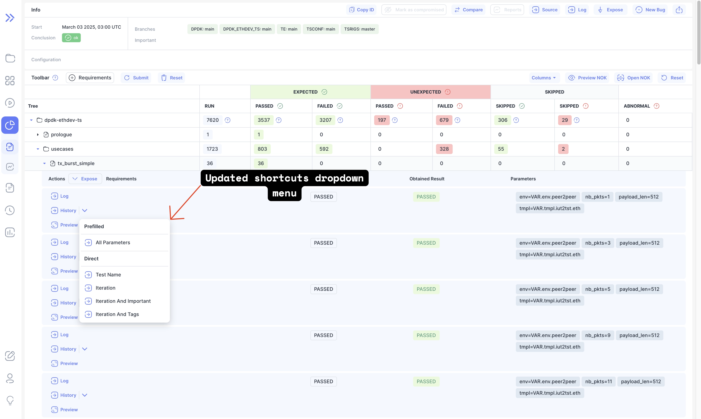
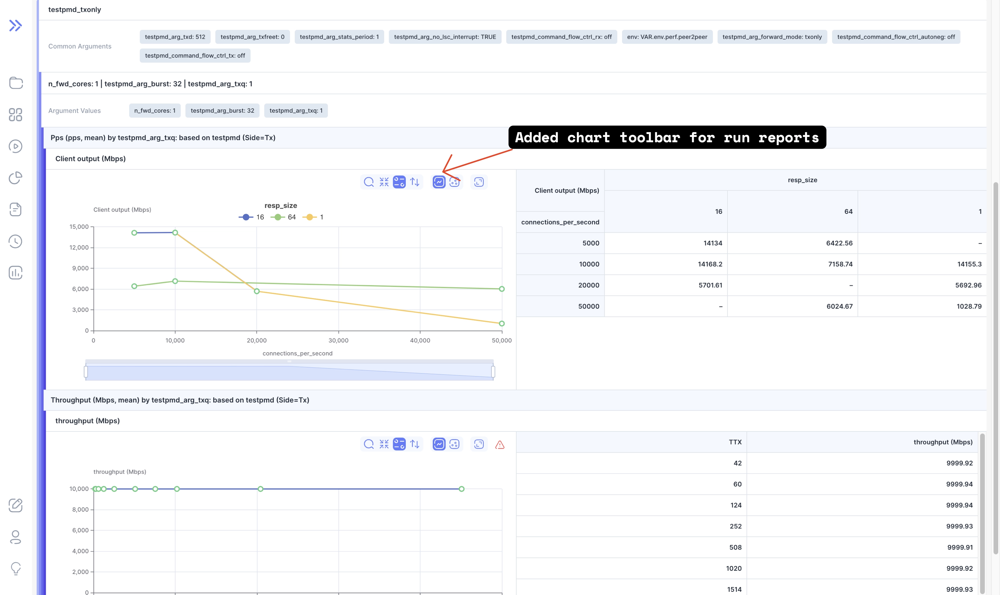

import {
  JSONFormatter,
  Highlight,
  Comment,
  JSONBlock,
} from '../../src/components/json-with-highlight';

In this release we've introduced significant new features and improvements, including enhanced project management with the ability to create, edit, and delete projects, along with a new project picker in the sidebar for easier navigation.
Network analysis capabilities have been expanded with the addition of a packet capture analysis page, dissection tree component, and support for `.cap` and `.pcap` file attachments.
The update also brings UI refinements such as resizable panels, loading states, and a new split-button component, alongside performance gains from converting PNG images to WebP format.

<!--truncate-->

## Multi-Project Support

In this release, we introduced support for managing multiple projects within a single instance.

### Project Management

Project management is available through the Configuration Manager in the Admin section.

:::note
This functionality is accessible to administrators only.
:::

Here you can:

- Create new projects
- Rename projects
- Delete projects

:::note
Currently, you can only rename or delete projects that do not have any runs associated with them.
:::

### Importing Runs

To import a run that belongs to a new project, you must first create the project using the Configuration Manager in the Admin section.

To specify which project a run belongs to, set the project name as the value of the `PROJECT` meta field in the `meta_data.json` log file before starting the import.

  

    Example of a `meta_data.json` for a run that will be linked to the
    <strong>ts-factory</strong> project
  

<JSONFormatter>
  {`{
  "version": 1,
  "metas": [
    <Highlight>{
        "name": "PROJECT", <Comment>This means this run will be linked to project with name ts-factory</Comment>
        "value": "ts-factory"
    },</Highlight>
    {
      "name": "TS_NAME",
      "value": "net-drv-ts"
    },
    {
      "name": "NET_DRV_TS_GIT_URL",
      "value": "https://github.com/ts-factory/net-drv-ts.git"
    },
    {
      "name": "NET_DRV_TS_BRANCH",
      "value": "main",
      "type": "branch"
    },
    {
      "name": "NET_DRV_TS_REV",
      "value": "9ac8dee6e9345039a2b602de72239f2faf8ab89f",
      "type": "revision"
    },
    {
      "name": "TSRIGS_GIT_URL",
      "value": "https://cbs-speed-stack@git.oktetlabs.ru/git/oktetlabs/ts-rigs.git"
    },
    {
      "name": "TSRIGS_BRANCH",
      "value": "master",
      "type": "branch"
    },
    {
      "name": "TSRIGS_REV",
      "value": "0ecac2d569b7fc83242d7c136c859c0c4cbea713",
      "type": "revision"
    },
    {
      "name": "CFG",
      "value": "beechbone-e810"
    },
    {
      "name": "TSCONF_GIT_URL",
      "value": "https://github.com/ts-factory/ts-conf.git"
    },
    {
      "name": "TSCONF_BRANCH",
      "value": "main",
      "type": "branch"
    },
    {
      "name": "TSCONF_REV",
      "value": "df76a477945aabed165ec244257100f1894d39af",
      "type": "revision"
    },
    {
      "name": "START_TIMESTAMP",
      "value": "2025-02-23T17:07:32+03:00"
    },
    {
      "name": "CAMPAIGN_DATE",
      "value": "2025-02-23"
    },
    {
      "name": "USER",
      "value": "cbs-speed-stack"
    },
    {
      "name": "RUN_STATUS",
      "value": "DONE"
    },
    {
      "name": "RUN_OK",
      "value": "true"
    },
    {
      "name": "TE_GIT_URL",
      "value": "https://github.com/ts-factory/test-environment.git"
    },
    {
      "name": "TE_BRANCH",
      "value": "main",
      "type": "branch"
    },
    {
      "name": "TE_REV",
      "value": "d869ac23287ee81795cf42803b2e79e17aea04ee",
      "type": "revision"
    },
    {
      "name": "REUSE_PCO",
      "value": "true"
    },
    {
      "name": "FINISH_TIMESTAMP",
      "value": "2025-02-23T19:32:03+03:00",
      "type": "timestamp"
    }
  ]
}`}
</JSONFormatter>

:::warning
At this time, setting the project in `meta_data.json` before import **is the only way to link a run to a project**.
It is not possible to reassign a run to another project through the user interface.
If you need to change a run’s project, you must delete it and re-import it with the correct `PROJECT` value in `meta_data.json`.
:::

### Configurations

Configurations are now divided into:

- Default configurations
- Project-specific configurations

Default configurations are used for:

- Displaying runs when no project is selected
- Importing and displaying runs in the absence of project-specific configurations or missing attributes in them

If you want to customize settings for a particular project, create a dedicated configuration for that project and override only the attributes you need.

:::tip
The presence of a run in Bublik is determined by the meta values listed in `RUN_KEY_METAS` in the main configuration (_per_conf_). If you want to import identical runs into different projects, include the `PROJECT` meta in the `RUN_KEY_METAS` of the main configurations for both projects. This ensures that when importing the same run into another project, Bublik will not treat it as already imported.
:::

### Filter By Project

## Highlights

### Network Packets

New Page to view `.cap` and `.pcap` files from log attachments
You can access it via log attachments if added them
For more information please see [documentation](/publish/attachments).

#### New Page

### Improved Shortcut Links For History And Run

#### Run

#### History

### Report

#### Report Chart Toolbar

---

## Admin Section

:::tip
Before starting the update, create a database backup to ensure data safety in case of any unexpected issues during the process.
:::

### Backend Update

:::tip
Since assigning projects by meta can take a long time, it is recommended to specify the desired meta in the initial command execution to avoid the need for re-running the process.

Stop side services to avoid potential disruptions or conflicts during the migration process: `./scripts/deploy --steps run_side_servers` + `stop`. Restart them once the process is complete: `./scripts/deploy --steps run_side_servers` + `start`.
:::

:::tip
During the update, use `tmux` or `screen` to keep your session running in the background, ensuring it won’t be interrupted if the connection is lost.
:::

1. `cd bublik`
2. `git remote update`
3. `git checkout v2.0.0`
4. `./scripts/deploy --steps migrate_db`
5. `python manage.py migrate_tags_config_to_meta`
6. `python manage.py reformat_configs`
7. `python manage.py assign_project_by_meta -m <meta_name>` (meta name to split runs into projects; default: `PROJECT`)
8. `python manage.py initialize_configs`
9. `./scripts/deploy --steps django_settings run_services`

### Frontend Update

1. Trigger the workflow in your frontend repository
2. Synchronize the mirrors
3. `cd bublik-ui`
4. `git remote update`
5. `git checkout v2.0.0`

### Documentation Update

1. Trigger the workflow in your frontend repository
2. Synchronize the mirrors
3. `cd bublik-docs`
4. `git remote update`
5. `git checkout v2.0.0`

### Docker Instance Update

1. `task backup:create` - to create a backup of the current database
2. `task pull` - to pull the latest images
3. `task up` - wait about 15 seconds for containers to start
4. `task shell` - to enter container
5. `python manage.py migrate_tags_config_to_meta`
6. `python manage.py reformat_configs`
7. `python manage.py assign_project_by_meta -m <meta_name>` (meta name to split runs into projects; default: `PROJECT`)
8. `python manage.py initialize_configs`

---

## Changelog

### Frontend

#### 🚀 New Feature

- **configs:** add project creation button to config sidebar ([c646f24](https://github.com/ts-factory/bublik-ui/commit/c646f24a2cf69d566359939c9b9332e1d038de08))
- **configs:** add project deletion and update functionality ([bb84489](https://github.com/ts-factory/bublik-ui/commit/bb84489811b66368fe88c18eda8d02bf444ba3d4))
- **log:** add new type of log attachment for `.cap` and `.pcap` files ([4bef056](https://github.com/ts-factory/bublik-ui/commit/4bef0565f72a4b2e7e2ef685885300e252498797))
- **net:** add dissection tree component ([50bacfe](https://github.com/ts-factory/bublik-ui/commit/50bacfe640ae52446daac320a1edda7e564ecac7))
- **net:** add loading samples for testing ([479b6d9](https://github.com/ts-factory/bublik-ui/commit/479b6d95a7ab0d861c491a1ffffb68eff03cc51a))
- **net:** add packet capture analyze page ([5452f0d](https://github.com/ts-factory/bublik-ui/commit/5452f0d3a017d8979366231550e1e9c1b71f2f3e))
- **net:** add resizable panels for tree, dump and table ([abd25ec](https://github.com/ts-factory/bublik-ui/commit/abd25ecc6fcd75b0969fb0d29139eedc74ecd2b9))
- **net:** add trace flow component ([4287321](https://github.com/ts-factory/bublik-ui/commit/4287321180b6cf7a43587fea340f986eb779c9df))
- **projects:** [config] remove global config validation and improve empty state handling ([369845a](https://github.com/ts-factory/bublik-ui/commit/369845abad489bb3120d93eba96b42dcec82ce24))
- **projects:** add project creation functionality ([9618134](https://github.com/ts-factory/bublik-ui/commit/961813446ffbf514bd11c80401ced5bea780fa91))
- **projects:** add project dropdown component ([78499f4](https://github.com/ts-factory/bublik-ui/commit/78499f43b170ef56d1f95b16d0dd96d20905ad8b))
- **projects:** add project support and missing config creation ([2cec4fa](https://github.com/ts-factory/bublik-ui/commit/2cec4fa009dce785ffe933f69e8648df3864bd6b))
- **projects:** add projects feature library ([e0603f7](https://github.com/ts-factory/bublik-ui/commit/e0603f7a9a5230c828700b0f3e23c2143e99f2fe))
- **projects:** enhance project dropdown with sidebar toggle and project name display ([c609cc2](https://github.com/ts-factory/bublik-ui/commit/c609cc2f48ea72a639d2be3396e71afac386b5d7))
- **projects:** extend config schema with project field ([a1dd545](https://github.com/ts-factory/bublik-ui/commit/a1dd545b9858fdb3ae4e3eab2ffd6dc58d829b4c))
- **projects:** implement project creation modal and add project dropdown to sidebar ([9255aeb](https://github.com/ts-factory/bublik-ui/commit/9255aeb6513274c580386c2c418fb1b61f202a70))
- **projects:** implement project filtering across pages ([f88a601](https://github.com/ts-factory/bublik-ui/commit/f88a6018f911dbea35c29ebee758fa5f41b65ad5))
- **projects:** improve error handling for project creation and update forms ([d1e366a](https://github.com/ts-factory/bublik-ui/commit/d1e366a1988706a39f06e6c99aaf75c1d0b59d2c))
- **projects:** replace Link with `LinkWithProject`` across all components ([72ffded](https://github.com/ts-factory/bublik-ui/commit/72ffdeda47b552c3dfb12a6b27f2d53b27fdbf1f))
- **report:** [chart] add toolbar for report charts ([ee23155](https://github.com/ts-factory/bublik-ui/commit/ee231559b6464970c68bad61fc953734195f10b2))
- **report:** [TOC] remember open/close state in URL ([1db6e9c](https://github.com/ts-factory/bublik-ui/commit/1db6e9c4e2f160d46525951ca7ee7a042f87a550))
- **run:** improve error handling in compromise status feature ([d3ea8fb](https://github.com/ts-factory/bublik-ui/commit/d3ea8fbce8734f54e1211b0d9a9ca027f9e3f607))
- **ui:** [icons] add external-link icon ([91ad7aa](https://github.com/ts-factory/bublik-ui/commit/91ad7aabd903fe4352e79af036169a28a115867d))
- **ui:** [split-button] add new component for split-button ([4cb17a0](https://github.com/ts-factory/bublik-ui/commit/4cb17a0b9732154d7efddfca5e066e71e254f381))

#### 💅 Polish

- **configs:** add animation for project list accordion open/close states ([8d708d1](https://github.com/ts-factory/bublik-ui/commit/8d708d1ee2c97814376bff04c03866f3fd61aeee))
- **net:** [packet-table] add proper empty/loading states ([66edb07](https://github.com/ts-factory/bublik-ui/commit/66edb07fe35b490f58e51dfab1dff67f8f41e393))
- **sidebar:** fix sidebar button label alignment ([7b52db1](https://github.com/ts-factory/bublik-ui/commit/7b52db1f3b5dabaef0917c51f8ce650ef2fb5831))
- **sidebar:** refactor project dropdown and search hooks ([824a493](https://github.com/ts-factory/bublik-ui/commit/824a493fe219ac5747f50bb601bdc3dab7b81c06))
- **ui:** [dropdown-menu] remove unused left padding from dropdown menu items ([ae46070](https://github.com/ts-factory/bublik-ui/commit/ae460701522643e91221caa5fa4421a7d0c4d9cc))

#### 🐛 Bug Fix

- **assets:** ensure public directory exists for static assets ([33dd537](https://github.com/ts-factory/bublik-ui/commit/33dd537b32ba75f3e38e08d5658b247f7482643d))
- **ci:** increase node memory limit to prevent out-of-memory errors ([4426e54](https://github.com/ts-factory/bublik-ui/commit/4426e54016028caed13315c5464e47ff30ad6dab))
- **configs:** handle default project deletion and conditional rendering ([bb1f043](https://github.com/ts-factory/bublik-ui/commit/bb1f043989d699c85fd60a84605ce02808cded40))
- **configs:** handle null project IDs in config list and API schema ([bbc5157](https://github.com/ts-factory/bublik-ui/commit/bbc51571149f2e6e5f2d81bfd5570e051cb4a991))
- **history:** preserve project filter when resetting history filters ([9aaa76f](https://github.com/ts-factory/bublik-ui/commit/9aaa76f8bb7fff47f8cdeb1d44c6c4f0c99c6fec))
- **import:** improve import log error handling and display ([b869367](https://github.com/ts-factory/bublik-ui/commit/b86936705d27f771f80f173294c93f33d8c322f2))
- **net:** evenly space bottom panels for tree and data sources ([ce42680](https://github.com/ts-factory/bublik-ui/commit/ce42680b5ed3a5151ec92fa3c87991ffd2eb6016))
- **net:** loading `.cap` and `.pcap` files ([ffaa94e](https://github.com/ts-factory/bublik-ui/commit/ffaa94ed8b25fb73fe4c8cf93b28b64dd3591b86))
- **projects:** add truncate class to project dropdown text ([2bd9f4d](https://github.com/ts-factory/bublik-ui/commit/2bd9f4dcc34794c76fc8f5db03c33ad0a8a351d2))
- **projects:** handle `undefined` project field in config endpoint ([625d0d4](https://github.com/ts-factory/bublik-ui/commit/625d0d417a23c7463bd1fa922a2f3af6d17b43ab))
- **projects:** refine config endpoint error handling and project field ([66c7af5](https://github.com/ts-factory/bublik-ui/commit/66c7af55d9f673beb2720989283e11b1f8c86fa1))
- **projects:** rename `project_name` field to`name` in API endpoints ([c71b31e](https://github.com/ts-factory/bublik-ui/commit/c71b31e712e06c7c2282b56cfe0911443cc986b9))
- **report:** [table] fix react duplicate key error ([b9a8971](https://github.com/ts-factory/bublik-ui/commit/b9a8971dbcc7114209f4ba1ecd9ab0d96c7f7119))
- **run:** [comments] add project ID to test comment functionality ([80620d4](https://github.com/ts-factory/bublik-ui/commit/80620d49318bc7ef046a276de4a922291094897b))
- **run:** add no-cache to outside domains issues endpoint ([fa488d2](https://github.com/ts-factory/bublik-ui/commit/fa488d25f0a7b89bdfb1b3d7aef946c58a014d11))
- **run:** fix split button popover being overlayed by run row ([7584646](https://github.com/ts-factory/bublik-ui/commit/7584646f0f15f4afbbc9c2e35898c453ce4fdcd8))
- **run:** update API endpoints and remove unused prefetch ([19f65e1](https://github.com/ts-factory/bublik-ui/commit/19f65e1f2f6a186c92d22f53cc6d44ce2732f8a2))
- **types:** replace most of `any` types with concrete ones ([b3edcba](https://github.com/ts-factory/bublik-ui/commit/b3edcba4aa2aee2b8a6280fdb05535f6ee2718b0))
- **ui:** [link] update link component ref type and pass ref to Link ([3f318a0](https://github.com/ts-factory/bublik-ui/commit/3f318a05df4a1c23741ae1804d4c64b73020c06c))
- **ui:** fix circural deps issue with context-links component ([12775d0](https://github.com/ts-factory/bublik-ui/commit/12775d0b6027daf152bafba923b8010597cedaa5))

#### ♻ Code Refactoring

- **history:** [linear] use split button to display shortcuts ([431ac51](https://github.com/ts-factory/bublik-ui/commit/431ac51fb21003ff33d9c90c794d39d5b808a681))
- **projects:** add project support to config creation and sidebar ([bd9fb66](https://github.com/ts-factory/bublik-ui/commit/bd9fb662d14349c0ce40b4d33f393e8fb612eb19))
- **projects:** refactor project dropdown to use radio buttons instead of checkboxes ([1d3152f](https://github.com/ts-factory/bublik-ui/commit/1d3152f8182e838f9473fc594287c7a7be0aec31))
- **report:** [chart] extract logic for chart options ([e832af0](https://github.com/ts-factory/bublik-ui/commit/e832af050c9eca2497ba431227b3342837544197))
- **run:** [result-table] change history link labels and add new shortcuts ([484c4d5](https://github.com/ts-factory/bublik-ui/commit/484c4d55d955a953b8c45f13d5aeb53be8c718d3)), closes [#358](https://github.com/ts-factory/bublik-ui/issues/358)
- **run:** [results] use split button to display links to history ([3ff9b3c](https://github.com/ts-factory/bublik-ui/commit/3ff9b3c192acdfbfc18981e0cc17c4cb0fe9cc97))

#### 📦 Chores

- **charts:** delete outdated toolbar component ([d47507d](https://github.com/ts-factory/bublik-ui/commit/d47507dffd44c80ce44e47b3e70153455b5a8cd6))
- **faq:** remove outdated storybook story ([526f99b](https://github.com/ts-factory/bublik-ui/commit/526f99b8074d141cbc7161620d29d4b1f2a4886f))
- **measurements:** remove unused chart imports from plot list component ([6469f18](https://github.com/ts-factory/bublik-ui/commit/6469f188050c23db6532814030ae59c0dd5a174b))
- **measurements:** update export utility import path ([8d2b23a](https://github.com/ts-factory/bublik-ui/commit/8d2b23a1a8ab3083bba4c99b3addd76a5e2dc155))
- **net:** generate library for network analysis ([6f5f43a](https://github.com/ts-factory/bublik-ui/commit/6f5f43ae12e13e5291fb7a4f640ac45b48a0a29e))
- **net:** move packet analysis component to generated library ([303ae2e](https://github.com/ts-factory/bublik-ui/commit/303ae2e3c7f9f1b7e91488d30dbd6bd8099b0d31))
- **projects:** update redux toolkit query import path ([f8a877e](https://github.com/ts-factory/bublik-ui/commit/f8a877e7d52ee2cb186f82632f59e5682bcd9c4f))
- **run:** remove debug console log from compromise form ([eade7db](https://github.com/ts-factory/bublik-ui/commit/eade7dbcde1e75ef062a9accca44385e56057244))
- **sidebar:** update project dropdown and sidebar link behavior ([ca939ae](https://github.com/ts-factory/bublik-ui/commit/ca939ae83831a8f23588b8de0ff409a86d71653e))

#### ⚡ Performance Improvements

- **images:** convert PNG images to WebP for improved performance and loading speed ([844bb16](https://github.com/ts-factory/bublik-ui/commit/844bb16f6d6f52f0ddbc7edd508cd325dc439d5d))

---

### Backend

#### 🐛 Bug Fix

- **apps:** register signal handlers on app startup ([f88de75](https://github.com/ts-factory/bublik/commit/f88de75159559b6ab96b74a7f25358029d631086))
- **config:** avoid meta config format mismatch errors ([2cbea3e](https://github.com/ts-factory/bublik/commit/2cbea3e2b9b907566da31e1850d85a9503392cf8))
- **config:** fix meta config schema ([e6e557a](https://github.com/ts-factory/bublik/commit/e6e557a1d6c9e58e9b6f0e5fef37f6c5def635da))
- **importruns:** fix metadata error msg ([b37cfcc](https://github.com/ts-factory/bublik/commit/b37cfcc004d9397db83ca48fa3a646e3306006c4))
- **management:** fix config validation after reformatting ([3f13f3d](https://github.com/ts-factory/bublik/commit/3f13f3d7c787121234e8456af40ea95ff3a6224f))
- **urls:** fix run source URL construction ([46bd745](https://github.com/ts-factory/bublik/commit/46bd745f91d26d0ce4337e9a8a9886192429f833))

#### 🚀 New Feature

- **metatest:** enforce per-test comment uniqueness at the model level ([fa5b0e6](https://github.com/ts-factory/bublik/commit/fa5b0e6a1f5f8af1dcc0041bf77609b05eed3617))
- **management:** enable merging of meta and tags configs to reduce complexity ([8ec0ea9](https://github.com/ts-factory/bublik/commit/8ec0ea9d6c1bcc0dcd370636a17b17edfedc540e))
- **management:** simplify configs by merging tags into meta during their migration ([f44d3be](https://github.com/ts-factory/bublik/commit/f44d3bec40cfcae03ba8d86f457805ebf7f2fdc7))
- **config:** drop tags config to simplify and unify config management ([de16e4](https://github.com/ts-factory/bublik/commit/de16e408bf1acafd2928951f35da3a46a5c5644f))
- **config:** add meta config content validation ([d2dfc23](https://github.com/ts-factory/bublik/commit/d2dfc238c821b96dc2bd3acce1340fcaf21b7d7a))
- **project:** add project model and its relations ([925fafa](https://github.com/ts-factory/bublik/commit/925fafaf6df43d99c15b5a22c904a1843e23f25a))
- **project:** add basic serializer ([20f8ae5](https://github.com/ts-factory/bublik/commit/20f8ae514fc334014abcee55fed79ac7c74df68b))
- **project:** add API for management ([2c662d7](https://github.com/ts-factory/bublik/commit/2c662d775622be6f305c58bab506b29f866e6a63))
- **api:** implement and apply project-based filtering ([985b287](https://github.com/ts-factory/bublik/commit/985b287409f024a70d00102bf04320174ea4b1b3))
- **config:** make config methods project-aware ([e5f5447](https://github.com/ts-factory/bublik/commit/e5f54477158d09c13e681ab07f1a034a03d2d10c))
- **config:** make serializer methods project-aware ([d560e43](https://github.com/ts-factory/bublik/commit/d560e430309fb3eecf4323f7a71b0c6614eb99a3))
- **config:** update API to support project association ([7d80277](https://github.com/ts-factory/bublik/commit/7d8027775dbeb349f693f055629458a8f3a98082))
- **test comments:** make test comments management project-aware ([16ecd0c](https://github.com/ts-factory/bublik/commit/16ecd0c77b94ad156b3368450eb7503c74bc633d))
- **middleware:** consider project in dynamic settings retrieval ([4530b80](https://github.com/ts-factory/bublik/commit/4530b801154d41e43292d9a0ec59ef071c65195b))
- **services:** make global config attrs retrieval project-aware ([1f4bb06](https://github.com/ts-factory/bublik/commit/1f4bb06bc3d7f05cc6c4c5f23a81d776e3fc4d42))
- **importruns:** make the import process project-aware ([6b34ee4](https://github.com/ts-factory/bublik/commit/6b34ee484ce034233d8369fb6f13fbf3ab7e776b))
- **importruns:** fix meta data generation ([d2b3d65](https://github.com/ts-factory/bublik/commit/d2b3d65e70654888295150f9762db3ea80767d46))
- **importruns:** filter import failure recipients by project ([7716878](https://github.com/ts-factory/bublik/commit/7716878547a010cbc112a729ca7952fd0bf9a98e))
- **management:** make meta categorization project-aware ([7a03904](https://github.com/ts-factory/bublik/commit/7a0390491c4d7164784ab1b9d87f1f889282d57f))
- **auth:** make permissions check project-aware ([21fc4e7](https://github.com/ts-factory/bublik/commit/21fc4e7bc91103665f79ad9af90ec38155424105))
- **performance:** update data retrieval with project filtering ([c74048e](https://github.com/ts-factory/bublik/commit/c74048e32c6a1682fd95fc32e6b7a88f72beebd3))
- **outside domains:** update data retrieval with project filtering ([7ad218c](https://github.com/ts-factory/bublik/commit/7ad218c2c85d05c8acb84c3193d5272e46f03d15))
- **api:** update runs data retrieval with project filtering ([376180d](https://github.com/ts-factory/bublik/commit/376180dae74f6bf87ced000aac2e7f6632dfa5b5))
- **api:** add project info to API output ([d320bae](https://github.com/ts-factory/bublik/commit/d320bae0f958932e10ca4fbd78fa7860dc2ccc53))
- **report:** update available config list filtering with project ([f7a19e5](https://github.com/ts-factory/bublik/commit/f7a19e5686860522386c1a50898f66abc21297c7))
- **management:** associate migrated configs with the corresponding project ([473029c](https://github.com/ts-factory/bublik/commit/473029c6f063b0e8d6a85dad5e577f8aa2d48e41))
- **management:** add project info to config initialization ([7f12565](https://github.com/ts-factory/bublik/commit/7f125657e0eb64ceff3fc0f4b8693aeb221c9a14))
- **management:** update config reformatting labels with project ([b54b56a](https://github.com/ts-factory/bublik/commit/b54b56a70fe330a2c3f2cf5febc5bb8854f1cc3b))
- **urls:** update short URLs with project ([ec076d7](https://github.com/ts-factory/bublik/commit/ec076d779c48ad6f3303ed3d48a4de408e3a1c9b))
- **management:** enable run reassignment based on meta values ([1da5485](https://github.com/ts-factory/bublik/commit/1da54856be6fb977d84299fc8b41830e54c923a1))

#### ♻️ Code Refactoring

- **cache:** simplify tag category cache setup using base tag queryset ([3387789](https://github.com/ts-factory/bublik/commit/33877899f7a30b2dd311c01703936af86bdfdb19))
- **signals:** centralize signals ([4d76d81](https://github.com/ts-factory/bublik/commit/4d76d81a702f80bbe56576819c1cf55c97b27e2d))
- **metatest:** ensure consistent orphan meta cleanup ([e88e863](https://github.com/ts-factory/bublik/commit/e88e863b1fffb16dec8ca449fd15224bb6c6c8be))
- **metatest:** ensure valid updated value ([26ee21a](https://github.com/ts-factory/bublik/commit/26ee21a15ee169e0b2b85f6b5c39aa7f73c77e72))
- **metatest:** ensure clean and reliable serial assignment ([c1f3dea](https://github.com/ts-factory/bublik/commit/c1f3dea15d5efea3133e25b6b9c3d1559ce0c149))
- **test comments:** ensure clean serialization and API ([618c360](https://github.com/ts-factory/bublik/commit/618c360e64eff0e13ba4ca2224694a6515d27570))
- **test comments:** ensure data integrity when updating ([70db86d](https://github.com/ts-factory/bublik/commit/70db86def2d857aac4bd190bbf221cfb9d196b83))
- **auth:** unify access to permission-exempt actions ([cda0163](https://github.com/ts-factory/bublik/commit/cda016311d669dfb2f80a85d293f29346d950892))
- **management:** optimize config type-name mapping ([069381b](https://github.com/ts-factory/bublik/commit/069381bc21705f5133a0f87674154e5c8b65d504))
- **management:** make configuration reformatting more flexible ([b738112](https://github.com/ts-factory/bublik/commit/b738112118bd8d895b5993ead9c73714922d5687))
- **config:** refactor active configuration retrieval ([01c1d3a](https://github.com/ts-factory/bublik/commit/01c1d3a584f7fa149a7fcd8cf3ecf8989a9ebdc3))
- **config:** improve meta config structure ([a275280](https://github.com/ts-factory/bublik/commit/a275280972141fdf08755c66b00012ba29051179))
- **management:** update meta categorization command for new config structure ([1928fe8](https://github.com/ts-factory/bublik/commit/1928fe8ef20053f0671356dd88686781f5b4835b))
- **management:** sort configs before reformatting ([74b4776](https://github.com/ts-factory/bublik/commit/74b4776d66fd0980d4c35f42b3e2840e5eb7ac1a))
- **management:** fix config reformatting order during migration ([c2530e4](https://github.com/ts-factory/bublik/commit/c2530e4d4d9ccd879df3ec87d05bcaf66d9f65e2))
- **management:** add reformatting for meta config schema update ([846bfb2](https://github.com/ts-factory/bublik/commit/846bfb2e21e07b21d9edfdbc463199324c85be37))
- **config:** update the main project config schema ([cc3e6d5](https://github.com/ts-factory/bublik/commit/cc3e6d56a24b33556b22be619ce7229d829b4283))
- **run:** prevent redundant DB hits ([86e135f](https://github.com/ts-factory/bublik/commit/86e135f913ef0e6749f9262253c7f98a5e5d28f9))
- **services:** require project ID for global config retrieval ([6a34d2d](https://github.com/ts-factory/bublik/commit/6a34d2da8f03a3cfe1c458e4d7d66d62a3eeb047))
- **management:** make config management commands atomic ([0eef519](https://github.com/ts-factory/bublik/commit/0eef5198267e7e8a6a537dcd96d16ed18a3f973d))
- **management:** unify config management commands output ([9a327d3](https://github.com/ts-factory/bublik/commit/9a327d3ef41fa4bd3efe4c849e6cf68b22b74c9b))
- **management:** make config migration command more readable ([4e495fa](https://github.com/ts-factory/bublik/commit/4e495fa028c6a75cabdc30efcd582c958e1328e8))

#### 🧹 Cleanup

- **cleanup:** format import blocks ([de7c985](https://github.com/ts-factory/bublik/commit/de7c9851f962421d7e087af17cc40cb4715f15a6))
- **serializers:** organize export order for better clarity ([b0e06c2](https://github.com/ts-factory/bublik/commit/b0e06c2df1025c12fb63e93b7d5fadb48cb7e79a))
- **serializers:** make meta test serializer public ([ceeeb29](https://github.com/ts-factory/bublik/commit/ceeeb295a0fddf0b2a98f20d9c8c977408c40af4))
- **test comments:** simplify docstrings ([dba67dc](https://github.com/ts-factory/bublik/commit/dba67dc0d9d569987640eb2a9103d00a03e1b59f))
- **management:** update meta categorization docstring ([e7da9f2](https://github.com/ts-factory/bublik/commit/e7da9f2056214edb906936e1b6aab0c42cb14dab))
- **management:** clarify all metas categorized ([ddd8dc0](https://github.com/ts-factory/bublik/commit/ddd8dc061fc0cee64cc1d372db8d5d14032874f2))

#### 📦 Chores

- **ci:** exclude migrations from code quality checks ([573a794](https://github.com/ts-factory/bublik/commit/573a794495f23b4a26b57576b5b23faa334ab0bc))
- **server:** delete the deprecated project retrieval endpoint ([0a6f6e2](https://github.com/ts-factory/bublik/commit/0a6f6e23d8ff15974b98a5c16e5cff72f782917e))
