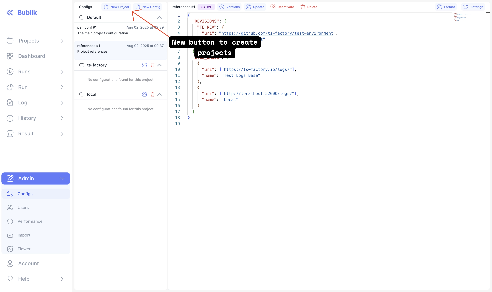

In this release we've introduced significant new features and improvements, including enhanced project management with the ability to create, edit, and delete projects, along with a new project picker in the sidebar for easier navigation.
Network analysis capabilities have been expanded with the addition of a packet capture analysis page, dissection tree component, and support for `.cap` and `.pcap` file attachments.
The update also brings UI refinements such as resizable panels, loading states, and a new split-button component, alongside performance gains from converting PNG images to WebP format.

<!--truncate-->

## Highlights

### Network Packets

New Page to view `.cap` and `.pcap` files from log attachments
You can access it via log attachments if added them
For more information please see [documentation](/publish/attachments).

#### New Page

### Projects

#### Project Selector

#### Create Project Button

#### Specify Project Config

### Improved shortcut links for history and run

#### Run

#### History

### Report

#### Report Chart Toolbar

### Backend Update

1. `cd bublik`
2. `git remote update`
3. `git checkout v2.0.0`
4. `./scripts/deploy --steps run_services`

### Frontend Update

1. Trigger the workflow in your frontend repository
2. Synchronize the mirrors
3. `cd bublik-ui`
4. `git remote update`
5. `git checkout v2.0.0`

### Documentation Update

1. Trigger the workflow in your frontend repository
2. Synchronize the mirrors
3. `cd bublik-docs`
4. `git remote update`
5. `git checkout v2.0.0`

### Docker Instance Updatee

1. `task backup:create`
2. `task pull`
3. `task up` - wait about 15 seconds for containers to start
4. `task shell` - to enter container
5. `python manage.py migrate_tags_config_to_meta`
6. `python manage.py migrate_runs_to_ts_projects`

---

## Changelog

### Frontend

#### 🚀 New Feature

- **config:** add edit and delete project actions ([49231fd](https://github.com/ts-factory/bublik-ui/commit/49231fd74a83448a93bdc25c5a13dc4b469b77a3))
- **configs:** add create new project button to config sidebar ([90efb0e](https://github.com/ts-factory/bublik-ui/commit/90efb0e4fbf4c84a996ad848c4ab7e793c24f4fd))
- **configs:** adjust config endpoints ([8f900b7](https://github.com/ts-factory/bublik-ui/commit/8f900b75ff0ed3f00b11bd4ed73c7b10bb652710))
- **log:** add new type of log attachment for `.cap` and `.pcap` files ([4bef056](https://github.com/ts-factory/bublik-ui/commit/4bef0565f72a4b2e7e2ef685885300e252498797))
- **net:** add dissection tree component ([50bacfe](https://github.com/ts-factory/bublik-ui/commit/50bacfe640ae52446daac320a1edda7e564ecac7))
- **net:** add loading samples for testing ([479b6d9](https://github.com/ts-factory/bublik-ui/commit/479b6d95a7ab0d861c491a1ffffb68eff03cc51a))
- **net:** add packet capture analyze page ([5452f0d](https://github.com/ts-factory/bublik-ui/commit/5452f0d3a017d8979366231550e1e9c1b71f2f3e))
- **net:** add resizable panels for tree, dump and table ([abd25ec](https://github.com/ts-factory/bublik-ui/commit/abd25ecc6fcd75b0969fb0d29139eedc74ecd2b9))
- **net:** add trace flow component ([4287321](https://github.com/ts-factory/bublik-ui/commit/4287321180b6cf7a43587fea340f986eb779c9df))
- **projects:** [config] add empty state and remove required global configs hint ([e09be63](https://github.com/ts-factory/bublik-ui/commit/e09be632afef84d01c3d83ec017283257e959f10))
- **projects:** [config] handle errors for create|update project form ([70e94f6](https://github.com/ts-factory/bublik-ui/commit/70e94f6e7201f1e507f16f5d135c27e30796577b))
- **projects:** add ghost button to create required configs ([2a1ac29](https://github.com/ts-factory/bublik-ui/commit/2a1ac2930d9977b7201f2b8541b2b91ec1d9174e))
- **projects:** add project endpoints ([cb38b86](https://github.com/ts-factory/bublik-ui/commit/cb38b863a26b56d979b3123fac66160fcd9d391b))
- **projects:** add project picker component ([0f8dd44](https://github.com/ts-factory/bublik-ui/commit/0f8dd445ff6a1d1b307e8ac8fa2a9c339d3f0ec4))
- **projects:** add project picker to sidebar ([8d9e8fd](https://github.com/ts-factory/bublik-ui/commit/8d9e8fdf7f3dda9cf9d361a4125032b532e6ad1b))
- **projects:** add projects query params to all endpoints ([4a7cf8e](https://github.com/ts-factory/bublik-ui/commit/4a7cf8eb52aba93d18f0efb9067a5d3324265fe7))
- **projects:** display selected project name in sidebar ([1143476](https://github.com/ts-factory/bublik-ui/commit/1143476b021245f04c0b83d929bc365752748410))
- **projects:** use radio button for project selection ([79a017b](https://github.com/ts-factory/bublik-ui/commit/79a017b63cfb11205e601d94fc8b155b6bbb74ae))
- **report:** [chart] add toolbar for report charts ([ee23155](https://github.com/ts-factory/bublik-ui/commit/ee231559b6464970c68bad61fc953734195f10b2))
- **report:** [TOC] remember open/close state in URL ([1db6e9c](https://github.com/ts-factory/bublik-ui/commit/1db6e9c4e2f160d46525951ca7ee7a042f87a550))
- **run:** disable caching on issues endpoint ([138eb74](https://github.com/ts-factory/bublik-ui/commit/138eb74a84a886ca9ed66fe51b2de425d5b724e3))
- **run:** fetch tags for correct run project ([c88c2d8](https://github.com/ts-factory/bublik-ui/commit/c88c2d8c39d6262fae2f558c814ce51187aae63f))
- **run:** remove getCompromisedTags prefetch and update endpoints for projects ([74221a4](https://github.com/ts-factory/bublik-ui/commit/74221a496b619247710194adb157f004662d28f1))
- **ui:** [icons] add external-link icon ([91ad7aa](https://github.com/ts-factory/bublik-ui/commit/91ad7aabd903fe4352e79af036169a28a115867d))
- **ui:** [split-button] add new component for split-button ([4cb17a0](https://github.com/ts-factory/bublik-ui/commit/4cb17a0b9732154d7efddfca5e066e71e254f381))

#### 💅 Polish

- **configs:** animate project list accordion open/close states ([de60e27](https://github.com/ts-factory/bublik-ui/commit/de60e272fa52493a5a7562c6ff743d721324494e))
- **net:** [packet-table] add proper empty/loading states ([66edb07](https://github.com/ts-factory/bublik-ui/commit/66edb07fe35b490f58e51dfab1dff67f8f41e393))
- **projects:** fix projects dropdown label overflowing sidebar ([af3cb87](https://github.com/ts-factory/bublik-ui/commit/af3cb87f7a64b7f9782c5954a6a87f69063c2fae))
- **projects:** fix sidebar button label alignment ([1993fbc](https://github.com/ts-factory/bublik-ui/commit/1993fbcf5c6fbb7efecdb355f1830b6fbf367a92))
- **run:** fix split button popover being overlayed by run row ([29bc333](https://github.com/ts-factory/bublik-ui/commit/29bc3331b0547f7425437d371852f539117ca6bd))
- **sidebar:** change style of project select to accordion menu ([97b9bc0](https://github.com/ts-factory/bublik-ui/commit/97b9bc00bf424946a6ba6f86b023c4409e69ec8f))
- **ui:** [dropdown-menu] fix insets ([12412cd](https://github.com/ts-factory/bublik-ui/commit/12412cdaa5062ee4b91769bf1bea0688df1afc35))

#### 🐛 Bug Fix

- **assets:** ensure public directory exists for static assets ([33dd537](https://github.com/ts-factory/bublik-ui/commit/33dd537b32ba75f3e38e08d5658b247f7482643d))
- **ci:** increase node memory limit to prevent out-of-memory errors ([4426e54](https://github.com/ts-factory/bublik-ui/commit/4426e54016028caed13315c5464e47ff30ad6dab))
- **configs:** `null` value in call to create config for default project ([e3ac875](https://github.com/ts-factory/bublik-ui/commit/e3ac8758c28b4c4b6bcc9baa4058e0c668e2ac53))
- **configs:** display missing default config ([7041067](https://github.com/ts-factory/bublik-ui/commit/7041067844dff084bf6c989dd42a248e2db016d3))
- **configs:** prevent deleting default project ([f91e5af](https://github.com/ts-factory/bublik-ui/commit/f91e5af6cf524b47d9f71c975b7c25c4d4764b1d))
- **history:** missing `project` search param on history submit ([28e3e3e](https://github.com/ts-factory/bublik-ui/commit/28e3e3eee13602e518f0a9c67e7a06ef21efc921))
- **net:** evenly space bottom panels for tree and data sources ([ce42680](https://github.com/ts-factory/bublik-ui/commit/ce42680b5ed3a5151ec92fa3c87991ffd2eb6016))
- **net:** loading `.cap` and `.pcap` files ([ffaa94e](https://github.com/ts-factory/bublik-ui/commit/ffaa94ed8b25fb73fe4c8cf93b28b64dd3591b86))
- **projects:** [link] pass ref so tooltips work ([5292e73](https://github.com/ts-factory/bublik-ui/commit/5292e735873ff3683507299dbb4dbfe0db81ee0f))
- **projects:** [run] pass projectId as required by API for comment resource ([a5860b1](https://github.com/ts-factory/bublik-ui/commit/a5860b1ae9d71191ddc040093ef14c2e973db202))
- **projects:** pass `null` to create config endpoint ([141df34](https://github.com/ts-factory/bublik-ui/commit/141df34a473369b59aaec80cba8ce343a91f572d))
- **report:** [table] fix react duplicate key error ([b9a8971](https://github.com/ts-factory/bublik-ui/commit/b9a8971dbcc7114209f4ba1ecd9ab0d96c7f7119))
- **run:** [mark-as-compromised] add handling for error message from API ([b72eec3](https://github.com/ts-factory/bublik-ui/commit/b72eec3dfac51019d54fe7091b76346f35d5ccba))
- **types:** replace most of `any` types with concrete ones ([b3edcba](https://github.com/ts-factory/bublik-ui/commit/b3edcba4aa2aee2b8a6280fdb05535f6ee2718b0))

#### ♻ Code Refactoring

- **configs:** group configs by project in configs sidebar ([76e6664](https://github.com/ts-factory/bublik-ui/commit/76e66640529a02349e53cf00eee630b60d9eedae))
- **history:** [linear] use split button to display shortcuts ([431ac51](https://github.com/ts-factory/bublik-ui/commit/431ac51fb21003ff33d9c90c794d39d5b808a681))
- **report:** [chart] extract logic for chart options ([e832af0](https://github.com/ts-factory/bublik-ui/commit/e832af050c9eca2497ba431227b3342837544197))
- **router:** add `project` search params to all links ([fde66f8](https://github.com/ts-factory/bublik-ui/commit/fde66f8fd3c6a536967dd8a735b18ff472d529e3))
- **run:** [results] use split button to display links to history ([3ff9b3c](https://github.com/ts-factory/bublik-ui/commit/3ff9b3c192acdfbfc18981e0cc17c4cb0fe9cc97))

#### 📦 Chores

- **charts:** delete outdated toolbar component ([d47507d](https://github.com/ts-factory/bublik-ui/commit/d47507dffd44c80ce44e47b3e70153455b5a8cd6))
- **faq:** remove outdated storybook story ([526f99b](https://github.com/ts-factory/bublik-ui/commit/526f99b8074d141cbc7161620d29d4b1f2a4886f))
- **measurements:** fix exports ([2b3ed19](https://github.com/ts-factory/bublik-ui/commit/2b3ed19ed8066e323938d8c5a241e515cf70304a))
- **measurements:** fix static/dynamic import issues ([7c9955d](https://github.com/ts-factory/bublik-ui/commit/7c9955de989c33eb6b68465a14dc09d2534e0a37))
- **net:** generate library for network analysis ([6f5f43a](https://github.com/ts-factory/bublik-ui/commit/6f5f43ae12e13e5291fb7a4f640ac45b48a0a29e))
- **net:** move packet analysis component to generated library ([303ae2e](https://github.com/ts-factory/bublik-ui/commit/303ae2e3c7f9f1b7e91488d30dbd6bd8099b0d31))
- **projects:** create projects lib ([cdff9a9](https://github.com/ts-factory/bublik-ui/commit/cdff9a9a4fb81b2cf5c9c30ec9bd601539fbc022))
- **projects:** fix import for toolkit query ([000cc09](https://github.com/ts-factory/bublik-ui/commit/000cc09cb974cd130be37992f66919558b7d44e1))
- **run:** delete missed console.log ([9ae6b67](https://github.com/ts-factory/bublik-ui/commit/9ae6b67a26a9ae938ec9da25237750cd01dbe642))
- **sidebar:** remove hook for extracting project for sidebar links ([368caa7](https://github.com/ts-factory/bublik-ui/commit/368caa78cfc2057ace3f8c33263a4474d487b1ec))
- **ui:** fix circural deps issue with context-links component ([7ee81c0](https://github.com/ts-factory/bublik-ui/commit/7ee81c0a5088e1dc239adbd3b20852f4423a79e5))

#### ⚡ Performance Improvements

- **images:** convert PNG images to WebP for improved performance and loading speed ([844bb16](https://github.com/ts-factory/bublik-ui/commit/844bb16f6d6f52f0ddbc7edd508cd325dc439d5d))

---

### Backend
