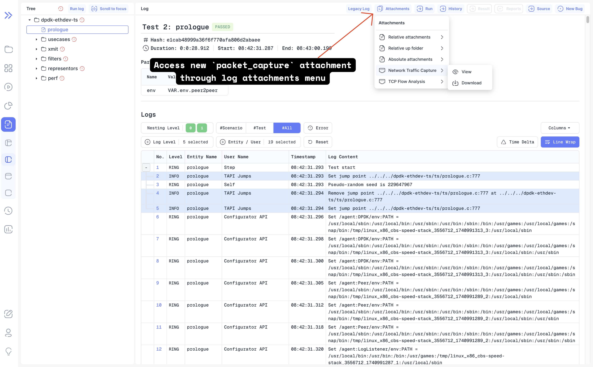
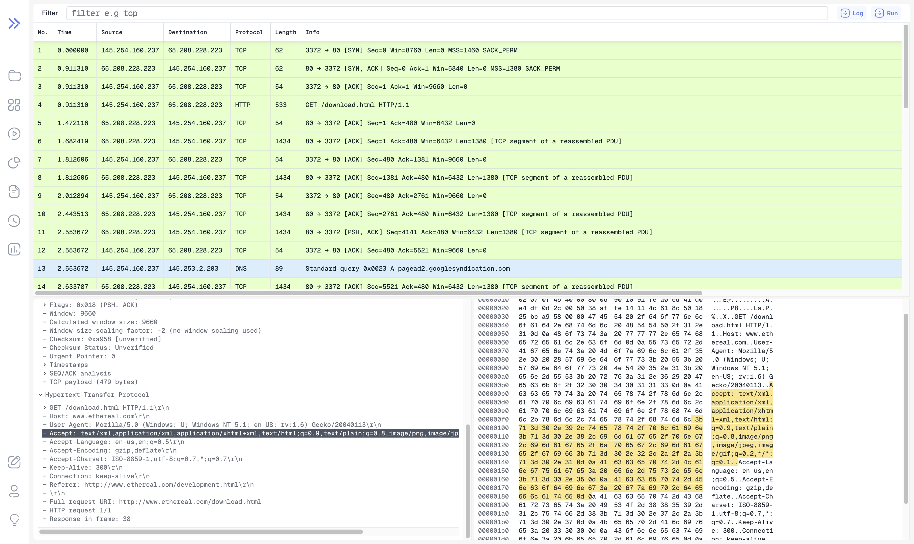
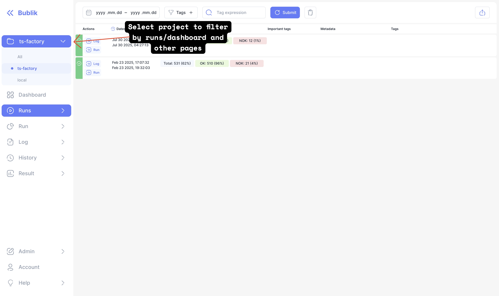
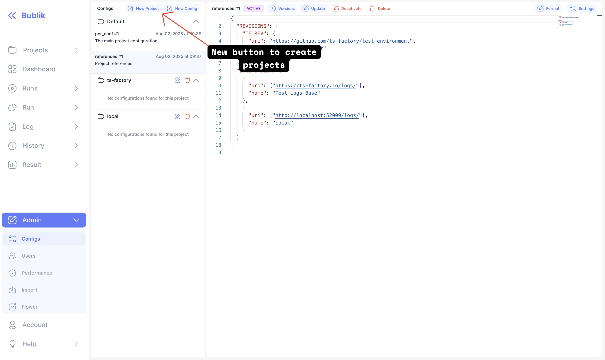
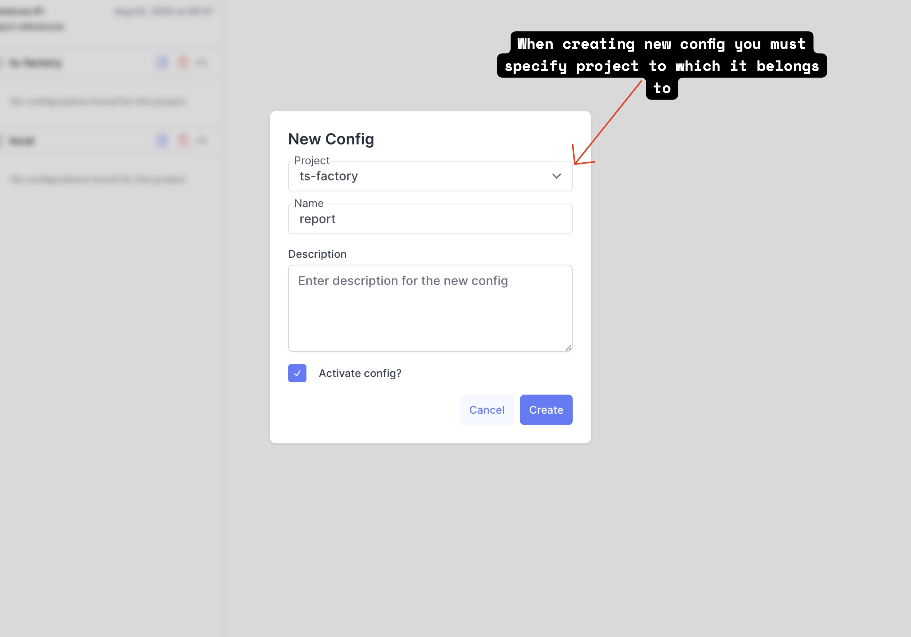
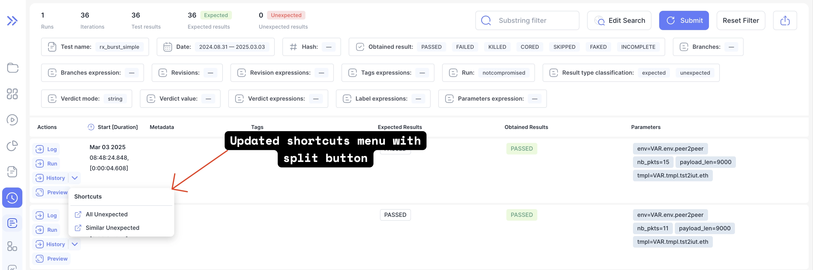
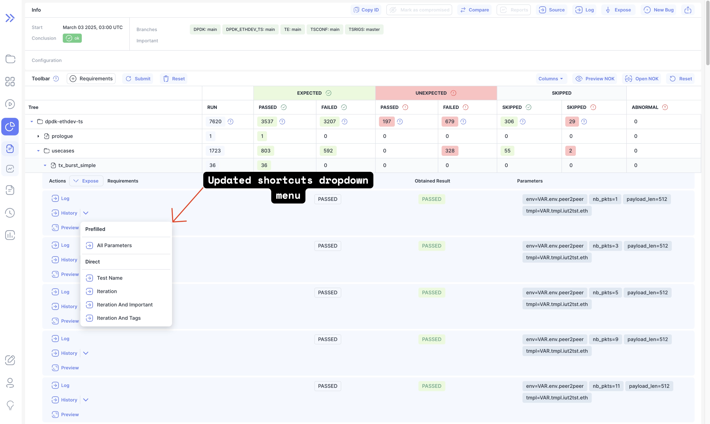
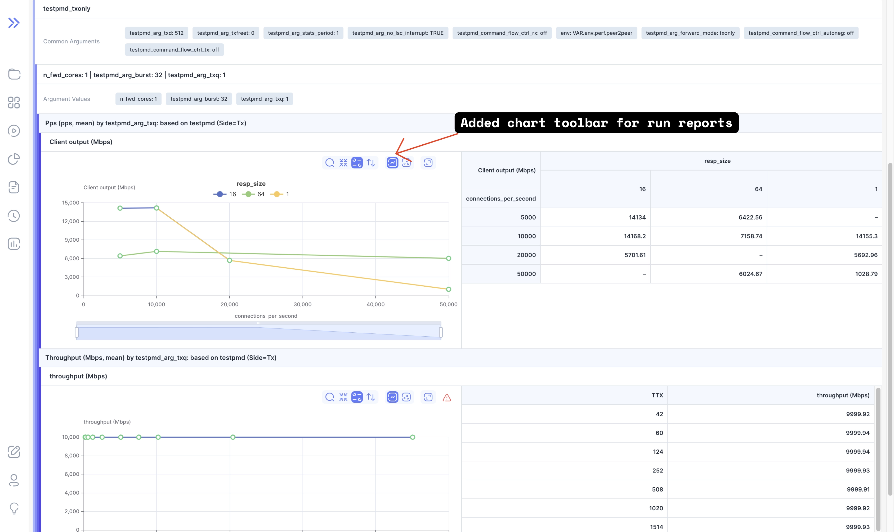

In this release we've introduced significant new features and improvements, including enhanced project management with the ability to create, edit, and delete projects, along with a new project picker in the sidebar for easier navigation.
Network analysis capabilities have been expanded with the addition of a packet capture analysis page, dissection tree component, and support for `.cap` and `.pcap` file attachments.
The update also brings UI refinements such as resizable panels, loading states, and a new split-button component, alongside performance gains from converting PNG images to WebP format.

<!--truncate-->

## Highlights

### Network Packets

New Page to view `.cap` and `.pcap` files from log attachments
You can access it via log attachments if added them
For more information please see [documentation](/publish/attachments).

#### New Page

### Projects

#### Project Selector

#### Create Project Button

#### Specify Project Config

### Improved shortcut links for history and run

#### Run

#### History

### Report

#### Report Chart Toolbar

### Backend Update

1. `cd bublik`
2. `git remote update`
3. `git checkout v2.0.0`
4. `./scripts/deploy --steps run_services`

### Frontend Update

1. Trigger the workflow in your frontend repository
2. Synchronize the mirrors
3. `cd bublik-ui`
4. `git remote update`
5. `git checkout v2.0.0`

### Documentation Update

1. Trigger the workflow in your frontend repository
2. Synchronize the mirrors
3. `cd bublik-docs`
4. `git remote update`
5. `git checkout v2.0.0`

### Docker Instance Updatee

1. `task backup:create`
2. `task pull`
3. `task up` - wait about 15 seconds for containers to start
4. `task shell` - to enter container
5. `python manage.py migrate_tags_config_to_meta`
6. `python manage.py reformat_configs`
7. `python manage.py assign_project_by_meta -m <meta_name>`

---

## Changelog

### Frontend

#### 🚀 New Feature

- **configs:** add project creation button to config sidebar ([c646f24](https://github.com/ts-factory/bublik-ui/commit/c646f24a2cf69d566359939c9b9332e1d038de08))
- **configs:** add project deletion and update functionality ([bb84489](https://github.com/ts-factory/bublik-ui/commit/bb84489811b66368fe88c18eda8d02bf444ba3d4))
- **log:** add new type of log attachment for `.cap` and `.pcap` files ([4bef056](https://github.com/ts-factory/bublik-ui/commit/4bef0565f72a4b2e7e2ef685885300e252498797))
- **net:** add dissection tree component ([50bacfe](https://github.com/ts-factory/bublik-ui/commit/50bacfe640ae52446daac320a1edda7e564ecac7))
- **net:** add loading samples for testing ([479b6d9](https://github.com/ts-factory/bublik-ui/commit/479b6d95a7ab0d861c491a1ffffb68eff03cc51a))
- **net:** add packet capture analyze page ([5452f0d](https://github.com/ts-factory/bublik-ui/commit/5452f0d3a017d8979366231550e1e9c1b71f2f3e))
- **net:** add resizable panels for tree, dump and table ([abd25ec](https://github.com/ts-factory/bublik-ui/commit/abd25ecc6fcd75b0969fb0d29139eedc74ecd2b9))
- **net:** add trace flow component ([4287321](https://github.com/ts-factory/bublik-ui/commit/4287321180b6cf7a43587fea340f986eb779c9df))
- **projects:** [config] remove global config validation and improve empty state handling ([369845a](https://github.com/ts-factory/bublik-ui/commit/369845abad489bb3120d93eba96b42dcec82ce24))
- **projects:** add project creation functionality ([9618134](https://github.com/ts-factory/bublik-ui/commit/961813446ffbf514bd11c80401ced5bea780fa91))
- **projects:** add project dropdown component ([78499f4](https://github.com/ts-factory/bublik-ui/commit/78499f43b170ef56d1f95b16d0dd96d20905ad8b))
- **projects:** add project support and missing config creation ([2cec4fa](https://github.com/ts-factory/bublik-ui/commit/2cec4fa009dce785ffe933f69e8648df3864bd6b))
- **projects:** add projects feature library ([e0603f7](https://github.com/ts-factory/bublik-ui/commit/e0603f7a9a5230c828700b0f3e23c2143e99f2fe))
- **projects:** enhance project dropdown with sidebar toggle and project name display ([c609cc2](https://github.com/ts-factory/bublik-ui/commit/c609cc2f48ea72a639d2be3396e71afac386b5d7))
- **projects:** extend config schema with project field ([a1dd545](https://github.com/ts-factory/bublik-ui/commit/a1dd545b9858fdb3ae4e3eab2ffd6dc58d829b4c))
- **projects:** implement project creation modal and add project dropdown to sidebar ([9255aeb](https://github.com/ts-factory/bublik-ui/commit/9255aeb6513274c580386c2c418fb1b61f202a70))
- **projects:** implement project filtering across pages ([f88a601](https://github.com/ts-factory/bublik-ui/commit/f88a6018f911dbea35c29ebee758fa5f41b65ad5))
- **projects:** improve error handling for project creation and update forms ([d1e366a](https://github.com/ts-factory/bublik-ui/commit/d1e366a1988706a39f06e6c99aaf75c1d0b59d2c))
- **projects:** replace Link with `LinkWithProject`` across all components ([72ffded](https://github.com/ts-factory/bublik-ui/commit/72ffdeda47b552c3dfb12a6b27f2d53b27fdbf1f))
- **report:** [chart] add toolbar for report charts ([ee23155](https://github.com/ts-factory/bublik-ui/commit/ee231559b6464970c68bad61fc953734195f10b2))
- **report:** [TOC] remember open/close state in URL ([1db6e9c](https://github.com/ts-factory/bublik-ui/commit/1db6e9c4e2f160d46525951ca7ee7a042f87a550))
- **run:** improve error handling in compromise status feature ([d3ea8fb](https://github.com/ts-factory/bublik-ui/commit/d3ea8fbce8734f54e1211b0d9a9ca027f9e3f607))
- **ui:** [icons] add external-link icon ([91ad7aa](https://github.com/ts-factory/bublik-ui/commit/91ad7aabd903fe4352e79af036169a28a115867d))
- **ui:** [split-button] add new component for split-button ([4cb17a0](https://github.com/ts-factory/bublik-ui/commit/4cb17a0b9732154d7efddfca5e066e71e254f381))

#### 💅 Polish

- **configs:** add animation for project list accordion open/close states ([8d708d1](https://github.com/ts-factory/bublik-ui/commit/8d708d1ee2c97814376bff04c03866f3fd61aeee))
- **net:** [packet-table] add proper empty/loading states ([66edb07](https://github.com/ts-factory/bublik-ui/commit/66edb07fe35b490f58e51dfab1dff67f8f41e393))
- **sidebar:** fix sidebar button label alignment ([7b52db1](https://github.com/ts-factory/bublik-ui/commit/7b52db1f3b5dabaef0917c51f8ce650ef2fb5831))
- **sidebar:** refactor project dropdown and search hooks ([824a493](https://github.com/ts-factory/bublik-ui/commit/824a493fe219ac5747f50bb601bdc3dab7b81c06))
- **ui:** [dropdown-menu] remove unused left padding from dropdown menu items ([ae46070](https://github.com/ts-factory/bublik-ui/commit/ae460701522643e91221caa5fa4421a7d0c4d9cc))

#### 🐛 Bug Fix

- **assets:** ensure public directory exists for static assets ([33dd537](https://github.com/ts-factory/bublik-ui/commit/33dd537b32ba75f3e38e08d5658b247f7482643d))
- **ci:** increase node memory limit to prevent out-of-memory errors ([4426e54](https://github.com/ts-factory/bublik-ui/commit/4426e54016028caed13315c5464e47ff30ad6dab))
- **configs:** handle default project deletion and conditional rendering ([bb1f043](https://github.com/ts-factory/bublik-ui/commit/bb1f043989d699c85fd60a84605ce02808cded40))
- **configs:** handle null project IDs in config list and API schema ([bbc5157](https://github.com/ts-factory/bublik-ui/commit/bbc51571149f2e6e5f2d81bfd5570e051cb4a991))
- **history:** preserve project filter when resetting history filters ([9aaa76f](https://github.com/ts-factory/bublik-ui/commit/9aaa76f8bb7fff47f8cdeb1d44c6c4f0c99c6fec))
- **import:** improve import log error handling and display ([b869367](https://github.com/ts-factory/bublik-ui/commit/b86936705d27f771f80f173294c93f33d8c322f2))
- **net:** evenly space bottom panels for tree and data sources ([ce42680](https://github.com/ts-factory/bublik-ui/commit/ce42680b5ed3a5151ec92fa3c87991ffd2eb6016))
- **net:** loading `.cap` and `.pcap` files ([ffaa94e](https://github.com/ts-factory/bublik-ui/commit/ffaa94ed8b25fb73fe4c8cf93b28b64dd3591b86))
- **projects:** add truncate class to project dropdown text ([2bd9f4d](https://github.com/ts-factory/bublik-ui/commit/2bd9f4dcc34794c76fc8f5db03c33ad0a8a351d2))
- **projects:** handle `undefined` project field in config endpoint ([625d0d4](https://github.com/ts-factory/bublik-ui/commit/625d0d417a23c7463bd1fa922a2f3af6d17b43ab))
- **projects:** refine config endpoint error handling and project field ([66c7af5](https://github.com/ts-factory/bublik-ui/commit/66c7af55d9f673beb2720989283e11b1f8c86fa1))
- **projects:** rename `project_name`` field to`name` in API endpoints ([c71b31e](https://github.com/ts-factory/bublik-ui/commit/c71b31e712e06c7c2282b56cfe0911443cc986b9))
- **report:** [table] fix react duplicate key error ([b9a8971](https://github.com/ts-factory/bublik-ui/commit/b9a8971dbcc7114209f4ba1ecd9ab0d96c7f7119))
- **run:** [comments] add project ID to test comment functionality ([80620d4](https://github.com/ts-factory/bublik-ui/commit/80620d49318bc7ef046a276de4a922291094897b))
- **run:** add no-cache to outside domains issues endpoint ([fa488d2](https://github.com/ts-factory/bublik-ui/commit/fa488d25f0a7b89bdfb1b3d7aef946c58a014d11))
- **run:** fix split button popover being overlayed by run row ([7584646](https://github.com/ts-factory/bublik-ui/commit/7584646f0f15f4afbbc9c2e35898c453ce4fdcd8))
- **run:** update API endpoints and remove unused prefetch ([19f65e1](https://github.com/ts-factory/bublik-ui/commit/19f65e1f2f6a186c92d22f53cc6d44ce2732f8a2))
- **types:** replace most of `any` types with concrete ones ([b3edcba](https://github.com/ts-factory/bublik-ui/commit/b3edcba4aa2aee2b8a6280fdb05535f6ee2718b0))
- **ui:** [link] update link component ref type and pass ref to Link ([3f318a0](https://github.com/ts-factory/bublik-ui/commit/3f318a05df4a1c23741ae1804d4c64b73020c06c))
- **ui:** fix circural deps issue with context-links component ([12775d0](https://github.com/ts-factory/bublik-ui/commit/12775d0b6027daf152bafba923b8010597cedaa5))

#### ♻ Code Refactoring

- **history:** [linear] use split button to display shortcuts ([431ac51](https://github.com/ts-factory/bublik-ui/commit/431ac51fb21003ff33d9c90c794d39d5b808a681))
- **projects:** add project support to config creation and sidebar ([bd9fb66](https://github.com/ts-factory/bublik-ui/commit/bd9fb662d14349c0ce40b4d33f393e8fb612eb19))
- **projects:** refactor project dropdown to use radio buttons instead of checkboxes ([1d3152f](https://github.com/ts-factory/bublik-ui/commit/1d3152f8182e838f9473fc594287c7a7be0aec31))
- **report:** [chart] extract logic for chart options ([e832af0](https://github.com/ts-factory/bublik-ui/commit/e832af050c9eca2497ba431227b3342837544197))
- **run:** [result-table] change history link labels and add new shortcuts ([484c4d5](https://github.com/ts-factory/bublik-ui/commit/484c4d55d955a953b8c45f13d5aeb53be8c718d3)), closes [#358](https://github.com/ts-factory/bublik-ui/issues/358)
- **run:** [results] use split button to display links to history ([3ff9b3c](https://github.com/ts-factory/bublik-ui/commit/3ff9b3c192acdfbfc18981e0cc17c4cb0fe9cc97))

#### 📦 Chores

- **charts:** delete outdated toolbar component ([d47507d](https://github.com/ts-factory/bublik-ui/commit/d47507dffd44c80ce44e47b3e70153455b5a8cd6))
- **faq:** remove outdated storybook story ([526f99b](https://github.com/ts-factory/bublik-ui/commit/526f99b8074d141cbc7161620d29d4b1f2a4886f))
- **measurements:** remove unused chart imports from plot list component ([6469f18](https://github.com/ts-factory/bublik-ui/commit/6469f188050c23db6532814030ae59c0dd5a174b))
- **measurements:** update export utility import path ([8d2b23a](https://github.com/ts-factory/bublik-ui/commit/8d2b23a1a8ab3083bba4c99b3addd76a5e2dc155))
- **net:** generate library for network analysis ([6f5f43a](https://github.com/ts-factory/bublik-ui/commit/6f5f43ae12e13e5291fb7a4f640ac45b48a0a29e))
- **net:** move packet analysis component to generated library ([303ae2e](https://github.com/ts-factory/bublik-ui/commit/303ae2e3c7f9f1b7e91488d30dbd6bd8099b0d31))
- **projects:** update redux toolkit query import path ([f8a877e](https://github.com/ts-factory/bublik-ui/commit/f8a877e7d52ee2cb186f82632f59e5682bcd9c4f))
- **run:** remove debug console log from compromise form ([eade7db](https://github.com/ts-factory/bublik-ui/commit/eade7dbcde1e75ef062a9accca44385e56057244))
- **sidebar:** update project dropdown and sidebar link behavior ([ca939ae](https://github.com/ts-factory/bublik-ui/commit/ca939ae83831a8f23588b8de0ff409a86d71653e))

#### ⚡ Performance Improvements

- **images:** convert PNG images to WebP for improved performance and loading speed ([844bb16](https://github.com/ts-factory/bublik-ui/commit/844bb16f6d6f52f0ddbc7edd508cd325dc439d5d))

---

### Backend
