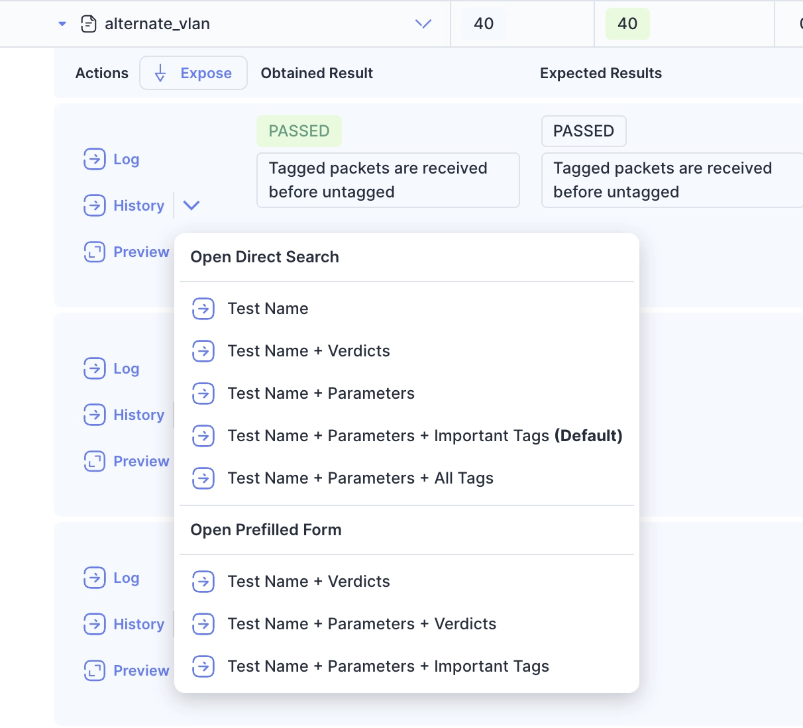

We're excited to announce the release of Bublik v2.2.0! <br />
This update brings several improvements to configuration management, enhanced UI polish, and important bug fixes.

<!--truncate-->

### UI Improvements

- Refined the settings dropdown with improved icon sizing and styling
- Updated the "Expose" button icon in test results for better clarity
- Made default history links bold for easier identification
- Fixed button disabled state colors for better visual consistency
- Dimmed placeholder text in input fields for improved readability

## Highlights

### Configuration Management Enhancements

Added a new button to view configuration schemas, making it easier to understand config structure
Improved config filtering to show only currently selected projects and configurations
Better error handling and validation feedback in config creation and update forms

Button to view config schema:


Schema View:


### New Link To History



### User Experience Updates

Changed default links to point directly to history pages
Adjusted admin-only actions visibility based on user permissions
Improved project card display in config list view

## Admin Section

### Backend Update

1. `cd bublik`
2. `git remote update`
3. `git checkout v2.2.0`
4. `./scripts/deploy --steps pip_requirements django_settings migrate_db per_project_conf run_services`

### Frontend Update

1. Trigger the workflow in your frontend repository
2. Synchronize the mirrors
3. `cd bublik-ui`
4. `git remote update`
5. `git checkout v2.2.0`

### Documentation Update

1. Trigger the workflow in your frontend repository
2. Synchronize the mirrors
3. `cd bublik-docs`
4. `git remote update`
5. `git checkout v2.2.0`

### Docker Instance Update


1. Add following variables to your `.env` file:

```
BUBLIK_DOCKER_DJANGO_HOST_PROXY=127.0.0.1
BUBLIK_DOCKER_TE_LOG_SERVER_HOST=127.0.0.1
BUBLIK_DOCKER_DOCS_HOST=127.0.0.1
FLOWER_HOST=127.0.0.1
BUBLIK_DOCKER_BUBLIK_UI_HOST=127.0.0.1
```

> **Note** it's also recommended to change all references from `localhost` to `127.0.0.1`

2. `task backup:create`
3. Open your `.env` file and change `IMAGE_TAG` to `2.2.0`
4. `task pull`
5. `task up`
6. `task shell` - to enter django container
7. `python manage.py reformat_configs`

## Changelog

### Frontend

#### 🚀 New Feature

* **config:** add button to view config schema ([eed4e0b](https://github.com/ts-factory/bublik-ui/commit/eed4e0b0b060cf379a348759b0d406c3fbbb0a5c))
* **config:** show only projects/configs that are currently selected ([9dd52b1](https://github.com/ts-factory/bublik-ui/commit/9dd52b14868dd3af23bdf39b27c5cdc4668ae7b1))

#### 💅 Polish

* **config:** [settings] improve sizing of icon and styling of dropdown ([c0c26f6](https://github.com/ts-factory/bublik-ui/commit/c0c26f6b668391cfc10a8b2958d4975dd5cc3b07))
* **run:** [results] change `Expose` button icon ([c131cb5](https://github.com/ts-factory/bublik-ui/commit/c131cb5341e176a2197156109f45cd036860084d))
* **run:** [results] make default history link bold ([2106fa5](https://github.com/ts-factory/bublik-ui/commit/2106fa52a21ef196aac0d0fc9bbf1148e623de2a))
* **ui:** [button] fix disabled state color ([9858ac1](https://github.com/ts-factory/bublik-ui/commit/9858ac1450960537634262ed3b9b40ebf507ebaa))
* **ui:** make placeholder text color dimmer for inputs ([8b9d38d](https://github.com/ts-factory/bublik-ui/commit/8b9d38dfb70ef5874c9da0023a1427e6ca2314cb))


#### 🐛 Bug Fix

* **config:** [update] display validation error in case of error ([e4cdcce](https://github.com/ts-factory/bublik-ui/commit/e4cdcce2ef269ceeaebc2f48886d5a7422113f7c))
* **config:** outdated config list after auth ([41c7b74](https://github.com/ts-factory/bublik-ui/commit/41c7b74fcc9e8379d0769ed7028378dd703a3641))
* **config:** overlapping editor line numbers ([4366ff1](https://github.com/ts-factory/bublik-ui/commit/4366ff12c67a8c7e75e37ea120deff9154a7ebb8))
* **dashboard:** missing project name for selected project ([534485d](https://github.com/ts-factory/bublik-ui/commit/534485d827d1087b5e7525e1352db13f41c53c63))


#### ♻ Code Refactoring

* **config:** [list] show all project cards by default ([e6e89e0](https://github.com/ts-factory/bublik-ui/commit/e6e89e091ae87ab8f3701de494739fca998ee0ea))
* **config:** disable/hide admin only actions ([2c0f7da](https://github.com/ts-factory/bublik-ui/commit/2c0f7da5828b2592e6da87cd470ff680f179f631))
* **config:** improve error handling for config create/update forms ([e01691b](https://github.com/ts-factory/bublik-ui/commit/e01691b031fd04f88a265d22aec777c54a66c076))


#### 📦 Chores

* **config:** remove redundant code ([8509e01](https://github.com/ts-factory/bublik-ui/commit/8509e01c9bfae956f97e4c9a39de8a78521cfd21))
* **run:** [results] change order of result table columns ([18f0ff6](https://github.com/ts-factory/bublik-ui/commit/18f0ff6711bb62eb47f4dde03dbf17033dc92b83))
* **run:** [results] swap `prefilled` and `direct` order ([52e0ddf](https://github.com/ts-factory/bublik-ui/commit/52e0ddf6ff76baac425c9f6163f8cbde75148da9))
* **run:** change default link to direct to history ([4dd7997](https://github.com/ts-factory/bublik-ui/commit/4dd7997716c3e09efa3223ff8dcf73164e531555))

---

### Backend

#### 🐛 Bug Fix

- **urls:** fix short URLs to work with multi-segment project names ([19bfad3](https://github.com/ts-factory/bublik/commit/19bfad3884e38ca9d32a2056d087243c2e1e76f2))
- **history:** fix filtering by parameters ([99507f9](https://github.com/ts-factory/bublik/commit/99507f9306c216c130ea080c60844060cfb0cfba))
- **importruns:** fix JSON log retrieval ([27af54e](https://github.com/ts-factory/bublik/commit/27af54e9adac6fcb3f1821c769a37582493b3109))
- **importruns:** fix added tags count logging and redundant lookup ([3c75a93](https://github.com/ts-factory/bublik/commit/3c75a932035e1c5466278b91ce7913170b574e5f))
- **importruns:** ensure runs are linked to projects in live import ([818833b](https://github.com/ts-factory/bublik/commit/818833bfe07c721ff890241c4e7fbeee10e0faf6))
- **management:** ensure project configs migrate if missing ([8271c83](https://github.com/ts-factory/bublik/commit/8271c83fb66860cfa883fbca2ef34d3e42d2c7e6))
- **management:** fix retired project recreation during config setup ([b1cdf53](https://github.com/ts-factory/bublik/commit/b1cdf530384ddd3640109f03fbbd28f290651e23))
- **management:** prevent redundant validation errors in config reformatting ([0c2d59e](https://github.com/ts-factory/bublik/commit/0c2d59e703847b0635535fa20b9f2493f5912ea6))
- **management:** ensure unique config content after reformatting ([6417dc9](https://github.com/ts-factory/bublik/commit/6417dc907397268933f192781ee69af1c38d6ac9))

#### 🚀 New Feature

- **importruns:** prioritize project name from import argument over meta ([e872219](https://github.com/ts-factory/bublik/commit/e872219b4f9a9fa6aa0b941f111c178a38b51ae5))
- **config:** relax configuration content uniqueness ([c68f040](https://github.com/ts-factory/bublik/commit/c68f040140a46e930e0f2cbf1bac1f23e5977fd5))
- **management:** improve access to full project meta categories ([c615ae7](https://github.com/ts-factory/bublik/commit/c615ae719c56274ef42dc48e7dd2fd1f0b38a9c4))
- **settings:** enable colored output for console messages ([0c2c84f](https://github.com/ts-factory/bublik/commit/0c2c84fe0ac581115edac59a243ccc59ec0e6b1d))
- **config:** improve meta config content ([1e7edfc](https://github.com/ts-factory/bublik/commit/1e7edfc74933a0bc0ef839ad351f337c82585377))
- **config:** standardize selected meta categories ([9ace6ca](https://github.com/ts-factory/bublik/commit/9ace6ca60d0437d0c06bb10aebfcbc036096ffb1))
- **config:** include meta config in initialized configs ([8eda6de](https://github.com/ts-factory/bublik/commit/8eda6de18cc5e3a539f6e34bf47af30db5616264))
- **config:** enable dashboard navigation by default ([a60b03c](https://github.com/ts-factory/bublik/commit/a60b03cb119fc468d77ec5e793237370786d918b))
- **config:** enforce project filters and permissions in queryset ([b9cb577](https://github.com/ts-factory/bublik/commit/b9cb5776452fe8339edf743f660738f095c2c203))
- **run data:** add configuration to run details ([6817318](https://github.com/ts-factory/bublik/commit/68173181bde7f349e8c471566fe3137605dd01a9)), closes [#205](https://github.com/ts-factory/bublik/issues/205)

#### ♻️ Code Refactoring

- **importruns:** unify error logging ([9a712af](https://github.com/ts-factory/bublik/commit/9a712afdbf220b6e55bd0959aab7c79066c807fe))
- **config:** ensure consistent activation on deletion ([ce62624](https://github.com/ts-factory/bublik/commit/ce626243c567cfd272afabf039e6db905e41a13e))
- **config:** strengthen data integrity for active configs ([d5901cc](https://github.com/ts-factory/bublik/commit/d5901cc1d7c485c7c84aa0669a48ce5d204e7ebe))
- **config:** ensure valid created value ([bd3dc1e](https://github.com/ts-factory/bublik/commit/bd3dc1eeaf9306d506b5cce895100b111f86e97e))
- **config:** ensure clean and reliable version assignment ([2757a2a](https://github.com/ts-factory/bublik/commit/2757a2afa63fa53f8f941a3a9acc3c8d22038323))
- **config:** ensure clean serialization and API ([9c00b76](https://github.com/ts-factory/bublik/commit/9c00b76deec9fc51b3fb933d666c89affde378f0))
- **management:** remove misleading config names arg from meta categorization ([615582c](https://github.com/ts-factory/bublik/commit/615582c34bb46f17916360bb3764b127c6dc16f3))
- **config:** remove redundant permission check ([b752268](https://github.com/ts-factory/bublik/commit/b752268be03096d37a699aa8791dc5cc87f91f1f))

#### 📦 Chores

- **requirements:** update packages versions to pick up bug fixes ([411aacd](https://github.com/ts-factory/bublik/commit/411aacd2cdb4fc7c7656b1f8648fa4aa8ba63451))
- **managemant:** log config source directory in config migration command ([077bfc7](https://github.com/ts-factory/bublik/commit/077bfc7243e0870c1083aa99777e0fdd873cbb81))
- **management:** clarify meta categorization project-specific logs ([e45a7eb](https://github.com/ts-factory/bublik/commit/e45a7eb865cbe2b0cc0ae05a729ca014a37a4c5e))
- **management:** clarify the reformatting config label ([5656bde](https://github.com/ts-factory/bublik/commit/5656bde3762e93552318ac3bec840583e146eb08))
- **management:** simplify reformatting log analysis by sorting configs ([a299f97](https://github.com/ts-factory/bublik/commit/a299f978d8f01f60655e914f700dae0bc4daf563))
- **management:** improve readability of config reformatting logs ([403ceb4](https://github.com/ts-factory/bublik/commit/403ceb44cefb119c88b4c00252371151a8175a24))
- **config:** annotate meta config JSON schema for clarity ([6e40f93](https://github.com/ts-factory/bublik/commit/6e40f93c08e7a6ac8b0f47846f7e2f22d066cd98))

#### 🧹 Cleanup

- **run data:** fix variable shadowing in metadata grouping ([68d92d1](https://github.com/ts-factory/bublik/commit/68d92d17e6820367e8c3a37e2941622aeec8632f))
