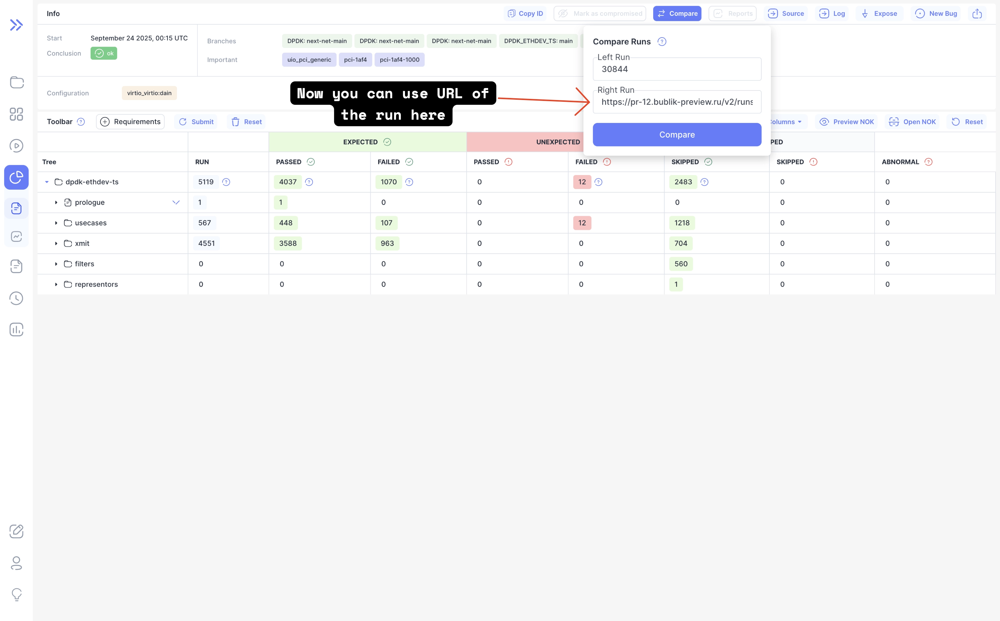

We're pleased to announce Bublik v2.3.0, featuring enhanced configurability and expanded platform support.
Added support for Debian 13 and Python 3.13.
We've also fixed several deployment issues involving Kerberos setup, the configuration directory path when using the default repository, and SSH key retrieval.

### What's New

**Custom Tab Titles**
Configure project-specific tab title prefixes using the new `TAB_TITLE_PREFIX` key in your `per_conf` configuration, making it easier to identify different projects when working with multiple tabs.

**Flexible Run Comparison**
The comparison form now accepts both run URLs and run IDs, streamlining the workflow when comparing test runs from different sources.

**Extended Platform Support**
This release adds compatibility with Debian 13 and Python 3.13, ensuring Bublik stays current with the latest platform versions.

<!--truncate-->

## Highlights

### Compare form

Allow to provide URL for a run besides run ID in comparison form

## Admin Section

### Backend Update

1. `cd bublik`
2. `git remote update`
3. `git checkout v2.3.0`
4. `./scripts/deploy --steps pip_requirements run_services`

### Frontend Update

1. Trigger the workflow in your frontend repository
2. Synchronize the mirrors
3. `cd bublik-ui`
4. `git remote update`
5. `git checkout v2.3.0`

### Documentation Update

1. Trigger the workflow in your frontend repository
2. Synchronize the mirrors
3. `cd bublik-docs`
4. `git remote update`
5. `git checkout v2.3.0`

### Docker Instance Update

:::warning
In this release we require to launch under `www-data` group so logs can be imported by
other users via `scp`
:::

1. `task backup:create`
2. Open your `.env` file and change `IMAGE_TAG` to `2.3.0`
3. Run command `getent group www-data | cut -d: -f3` to get `www-data` group id

> **Note** In case no `www-data` group exists create it

4. Open your `.env` file and change `HOST_GID` to output of previous step (usually `33` on Debian/Ubuntu)
5. `task pull`
6. `task up`

## Changelog

### Frontend

#### 🚀 New Feature

* **run:** [compare] support pasting full run URLs in comparison form ([87976f4](https://github.com/ts-factory/bublik-ui/commit/87976f414d6b9a08cfc5d6dde07ea68377c93607)), closes [#413](https://github.com/ts-factory/bublik-ui/issues/413)

#### ♻ Code Refactoring

* **projects:** get tab title prefix from API ([9c4c2cb](https://github.com/ts-factory/bublik-ui/commit/9c4c2cb79b8ac66ef86739e65717dc1ff4d481a0))

---

### Backend

#### 🐛 Bug Fix

- **deploy:** ensure reliable SSH public key retrieval ([197ce77](https://github.com/ts-factory/bublik/commit/197ce77f08e520782edfeb3439dc233e29d85806))
- **deploy:** fix config directory for default repo option ([05c5caf](https://github.com/ts-factory/bublik/commit/05c5caf8c87d3b3eead8db0a180d58120e3a3fe0))
- **deploy:** fix Kerberos package installation ([280aad2](https://github.com/ts-factory/bublik/commit/280aad23007048e78a0acb461b60abdc7fa4e729))

#### 🚀 New Feature

- **config:** add support for configurable browser tab titles ([02ff5ac](https://github.com/ts-factory/bublik/commit/02ff5acfc2cfb67f1ea4733dc622f5bf02fe7efa))
- **api:** expose configured browser tab title prefix to UI ([0e56541](https://github.com/ts-factory/bublik/commit/0e56541a607989e3f494d8cf4977bd8b6bb6eb21))

#### ♻️ Code Refactoring

- **deploy:** optimize file search performance ([63a6eb0](https://github.com/ts-factory/bublik/commit/63a6eb025eeff89ac69f4db2f0bb5609ffaeaf23))

#### 📦 Chores

- **deploy:** fix incompatibility with Debian 13 ([a4b8f47](https://github.com/ts-factory/bublik/commit/a4b8f4748b0c33e9bd004c1aaee6ceaaa30eaf62))
- **readme:** reflect compatibility with Python 3.13 ([aabd0a2](https://github.com/ts-factory/bublik/commit/aabd0a2f448e78cd7e560c5956b39047cf1edd5b))
- **requirements:** update Django version to pick up bug fixes ([7122db6](https://github.com/ts-factory/bublik/commit/7122db6def6bf27b9b9e9a338bb135e45851c877))
