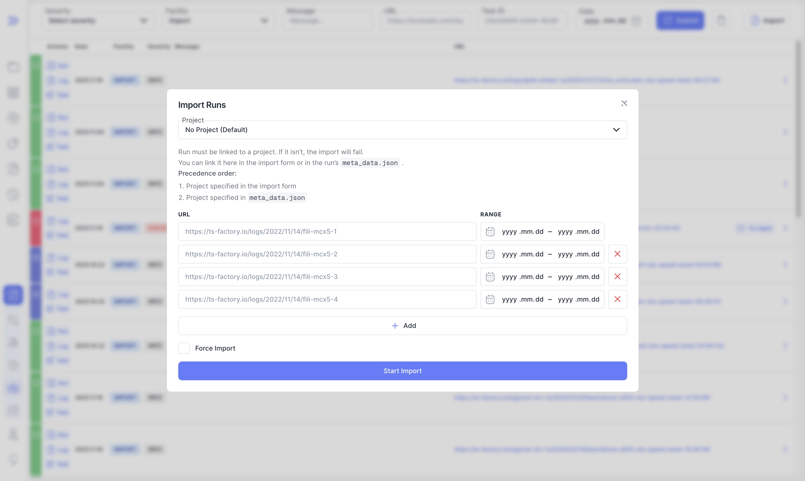

We’re pleased to announce Bublik v2.4.0. In this release, we improved overall performance, in particular for charts with large datasets, enhanced the import UI, and added run comments. We also fixed issues in deployment, live import, reports, and history, and made configurations more reliable by automatically filling missing required attributes from defaults to prevent errors during runtime.

### What's New

**Grouped Import Events by URL**  
Events associated with the same run are now neatly grouped, making navigation easier

**Quick Access to Run Details**  
Each grouped event includes a shortcut to the corresponding run details page

**Re-import Button**  
Retry failed imports directly with a dedicated “Try Again” button

**Project Field Added**  
Assign the project for the imported run directly in the import form

**Chart Performance Improvement**  
Charts now use a canvas renderer, significantly improving performance when visualizing large datasets

<!--truncate-->

## Highlights

### Grouped Import Events By URL

Added shortcut link to run details page

Grouped import events by URL for better organization
You can expand the details of each event to view all events associated with a specific run

Added button to trigger re-import in case of an import error

Added "Project" field to import form to specify the project for the imported run.

### Run Comments

Added support for comments on run details page

## Admin Section

### Backend Update

1. `cd bublik`
2. `git remote update`
3. `git checkout v2.4.0`
4. `./scripts/deploy --steps pip_requirements run_services`

### Frontend Update

1. Trigger the workflow in your frontend repository
2. Synchronize the mirrors
3. `cd bublik-ui`
4. `git remote update`
5. `git checkout v2.4.0`

### Documentation Update

1. Trigger the workflow in your frontend repository
2. Synchronize the mirrors
3. `cd bublik-docs`
4. `git remote update`
5. `git checkout v2.4.0`

### Docker Instance Update

1. `task backup:create`
2. Open your `.env` file and change `IMAGE_TAG` to `2.4.0`
5. `task pull`
6. `task up`

## Changelog

### Frontend

#### 🚀 New Feature

* **import:** [form] add `project` field to form ([1378923](https://github.com/ts-factory/bublik-ui/commit/1378923ce147282ab463ee73336cb6c900b8b0be))
* **import:** add "Try Again" button to trigger re-import of the run ([7baa22a](https://github.com/ts-factory/bublik-ui/commit/7baa22a5f16c18a46cd2eddd89781bfe8d8fbe46))
* **run:** add comment form to run details page ([60386c0](https://github.com/ts-factory/bublik-ui/commit/60386c0dc9832d85395ed863b025e50c11769edf))

#### 💅 Polish

* **report:** [TOC] change font size and spacing to improve clarity ([8f43850](https://github.com/ts-factory/bublik-ui/commit/8f43850b9b587bd90173299da1330959671af4e1))
* **run:** [details] add padding to error state ([c5e96ab](https://github.com/ts-factory/bublik-ui/commit/c5e96ab8e74cfeb6b87809e53e75e610cc38a534))

#### 🐛 Bug Fix

* **import:** open log modal with polling enabled in case of `STARTED` state ([024c609](https://github.com/ts-factory/bublik-ui/commit/024c6091fb389a36401cf30a0a9f40a96920669b))
* **log:** [preview] fix incorrectly handling for first log page ([0320a17](https://github.com/ts-factory/bublik-ui/commit/0320a170462a3a742aab30b9deffda939abc51fe))
* **log:** [preview] reset log table state on pagination change ([2156d47](https://github.com/ts-factory/bublik-ui/commit/2156d47b2ebb8ac0450f3cf8a4a88311113099fc))
* **run:** use full test path for history search ([6a39791](https://github.com/ts-factory/bublik-ui/commit/6a397916406a1b0b349eaaa168fcda237dd282e1))

#### ♻ Code Refactoring

* **import:** display timeline for each import task on row click ([456d0c7](https://github.com/ts-factory/bublik-ui/commit/456d0c70d3f0c99a8d934a8eaa9f5cc4cf4abef5))
* **run:** reorder columns and align headers with badge placement ([2dd6b13](https://github.com/ts-factory/bublik-ui/commit/2dd6b13cdbe6525ce1fdbc435defb2f4e13e2df0))

#### ⚡ Performance Improvements

* **measurements:** use canvas renderer for plots ([0bc05ce](https://github.com/ts-factory/bublik-ui/commit/0bc05ce4591890522e59697c5d99e748cadbedee))

---

### Backend

#### 🐛 Bug Fix
- **deploy:** fix SSH access during initial deployment setup ([9b7744f](https://github.com/ts-factory/bublik/commit/9b7744f19d45a6b7d18d873b7f02e050085c041c))
- **server:** fix incorrect inheritance causing queryset assertion ([7451850](https://github.com/ts-factory/bublik/commit/74518506c1bd8c5360a9e36fbc9de25d566fd96b))
- **importruns:** fix project handling during live import ([a6e9307](https://github.com/ts-factory/bublik/commit/a6e930734614602fa50ead436ac97375a95baf5c))
- **importruns:** ensure project query param consistency across APIs ([e74cb1d](https://github.com/ts-factory/bublik/commit/e74cb1d0d4b0ce31906cafc0c0ef7f1a9e7020b8))
- **report:** fix missing table rows caused by X-axis mismatches ([73c4bbb](https://github.com/ts-factory/bublik/commit/73c4bbbca54c9b422fb5bc504272214a76cb3433))
- **results:** fix inconsistent return type when retrieving tests by name ([a35797f](https://github.com/ts-factory/bublik/commit/a35797fb84e472c672cd2e939859bf7104118688))
- **config:** align config meta naming between default config and typical TS ([d117726](https://github.com/ts-factory/bublik/commit/d117726b649212ac2f25c5d59b91378bf2b2fd8d))
- **config:** ensure type-appropriate empty values for missing attrs ([5546916](https://github.com/ts-factory/bublik/commit/55469164af66371200a86cbc17f04d7667224cb2))
- **config:** ensure fallback to default if attr is missing ([517ad61](https://github.com/ts-factory/bublik/commit/517ad616418bbdcbeeb0afe23193e081541feac2))

#### 🚀 New Feature
- **management:** enable config cache management ([ba669e4](https://github.com/ts-factory/bublik/commit/ba669e473b7894424f618d9d4dade2dc05d0b0cd))
- **project:** allow renaming of projects that have linked runs ([13eb69f](https://github.com/ts-factory/bublik/commit/13eb69f7b169844dec8654287d0c63bb72ddce83))
- **events:** update events data with run ID ([5e1d982](https://github.com/ts-factory/bublik/commit/5e1d982c790a2daea0aab73bee88a286304af63f))
- **events:** group events by URI for convenience ([40f34ed](https://github.com/ts-factory/bublik/commit/40f34ed8366365a8b0430159b595506ef2c9a3cf))
- **api:** add endpoint for managing run comments ([ae7bb27](https://github.com/ts-factory/bublik/commit/ae7bb2736a894b9c7adfb04d96ba755808e95a80))

#### ⚡ Performance
- **config:** upgrade config cache for performance ([9129363](https://github.com/ts-factory/bublik/commit/9129363cfcc8f4730cc48f5a3b9f4a798abbe1a3))

#### ♻️ Code Refactoring
- **importruns:** make project argument more descriptive ([e4f76a0](https://github.com/ts-factory/bublik/commit/e4f76a06b947cb52af97dc4e21e27dd28612ad04))
- **management:** unify and clarify project argument definition ([163cb63](https://github.com/ts-factory/bublik/commit/163cb63830336f7ede5b989ec908c13522d17b1a))
- **report:** improve encapsulation in point sequence sorting ([7465ff6](https://github.com/ts-factory/bublik/commit/7465ff6bee933e23c2f50fe8e0c45224b83fe1f1))
- **events:** refine session import API ([7ad6457](https://github.com/ts-factory/bublik/commit/7ad6457f97792883c598e9df5e750657303cdef0))
- **events:** ensure runtime values are numeric ([31cfa49](https://github.com/ts-factory/bublik/commit/31cfa49f8fe0a1b4052e094af70450bac8b453de))

#### 📦 Chores
- **requirements:** update Markdown version to pick up bug fixes ([f219fa0](https://github.com/ts-factory/bublik/commit/f219fa0b51e19605865985cb60595ea896e0c14e))
- **requirements:** update packages versions to pick up bug fixes ([8ff2754](https://github.com/ts-factory/bublik/commit/8ff2754ca30111416a77ef507108837707022d10))

#### 🧹 Cleanup
- **importruns:** improve error message for missing project arg when required ([52d6cab](https://github.com/ts-factory/bublik/commit/52d6cabff09899c123b01ade5a4cf0cd145a399e))
- **config:** remove outdated default for metadata generation files ([62fd14c](https://github.com/ts-factory/bublik/commit/62fd14c344b869a09b246b50f07016f8f5cf432e))
- **config:** remove uninformative defaults from main project config schema ([c4e1a7c](https://github.com/ts-factory/bublik/commit/c4e1a7ce16522d83632ead9d2eca4f9b5d257ac2))
- **events:** simplify and clean up event list retrieval ([d3c6f47](https://github.com/ts-factory/bublik/commit/d3c6f470310aa7815fe3863861ee1e8b32066696))
- **metaresult:** ensure consistent orphan meta cleanup ([1ea61fd](https://github.com/ts-factory/bublik/commit/1ea61fd278709c7a12b008b7cd4d41925b967a0c))
- **cleanup:** improve code style and maintainability ([517cb3e](https://github.com/ts-factory/bublik/commit/517cb3ed5fc32b5e139ae9be8ab12648f997524a))
