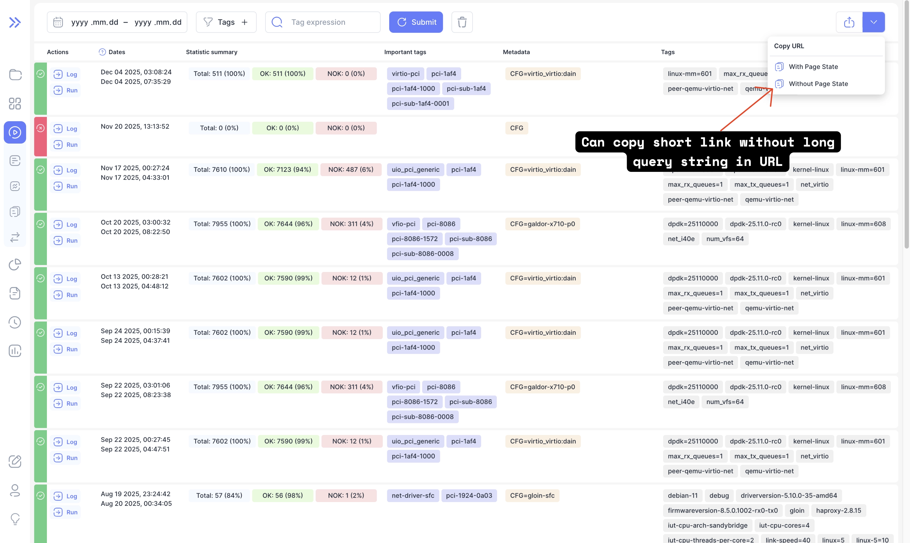

Bublik v2.5.0 brings improved navigation, cleaner short URLs, a more readable import log, and UI refinements like hiding empty argument blocks.  
This release also includes several bug fixes, minor enhancements, and an upgrade to Node v24.11 LTS.

### What's New

**Run Go To The Result**  
When going to the run details page, scroll to the result from which you are coming from if possible

**Improved Import Log**  
The import log now better formatted and highlights "ERROR" messages and "WARNING" messages

**Copy Short URL Without Page State**  
You can now copy a short URL to a page without the page state (long URL query string)

**Hide Empty Argument Values Block**  
On the report page, you hide argument values blocks that are empty

**Place "Gain" columns next to their base ones**  
On the report page, you can now place "Gain" columns next to their base ones for better comparison

<!--truncate-->

## Highlights

### Go Straight To Result
import resultGif from './img/result.gif';

### Import Log

### Copy Short URL Without Page State

You can now copy a short URL to a page without the page state (long URL query string)

### Place "Gain" Columns Next to Their Base Ones

On the report page, you can now place "Gain" columns next to their base ones for better comparison

## Admin Section

:::tip
Before starting the update, create a database backup to ensure data safety in case of any unexpected issues during the process.
:::

### Backend Update

1. `cd bublik`
2. `git remote update`
3. `git checkout v2.5.0`
4. `./scripts/deploy --steps pip_requirements migrate_db run_services`

### Frontend Update

1. Trigger the workflow in your frontend repository
2. Synchronize the mirrors
3. `cd bublik-ui`
4. `git remote update`
5. `git checkout v2.5.0`

### Documentation Update

1. Trigger the workflow in your frontend repository
2. Synchronize the mirrors
3. `cd bublik-docs`
4. `git remote update`
5. `git checkout v2.5.0`

### Docker Instance Update

1. `task backup:create`
2. Open your `.env` file and change `IMAGE_TAG` to `2.5.0`
5. `task pull`
6. `task up`

## Changelog

### Frontend

#### 🚀 New Feature

* **history:** [aggregation] add important tags to results hover card ([070e0b1](https://github.com/ts-factory/bublik-ui/commit/070e0b15794657280d3cc73610dc50dbd5859128))
* **log:** expand level up to row with `MI` level by default ([57f1cb8](https://github.com/ts-factory/bublik-ui/commit/57f1cb8de6bebfc04697c27c7f83ef5acf9174ba))
* **report:** [table] add ability to pair "gain" columns to their base series ([24052dd](https://github.com/ts-factory/bublik-ui/commit/24052dd9578efa70ebb7bc97788ffe6d113ff94f))
* **run:** add link to run straight to iteration ([831652d](https://github.com/ts-factory/bublik-ui/commit/831652d9c1b2d0dcbb10639f98f816d18d774364))
* **url:** add ability to copy short URL with page state or without ([816e8c8](https://github.com/ts-factory/bublik-ui/commit/816e8c8f8bdce555aaa45c88c1cf042dea4a5074))

#### 💅 Polish

* **report:** [chart,table] ensure table and chart always take 50% width ([0dcb4a9](https://github.com/ts-factory/bublik-ui/commit/0dcb4a9a39b964eaff3a0fb86512e35870ae2274))
* **report:** [table] allow table header to wrap for long header labels ([0ed18f6](https://github.com/ts-factory/bublik-ui/commit/0ed18f62040b43cc046904590e01c346fd7c4b41))

#### 🐛 Bug Fix

* **history:** apply filter state on mount ([7acf814](https://github.com/ts-factory/bublik-ui/commit/7acf814b7d5280bc459f782d9e524f4ae4c44572))
* **import:** add missing react `key` prop to import events table ([34a2b03](https://github.com/ts-factory/bublik-ui/commit/34a2b0372db0b655b2548a132507e223b2101bf6))
* **report:** hide empty `arg-val-block` in report ([4f3fdbb](https://github.com/ts-factory/bublik-ui/commit/4f3fdbb1a038d4ce64a640f402018f5a4c1bb722))
* **run:** [result-table] fix parameters diff ([2bdb7bc](https://github.com/ts-factory/bublik-ui/commit/2bdb7bc177aed919964ff680d308a17b771859dd))

#### ♻ Code Refactoring

* **import:** [log] display log as a table with columns ([e7cde45](https://github.com/ts-factory/bublik-ui/commit/e7cde451a570c8ff7250d988ff75e4f195294e73))
* **version:** fix missing API version information ([d0c71a2](https://github.com/ts-factory/bublik-ui/commit/d0c71a2c0c7a8c3bdaf364b0ef878d956b3cc981))

#### 📦 Chores

* **deps:** upgrade node version to 24.11 LTS ([eb62198](https://github.com/ts-factory/bublik-ui/commit/eb62198f588213c2640d3131af6a7ccdc2de708a))

---

### Backend

#### 🐛 Bug Fix
- **importruns:** fix project handling during live import ([61151a3](https://github.com/ts-factory/bublik/commit/61151a3c36b39ffefef039e2737da8a28a33a09e))
- **models:** enforce project association for all test iteration results ([ec5af1e](https://github.com/ts-factory/bublik/commit/ec5af1e24cb73d972f0b1ad5ebbb73d7d449a635))
- **signals:** fix config cascade delete error caused by project deletion ([3edd162](https://github.com/ts-factory/bublik/commit/3edd162d43842a13d99ba886ee2f647f0c746ea0))
- **index:** prevent path traversal when serving docs ([8af6a52](https://github.com/ts-factory/bublik/commit/8af6a5236c98933270abd78f81eb539f3b296fd5))
- **config:** ensure proper field-specific validation for config name ([6521116](https://github.com/ts-factory/bublik/commit/6521116b539476b48e0dc32d5efd855a52d64e4f))
- **utils:** fix string-to-number conversion ([5f33d02](https://github.com/ts-factory/bublik/commit/5f33d02c2a1b56e6b95c9011dd30239fb5c073a9))
- **report:** fix display of points with decimal x-axis values on charts ([849b0a4](https://github.com/ts-factory/bublik/commit/849b0a47ab2470b59762fdc614721905614f39e9))
- **report:** fix sequence normalization error due to missing chart values ([8cb45ac](https://github.com/ts-factory/bublik/commit/8cb45acc5f0e85d3d1866cbee6016a3452875b4e))
- **management:** fix reformat sequence settings of report config ([4816e98](https://github.com/ts-factory/bublik/commit/4816e981e5c8f7f24c632ec02b57c7fe26ad041b))

#### ♻️ Code Refactoring
- **importruns:** rename misleading param to reflect actual Celery task ID ([a38c15f](https://github.com/ts-factory/bublik/commit/a38c15f9d1d3dbaae9a66e8db9eed82489bb6936))
- **importruns:** rename uninformative arg to reflect actual Celery task ID ([abb8004](https://github.com/ts-factory/bublik/commit/abb8004a1e5d8e57ee17c0cadebfe8fdb2e0bf32))
- **importruns:** remove redundant check for run-complete indicator file name in config ([d02457d](https://github.com/ts-factory/bublik/commit/d02457dd036f7e7af4de05f9248b4a359a210d62))

#### 📦 Chores
- **run:** fix compatibility issues by replacing outdated PyEDA with SymPy ([e8aa04c](https://github.com/ts-factory/bublik/commit/e8aa04cc625207c1fc4755473a73dcf66056b514))
- **requirements:** update packages versions to pick up bug fixes ([0edd348](https://github.com/ts-factory/bublik/commit/0edd34832b7e23f4708260cc040dcf7a65029fe4))

#### 🧹 Cleanup
- **core:** address technical debt by removing unused error helpers ([5873e75](https://github.com/ts-factory/bublik/commit/5873e7559bf8be0c8ac9568646a8d70f44f0667d))
- **api:** simplify responses by removing redundant 200 status codes ([bd68bc0](https://github.com/ts-factory/bublik/commit/bd68bc0d227d9a5229adafa917c6b351581fd996))
