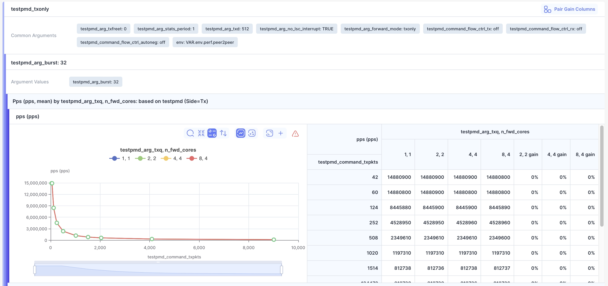

Bublik v2.6.0 introduces new capabilities in run reports, including stacked chart mode for overlaying multiple charts for easier comparison and analysis, as well as multi-argument chart overlays. It also fixes several issues related to argument display.

### What's New

**Multi-Argument Chart Overlays in Reports**  
Specify multiple overlay arguments in the configuration to display corresponding data series on the same axes for easier comparison.

<!--truncate-->

## Highlights

### Report Multi-Argument Chart Overlays

The report configuration now supports grouping data within a single record series across multiple arguments.

#### Overlay Configuration

#### Overlayed Charts

### Stacked Charts

#### How to use:

- Click the **plus** button to select additional charts for stacking
- Selected charts appear in the bottom right corner
- All stacked charts display together on a unified plot

#### Button to add for stacked charts

#### Stacked Charts

## Admin Section

:::tip
Before starting the update, create a database backup to ensure data safety in case of any unexpected issues during the process.
:::

### Backend Update

1. `cd bublik`
2. `git remote update`
3. `git checkout v2.6.0`
4. `./scripts/deploy --steps per_project_conf run_services`

### Frontend Update

1. Trigger the workflow in your frontend repository
2. Synchronize the mirrors
3. `cd bublik-ui`
4. `git remote update`
5. `git checkout v2.6.0`

### Documentation Update

1. Trigger the workflow in your frontend repository
2. Synchronize the mirrors
3. `cd bublik-docs`
4. `git remote update`
5. `git checkout v2.6.0`

### Docker Instance Update

1. `task backup:create`
2. Open your `.env` file and change `IMAGE_TAG` to `2.6.0`
5. `task pull`
6. `task up`
6. `task shell` - to enter django container
7. `python manage.py reformat_configs`

## Changelog

### Frontend

#### 🚀 New Feature

* **report:** [chart] add stacked charts support for report ([e4f4cc8](https://github.com/ts-factory/bublik-ui/commit/e4f4cc82bb91059ba200ded89164c960fb6b39c5))

#### 💅 Polish

* **run:** [result-table] fix history split button icon being on top of header ([d47cd2e](https://github.com/ts-factory/bublik-ui/commit/d47cd2e88996021d2c07c81264366209d3e7f5fe))

---

### Backend

#### 🐛 Bug Fix
- **report:** fix sequences argument move ([e42db0e](https://github.com/ts-factory/bublik/commit/e42db0e66247619477409eea4f126ccebb932f9c))
- **report:** ensure consistent argument display ([19fc68d](https://github.com/ts-factory/bublik/commit/19fc68dcb62c71e6a6e24c5e226970dd0c5ee869))
- **report:** fix iteration vs common test argument duplication ([2f98ea5](https://github.com/ts-factory/bublik/commit/2f98ea5c8735384d581d65c81c807904bf2ff2cd))
- **config:** disallow extra keys in report config to avoid confusion ([36c5e4d](https://github.com/ts-factory/bublik/commit/36c5e4dc03de7a9b05bd64b861e91eb08dc67587))
- **report:** fix overlay settings retrieval for new config format ([d2b1619](https://github.com/ts-factory/bublik/commit/d2b1619aa325aaa3e509b274f157e9a9694713ed))
- **config:** ensure uniqueness of base series in test report ([3de9af1](https://github.com/ts-factory/bublik/commit/3de9af1e0531a7d9637def89c5ceaaadd79b92d3))
- **config:** validate report configs for overlay argument conflicts ([2982a55](https://github.com/ts-factory/bublik/commit/2982a55145024e923f9e4ba9cf7cc7dd97721ed2))

#### 🚀 New Feature
- **config:** enable overlay charts by multiple args ([fe4841c](https://github.com/ts-factory/bublik/commit/fe4841c4735df9d906af597a09551a9143cec6f1))
- **report:** extend overlay processing for multi-argument overlays ([e89f4cb](https://github.com/ts-factory/bublik/commit/e89f4cb630c50ebe64519ef7e2638510aba872c0))

#### ♻️ Code Refactoring
- **report:** clean up test config access ([c21e852](https://github.com/ts-factory/bublik/commit/c21e8527f7021b4c6ccb63f721ae02e9f75b6546))
- **config:** rename overlaying settings key in report config ([ab8b0fb](https://github.com/ts-factory/bublik/commit/ab8b0fb8103f0909fd186653726669026de5a178))
- **report:** standardize terminology for data series ([6db786c](https://github.com/ts-factory/bublik/commit/6db786cceaf9a950ffd63a01f3b9dc2313c2c7f6))

#### 📦 Chores
- **config:** clarify report sequences settings descriptions ([3f13075](https://github.com/ts-factory/bublik/commit/3f13075da825948e60f85f1ac101044394fcdf16))
- **management:** enable reformat to rename overlay settings key in report configs ([990225e](https://github.com/ts-factory/bublik/commit/990225ebcae3ec9fa7a6cada09d7fd5b58610ba0))
- **management:** enable report configs reformat to overlay charts by multiple args ([9f37dd6](https://github.com/ts-factory/bublik/commit/9f37dd67261bb590cf1ae59f89e4d982a6527d9c))
