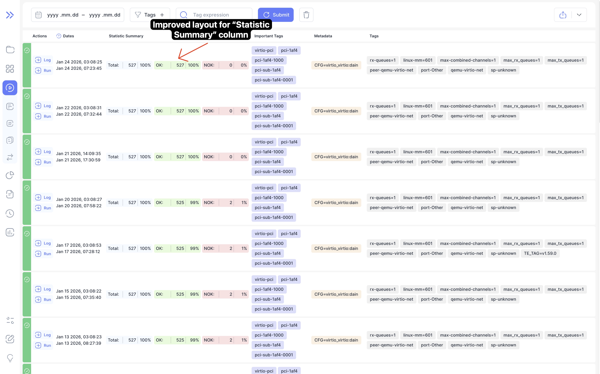

We're excited to announce Bublik v2.8.0! 
This release brings powerful new features for analyzing test results, including a dim mode for parameter comparison, Expected/Unexpected total columns, improved timezone handling, and support for interrupted run status. 
We also fixed issues in the metadata-based project assignment logic and the live import process.

### What's New

**Dim Mode for Parameter Comparison**  
Added a new "dim" mode alongside the existing "diff" mode that visually dims parameters common across all rows, making it easier to spot differences between test configurations.

**Expected/Unexpected Total Columns**  
New aggregate columns display total counts for expected and unexpected test results, providing a quick overview of test run outcomes.

**Interrupted Run Status**  
Added support for displaying runs that were interrupted or crashed during live import, clearly distinguishing them from failed runs.

**Timezone-Aware Date Display**  
Dates throughout the application now display in the user's local timezone instead of UTC, improving readability across different regions.

<!--truncate-->

## Highlights

### Dim Mode for Parameter Comparison

The new dim mode helps identify unique parameters by visually dimming common values across test iterations. Toggle between diff and dim modes to quickly analyze parameter variations.

### Expected/Unexpected Total Columns

Run tables now include aggregate columns showing total counts of expected results (Passed, Failed, Skipped) and unexpected results (Passed Unexpected, Failed Unexpected, Skipped Unexpected), giving you an instant summary of test outcomes.

### Interrupted Run Status

The new INTERRUPTED run status allows you to distinguish runs whose live import was interrupted or crashed from failed runs in the dashboard and runs list.

### Reworked Settings

Settings have been redesigned as a modal accessible from the sidebar

### Improved Statistics Summary Layout

The "Statistics Summary" column on the runs page now features a grid-based layout with better badge alignment and improved visual hierarchy.

### Timezone-Aware Date Display

All dates and times throughout the application now should display in your local timezone

### Clickable URL Labels

Run detail labels containing URLs are now clickable, allowing you to open external links directly from the interface.

## Admin Section

### Backend Update

1. `cd bublik`
2. `git remote update`
3. `git checkout v2.8.0`
4. `./scripts/deploy --steps pip_requirements run_services`

### Frontend Update

1. Trigger the workflow in your frontend repository
2. Synchronize the mirrors
3. `cd bublik-ui`
4. `git remote update`
5. `git checkout v2.8.0`

### Documentation Update

1. Trigger the workflow in your frontend repository
2. Synchronize the mirrors
3. `cd bublik-docs`
4. `git remote update`
5. `git checkout v2.8.0`

### Docker Instance Update

1. `task backup:create`
2. Open your `.env` file and change `IMAGE_TAG` to `2.8.0`
3. `task pull`
4. `task up`

## Changelog

### Frontend

#### 🚀 New Feature

- **log:** [preview] add history link to log preview drawer modal ([7f71547](https://github.com/ts-factory/bublik-ui/commit/7f71547c7d48f85fcf5b8ca9e0b38ff86fa5edb0))
- **log:** add full path to test when navigating to history ([709916d](https://github.com/ts-factory/bublik-ui/commit/709916d3f4826c49f95042616926b673e7cf52b9))
- **run:** [details] support URL links in labels to allow users open new tab ([6fe12db](https://github.com/ts-factory/bublik-ui/commit/6fe12dba636cc36697f5eecd7fd83d7ce0a09d74)), closes [#468](https://github.com/ts-factory/bublik-ui/issues/468)
- **run:** add dim mode to visually highlight common parameters ([f97f5d5](https://github.com/ts-factory/bublik-ui/commit/f97f5d564d46cdb20a6635874da1182f42b467b3)), closes [#449](https://github.com/ts-factory/bublik-ui/issues/449)
- **run:** add Expected/Unexpected total columns ([a902b9e](https://github.com/ts-factory/bublik-ui/commit/a902b9ea441865ce763bd7853a7d8b3b3a893a0e)), closes [#54](https://github.com/ts-factory/bublik-ui/issues/54)
- **run:** add interrupted run status handling ([d92eee0](https://github.com/ts-factory/bublik-ui/commit/d92eee0321c40dc5487bf381fc7803d8c2a07e9e))
- **settings:** initialize settings library ([c3f2cb7](https://github.com/ts-factory/bublik-ui/commit/c3f2cb70b4c7a97c97fb18406f7342d68772a84f))

#### 🐛 Bug Fix

- **bublik-logs:** align TypeScript lib config with bublik for ESNext support ([e705bbd](https://github.com/ts-factory/bublik-ui/commit/e705bbdebfde617dedec635a0ff9bbcf8c358223))
- **history:** format date based on user timezone for history ([1f56e7c](https://github.com/ts-factory/bublik-ui/commit/1f56e7ced32ed488f08622a72b1e96b981378cbe))
- **import:** fix React Hooks order violation in EventRow ([f4c22b6](https://github.com/ts-factory/bublik-ui/commit/f4c22b6bcc6df717e0000363a1c7515293a1b483))
- **import:** handle `null` celery_task in events table ([2bc21de](https://github.com/ts-factory/bublik-ui/commit/2bc21def5963b93a84af75ebcd9d2edafa1503af)), closes [#459](https://github.com/ts-factory/bublik-ui/issues/459)
- **import:** resolve React Hooks order violation ([6a2eb40](https://github.com/ts-factory/bublik-ui/commit/6a2eb40da3a43a422c3ecc67a2315ba995bd59c4))
- **log:** [new-bug] fix layout shift for "new bug" button ([814a0f6](https://github.com/ts-factory/bublik-ui/commit/814a0f601c533b2f011caa6eb53d501cad8ee44a))
- **log:** [new-bug] generate CMD based on top level `config` key ([78417ac](https://github.com/ts-factory/bublik-ui/commit/78417acd9ba2abcbac7444f85d709fc686323039)), closes [#174](https://github.com/ts-factory/bublik-ui/issues/174)
- **log:** [new-bug] make log data optional for NewBugContainer ([bfcd1ef](https://github.com/ts-factory/bublik-ui/commit/bfcd1efae81750b5101032635890799d26a87648))
- **log:** display test start and end in user timezone ([2c1fbad](https://github.com/ts-factory/bublik-ui/commit/2c1fbad239e0a5f0a68a5f5d16686125b5f57e3f)), closes [#470](https://github.com/ts-factory/bublik-ui/issues/470)
- **log:** not showing pagination when viewing full log ([5e4fc44](https://github.com/ts-factory/bublik-ui/commit/5e4fc44f253a7a0e9a4a4d32cdce552526001908)), closes [#176](https://github.com/ts-factory/bublik-ui/issues/176)
- **run:** [details] format start, finish dates of test run ([86e7d29](https://github.com/ts-factory/bublik-ui/commit/86e7d294ce59df331daa9bf0d23294ae2fd0ea1d)), closes [#470](https://github.com/ts-factory/bublik-ui/issues/470)
- **run:** ensure reference rows have visible borders in diff/dim mode ([5c8ba2d](https://github.com/ts-factory/bublik-ui/commit/5c8ba2d1371091701af2857c59c97d2eccc9d333))
- **run:** incorrectly formatted column labels for Unexpected/Expected total ([042df12](https://github.com/ts-factory/bublik-ui/commit/042df12f26c5b4a75c915aea1c988e98085255d5))
- **run:** preserve toolbar visibility when toggling dim/diff mode ([5af2ac1](https://github.com/ts-factory/bublik-ui/commit/5af2ac11323503ca9d125fafb582053d5ebcb027))

#### 💅 Polish

- **run:** [details] make "Expose" button the most left button ([1f83306](https://github.com/ts-factory/bublik-ui/commit/1f83306888bff9c782fa0b22259eed72b2074947))
- **run:** [results] move filter toolbar below result's table header ([df3e344](https://github.com/ts-factory/bublik-ui/commit/df3e34427b061a5c512f66a651418ebac86d261b))
- **runs:** improve layout of `Statistic Summary` columns ([fd6baf3](https://github.com/ts-factory/bublik-ui/commit/fd6baf36619abeb189dd573be63dbd782269080a))
- **ui:** update checkbox and radio-group components ([fc26942](https://github.com/ts-factory/bublik-ui/commit/fc26942d97cbc1bf9a03c7fd45188857d56016dd))

#### ♻️ Code Refactoring

- **history:** generate history-link library ([6c29b4b](https://github.com/ts-factory/bublik-ui/commit/6c29b4b4072120f926b491432107afce19a481be))
- **history:** unify history link component into shared library ([310cf27](https://github.com/ts-factory/bublik-ui/commit/310cf27d7e590d85f4746e67f6e6670b2c28564e)), closes [#414](https://github.com/ts-factory/bublik-ui/issues/414)
- **performance:** remove page and update component ([71a0cb8](https://github.com/ts-factory/bublik-ui/commit/71a0cb8fab92da0ab28f61d6d5f986ea10b439b3))
- **router:** update router and navigation ([73e4468](https://github.com/ts-factory/bublik-ui/commit/73e4468fcc4b30d87cfd330fe4605312377bbd29))
- **run,log,measurements:** use single result type across all code ([fb6a8c0](https://github.com/ts-factory/bublik-ui/commit/fb6a8c0c769e0e72aca76ceef69b343d2cd814fb))
- **settings:** migrate to modal-based UI ([a547df8](https://github.com/ts-factory/bublik-ui/commit/a547df8ace8663916d11644e058e89e1a4d45f62))
- **settings:** split and simplify forms ([da4e402](https://github.com/ts-factory/bublik-ui/commit/da4e402c5e74beaa6c3b8be85c468626ddea555a))

---

### Backend

#### 🐛 Bug Fix
- **management:** fix single-meta run check in assign-project-by-meta ([1f0c7a5](https://github.com/ts-factory/bublik/commit/1f0c7a5bddd7ef9d175cfe82a12e252c1588a29d)), closes [#260](https://github.com/ts-factory/bublik/issues/260)
- **index:** fix potential path traversal when serving docs ([2280b97](https://github.com/ts-factory/bublik/commit/2280b97d2803ebad6c04132e381be386a652198c))
- **importruns:** fix artifacts handling during live import ([f7d92d7](https://github.com/ts-factory/bublik/commit/f7d92d78a521e5a7b1a279673a47dd1fd14371f8))

#### 🚀 New Feature
- **importruns:** distinguish interrupted live imports from failed runs ([af02880](https://github.com/ts-factory/bublik/commit/af028805470210b0d97160c4212ce2c9b62cb78a))

#### ♻️ Code Refactoring
- **core:** extract tree logic to improve code organization ([606d3cc](https://github.com/ts-factory/bublik/commit/606d3cccc9b7736e7defef89085e8d2a5f10869f))

#### 📦 Chores
- **ci:** remove redundant quote-style-check job ([2cb95e](https://github.com/ts-factory/bublik/commit/2cb95e23f9075de5fed4683716e4270fc360c3a2))
- **history:** standardize date format to ISO8601 for proper timezone handling ([d9353fe](https://github.com/ts-factory/bublik/commit/d9353febc2bb556cf170d3183a0569e99c7122cc))
- **ci:** fix black formatting mismatch between local and CI ([65165a8](https://github.com/ts-factory/bublik/commit/65165a8b2bdd46dbdd0fb5c806790ca418026bea))
- **requirements:** update urllib3 version to pick up bug fixes ([9fa308c](https://github.com/ts-factory/bublik/commit/9fa308c2bf74984ad25e07da831e7a75a2db5a37))

#### 🧹 Cleanup
- **history:** fix comment typo in group_results function ([f6ed810](https://github.com/ts-factory/bublik/commit/f6ed8104d525ad9b8f6de6c3874ca395a439796f))
