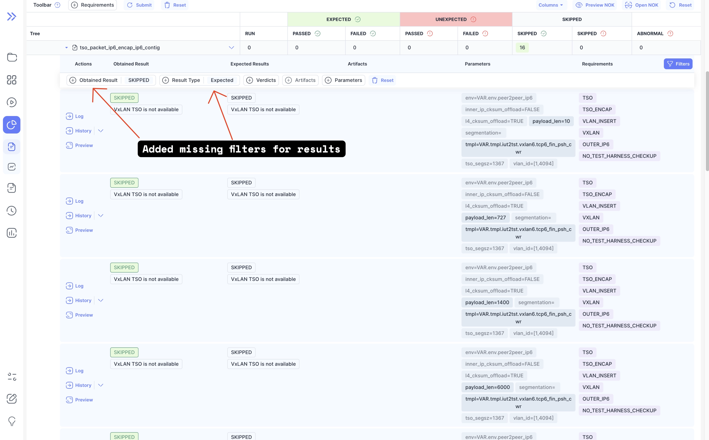
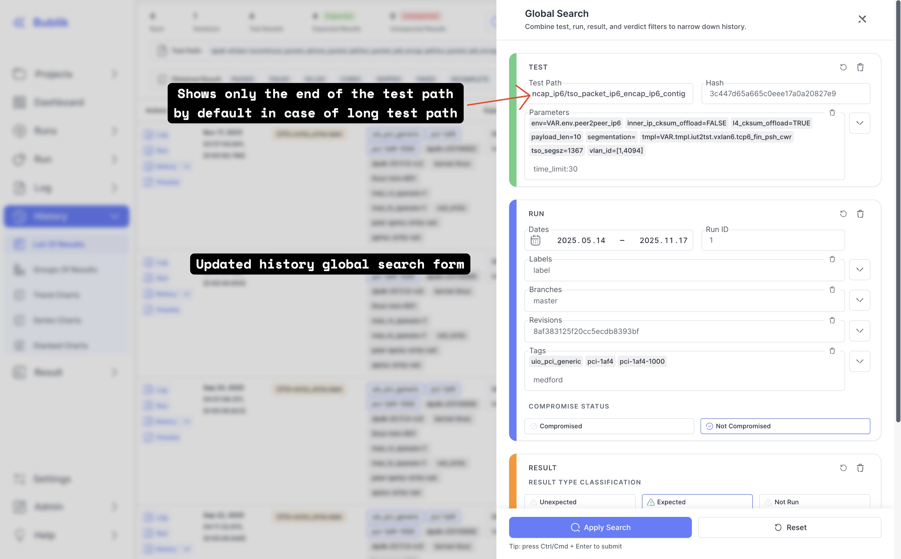
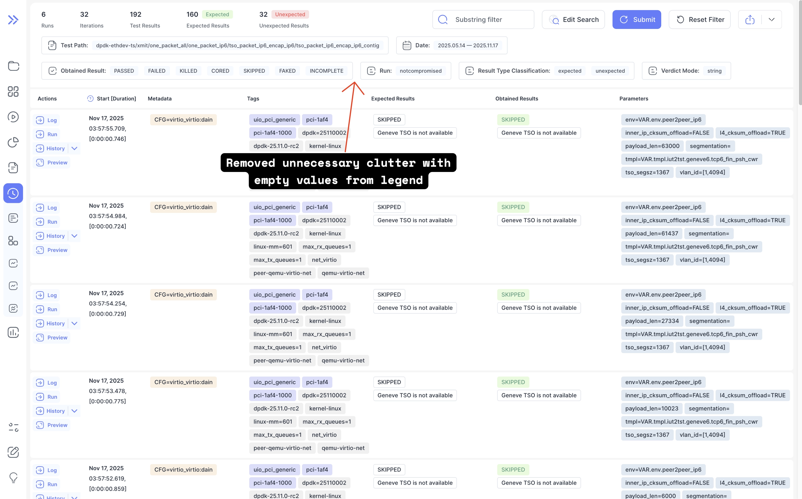
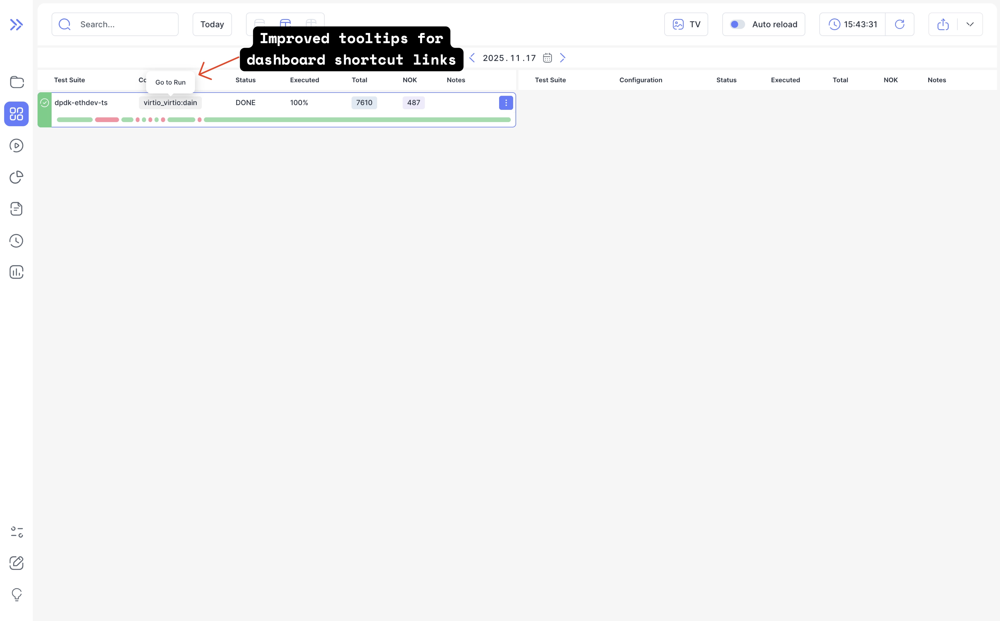

We're excited to announce Bublik v2.10.5! <br />
This release introduces powerful new AI integration features and an enhanced global search form in History. We also fixed full test path search in History, made VCS tags visible in the revisions list in run details, and improved dashboard navigation.

### What's New

**MCP Server** <br />
In this release, we've added an MCP (Model Context Protocol) server, enabling seamless integration with AI agents and assistants.

**Run Filters for Obtained Results** <br />
We've enhanced the run page with powerful new filtering capabilities in the results table.

**History Global Search Form Improved** <br />
The history global search form has been completely revamped for better usability. Filters are now organized into clear sections (TEST, RUN, RESULT, VERDICT), with frequently used fields prominently displayed and advanced options collapsed by default.

<!--truncate-->

## Highlights

### MCP Server

We're introducing a Model Context Protocol (MCP) server that allows AI agents to interact with Bublik programmatically. This opens up possibilities for:

- **Automated Analysis**: Let AI assistants analyze test failures and identify patterns
- **Natural Language Queries**: Ask questions about your test data in plain language
- **Workflow Integration**: Connect Bublik to your existing AI-powered workflows

Here's an example of naive just for the start [conversation](https://opncd.ai/share/u17o7d4z)

You can connect to it via these configs as an example:

1. OpenCode:
```json
"bublik-mcp": {
  "type": "remote",
  "url": "https://<bublik_url>/mcp",
}
```

2. Claude:
```json
"bublik-mcp": {
  "type": "http",
  "url": "https://<bublik_url>/mcp"
}
```

### Run Filters For Obtained Results



### History Global Search Form Improved

The form now shows the most commonly used fields by default, with advanced options available through expandable sections. Long test paths are intelligently truncated to show only the end portion by default, making the interface cleaner.



**Cleaner Legend** — We've also removed unnecessary clutter from the history legend by hiding empty values, giving you a cleaner view of your test data.



### Dashboard Navigation Tooltips Improved

Dashboard tooltips now display the navigation target rather than repeating the value, making navigation easier to understand.



## Admin Section

### Backend Update

:::warning
The `nginx_conf` and `run_side_servers` deployment steps require root rights. If you don't have root access, you must manually update the Nginx configuration using `bublik/templates/nginx.bublik.template` and reload Nginx.
:::

1. `cd bublik`
2. `git remote update`
3. `git checkout v2.10.5`
4. Set path for user systemd services:
```bash
export USER_SERVICES_PATH="${HOME}/.config/systemd/user"
```
5. Set full path for the MCP service file:
```bash
export MCP_SERVICE_PATH="${USER_SERVICES_PATH}/bublik-mcp.service"
```
6. Create the user systemd directory:
```bash
mkdir -p $USER_SERVICES_PATH
```
7. Run deploy script with steps:
```bash
./scripts/deploy --steps general_conf pip_requirements django_settings mcp_service nginx_conf run_side_servers run_services
```
8. Clear all Redis caches to remove old data due to changing the caching backend:
```bash
redis-cli FLUSHALL
```

### Frontend Update

1. Trigger the workflow in your frontend repository
2. Synchronize the mirrors
3. `cd bublik-ui`
4. `git remote update`
5. `git checkout v2.10.5`

### Documentation Update

1. Trigger the workflow in your frontend repository
2. Synchronize the mirrors
3. `cd bublik-docs`
4. `git remote update`
5. `git checkout v2.10.5`

### Docker Instance Update

1. `task backup:create`
2. Open your `.env` file and change `IMAGE_TAG` to `2.10.0`
3. `grep -q "BUBLIK_DOCKER_MCP_HOST" .env || echo "BUBLIK_DOCKER_MCP_HOST=127.0.0.1" >> .env`
4. `grep -q "BUBLIK_DOCKER_MCP_PORT" .env || echo "BUBLIK_DOCKER_MCP_PORT=8001" >> .env`
5. `task pull`
6. `task up`
7. `task reset-redis-cache`

## Changelog

### Frontend

#### 🚀 New Feature

* **api:** add components for handling API errors in a centralized manner ([fba28d8](https://github.com/ts-factory/bublik-ui/commit/fba28d8e93e9df787bcb7a1eb1dc55efab0948b4))
* **api:** add normalized error handling ([c8c5a06](https://github.com/ts-factory/bublik-ui/commit/c8c5a06897ce126ac94aa77e863cbc8988472c4c))
* **api:** create library for centralized display of API errors ([0f5c423](https://github.com/ts-factory/bublik-ui/commit/0f5c4231cefd85decd91c8e31138aea0909d890a))
* **run:** expose obtained-result facets in result table toolbar ([302ee2c](https://github.com/ts-factory/bublik-ui/commit/302ee2cf2b0cd1122ee45ccceea6c8caeb3fea23))
* **ui:** [input] allow input to oprionally show end of value on mount ([302c499](https://github.com/ts-factory/bublik-ui/commit/302c4996b4feb593967d482d1ceca50544b6472f))
* **ui:** add shared primitives for handling API errors in a centralized manner ([cfa28df](https://github.com/ts-factory/bublik-ui/commit/cfa28df791e9af563efd85ea78a3abf8c5e9f7bb))


#### 💅 Polish

* **dashboard:** remove line wrap for run progress nok/ok results ([063be18](https://github.com/ts-factory/bublik-ui/commit/063be18160a21f9119bbd969f0f5d49c948225f6))
* **dashboard:** separate refresh button from clock widget ([a829cee](https://github.com/ts-factory/bublik-ui/commit/a829ceea46624908de9f0364160f08ef01456c31))
* **dashboard:** [header] align header items gap with the rest of the app style ([cfdf357](https://github.com/ts-factory/bublik-ui/commit/cfdf3578801cf103891064cd17c8ca512f68d208))
* **form:** change gray color for input placeholders and app labels ([e596185](https://github.com/ts-factory/bublik-ui/commit/e596185f3748b85157a1a4e2cca8f642b131fa16))
* **history:** capitalize labels for history legend items ([eb8978e](https://github.com/ts-factory/bublik-ui/commit/eb8978efd7c6110a52237514308664fe6db58ec8))
* **history:** don't display placeholder for empty legend items ([8867bfa](https://github.com/ts-factory/bublik-ui/commit/8867bfa31dd7bba53dba88a6f0d282f2afba4d90))
* **log:** [meta] improve structure for log time information ([d855ce4](https://github.com/ts-factory/bublik-ui/commit/d855ce4afe972fdb8b2c729c1071d3ec98c8c4d4))
* **ui:** [checkbox] allow passing className for icon as a prop ([90e0ddc](https://github.com/ts-factory/bublik-ui/commit/90e0ddc7ea91f60dfb60791dc5784569b23ae31e))
* **ui:** [hover-card] fix incorrect arrow position ([c983414](https://github.com/ts-factory/bublik-ui/commit/c98341434b71c2da98bc33ede8570e336fac1f0b))


#### 🐛 Bug Fix

* **history:** stop prefiltering history shortcuts by classification ([a69e212](https://github.com/ts-factory/bublik-ui/commit/a69e2125a4c59c96ef3aa0f595428ba2b1d29e77)), closes [#512](https://github.com/ts-factory/bublik-ui/issues/512)
* **log:** expand nested `ERROR` rows in log ([be1288a](https://github.com/ts-factory/bublik-ui/commit/be1288a49cbe46429911202392d5de7cd22b7339))
* **run:** [details] clarify Run ID label ([79f7e2f](https://github.com/ts-factory/bublik-ui/commit/79f7e2fc688d64072c111b31a917e251a9ac821c))
* **run:** [multiple] preserve `runIds` query params on columns reset ([3f89cee](https://github.com/ts-factory/bublik-ui/commit/3f89cee24ac6ba232ce708411557731d5b54c654)), closes [#511](https://github.com/ts-factory/bublik-ui/issues/511)
* **run:** make filtering exact and prevent accidental dim reference selection ([e401ded](https://github.com/ts-factory/bublik-ui/commit/e401dedcd72188c2a2251c6d7e0c4885257a02ff))
* **runs,history,report:** fix memory leak ([4527f0a](https://github.com/ts-factory/bublik-ui/commit/4527f0ac1ddbd21ccda83113ae3cc21fad37d05c))
* **runs:** [charts] align day charts to daily aggregates ([55ae3dc](https://github.com/ts-factory/bublik-ui/commit/55ae3dc2510b132eacfa20e1b393651453eb7c99))
* **runs:** [charts] guard pass rate against zero totals ([8d85479](https://github.com/ts-factory/bublik-ui/commit/8d854794d686e984e8df93c90b8835ecd30a0a99))
* **runs:** rename metadata filter label from 'Tags' to 'Metas' ([8160813](https://github.com/ts-factory/bublik-ui/commit/816081352be73733fe68d12093f5d46f813f9629)), closes [#505](https://github.com/ts-factory/bublik-ui/issues/505)
* **dashboard:** incorrect prefetch without project filters ([bc7595a](https://github.com/ts-factory/bublik-ui/commit/bc7595adb29397d3ef2ccf7e7ddacd57a5c6c3c0))
* **dashboard:** prevent empty-state flicker when changing project filter ([15d297e](https://github.com/ts-factory/bublik-ui/commit/15d297ee142f0cde5193b9a892f22b4cdc9ae9cb))
* **config:** sanitize persisted editor content ([9439acf](https://github.com/ts-factory/bublik-ui/commit/9439acfc6487d76fd0fa42e77f695d7a4efc6d01))
* **dashboard:** display API errors for implicit-date resolution failures ([ebfb411](https://github.com/ts-factory/bublik-ui/commit/ebfb41175e42e75f57e503e5e0154a83d1a5abd4))
* **dashboard:** don't show stale data in case of error ([0718788](https://github.com/ts-factory/bublik-ui/commit/07187885a5d601b0430bbba7a51ec3bf2831af32))
* **dashboard:** validation error when dashboard contains report links ([238cfd3](https://github.com/ts-factory/bublik-ui/commit/238cfd39e80d9fc9fa36333e1a8bbce22a15db09))
* * **dashboard:** show empty dashboard in case of no data from API ([9fbdfad](https://github.com/ts-factory/bublik-ui/commit/9fbdfad9432d2273f0a742345e5db92e00e0618b))


#### ♻️ Code Refactoring

* **history:** revamp global search form interactions ([b7c3d91](https://github.com/ts-factory/bublik-ui/commit/b7c3d910c8b7c13842b6f169136c4444fcfa197c))
* **report:** extract hooks for performance from report to reusable library ([fc1fb29](https://github.com/ts-factory/bublik-ui/commit/fc1fb293541b67e4c874d6e162399b01c5e814ed))
* **run:** make dim mode default in result table ([5cd151b](https://github.com/ts-factory/bublik-ui/commit/5cd151b52f486af65109ba3a19c55378eab933e5))
* **ui:** [badge-input] improve ergonomics ([523907d](https://github.com/ts-factory/bublik-ui/commit/523907dc876b43719dfba9ead16940b8d0d77a61))
* use single component for API errors handling and empty states ([2e54fda](https://github.com/ts-factory/bublik-ui/commit/2e54fda1f5500d890057006bf5d3c6653e12eb4b))


#### 📦 Chores

* **dashboard:** remove links from subrow and add link hints to tooltips ([93d11fa](https://github.com/ts-factory/bublik-ui/commit/93d11fa5217a2439a2dcf7c04ce9f5ba528be36e)), closes [#488](https://github.com/ts-factory/bublik-ui/issues/488)
* **history:** rename "Test Name" to "Test Path" ([6b5ff68](https://github.com/ts-factory/bublik-ui/commit/6b5ff6839753a77f2be7b0c9bcd33ff60af43e7b))
* **run:** [comment] close after succesufull edit/create/update form ([7aa905d](https://github.com/ts-factory/bublik-ui/commit/7aa905d076df90eb40f3c9c5e9d9a3f5deb78568))
* **run:** [result-table] move button and rename to "Filters" for opening toolbar ([33de7ff](https://github.com/ts-factory/bublik-ui/commit/33de7fffb348f90ef478a95984a8dbaa33b75ff4))
* **test:** update snapshot tests ([da533b7](https://github.com/ts-factory/bublik-ui/commit/da533b70a78a1a8d2b58481e19ab4bd99cc07ea0))


#### ⚡ Performance Improvements

* **history:** [series] improve performance of series charts ([bc58b7a](https://github.com/ts-factory/bublik-ui/commit/bc58b7a50199267a1e6fc2024bd927d1ad568eae))
* **report:** improve performance for report charts ([a42f530](https://github.com/ts-factory/bublik-ui/commit/a42f5305e2d49721e9df6ab05c5056c7bc3407b2))

---

### Backend

#### 🐛 Bug Fix

- **metadata:** fix false positive LSP error ([a063081](https://github.com/ts-factory/bublik/commit/a0630818d967856162c00a1395fa87f36cb82ba5))
- **history:** fix full test path parsing during history search ([276d0f2](https://github.com/ts-factory/bublik/commit/276d0f240deee5d78f22f1ae862c84b92f459835))
- **history:** fix test retrieval by full path by removing legacy session traversal ([72a79d8](https://github.com/ts-factory/bublik/commit/72a79d8da04e0a38c7c69334f8760c7bdc2474f5)), closes [#277](https://github.com/ts-factory/bublik/issues/277)
- **dashboard:** fix formatting validation to ignore default 'progress' ([6c32c3b](https://github.com/ts-factory/bublik/commit/6c32c3b743519b443807e4378021e4e67e662cf4))
- **dashboard:** prevent shared state between payload instances ([7446414](https://github.com/ts-factory/bublik/commit/744641464daba283d01643e7a1bb89518160fb36))
- **runs:** ensure project parameter is correctly typed ([affd42c](https://github.com/ts-factory/bublik/commit/affd42c5c5ac38ccc8f3e5bf339d322283c3e306))
- **dashboard:** fix passing ignore parameter for formatting validation ([4363497](https://github.com/ts-factory/bublik/commit/4363497a96a28d125191b864e2c2697848042989))
- **requirements:** fix Python 3.12+ incompatibility by dropping XStatic-Treeview ([bbca812](https://github.com/ts-factory/bublik/commit/bbca8120f05460b3fba00e39ccd9bb0c9055c7a6))
- **nginx:** fix hardcoded URL prefix in MCP location ([fd405a0](https://github.com/ts-factory/bublik/commit/fd405a0048fcb22547097fe7932fe17650afc735))

#### 🚀 New Feature

- **run data:** make VCS tags visible in revisions list in run details ([fdf4982](https://github.com/ts-factory/bublik/commit/fdf49829f89b4b43c54a7f111b346a6a52e64bb6))
- **mcp:** add pagination helpers for usage in MCP ([35b24af](https://github.com/ts-factory/bublik/commit/35b24afee08aa64f6b33ddf11d1d9aa3243fbee0))
- **mcp:** add MCP server implementation ([06d5a1a](https://github.com/ts-factory/bublik/commit/06d5a1a4be102165f338fdd673705ef93c46f82c))
- **log:** add json log pydantic models for validation ([2810fc8](https://github.com/ts-factory/bublik/commit/2810fc8a910ba82fb580e558bb631b121f105185))
- **log:** add json log processor for processing log to markdown ([533d389](https://github.com/ts-factory/bublik/commit/533d3891e7b7ed3a36c237b5fa9414ba7f071c7f))
- **deploy:** add MCP service deployment ([401ec32](https://github.com/ts-factory/bublik/commit/401ec32de1a21c978f8a19f8ac21e0d78a2328c0))
- **nginx:** add Nginx proxy for MCP service ([80111cb](https://github.com/ts-factory/bublik/commit/80111cbe71d482046142af3ec921dc4a9535fcf6))

#### ⚡ Performance Improvements

- **dashboard:** improve performance when applying payload to rows ([b215b01](https://github.com/ts-factory/bublik/commit/b215b01e0725d698c7936ddbf5cb8b87e3372645))
- **dashboard:** improve performance when building dashboard rows ([8c1989d](https://github.com/ts-factory/bublik/commit/8c1989df0a893818d120549bc3ce730b678dd9cc))
- **runs:** fix lazy evaluation to prevent extra queries for run IDs ([3ee9753](https://github.com/ts-factory/bublik/commit/3ee9753ce063450bdfe7b400ff1b0a11099b4eca))

#### 📦 Chores

- **requirements:** update packages versions to pick up bug fixes ([76f2d17](https://github.com/ts-factory/bublik/commit/76f2d177be4286e35dccad9a3bccc10c3d1f8835))
- **requirements:** add and upgrade required dependencies for MCP server integration ([fe5c982](https://github.com/ts-factory/bublik/commit/fe5c98274820409b340b435cb581d9dd97871ef4))
- **requirements:** update Django version to pick up bug fixes ([a262442](https://github.com/ts-factory/bublik/commit/a262442f7cf6d62148dff601998e4538ec5d554c))
- **deploy:** make MCP port configurable ([b731730](https://github.com/ts-factory/bublik/commit/b731730e8d83ac548459074af9fb1e21afb69ffa))

#### ♻️ Code Refactoring

- **auth:** ensure consistent error handling ([5eccae7](https://github.com/ts-factory/bublik/commit/5eccae7cc6c04c03a93de883d1863524811b4478))
- **run:** extract run related operations for separations of concern ([7b92d01](https://github.com/ts-factory/bublik/commit/7b92d018b64297e6030010f3171ec27406707e86))
- **run:** adjust run API routes to use service layer ([e44416c](https://github.com/ts-factory/bublik/commit/e44416c1d0f8b0a62584b795c3783b4f76236de9))
- **result:** extract result related operations for separation of concern ([397282b](https://github.com/ts-factory/bublik/commit/397282bf2000006129cc4da58fe19297387e0cfc))
- **result:** adjust result API routes to use service layer ([88a01fa](https://github.com/ts-factory/bublik/commit/88a01fa1e9b4f15db06c1813023432dc58658b99))
- **history:** extract history related operations for separation of concern ([105ffdb](https://github.com/ts-factory/bublik/commit/105ffdb6d2b5e74076a941759bb4a170c983b986))
- **history:** adjust history API routes to use service layer ([df6d09c](https://github.com/ts-factory/bublik/commit/df6d09c31efea272f3b89d2dd825c6381cbd9d5b))
- **log:** extract log related operations for separation of concern ([663a63b](https://github.com/ts-factory/bublik/commit/663a63b2e60c1d837d7da1168ed0e1d07330c7e8))
- **log:** adjust log API routes to use service layer ([0f8e3a8](https://github.com/ts-factory/bublik/commit/0f8e3a8580aba7953aced8d5c80dc7205d6a0747))
- **tree:** extract tree related operations for separation of concern ([3fde322](https://github.com/ts-factory/bublik/commit/3fde3220a810c2752e0b95ba6fc171f7ccafc5e5))
- **tree:** adjust tree API routes to use service layer ([d0c3781](https://github.com/ts-factory/bublik/commit/d0c378174cbb85d803046cb70faa300b41841ca1))
- **report:** extract report related operations for separation of concern ([08ca9b8](https://github.com/ts-factory/bublik/commit/08ca9b8fc08d7555648f536f05c9bff90a4f5738))
- **report:** adjust report API routes to use service layer ([540d364](https://github.com/ts-factory/bublik/commit/540d364338dd3e38f8054c77e8596ac1463299d2))
- **measurements:** extract measurements related operations for separation of concern ([c67dff7](https://github.com/ts-factory/bublik/commit/c67dff7b798ad681e5cb737452f99a4b19bac743))
- **measurements:** adjust measurements API routes to use service layer ([4a6db43](https://github.com/ts-factory/bublik/commit/4a6db4395ee65994698d782687c384a15ba56186))
- **dashboard:** extract dashboard related operations for separation of concern ([bfb046b](https://github.com/ts-factory/bublik/commit/bfb046ba21e1d3657dd1cfa76a4b2a2c62eb02f0))
- **dashboard:** adjust dashboard API routes to use service layer ([39ceab5](https://github.com/ts-factory/bublik/commit/39ceab5ce8bcf1d238aaa6f596bfb4f5ce65617f))
- **project:** extract project related operations for separation of concern ([7c14e57](https://github.com/ts-factory/bublik/commit/7c14e57416502ab0b5b31f684c69114491a220c5))
- **project:** adjust project API routes to use service layer ([2dae29f](https://github.com/ts-factory/bublik/commit/2dae29f312bef947b977377339c346bb60eb95a1))
- **server:** extract server related operations for separation of concern ([d6c5adc](https://github.com/ts-factory/bublik/commit/d6c5adc99b87b26457899f8b75ca9dc92889333e))
- **server:** adjust server API routes to use service layer ([192ce89](https://github.com/ts-factory/bublik/commit/192ce890f76045d630ad01a20da23fb4f3e3983a))
- **dashboard:** simplify row preparation method ([98ccdad](https://github.com/ts-factory/bublik/commit/98ccdad333d1e518d05b7438bcbc9298d80a6e18))
- **runs:** improve readability of queryset retrieval ([92b5a1c](https://github.com/ts-factory/bublik/commit/92b5a1c8ee564a2cc4c671fffb746e48a6e4a0a5))

#### 💅 Polish

- **dashboard:** improve navigation tooltip wording for consistency ([b45206d](https://github.com/ts-factory/bublik/commit/b45206d9ff0309276774f68b31b5e8ccb076de46))
