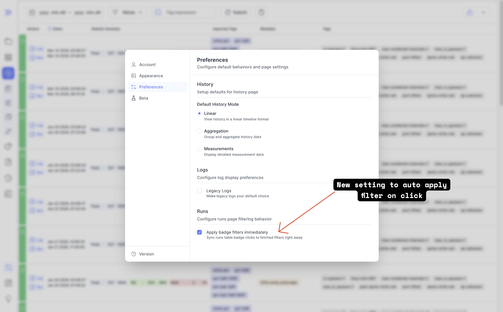
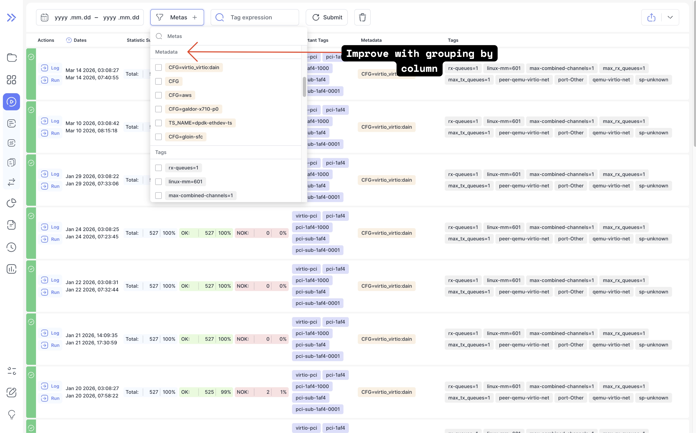
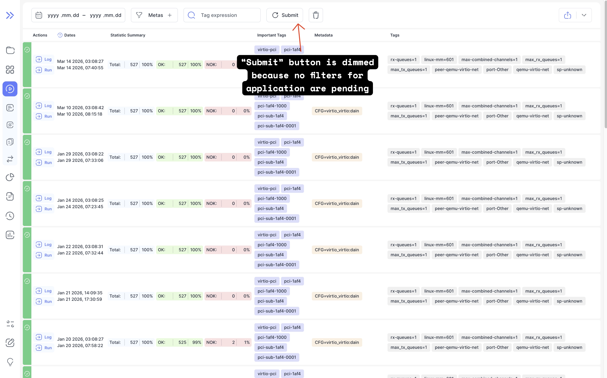
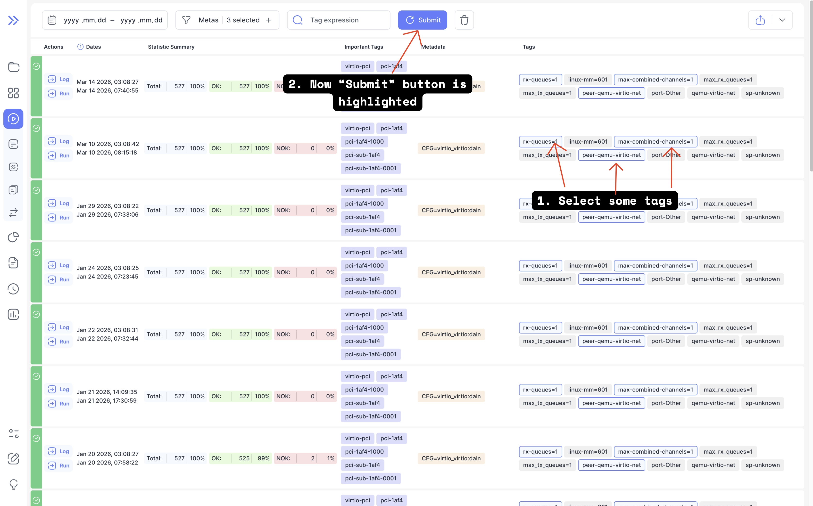
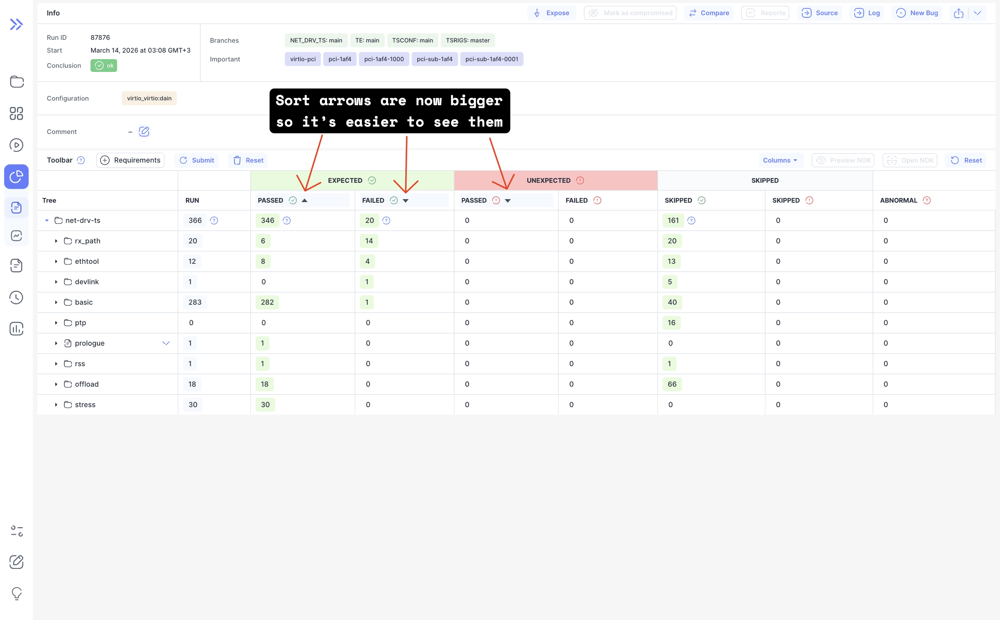
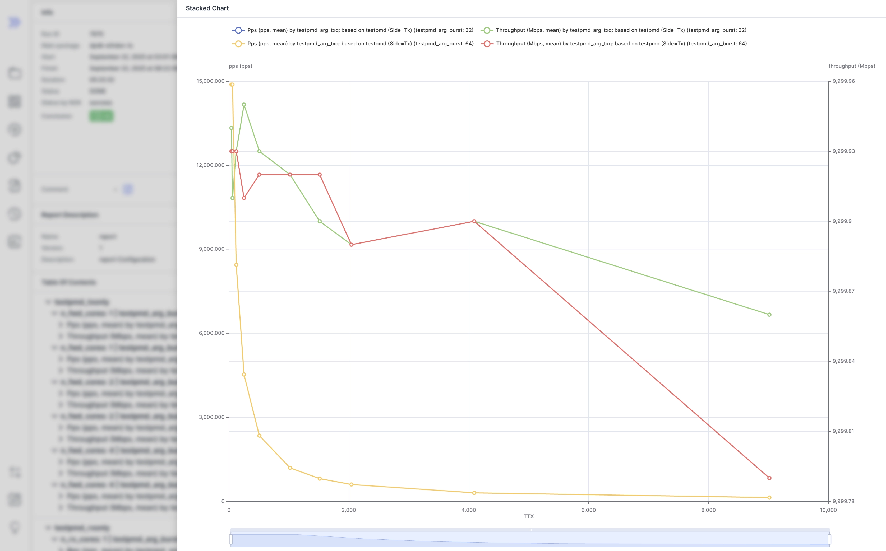
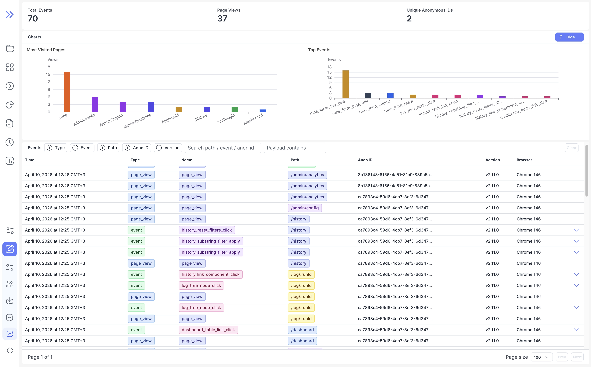

We're excited to announce Bublik v2.11.0! <br />
This release adds optional analytics for admins, along with a smoother run filtering workflow and clearer UI feedback. You can now enable auto-apply for click search, see when run filters have pending changes, work with improved grouped badge inputs on the run page, and view a proper empty state on dashboards with no data. We also polished chart legends, sort indicators, and button transitions across the interface.

### What's New
**New Analytics** <br />
We've added optional analytics so admins can see which pages users visit and which actions they take most often.

**Click Search Auto-Apply Setting** <br />
You can now enable automatic click search application from settings, reducing manual steps when refining results on the run page.

**Clear Feedback for Unapplied Filters** <br />
The run page now highlights the submit button when filters have changed but have not yet been applied, making pending updates immediately visible.

**Improved Badge Input for Run Filters** <br />
Run filters now use an updated badge input component with grouping labels, making complex filter sets easier to scan and manage.

**UI Polish Across Charts and Controls** <br />
This release also improves sort arrow visibility, formats stacked chart legends with line breaks, and removes button flicker when switching variants.

<!--truncate-->

## Highlights

### Faster Click Search Workflow

Click search is now applied automatically, so common run filtering flows require fewer manual actions.
We've introduced toggle (default is enabled) to manage this behaviour.





### Easier-To-Read Run Filters

The run page now gives clearer feedback when filters are waiting to be applied by highlighting the submit button.
At the same time, the refreshed badge input with grouping labels makes filter configuration easier to read and adjust.





### Cleaner Visual Details

Several UI refinements improve day-to-day readability: sort arrows are more visible, and buttons no longer flicker when their variant changes.



### Charts Legend Stack

Now in case of stacked charts we place legend items in a row with wrapping so it's easier to toggle legend items instead of arrows with scroll.



### Analytics Page

:::warning
You must be logged in as admin user to see this page
:::



## Admin Section

For full setup instructions for analytics, see the [Analytics Configuration](/configuration/analytics) documentation.

### Backend Update

1. `cd bublik`
2. `git remote update`
3. `git checkout v2.11.0`
4. `./scripts/deploy --steps general_conf pip_requirements django_settings run_services`

Analytics is disabled by default. To enable it, follow these steps:

1. Enable analytics in the configuration file *bublik/general.conf*: `ANALYTICS_ENABLE="True"`
2. Apply updated Django settings and restart services: `./scripts/deploy --steps django_settings run_services`
3. Activate the virtual environment: `source .env/bin/activate`
4. Run analytics database migrations: `python manage.py migrate analytics --database=analytics`

### Frontend Update

1. Trigger the workflow in your frontend repository
2. Synchronize the mirrors
3. `cd bublik-ui`
4. `git remote update`
5. `git checkout v2.11.0`

### Documentation Update

1. Trigger the workflow in your frontend repository
2. Synchronize the mirrors
3. `cd bublik-docs`
4. `git remote update`
5. `git checkout v2.11.0`

### Docker Instance Update

1. `task backup:create`
2. Open your `.env` file and change `IMAGE_TAG` to `2.11.0`
3. To enable **optional** anonymous analytics, append these variables to your `.env` file:

   ```bash
   ANALYTICS_ENABLED=false # set to true if you want analytics enabled
   ANALYTICS_DB_PATH=/app/bublik/logs/analytics.sqlite3
   ```

4. `task pull`
5. `task up`

## Changelog

### Frontend

#### 🚀 New Feature

* **admin:** add analytics event tracking to admin user page ([6889aff](https://github.com/ts-factory/bublik-ui/commit/6889affad2fcdc6663fa5283b5197d7fbcab2f81))
* **analytics:** add analytics library ([4c13c82](https://github.com/ts-factory/bublik-ui/commit/4c13c82d984bb9d2507e49e7101c3039e4175329))
* **analytics:** add analytics page and route visit tracking ([986e166](https://github.com/ts-factory/bublik-ui/commit/986e166292e2975e1475c3220066a26c84dce892))
* **analytics:** add API endpoints for analytics ([9189d41](https://github.com/ts-factory/bublik-ui/commit/9189d416d23b63efa02c6eb5c74e0045b4fb2c4f))
* **auth:** add analytics event tracking to email page ([fb89921](https://github.com/ts-factory/bublik-ui/commit/fb8992142edf5ce7f1a3ba3acfd4359c7b32c705))
* **config:** add analytics event tracking to configs page ([a26b7e0](https://github.com/ts-factory/bublik-ui/commit/a26b7e042e01201e34262e3b1ce24f204bb0a44e))
* **dashboard:** add analytics event tracking to dashboard page ([1c53ef3](https://github.com/ts-factory/bublik-ui/commit/1c53ef35fb775f32845a5ebb7c5f1fafcf628def))
* **history:** add analytics event tracking to history page ([01fc28a](https://github.com/ts-factory/bublik-ui/commit/01fc28a7088104c7bad6a7250981200919e87e5c))
* **history:** add analytics event tracking to history shortcut links ([4181aab](https://github.com/ts-factory/bublik-ui/commit/4181aabc20130ead56e41fb9a356d8f2aa2ef945))
* **import:** add analytics events tracking to import page ([f5c0069](https://github.com/ts-factory/bublik-ui/commit/f5c0069a7678f2c2f35263e7b63a29927f9a776e))
* **log:** add analytics event tracking to log `pcap` attachment page ([d04c3b4](https://github.com/ts-factory/bublik-ui/commit/d04c3b49937d8e659911424e238c0712bf479918))
* **log:** add analytics event tracking to log page ([2e519b2](https://github.com/ts-factory/bublik-ui/commit/2e519b22683deb8ec4b1ad392a628f49ccb4e591))
* **report:** add analytics event tracking to report page ([6e060c6](https://github.com/ts-factory/bublik-ui/commit/6e060c625ec56e2803b5675204c7e377d2607bbf))
* **result:** add analytics event tracking to result page ([35f60b9](https://github.com/ts-factory/bublik-ui/commit/35f60b94f9dad3b8577f90829d9f72320acfaf34))
* **run,settings:** add settings to auto apply click search ([a88725d](https://github.com/ts-factory/bublik-ui/commit/a88725d02f95902df698a640e1111b2a5c94de63))
* **run:** add analytics event tracking to run page ([0d09675](https://github.com/ts-factory/bublik-ui/commit/0d096759fc6214447ce2f27047358a6002dae711))
* **run:** highlight submit button in case filters are not applied ([2c04b34](https://github.com/ts-factory/bublik-ui/commit/2c04b345414f7c72b1f0d236ecf8630fc3f538aa))
* **runs:** add analytics event tracking to runs page ([a7d910e](https://github.com/ts-factory/bublik-ui/commit/a7d910e3f08881a965375a85004ac818f72f0a12))
* **settings:** add reusable hook for listening for storage events ([4747032](https://github.com/ts-factory/bublik-ui/commit/4747032cf3cb68e517306771a8ec8f6831c61de5))


#### 💅 Polish

* **dashboard,run:** make sort arrow bigger to improve visibility ([c5d1cff](https://github.com/ts-factory/bublik-ui/commit/c5d1cff96841594d21d67d19d409f8580d88ed39))
* **report,history:** [stacked-chart] display legend with line breaks ([f115923](https://github.com/ts-factory/bublik-ui/commit/f115923706aa0b75a3dea28475c0291601e22a43)), closes [#487](https://github.com/ts-factory/bublik-ui/issues/487)


#### 🐛 Bug Fix

* **history:** prevent hover card tags from being cut off ([8a8613e](https://github.com/ts-factory/bublik-ui/commit/8a8613ea3911ce00330a4712f3681b62a5cab385))


#### ♻ Code Refactoring

* **run:** use new badge input component with grouping labels ([bc55e7b](https://github.com/ts-factory/bublik-ui/commit/bc55e7b5831f88b5af5ba632f1224148159a2a84))
* **ui:** improve badge input component for run page ([fc97d97](https://github.com/ts-factory/bublik-ui/commit/fc97d97b2d97b612747e307a326c735f3d781fa1))


#### 📦 Chores

* **runs:** align filter param names with backend changes ([31bda0b](https://github.com/ts-factory/bublik-ui/commit/31bda0bb94836dcd0596402e80a20806961fbc7a))

---

### Backend

#### 🐛 Bug Fix
- **config:** improve API safety by restricting HTTP methods ([da254f9](https://github.com/ts-factory/bublik/commit/da254f9c6663cac88d3a78c5e73935a3d58dddc5))
- **requirements:** fix missing MCP server startup dependencies ([576d56b](https://github.com/ts-factory/bublik/commit/576d56be3c9ffc8808133f3add89fb78583a9418))

#### 🚀 New Feature
- **analytics:** add analytics event ingestion and reporting API ([2e42bb9](https://github.com/ts-factory/bublik/commit/2e42bb971cf6e7db0eeda0b13d41858027aea908))

#### 📦 Chores
- **requirements:** update packages versions to pick up bug fixes ([71d063a](https://github.com/ts-factory/bublik/commit/71d063a38c26ef27c818dcdf47c4bf2d8c5211c3))
- **deploy:** eliminate manual export of analytics settings ([9d4b0ca](https://github.com/ts-factory/bublik/commit/9d4b0ca8afd65b8f8ffc33bb4d285ef12e82c213))

#### ♻️ Code Refactoring
- **server:** mark tab_title_prefix `request` arg as unused ([b48aea1](https://github.com/ts-factory/bublik/commit/b48aea129a194f5b5cf1220e6e5499835175b9dc))
- **runs:** make metadata filtering param name more descriptive ([592bfc2](https://github.com/ts-factory/bublik/commit/592bfc2183a2fad3fbf484edc1c9a337438032f0))

#### 🧹 Cleanup
- **config:** clean up unused configuration filter ([0e115d5](https://github.com/ts-factory/bublik/commit/0e115d57b2fd5750d3302caa4e9d3642952e3cff))
- **deploy:** improve general.conf readability ([03b94a8](https://github.com/ts-factory/bublik/commit/03b94a83af00b5be7b281842d9a1c7cd19c73727))
