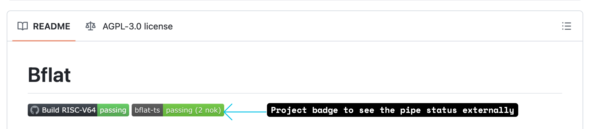
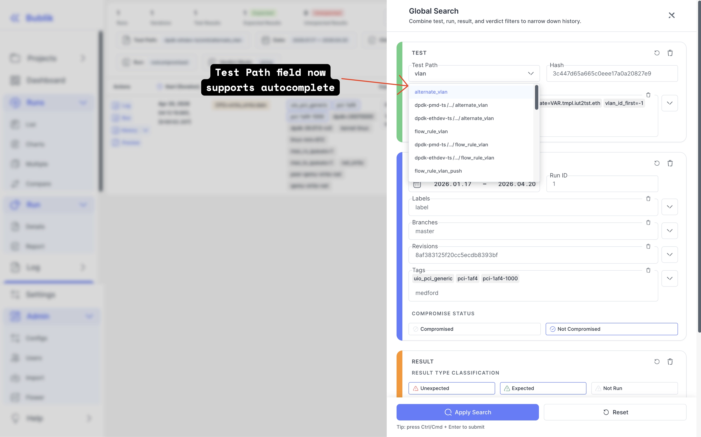
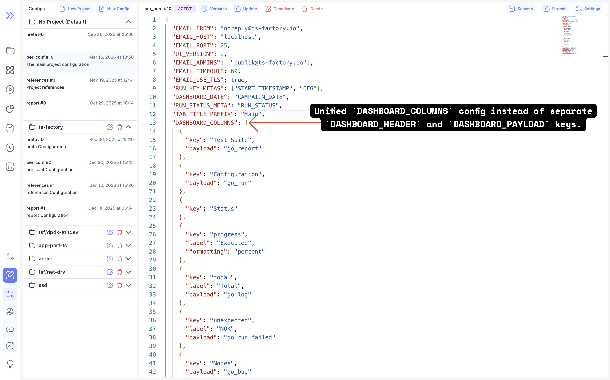
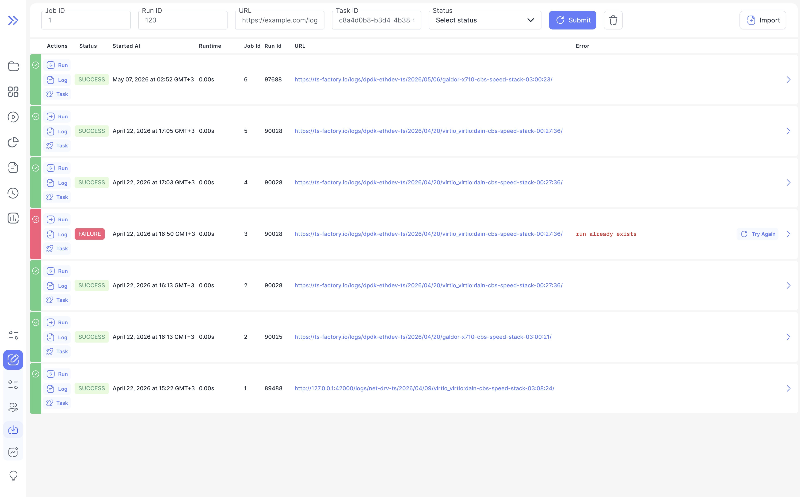

We're excited to announce Bublik v2.12.4! <br />
This release brings live project status badges you can embed in READMEs and dashboards, autocomplete for the "Test Path" field in the history search form, and an improved dashboard column configuration structure in the per-project config. The import workflow has been significantly reworked: runs imports are now tracked as structured jobs with run-specific tasks, making it possible to monitor execution status per job. We also fixed a bug where filtering by test name could return mixed results from different test groups and normalized stacked chart y-axes for multi-axis plots.

### What's New

**Project Status Badges** <br />
Projects now expose an SVG badge endpoint showing the latest run status. Use `GET /api/v2/projects/{id}/badge/` with an optional `metric` parameter to embed live badges in READMEs or dashboards.

**Autocomplete for Test Path Search** <br />
The global search form now provides autocomplete for the "Test Path" field, making it faster to find and filter relevant test results.

**Unified Dashboard Column Configuration** <br />
The per-project configuration structure has changed: `DASHBOARD_HEADER` and `DASHBOARD_PAYLOAD` keys are merged into a single `DASHBOARD_COLUMNS` array. Each column's `key`, `label`, `payload`, and `formatting` are now defined in one place.

**Improved Run and Import API Support** <br />
The run and import pages have been updated to work with the latest backend API changes.

**Chart and Table Improvements** <br />
Stacked chart y-axes are now normalized for multi-axis plots, and the "Objective" column is visible by default on the run page.

<!--truncate-->

## Highlights

### Project Status Badges
Projects now have a built-in SVG badge endpoint reflecting the latest run status. Badges follow the shields.io flat style and can be embedded anywhere that renders images — READMEs, wikis, dashboards.

**Endpoint:** `GET /api/v2/projects/{id}/badge/`

Supported `metric` values: `passed`, `unexpected`, `total`, `rate`, or omit for run conclusion with unexpected count.



### Autocomplete for Test Path Search

The global search form now provides autocomplete for the "Test Path" field, making it faster to find and filter relevant test results.<br />



### Unified Dashboard Column Configuration
The per-project configuration structure has changed: `DASHBOARD_HEADER` and `DASHBOARD_PAYLOAD` are replaced by a single `DASHBOARD_COLUMNS` array where each column is a self-contained object with `key`, `label`, `payload`, and `formatting`. 

:::note
The `go_tree` payload value is renamed to `go_log`.
:::



### Improved Run and Import API Support



## Admin Section

### Backend Update

1. `cd bublik`
2. `git remote update`
3. `git checkout v2.12.4`
4. `./scripts/deploy --steps pip_requirements setup_gunicorn migrate_db per_project_conf run_services`

The run statistics data structure has been updated. Therefore, the run statistics cache must be cleared so that the statistics are rebuilt accordingly:

1. Activate the virtual environment: `source .env/bin/activate`
2. Clear run statistics cache for all runs: `python manage.py run_cache delete -f 2017.01.01 -d stats -d stats_reqs`

### Frontend Update

1. Trigger the workflow in your frontend repository
2. Synchronize the mirrors
3. `cd bublik-ui`
4. `git remote update`
5. `git checkout v2.12.4`

### Documentation Update

1. Trigger the workflow in your frontend repository
2. Synchronize the mirrors
3. `cd bublik-docs`
4. `git remote update`
5. `git checkout v2.12.4`

### Docker Instance Update

```bash
# 1. Backup the current db
task backup:create

# 2. Update the image tag in the .env file
sed -i "s/^IMAGE_TAG=.*/IMAGE_TAG=2.12.4/" .env

# 3. Pull the latest docker image
task pull

# 4. Start the docker container
task up

# 5. Enter the container shell
task shell

# 6. Reformat configs
python manage.py reformat_configs

# 7. Delete old cache data
python manage.py run_cache delete -f 2017.01.01 -d stats -d stats_reqs
```

## Changelog

### Frontend

#### 🚀 New Feature

* **history:** add autocomplete to "Test Path" global search form field ([ae3d3d8](https://github.com/ts-factory/bublik-ui/commit/ae3d3d8c351be852e0b737d3b49024137a9491d6))
* **router:** send current URL information to parent window ([5eab15d](https://github.com/ts-factory/bublik-ui/commit/5eab15d2b25dd5a9604904d1ca37a54671191862))
* **hooks:** add hotkey hook to handle different locales ([d873865](https://github.com/ts-factory/bublik-ui/commit/d8738655b1f54f24d0dd1de5cd9c332d3fa81fcf))
* **import:** add reload indicator to the header ([e87e112](https://github.com/ts-factory/bublik-ui/commit/e87e1122adb81d3d75b739d09c1510a62d0bcba5))
* **report:** add button shorcuts for report navigation ([075f008](https://github.com/ts-factory/bublik-ui/commit/075f008059e9d954a229f9f02dcf3df03f5c67b2))
* **ui:** add kdb ui component for hinting users about shortcuts ([33c1d1a](https://github.com/ts-factory/bublik-ui/commit/33c1d1a98b3130c66458e00c0d306c2fd57ee094))


#### 🐛 Bug Fix

* **history:** preserve verdict lookup type when clicking reset verdict button ([09d78f9](https://github.com/ts-factory/bublik-ui/commit/09d78f9e706fe3ea1615bc232741b9da138c6f1b))
* **history:** support quoted badge values containing commas ([200e2a6](https://github.com/ts-factory/bublik-ui/commit/200e2a6d1e26b877f74a346d405cb982c38df02b))
* **dashboard:** fix analytics dashboard page view tracking ([94d7f42](https://github.com/ts-factory/bublik-ui/commit/94d7f429d1425986080415ee2d88ab3e2ba4ef1f))
* **import:** remove duplicated root prefix in import run requests ([27dd360](https://github.com/ts-factory/bublik-ui/commit/27dd360f13ec9bf9033e02703b8517f82d383322))
* **import:** [form] show validation errors from API ([58025d4](https://github.com/ts-factory/bublik-ui/commit/58025d43ab7d7b2acb829167af940623c4dab0da))
* **import:** show error properly for "Try Again" action ([dcb7bc5](https://github.com/ts-factory/bublik-ui/commit/dcb7bc5357b4f30dfc8dc6f1aa8bbb6a3f0a1272))
* **log:** fix duplicate log JSON requests ([36990bd](https://github.com/ts-factory/bublik-ui/commit/36990bd0aafcaeac269c6ec1ccebf15e210d6a0b))
* **run:** update run results API filtering to use `exec_seqno` ([19a373c](https://github.com/ts-factory/bublik-ui/commit/19a373cf8ba63bd36ced9f30e3ced96b551b65da))

#### ♻️ Code Refactoring

* **import:** adapt import table to new API changes ([ba7d169](https://github.com/ts-factory/bublik-ui/commit/ba7d169153c8a6629aef7a6ae03014c867963124))
* **run:** adapt for new api changes ([139001e](https://github.com/ts-factory/bublik-ui/commit/139001ef3b35bf9a7ff1beea617d7aace699a31a))
* **dashboard:** move analytics route tracker for better organization ([f11e5fe](https://github.com/ts-factory/bublik-ui/commit/f11e5fe62f2a9eed15040eaea44ebea506a0f8ac))
* **history:** [form] improve test path input with proper path handling ([dcb9fe1](https://github.com/ts-factory/bublik-ui/commit/dcb9fe1ce9166fbcf5828aea7b9f9caf6d3ad1f2))
* **import:** [form] display loading state in import form properly ([f80906a](https://github.com/ts-factory/bublik-ui/commit/f80906a29cc33de27fee70e1679ef7e8c62ce4a3))
* **log:** deprecate `formatted` field in JSON log ([2f25dce](https://github.com/ts-factory/bublik-ui/commit/2f25dcefae2a1c85e1cef8225ff6ad9ddaf6a2f7))


#### 📦 Chores

* **measurements:** normalize stacked chart y-axes for multi-axis plots ([8933fd8](https://github.com/ts-factory/bublik-ui/commit/8933fd83ce450fd7608d23b9431bb01558659763)), closes [#532](https://github.com/ts-factory/bublik-ui/issues/532)
* **run:** make "Objective" column visible by default ([e1b1285](https://github.com/ts-factory/bublik-ui/commit/e1b1285548d20bf3c94d0e734e6fab0134ae1c81))
* **analytics:** remove logging of all events from client side ([dfb738c](https://github.com/ts-factory/bublik-ui/commit/dfb738c2f981e4a959e4cbac0cc2c31f74035659))


### 💅 Polish

* **history:** [form] align close button horizontally ([defe631](https://github.com/ts-factory/bublik-ui/commit/defe6319d0ba6e6cc0b70367989c8a8251265132))
* **import:** improve import events table layout ([ba0507f](https://github.com/ts-factory/bublik-ui/commit/ba0507fb629563aadec8ce61044dd3c621aed340))
* **import:** [table] fix "Runtime" and "Job Id" column layout ([98213f9](https://github.com/ts-factory/bublik-ui/commit/98213f9412aa9c695379fa51f5ee676bd64f4245))
* **import:** move job id in line with status for better readability ([3c3d57b](https://github.com/ts-factory/bublik-ui/commit/3c3d57b1018b8143232cc36eb687ca29f8c271dc))
* **import:** [table] display pagination at the bottom always visible ([2c7ba99](https://github.com/ts-factory/bublik-ui/commit/2c7ba9978a17ee328970dd53dce80545ae56babf))
* **report:** add arrow for "Reports" dropdown menu ([46d397b](https://github.com/ts-factory/bublik-ui/commit/46d397b09e62ffae6cbbe90c2039790d326be11a))
* **ui:** [pagination] add new style with bordered button ([5505a83](https://github.com/ts-factory/bublik-ui/commit/5505a83b82d78dfe57e9be8a87ab48a167221915))

---

### Backend

#### 🐛 Bug Fix

- **pagination:** fix OpenAPI schema mismatch for paginated responses ([e82a489](https://github.com/ts-factory/bublik/commit/e82a489ce824c7776142c4dcced6f2421d57793c))
- **importruns:** ensure failed tasks are marked correctly ([f18e545](https://github.com/ts-factory/bublik/commit/f18e545f3e2a973fc9806560254413067b4e8ea9))
- **logging:** fix incorrect log routing in importruns ([0597a29](https://github.com/ts-factory/bublik/commit/0597a29bbabff114133656916198f1473b04f64b))
- **results:** fix same-name test results retrieval via start result ID filter ([abfa3c4](https://github.com/ts-factory/bublik/commit/abfa3c423a987fb4eb0e293c1131f8b2aa640817))
- **run:** fix missing run stats test comments ([895069e](https://github.com/ts-factory/bublik/commit/895069ee3794aacd6fb97019365d65b96c67116d))
- **results:** fix broken `result`, `result_properties`, `requirements` filters ([facfc8e](https://github.com/ts-factory/bublik/commit/facfc8e2a5e46cccefa26a3b649f7bd5fef40b82))
- **management:** fix per_conf migration when dashboard keys are missing ([f8a8221](https://github.com/ts-factory/bublik/commit/f8a82213b62b4b1c0df4c4a88a51835a6b79d61b))
- **management:** sync dashboard sort keys with column keys during per_conf migration ([b1465f4](https://github.com/ts-factory/bublik/commit/b1465f419a7acffa433c9fdd5c0da93b9a64bb13))
- **serializers:** remove access to non-existent attribute ([8fa13de](https://github.com/ts-factory/bublik/commit/8fa13de39f10143aeb38b9fe9b53eed40991a387))
- **importruns:** fix possible hanging when an arbitrary URL is provided ([ac0ef64](https://github.com/ts-factory/bublik/commit/ac0ef6409267b35bfc6cf89c9f1d2fe952ddfad6))
- **importruns:** fix authentication failures when accessing the logs server ([9a04cc5](https://github.com/ts-factory/bublik/commit/9a04cc50361d4264c7a033fed65c467b3ef5abd9))
- **run stats:** fix incorrect filtering when retrieving test iteration results ([9a46e1a](https://github.com/ts-factory/bublik/commit/9a46e1a7c03d679f7c66725e39b1828052e504fc))

#### 🚀 New Feature
- **api:** add project badges to see the pipe status externally ([3bd4ea9](https://github.com/ts-factory/bublik/commit/3bd4ea9f49b84fbf75594403aaa896e8800c15b4))
- **history:** add test search options endpoint ([841b553](https://github.com/ts-factory/bublik/commit/841b553d1e7cbb30e87a0ed13740ce63269778af))
- **cache:** add tests cache ([46235ed](https://github.com/ts-factory/bublik/commit/46235ed9398b1373011e7e1fe8837de13a905f21))
- **importruns:** add job and task models with relations to track executions ([2140465](https://github.com/ts-factory/bublik/commit/2140465026b234c1af684dd96733d685e3d41032))

#### ⚡ Performance Improvements
- **models:** speed up results filtering by execution sequence number ([863068e](https://github.com/ts-factory/bublik/commit/863068e14097a710efec54523b7f722f5017e067))

#### 📦 Chores
- **management:** enable reformat to merge dashboard column settings ([858c32a](https://github.com/ts-factory/bublik/commit/858c32a12e69099c589b1a1e731f7e98b02b681c))
- **api:** define error response serializers to ensure OpenAPI schema matches runtime ([dd7172b](https://github.com/ts-factory/bublik/commit/dd7172b6ecdcc53c93e7fcadcdb41c3aecc42c1b))
- **importruns:** enforce mandatory task ID across the import process ([df90506](https://github.com/ts-factory/bublik/commit/df90506c8169f598191f763743a8018db293c64d))
- **importruns:** ensure reliable task execution during worker restarts ([5cc606f](https://github.com/ts-factory/bublik/commit/5cc606f1560c72e2bfa8e910dbff408e9df93ee8))
- **jobtasks:** align OpenAPI schema with actual runtime responses ([73c188d](https://github.com/ts-factory/bublik/commit/73c188d7e66f12cf4a4533fa0aeba15925a68227))
- **run stats:** improve clarity and consistency of run stats data fields ([d1a8254](https://github.com/ts-factory/bublik/commit/d1a82541357e326c636a92458805d0475c7d41cd))
- **requirements:** update packages versions to pick up bug fixes ([7f3eaa9](https://github.com/ts-factory/bublik/commit/7f3eaa98003a280610346410af43ad0ea3a7589d))
- **management:** document dashboard settings merge reformat step ([a5df64f](https://github.com/ts-factory/bublik/commit/a5df64f298c4b9dc3b8cd090358db9447308621b))
- **requirements:** update packages versions to pick up bug fixes ([fa32b5c](https://github.com/ts-factory/bublik/commit/fa32b5c82136cca25b7abe515738a45ea616e9a1))
- **exceptions:** stop hiding additional error context from logs ([6fba90d](https://github.com/ts-factory/bublik/commit/6fba90d49b704126147febe5913b36708c6982f3))

#### ♻️ Code Refactoring
- **config:** improve dashboard column configuration by consolidating settings ([5a8946e](https://github.com/ts-factory/bublik/commit/5a8946e2690ba232046b871db775a3eb7d1ebae0))
- **dashboard:** adapt service to handle consolidated column configuration ([cd854f3](https://github.com/ts-factory/bublik/commit/cd854f36064d63db3c7b4488b5b371b77c7ca08e))
- **dashboard:** use config schema as source of truth for payload handlers ([18699e1](https://github.com/ts-factory/bublik/commit/18699e1b3c0d0d6d327b5b14e5c4af14bd648a89))
- **importruns:** clarify API logic by adjusting parameter handling ([f4657db](https://github.com/ts-factory/bublik/commit/f4657db38f83408a52d6e9ed2593ce6c17c0f8ed))
- **importruns:** improve consistency by unifying parameter names ([6fb728a](https://github.com/ts-factory/bublik/commit/6fb728a1ba5d4880f08fe54ace56f4727dccbb7c))
- **importruns:** move runtime helper to utils for helpers centralization ([9add310](https://github.com/ts-factory/bublik/commit/9add310fad3598b71a181d7100ec9d2a13c0cb69))
- **importruns:** extract run path traversal logic to separate concerns ([ae4f58a](https://github.com/ts-factory/bublik/commit/ae4f58a4c0f17a6c4b6b9e0e3017f7b54f6db2e3))
- **importruns:** extract import logic to separate concerns ([7c01e99](https://github.com/ts-factory/bublik/commit/7c01e99d47bba6fd2507bbbfe2c42c0893e384ad))
- **importruns:** extract run scheduling logic to separate concerns ([ec7d642](https://github.com/ts-factory/bublik/commit/ec7d642388f020d551c41a53e9b40a49d428a744))
- **importruns:** remove CLI dependency by using direct scheduling ([655a679](https://github.com/ts-factory/bublik/commit/655a679fb4c2481f30c4018be4019b456457aff8))
- **importruns:** make parameter validation independent from CLI ([52753c4](https://github.com/ts-factory/bublik/commit/52753c4ad621730a2559d6a5a522e3ad3ee7580a))
- **importruns:** enforce single API entry point for imports ([6ee1356](https://github.com/ts-factory/bublik/commit/6ee135624ab269629f6c72300dcd382360f023a5))
- **importruns:** centralize parameter normalization ([8429d33](https://github.com/ts-factory/bublik/commit/8429d33d357514e2b9c9a5c9783a642384d8ecbb))
- **importruns:** make Celery tasks run-specific ([267bff9](https://github.com/ts-factory/bublik/commit/267bff9328f4b5625b18a60114ae2cdcbc40e203))
- **importruns:** integrate job and task entities into import workflow ([9b7513a](https://github.com/ts-factory/bublik/commit/9b7513a897bc77caead9360b7198e1e70e028489))
- **jobtasks:** add task execution service for separation of concerns ([dbe5f0c](https://github.com/ts-factory/bublik/commit/dbe5f0c43daf3f89e6989119abfb161637add753))
- **jobtasks:** improve session import tracking using job/task models ([3c5682f](https://github.com/ts-factory/bublik/commit/3c5682fd0e5f2696f3be94463b8bf966b72b53f6))
- **importruns:** improve parameter validation by introducing a serializer ([777e47c](https://github.com/ts-factory/bublik/commit/777e47c24add3260dcb63e71bde8fc4efd3717e2))

#### 🧹 Cleanup
- **utils:** remove unused argument to avoid variable shadowing ([d956755](https://github.com/ts-factory/bublik/commit/d956755e3ddf3f2d9901ba1da99e588077455ed9))
- **logging:** clean up unused logger in importruns ([09eb40f](https://github.com/ts-factory/bublik/commit/09eb40f5b04c66a122319f95453688dbb33a2c73))
- **checks:** remove unused message helper ([af736a1](https://github.com/ts-factory/bublik/commit/af736a1ae55bf63b4a37df2aa496116346446ee0))
- **tasks:** explicit task ID in Celery event handlers ([ecf2c2c](https://github.com/ts-factory/bublik/commit/ecf2c2c6b2fdf7dd7466a675ffee62f2f0557b6e))
- **tasks:** explicit run source URL in Celery event handlers ([8311833](https://github.com/ts-factory/bublik/commit/83118336f7e7982fe1773d0b01473f24683e31a9))
- **tasks:** make Celery events error message safer ([ae0dbf1](https://github.com/ts-factory/bublik/commit/ae0dbf104991e4f2b8a8b8f20a1a473e9fc525b5))
- **importruns:** make task argument order more logical ([2a681a8](https://github.com/ts-factory/bublik/commit/2a681a8c64288da586c0bc1a4ab5c0951433a0fd))
- **importruns:** remove duplicated exception logging ([701baa3](https://github.com/ts-factory/bublik/commit/701baa3b9c6eebff82f3d56e57781b6ecaea76ab))
- **importruns:** unify import exception handling ([09ce9d5](https://github.com/ts-factory/bublik/commit/09ce9d533b5eabcdc883b90fb03bd6269fb8405a))
- **importruns:** improve run source URL naming to reduce confusion ([17589f4](https://github.com/ts-factory/bublik/commit/17589f449a5864c071a5c7867e2fd24215641714))
- **logging:** remove error logging duplicated by exception handler ([7d051fe](https://github.com/ts-factory/bublik/commit/7d051fe4180fb5815ee8b3510968686a30e48cfb))
- **importruns:** remove unnecessary intermediate variable ([190d8cf](https://github.com/ts-factory/bublik/commit/190d8cf41a0d4a1d397b323a968574317c9fc804))
