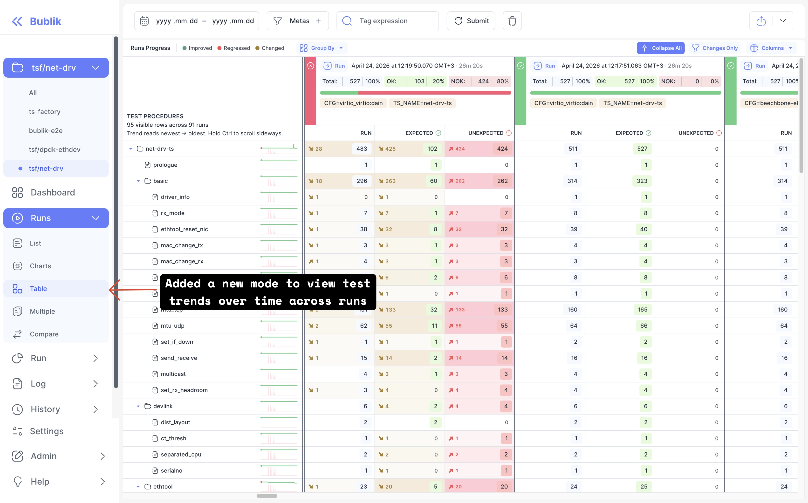

We're excited to announce Bublik v2.15.0! <br />
This release introduces a new **Runs Progress** mode that adds a dedicated table view, navigation entry, and mode picker option for tracking how runs progress over time, backed by new runs-progress API endpoints. We've also made the config editor more reliable, false MODIFIED badges are gone, and stale drafts no longer shadow the server config after edits.

### What's New

**Runs Progress Mode** <br />
A new progress mode is available from the runs navigation and mode picker, with a dedicated table view for tracking run progress, backed by new runs-progress endpoints.

**Config Editor Reliability Fixes** <br />
Global configs now remain visible when a project filter is active, the false MODIFIED badge no longer appears, and stale drafts no longer shadow the server config after edits.

<!--truncate-->

## Highlights

### Runs Progress Mode

A new **Runs Progress** mode joins the existing run views. It adds a progress entry to the runs navigation and mode picker, along with a dedicated table view for tracking how runs progress.



## Admin Section

### Backend Update

1. `cd bublik`
2. `git remote update`
3. `git checkout v2.15.0`
4. `./scripts/deploy --steps run_services`

### Frontend Update

1. Trigger the workflow in your frontend repository
2. Synchronize the mirrors
3. `cd bublik-ui`
4. `git remote update`
5. `git checkout v2.15.0`

### Documentation Update

1. Trigger the workflow in your frontend repository
2. Synchronize the mirrors
3. `cd bublik-docs`
4. `git remote update`
5. `git checkout v2.15.0`

### Docker Instance Update

```bash
# 1. Backup the current db
task backup:create

# 2. Update the image tag in the .env file
sed -i "s/^IMAGE_TAG=.*/IMAGE_TAG=2.15.0/" .env

# 3. Pull the latest docker image
task pull

# 4. Start the docker container
task up
```

## Changelog

### Frontend

#### 🐛 Bug Fix

* **config:** show global configs when a project filter is active ([e078739](https://github.com/ts-factory/bublik-ui/commit/e07873984fb9dccb1c850509ce231c8899fce243))
* **config:** stop showing a false MODIFIED badge ([0215ece](https://github.com/ts-factory/bublik-ui/commit/0215ece22961e47d99fa3a4bcaf9a377d3844981))
* **config:** stop stale drafts shadowing server config after edits ([91b00aa](https://github.com/ts-factory/bublik-ui/commit/91b00aae2916a8004d90b6a0fd46b54f846af743))
* **run:** prevent column visibility item layout shifts on toggle ([0531ad3](https://github.com/ts-factory/bublik-ui/commit/0531ad3ec6faf04763f8d558ff2066c4b405940d))

#### 🚀 New Feature

* **router:** carry a result filter on run links ([a8a46fa](https://github.com/ts-factory/bublik-ui/commit/a8a46fa401c880c5a987f96396f3143c7c963a56))
* **run:** add Expected column and test comments, drop Objective/Notes ([057db96](https://github.com/ts-factory/bublik-ui/commit/057db96e0e9ccd42eed7244218110ebe14f43be3))
* **run:** add runs-progress run endpoints ([d71fedf](https://github.com/ts-factory/bublik-ui/commit/d71fedfe1778edd2e218e24d6717c42931eed279))
* **runs:** add new progress mode into nav and mode picker ([c5ab0fb](https://github.com/ts-factory/bublik-ui/commit/c5ab0fbe2389ba8a237bd41fe4c13684ff62735d))
* **runs:** add runs progress table mode ([1d6793d](https://github.com/ts-factory/bublik-ui/commit/1d6793dcfd9c7f80325f3a3a47f26fa1a6d1ca98))
* **ui:** support column checkmark and expander-less tree node ([9060be6](https://github.com/ts-factory/bublik-ui/commit/9060be6eb27cd92aa8955c04a336b75ae3c5a04c))

#### ♻ Code Refactoring

* **configs:** tidy draft-persistence effects in the editor ([851e312](https://github.com/ts-factory/bublik-ui/commit/851e31239a3a2d6b45b853bc3985b112f193f37c))
