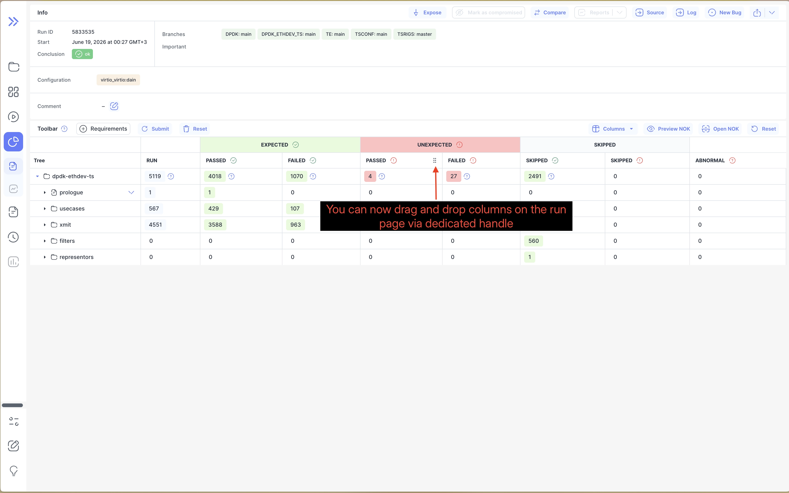

We're excited to announce Bublik v2.17.0! <br />
This release adds **drag-and-drop column reordering** to run tables, improves progress loading by fetching runs in batches as needed, and extends MI log charts with support for the new series aggregation type. It also brings clearer labels and placeholders to the history form.

### What's New

**Reorder Runs Table Columns** <br />
Drag column headers into the order that works best for you. Your layout is preserved per project and can be shared through the page URL.

**Faster Progress Loading** <br />
Progress runs are now loaded in batches of 50 as you navigate through the table, replacing the previous 200-run limit.

**New MI Log Aggregation** <br />
MI log charts now support series entries containing multiple values, including charts that use automatic sequence numbers.

<!--truncate-->

## Highlights

### Reorder Runs Table Columns

Run table columns can now be reordered directly from their headers. Drag an individual column or move a grouped header as one block; the tree column remains fixed at the start of the table. Your preferred order is saved per project, reflected in the URL for sharing, and can be restored with the table's **Reset** action.



## Admin Section

### Backend Update

1. `cd bublik`
2. `git remote update`
3. `git checkout v2.15.1`
4. `./scripts/deploy --steps run_services`

### Frontend Update

1. Trigger the workflow in your frontend repository
2. Synchronize the mirrors
3. `cd bublik-ui`
4. `git remote update`
5. `git checkout v2.17.0`

### Documentation Update

1. Trigger the workflow in your frontend repository
2. Synchronize the mirrors
3. `cd bublik-docs`
4. `git remote update`
5. `git checkout v2.17.0`

### Docker Instance Update

```bash
# 1. Backup the current db
task backup:create

# 2. Update the image tag in the .env file
sed -i "s/^IMAGE_TAG=.*/IMAGE_TAG=2.17.0/" .env

# 3. Pull the latest docker image
task pull

# 4. Start the docker container
task up
```

## Changelog

### Frontend

#### 🚀 New Feature

* **log:** support new aggregation type in MI logs ([ae42f7a](https://github.com/ts-factory/bublik-ui/commit/ae42f7ac757e60b4416f21bf0d2e83b6ea20d214))
* **run:** [table] add ability to reorder columns by dragging them ([ffa946c](https://github.com/ts-factory/bublik-ui/commit/ffa946cc7a7865fc5aafd13f60a6bba335ba6173))
* **runs:** [progress] lazy load progress runs in batches of 50 ([92d2306](https://github.com/ts-factory/bublik-ui/commit/92d2306c73161592a0bed691186875c8128a42c9))

#### 💅 Polish

* **history:** [form] make input label bolder ([0db1f7b](https://github.com/ts-factory/bublik-ui/commit/0db1f7b4789886e5635af9c80f2349f9bdd2bc66))
* **history:** [form] make inputs placeholders to use `#ccc` color ([bc72565](https://github.com/ts-factory/bublik-ui/commit/bc7256581aea0ec6072a1e558816f1078591bb0e))

#### 🐛 Bug Fix

* **log:** render new series aggregation on auto-seqno MI charts ([99fec0b](https://github.com/ts-factory/bublik-ui/commit/99fec0b7eb20bbc4ae2ac12c6bf01c6126a721d3))

---

### Backend
