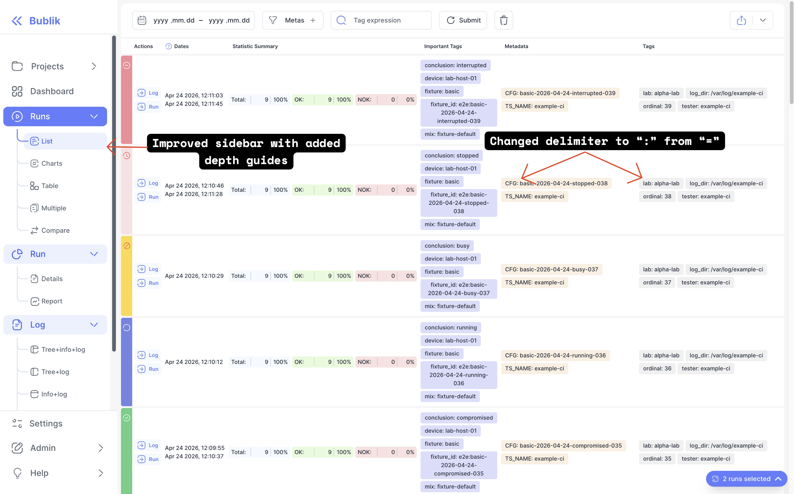

We're excited to announce Bublik v2.16.0-rc.0! <br />
This release brings an **improved sidebar** built on a new sidebar-nav library, with per-feature navigation items, guides and dialogs, and sidebar URL state that persists per feature. We've also changed the default key-value **delimiter to ": "** instead of "=", and wired the configured delimiter consistently into global search and run queries.

### What's New

**Improved Sidebar** <br />
The app sidebar is now built from per-feature navigation items on top of a new sidebar-nav library and primitives. It gains guides and remembers its URL state per feature.

**":" as Default Delimiter** <br />
The default key-value delimiter is now ": " instead of "=". The configured delimiter is applied consistently across global search badge fields and run data queries.

<!--truncate-->

## Highlights

### Improved Sidebar

The app sidebar has been rebuilt on a new **sidebar-nav** library and primitives. Each feature now contributes its own navigation items, the sidebar hosts guides and dialogs, and its URL state is persisted per feature — so returning to a section brings you back to where you left off.



## Admin Section

### Backend Update

1. `cd bublik`
2. `git remote update`
3. `git checkout v2.15.1`
4. `./scripts/deploy --steps run_services`

### Frontend Update

1. Trigger the workflow in your frontend repository
2. Synchronize the mirrors
3. `cd bublik-ui`
4. `git remote update`
5. `git checkout v2.16.0-rc.0`

### Documentation Update

1. Trigger the workflow in your frontend repository
2. Synchronize the mirrors
3. `cd bublik-docs`
4. `git remote update`
5. `git checkout v2.16.0-rc.0`

### Docker Instance Update

```bash
# 1. Backup the current db
task backup:create

# 2. Update the image tag in the .env file
sed -i "s/^IMAGE_TAG=.*/IMAGE_TAG=2.16.0-rc.0/" .env

# 3. Pull the latest docker image
task pull

# 4. Start the docker container
task up
```

## Changelog

### Frontend

#### 🚀 New Feature

* **sidebar:** add sidebar-nav library and primitives ([d3af38e](https://github.com/ts-factory/bublik-ui/commit/d3af38e03ff073a4c8882d40ac37739fd939a174))
* **sidebar:** persist per-feature sidebar URL state ([210feea](https://github.com/ts-factory/bublik-ui/commit/210feea0ccee03ded234e8e12d2aecb8fb50da39))
* **sidebar:** sidebar guides and dialogs ([c2682d6](https://github.com/ts-factory/bublik-ui/commit/c2682d66908aaf48773d4a37702a3c0f94ee7927))
* **ui:** shared selection popover ([f13b0b3](https://github.com/ts-factory/bublik-ui/commit/f13b0b38238925a5011db2e9f60f376f8e5a7c3a))


#### 💅 Polish

* change default delimeter to be ": " instead of "=" ([90f54f6](https://github.com/ts-factory/bublik-ui/commit/90f54f6d04f39b86ead22bbb881c7edb9b5a957c))


#### 🐛 Bug Fix

* **history:** wire key-value delimiters into global search BadgeFields ([9a7cbb6](https://github.com/ts-factory/bublik-ui/commit/9a7cbb6679730ae2eb1136599bdfaa57f8a7d5a4))
* **runs:** use config.queryDelimiter for runData query split/join ([893daa4](https://github.com/ts-factory/bublik-ui/commit/893daa44dd15d5ac31ffed58c43718e6d26be8aa))


#### ♻ Code Refactoring

* **sidebar:** build app sidebar from per-feature nav items ([2f278f5](https://github.com/ts-factory/bublik-ui/commit/2f278f597ace30c8a9b13c3326b89fdd7abc9589))
