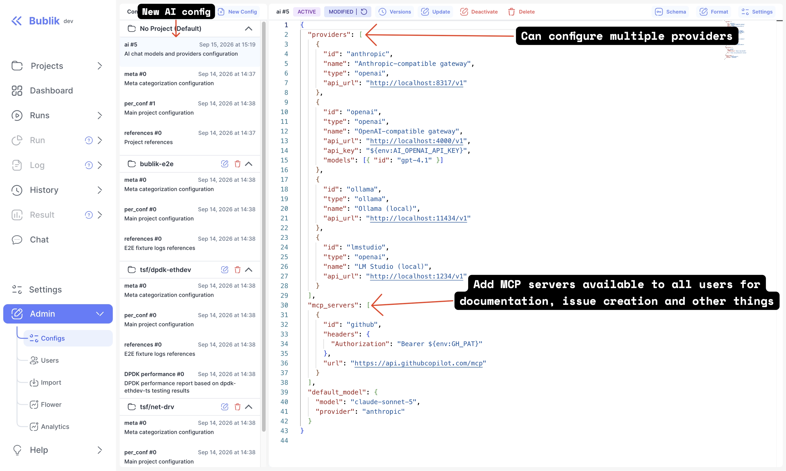
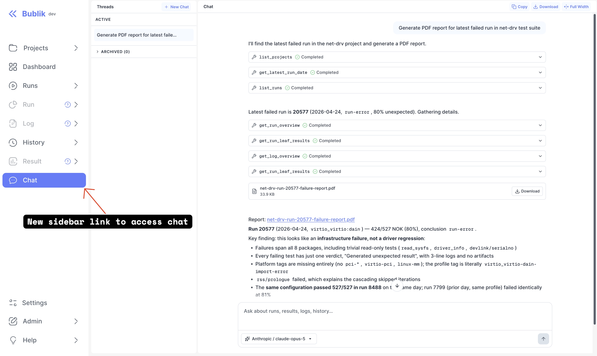

We're excited to announce Bublik v2.18.1! <br />
The headline of this release is the **AI assistant** — a chat built into Bublik
that can investigate runs, results, logs, history and dashboards for you, with
model selection, streaming responses, persistent threads and downloadable
generated files.

### What's New

**AI Chat** <br />
A new Chat page talks to the model provider you configure, calls Bublik's own
tools to answer questions about your test data, and keeps each conversation as a
thread you can come back to. Disabled by default — an administrator turns it on.

<!--truncate-->

## Highlights

### AI Chat

Bublik now ships an AI assistant. It answers questions about runs, results,
logs, history, dashboards, projects and reports by calling the same data
services as Bublik's MCP server — in-process, so the standalone `mcp` service
does not need to be running.

What it does:

- **Model selection.** Configure one or more providers — OpenAI, Anthropic,
  Google, a gateway, or a local runtime such as Ollama or LM Studio — and pick a
  model per conversation.
- **Streaming responses**, with reasoning and tool calls rendered as they
  arrive.
- **Generated files.** Ask for a PDF, DOCX, XLSX, CSV, Markdown, HTML, JSON or
  text file and download it from the thread.





Chat is **disabled by default**. See the [AI Chat documentation](/configuration/chat)
for what it is, and [AI Chat Setup](/configuration/chat/setup) for the
step-by-step procedure on both Docker and `scripts/deploy` installations.

:::note Your test data reaches the model provider

Prompts, model responses, tool arguments and tool results — which include test
logs and metadata — are sent to whichever provider you configure. Review the
provider's privacy and retention terms before enabling chat for sensitive data.

:::

### Smaller Improvements

- The **report header** with links to Run, Log and Source is now sticky.
- The collapsed **run header** shows the run duration.
- The **sidebar** displays version information next to the "Bublik" label.
- **History** now defaults to the latest three months.
- Truncated dashboard text cells show a native tooltip.
- Runs support the `UNSPEC` and `EMPTY` result statuses, and run diff propagates
  deep child changes up to parent packages.

## Admin Section

### Backend Update

:::warning
The `nginx_conf` and `run_side_servers` deployment steps require root rights. If you don't have root access, you must manually update the Nginx configuration using `bublik/templates/nginx.bublik.template` and reload Nginx.
:::

1. `cd bublik`
2. `git remote update`
3. `git checkout v2.18.1`
4. `./scripts/deploy --steps general_conf pip_requirements django_settings celery_service flower_service mcp_service setup_gunicorn nginx_conf migrate_db run_side_servers run_services`

AI Chat is disabled by default. For instructions on enabling and configuring it, see [Setting Up AI Chat](/configuration/chat/setup).

### Frontend Update

1. Trigger the workflow in your frontend repository
2. Synchronize the mirrors
3. `cd bublik-ui`
4. `git remote update`
5. `git checkout v2.18.1`

### Documentation Update

1. Trigger the workflow in your frontend repository
2. Synchronize the mirrors
3. `cd bublik-docs`
4. `git remote update`
5. `git checkout v2.18.1`

### Docker Instance Update

```bash
# 1. Backup the current db
task backup:create

# 2. Update the image tag in the .env file
sed -i "s/^IMAGE_TAG=.*/IMAGE_TAG=2.18.1/" .env

# 3. Pull the latest docker image
task pull

# 4. Start the docker container
task up
```

To enable AI chat on Docker, add `AI_CHAT_ENABLED=true` and your provider key to
the deployment `.env`, then `task up`. Object storage is already the default
there — compose ships SeaweedFS. See
[AI Chat Setup](/configuration/chat/setup) for the full procedure.

## Changelog

### Frontend

#### 🚀 New Feature

* **chat:** add AI assistant with model selection and persistent threads ([3ff9c3b](https://github.com/ts-factory/bublik-ui/commit/3ff9c3b88e7f5e6c1b043fac38f5259d0e36b7f8))
* **chat:** add streaming and rich response rendering ([f28f4e4](https://github.com/ts-factory/bublik-ui/commit/f28f4e4bafd9e8a2cf193d86e832f3e50be64149))
* **chat:** align AI models, reasoning, and generated files ([422685c](https://github.com/ts-factory/bublik-ui/commit/422685ca8a3d1bbf8079cebab75f5ed482cfcfd0))
* **chat:** gate sidebar navigation ([81a72ce](https://github.com/ts-factory/bublik-ui/commit/81a72cebd6b0cfde6ec924db573599c108faca2c))
* **chat:** support cancellation and context compaction ([99e2784](https://github.com/ts-factory/bublik-ui/commit/99e2784a3b89bbdd405847a784bef8f3866db037))
* **dashboard:** show native tooltip on truncated text cells ([e488537](https://github.com/ts-factory/bublik-ui/commit/e48853779de4cc2456e83e4e5ba48a48f6893bf3))
* **log:** render scenario step outline in test meta ([cf6b24a](https://github.com/ts-factory/bublik-ui/commit/cf6b24a3b97fc7b68a13e28cbbbd8b1e4917c417))
* **log:** show test parameter descriptions in parameters table ([d742903](https://github.com/ts-factory/bublik-ui/commit/d74290338cdd68d8fc7718c2ccb3d85cad2289a1))
* **report:** make header with links to Run, Log, Source sticky ([34c9eb3](https://github.com/ts-factory/bublik-ui/commit/34c9eb3037e93c521ba4058578b4f9d6d46a3d1c))
* **run-details:** show duration in collapsed run header ([561a808](https://github.com/ts-factory/bublik-ui/commit/561a80886a605e3f11c6354c9a4f0ebf13adc1fd))
* **sidebar:** display version information next to "Bublik" label ([ad8b14e](https://github.com/ts-factory/bublik-ui/commit/ad8b14eb3064d4055c3a1a7758fbca65332e75c5))
* **ui:** add reusable Markdown component ([d00c14a](https://github.com/ts-factory/bublik-ui/commit/d00c14a0264708258d57c0a771fa57d2732566b6))
* **ui:** expose test hooks for e2e selectors ([0170b9d](https://github.com/ts-factory/bublik-ui/commit/0170b9d4f617efac8e274d2a0389bb9fe1f12f6c))
* **ui:** float text area label like text input ([e35d142](https://github.com/ts-factory/bublik-ui/commit/e35d1426e81c001d643404186085d324ee0aca83))

#### 💅 Polish

* **run:** make gap between items smaller for consistency ([97b9fea](https://github.com/ts-factory/bublik-ui/commit/97b9fea29049a5264b6fde20b1fd7a96b928f194))

#### 🐛 Bug Fix

* **api:** refetch config-derived data when a config changes ([1bc9ef9](https://github.com/ts-factory/bublik-ui/commit/1bc9ef94abf6ff0fa47e214af267b9471320bf0a))
* **api:** register the chat tag with RTK Query ([1c6abc5](https://github.com/ts-factory/bublik-ui/commit/1c6abc5e16614243ed63265b3c39be5779687f8f))
* **auth:** refresh the session for the `me` query and share one refresh ([882f4ca](https://github.com/ts-factory/bublik-ui/commit/882f4ca05e137ed57bf4b3713b3bcf9f3a7e45c5))
* **chat:** harden thread state and background run recovery ([c7c4ffe](https://github.com/ts-factory/bublik-ui/commit/c7c4ffeb302cb0c851dcf710d5c12c919851cf9f))
* **chat:** preserve markdown, reasoning, and tool rendering ([fd6ec17](https://github.com/ts-factory/bublik-ui/commit/fd6ec17424a0848f46c13f974a890db14fdc0497))
* **config:** lock AI configuration to default project ([0a8cf84](https://github.com/ts-factory/bublik-ui/commit/0a8cf847a3bb05eb1af52f72faaad3a542554c3a))
* **configs:** fall back to the form value when the editor has none ([9c102fb](https://github.com/ts-factory/bublik-ui/commit/9c102fb865bd6f3835d3a292cf28d8adfc8a1c0c))
* **deploy-info:** tolerate unpopulated server version data ([9234318](https://github.com/ts-factory/bublik-ui/commit/923431815c0693c9d609a5e615dedb627f9f63dd))
* **history:** default to latest three months ([a5aecdf](https://github.com/ts-factory/bublik-ui/commit/a5aecdf4161a3df8e7a28302697b6808773ad4c3))
* **history:** drop the debug logging from the filter refresh ([a0a0771](https://github.com/ts-factory/bublik-ui/commit/a0a07713cda99e86570bf6d22b37cc31cad8de92))
* **lint:** scope the playwright rules to the e2e suite ([3a37660](https://github.com/ts-factory/bublik-ui/commit/3a376603d939217a380c4cee9cca5a8f6a011e9a))
* **log:** [tree] keep the ancestor chain when filtering to errors only ([925330c](https://github.com/ts-factory/bublik-ui/commit/925330cbb70e76994335f883fd2d55360e371eb7))
* **log:** disable New Bug when its data fails to load ([25bf979](https://github.com/ts-factory/bublik-ui/commit/25bf979e0827a8c6a0f99005215afb1a389ab915))
* **log:** retry transient JSON generation failures ([694eca1](https://github.com/ts-factory/bublik-ui/commit/694eca11430262b41658fa182c7c1b3655d5c514)), closes [#573](https://github.com/ts-factory/bublik-ui/issues/573)
* **log:** stop getChunks emitting an empty chunk between skipped items ([aafa05d](https://github.com/ts-factory/bublik-ui/commit/aafa05d44a9cf7ff9deffd4d60e9170d98d178ee))
* **log:** stop the all-pages pager racing the cache for its page count ([308c1be](https://github.com/ts-factory/bublik-ui/commit/308c1be7e6b2eebf140cd694b0848f5dd9279891))
* **run-diff:** propagate deep child changes to parent packages ([c24d4c8](https://github.com/ts-factory/bublik-ui/commit/c24d4c826f316124e93d5c661a5ec38d0b9c40ee)), closes [#3](https://github.com/ts-factory/bublik-ui/issues/3)
* **run:** [result-table] stop the results filter rejecting UNSPEC ([2549c9e](https://github.com/ts-factory/bublik-ui/commit/2549c9e681e17aa3569ab2c6b23d3140399555b6))
* **runs:** [form] preserve dirty filter values without remounting ([9ee9571](https://github.com/ts-factory/bublik-ui/commit/9ee95710b41778e120a9d9e2a7a8eed307786cd0))
* **runs:** drop the redundant fragment wrapper ([8958d7e](https://github.com/ts-factory/bublik-ui/commit/8958d7e6ec5384b840cef56438d605d2d29c06f3))
* **run:** support UNSPEC and EMPTY result statuses ([1131ce7](https://github.com/ts-factory/bublik-ui/commit/1131ce74bcc2cd41339effaf17e8ee09469cc9b2))
* **ui:** use font-medium for floating field labels ([e1f50c2](https://github.com/ts-factory/bublik-ui/commit/e1f50c2779f41cdf7193c4702b68cbfc3fe709d1))

#### 🔧 Continuous Integration | CI

* **e2e:** add a cross-repository playwright workflow ([2ee4594](https://github.com/ts-factory/bublik-ui/commit/2ee45941a85d18a5f09680fb8263bab67dd4766e))

#### 📝 Documentation

* add CONTRIBUTING.md ([f161352](https://github.com/ts-factory/bublik-ui/commit/f16135284752520abd1db0fe9f86bbf9f76dd73d))

#### ✅ Tests

* **config:** stub TextArea and InputLabel in the tailwind-ui mock ([67c7d9d](https://github.com/ts-factory/bublik-ui/commit/67c7d9d05520765252316133796e4738d60985d2))
* **e2e:** add the page objects shared across pages ([c15f725](https://github.com/ts-factory/bublik-ui/commit/c15f7259fe2baa2a4700bfb0900152bc2d2344e5))
* **e2e:** cover auth, help, tools and navigation with gherkin scenarios ([a53b59c](https://github.com/ts-factory/bublik-ui/commit/a53b59c9d71e9ad38a8227fb2facdf208be5cbbb))
* **e2e:** cover the admin pages with gherkin scenarios ([11e86c0](https://github.com/ts-factory/bublik-ui/commit/11e86c0baaa733bd18b326dc383a077f0d6a96ed))
* **e2e:** cover the compare and multiple pages with gherkin scenarios ([1eacd53](https://github.com/ts-factory/bublik-ui/commit/1eacd531c3415f3f9100418499ca921eb5738f14))
* **e2e:** cover the dashboard with gherkin scenarios ([c4c0626](https://github.com/ts-factory/bublik-ui/commit/c4c0626c36c71d1f3dcf2ed3b263eca9a807ba2b))
* **e2e:** cover the history page with gherkin scenarios ([51692f9](https://github.com/ts-factory/bublik-ui/commit/51692f924216b2dcd6775704057127f40b888e4f))
* **e2e:** cover the log page with gherkin scenarios ([49e5af8](https://github.com/ts-factory/bublik-ui/commit/49e5af8d9d363b1fad51760e9fc1f2a1e5ef2df3))
* **e2e:** cover the report and measurements pages with gherkin scenarios ([f79b769](https://github.com/ts-factory/bublik-ui/commit/f79b769b3d6ef1ed3739669e647b9c3e7f3349be))
* **e2e:** cover the run details page with gherkin scenarios ([5ef5ad2](https://github.com/ts-factory/bublik-ui/commit/5ef5ad2a6c46f4c5d73cd77aa928dc9953f68c8f))
* **e2e:** cover the runs page with gherkin scenarios ([2e99639](https://github.com/ts-factory/bublik-ui/commit/2e996397db56f9a0cce643307d37b028d831cf5f))
* **e2e:** describe the fixture data with a generated manifest ([b5be2c8](https://github.com/ts-factory/bublik-ui/commit/b5be2c81922511d4005b39aba49493c772b1c0f1))
* **e2e:** scaffold the playwright harness ([d63332b](https://github.com/ts-factory/bublik-ui/commit/d63332b41dc84fc763fa19765d7a216e8ddbaa9f))
* **e2e:** sign in and import the fixture bundles before the suite runs ([cbd3322](https://github.com/ts-factory/bublik-ui/commit/cbd3322192c748615e08a5ccb1d17240b11efb75))

---

### Backend

#### 🐛 Bug Fix

- **report:** return a clear error for invalid config ID ([0c8c251](https://github.com/ts-factory/bublik/commit/0c8c2511fd4dd60089eab48e74d01a231a8f5d23))
- **measurements:** return a clear error for invalid measurement ID ([0ca2869](https://github.com/ts-factory/bublik/commit/0ca28694125a9a48e46c5c7c3e1e62fa2f204d5b))
- **config:** prevent silent meta categorization failures on invalid patterns ([4cd3364](https://github.com/ts-factory/bublik/commit/4cd33641c647ae8a7ce1da1db913d3ddd77caae6)), related to [#259](https://github.com/ts-factory/bublik/issues/259)
- **config:** prevent empty log bases in references config ([7c24544](https://github.com/ts-factory/bublik/commit/7c24544ccd51d8a7f5485bde463029b671283cf7))
- **config:** prevent broken reference links caused by invalid URIs ([d72b3e4](https://github.com/ts-factory/bublik/commit/d72b3e48836542b916e63f1c61053cf2f2052d1f)), closes [#259](https://github.com/ts-factory/bublik/issues/259)
- **importruns:** fix import failure caused by missing values key in schema ([cdec80d](https://github.com/ts-factory/bublik/commit/cdec80dc49cd2ab4c779ebc1e9a676b26075b26a))
- **result:** accept UNSPEC expected result status in run log import ([3f05a87](https://github.com/ts-factory/bublik/commit/3f05a8782fc65cda4db7adb04cff582b3799e75a))
- **management:** fix categories with no patterns not being assigned any metas ([2d89ca4](https://github.com/ts-factory/bublik/commit/2d89ca41853d70888cda8a8ea1cb6386243d55f0))
- **results:** avoid 500 when a result has no iteration ([08791d3](https://github.com/ts-factory/bublik/commit/08791d32742b267585c719aba4900ed9d4383ce4))
- **configs:** initialize the ai config when chat is enabled ([8f93f8f](https://github.com/ts-factory/bublik/commit/8f93f8f729547d6021976635c800e7ceef2ac46a))
- **deploy:** fix the MCP service path and silent config install failures ([3b409c3](https://github.com/ts-factory/bublik/commit/3b409c3e7103394bb753c015eae7d12182bdcdc6))
- **auth:** fix access/refresh cookies expiring with browser session ([120701d](https://github.com/ts-factory/bublik/commit/120701d00e96152ab949201cce106afb72ecb2e3))
- **chat:** require an explicit api_url for every provider ([e26037d](https://github.com/ts-factory/bublik/commit/e26037d678a5ead9395a0b6f4bfae0806c1b1f72))
- **mcp:** fix crash in `get_run_overview` tool ([23434e6](https://github.com/ts-factory/bublik/commit/23434e6e338ff9466e23b09aa1c0c05ace0fec0b))

#### 🚀 New Feature

- **mcp:** expose tools for in-process clients ([7bee6f0](https://github.com/ts-factory/bublik/commit/7bee6f04cf2d20289ec030e571bb09441759fb2c))
- **mcp:** improve tool output for AI clients ([1308e02](https://github.com/ts-factory/bublik/commit/1308e02a952d105c0e6913da7c5fc3670ed8fc8b))
- **importruns:** accept param_docs and scenario in the run log schema ([7855671](https://github.com/ts-factory/bublik/commit/78556715b1054b313b1d5c09ca16e22cba186271))
- **chat:** add secure global provider configuration ([5feaadc](https://github.com/ts-factory/bublik/commit/5feaadc5f8365e0cab914b250c1bc9e5edf35e54))
- **chat:** persist user-owned conversation threads ([b9553d9](https://github.com/ts-factory/bublik/commit/b9553d9b5d2fd02b39e52bd7f805ef058face733))
- **chat:** generate private downloadable files ([8d495d9](https://github.com/ts-factory/bublik/commit/8d495d981ed6ea4e4ff86a55831e35df62cf8214))
- **chat:** construct agents from configured providers ([20c6fee](https://github.com/ts-factory/bublik/commit/20c6fee61179e0a5f8918ac886e180cd05d2b880))
- **chat:** stream durable server-owned runs ([a878019](https://github.com/ts-factory/bublik/commit/a8780193e42f257eafc0d064d391489b5b118674))
- **chat:** report model context usage ([d495bc2](https://github.com/ts-factory/bublik/commit/d495bc2a057f859aa753e74a9adca3bbbf2bdc95))
- **chat:** compact long conversation histories ([69c4107](https://github.com/ts-factory/bublik/commit/69c410736a2bc35b133a69d7f9fa41fe624f15e4))
- **server:** expose chat availability ([4c1e6f9](https://github.com/ts-factory/bublik/commit/4c1e6f9676fc5718a9b705c05d251d7f68203a05))
- **chat:** send configurable per-provider request headers ([46241fa](https://github.com/ts-factory/bublik/commit/46241fa043afdbd9ef5dc08f85fa13e53fadf6cf))
- **deploy:** add optional SeaweedFS object storage for chat files ([ce9abbb](https://github.com/ts-factory/bublik/commit/ce9abbb1fd681b8dac0a52cfd503dd5cd449523e))

#### ♻️ Code Refactoring

- **report:** introduce DTO-based service contracts ([4c6eecd](https://github.com/ts-factory/bublik/commit/4c6eecd3ce85f6f9985e8f4f66597a4b9b2c7919))
- **measurements:** introduce DTO-based service contracts ([7008ece](https://github.com/ts-factory/bublik/commit/7008ece6242df58439df76e4ac5a310c904ace83))
- **measurements:** remove pagination from ViewSet for consistency ([2f399ce](https://github.com/ts-factory/bublik/commit/2f399ce54b9e965ed00ecba18019d0a88af0bb95))

#### 📦 Chores

- **requirements:** update packages versions to pick up bug fixes ([1582ed9](https://github.com/ts-factory/bublik/commit/1582ed9849e75ac31dabe6782b90df1765c1e2a1))
- **report:** align OpenAPI schemas with actual API responses ([b0a7311](https://github.com/ts-factory/bublik/commit/b0a731121a57d12e69762fd760642303169a1139))
- **measurements:** align OpenAPI schemas with actual API responses ([b83250d](https://github.com/ts-factory/bublik/commit/b83250d4443aee8e4792b2bcfb1180f766c6593b))
- **build:** add AI chat runtime dependencies ([7ba7e53](https://github.com/ts-factory/bublik/commit/7ba7e536a61cd9dccd228bf56391144c933e1012))
- **deploy:** serve chat streams over ASGI ([149f374](https://github.com/ts-factory/bublik/commit/149f3749bd96d8728543034dbc208942d7c23d10))
- **deploy:** release chat settings and secrets to the services ([edd6df3](https://github.com/ts-factory/bublik/commit/edd6df33d827010d8c9e6779a8eddb7b4e0d3abd))
- **requirements:** update packages versions to pick up bug fixes ([c29d5cb](https://github.com/ts-factory/bublik/commit/c29d5cb25d798d4198d6473548f89add9faafe61))

#### 🧹 Cleanup

- **deploy:** fix misaligned AI chat file storage directory step definition ([9e464a0](https://github.com/ts-factory/bublik/commit/9e464a026f0b7e558bb8549e7381af67fc106633))
