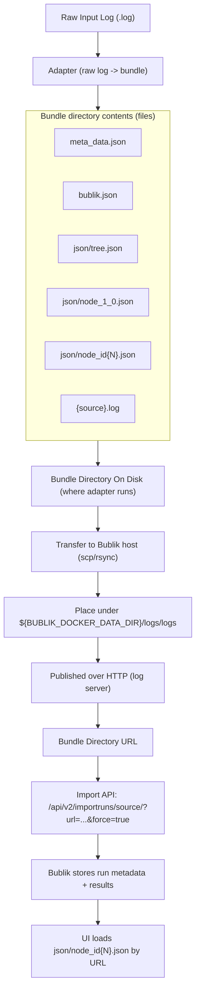

# Import From Raw Logs

This page outlines how any text-based logs can be integrated into Bublik. <br />
The approach is to use a Python conversion script that creates a
Bublik-importable run bundle similar to TE.

## Example Files

Use these downloadable example assets:

- Raw log example: [`example_raw.log`](./assets/example_raw.log)

### View Example Raw Log

```text
2026-04-21 12:00:00,000:[INFO    ][runner      ]  MI: FORMAT_VERSION value=2
2026-04-21 12:00:00,001:[INFO    ][runner      ]  MI: RUN_START name=example-ci
2026-04-21 12:00:00,002:[INFO    ][runner      ]  MI: RUN_META key=TS_NAME value=example-ci
2026-04-21 12:00:00,003:[INFO    ][runner      ]  MI: RUN_META key=PROJECT value=example
2026-04-21 12:00:00,004:[INFO    ][runner      ]  MI: RUN_META key=CFG value=lab-host-01
2026-04-21 12:00:00,005:[INFO    ][runner      ]  MI: RUN_META key=START_TIMESTAMP value=2026-04-21T12:00:00+03:00 type=timestamp
2026-04-21 12:00:00,006:[INFO    ][runner      ]  MI: RUN_TAG key=tester value=example-ci
2026-04-21 12:00:00,007:[INFO    ][runner      ]  MI: RUN_TAG key=device value=lab-host-01
2026-04-21 12:00:00,008:[INFO    ][runner      ]  MI: RUN_TAG key=lab value=alpha-lab
2026-04-21 12:00:00,009:[INFO    ][runner      ]  MI: RUN_TAG key=log_dir value=/var/log/example-ci
2026-04-21 12:00:00,010:[INFO    ][runner      ]  MI: RUN_OBJECTIVE text="Demonstrate MI v2 raw-log conversion into a Bublik bundle."
2026-04-21 12:00:00,020:[INFO    ][runner      ]  MI: TEST_START name=prologue
2026-04-21 12:00:00,021:[INFO    ][runner      ]  MI: TEST_PARAM key=os value=ubuntu-24.04
2026-04-21 12:00:00,022:[INFO    ][runner      ]  MI: TEST_PARAM key=kernel value=6.8.0
2026-04-21 12:00:00,023:[INFO    ][runner      ]  MI: TEST_OBJECTIVE text="Prepare the host and confirm the test rig is ready."
2026-04-21 12:00:00,024:[INFO    ][runner      ]  MI: STEP text="Load drivers"
2026-04-21 12:00:00,025:[INFO    ][host_setup  ]  Loading nvme and vfio drivers
2026-04-21 12:00:00,026:[INFO    ][host_setup  ]  Module nvme loaded successfully
2026-04-21 12:00:00,027:[INFO    ][host_setup  ]  Module vfio-pci loaded successfully
2026-04-21 12:00:00,030:[INFO    ][runner      ]  MI: STEP text="Check device visibility"
2026-04-21 12:00:00,031:[INFO    ][host_setup  ]  Found /dev/nvme0n1
2026-04-21 12:00:00,032:[INFO    ][host_setup  ]  PCI address 0000:03:00.0 is present in lspci output
2026-04-21 12:00:00,040:[INFO    ][runner      ]  MI: RESULT status=PASSED expected=PASSED
2026-04-21 12:00:00,041:[INFO    ][runner      ]  MI: TEST_END name=prologue status=PASSED
2026-04-21 12:00:00,050:[INFO    ][runner      ]  MI: PACKAGE_START name=storage
2026-04-21 12:00:00,051:[INFO    ][runner      ]  MI: PACKAGE_PARAM key=transport value=tcp
2026-04-21 12:00:00,052:[INFO    ][runner      ]  MI: PACKAGE_PARAM key=lab_mode value=regression
2026-04-21 12:00:00,053:[INFO    ][runner      ]  MI: PACKAGE_OBJECTIVE text="Run storage-oriented qualification scenarios."
2026-04-21 12:00:00,060:[INFO    ][runner      ]  MI: PACKAGE_START name=identify
2026-04-21 12:00:00,061:[INFO    ][runner      ]  MI: PACKAGE_OBJECTIVE text="Verify identify data remains stable across iterations."
2026-04-21 12:00:00,062:[INFO    ][runner      ]  MI: TEST_START name=identify_basic
2026-04-21 12:00:00,063:[INFO    ][runner      ]  MI: TEST_PARAM key=tool value=nvme-cli
2026-04-21 12:00:00,064:[INFO    ][runner      ]  MI: TEST_OBJECTIVE text="Confirm controller and namespace identify output is consistent."
2026-04-21 12:00:00,065:[INFO    ][runner      ]  MI: ITERATION_START name=identify_basic tin=0
2026-04-21 12:00:00,066:[INFO    ][runner      ]  MI: ITERATION_PARAM key=namespace value=1
2026-04-21 12:00:00,067:[INFO    ][runner      ]  MI: ITERATION_OBJECTIVE text="Capture the initial identify snapshot."
2026-04-21 12:00:00,068:[INFO    ][runner      ]  MI: STEP text="Read controller identify data"
2026-04-21 12:00:00,069:[INFO    ][nvmecli     ]  nvme id-ctrl /dev/nvme0
2026-04-21 12:00:00,069:[INFO    ][nvmecli     ]  mn ExampleDrive 4TB
2026-04-21 12:00:00,070:[INFO    ][nvmecli     ]  fr 1.2.3
2026-04-21 12:00:00,070:[INFO    ][runner      ]  MI: RESULT status=PASSED expected=PASSED
2026-04-21 12:00:00,071:[INFO    ][runner      ]  MI: ITERATION_END name=identify_basic tin=0 status=PASSED
2026-04-21 12:00:00,072:[INFO    ][runner      ]  MI: ITERATION_START name=identify_basic tin=1
2026-04-21 12:00:00,073:[INFO    ][runner      ]  MI: ITERATION_PARAM key=namespace value=1
2026-04-21 12:00:00,074:[INFO    ][runner      ]  MI: ITERATION_OBJECTIVE text="Repeat identify collection after a short delay."
2026-04-21 12:00:00,075:[INFO    ][runner      ]  MI: STEP text="Read namespace identify data"
2026-04-21 12:00:00,076:[INFO    ][nvmecli     ]  nvme id-ns /dev/nvme0n1
2026-04-21 12:00:00,076:[INFO    ][nvmecli     ]  nsze 7814037168
2026-04-21 12:00:00,077:[INFO    ][nvmecli     ]  ncap 7814037168
2026-04-21 12:00:00,077:[INFO    ][runner      ]  MI: RESULT status=PASSED expected=FAILED
2026-04-21 12:00:00,078:[WARN    ][runner      ]  MI: VERDICT text="Operation unexpectedly succeeded"
2026-04-21 12:00:00,078:[INFO    ][runner      ]  MI: ITERATION_END name=identify_basic tin=1 status=PASSED
2026-04-21 12:00:00,079:[INFO    ][runner      ]  MI: TEST_END name=identify_basic status=PASSED
2026-04-21 12:00:00,080:[INFO    ][runner      ]  MI: PACKAGE_END name=identify
2026-04-21 12:00:00,090:[INFO    ][runner      ]  MI: PACKAGE_START name=io
2026-04-21 12:00:00,091:[INFO    ][runner      ]  MI: PACKAGE_OBJECTIVE text="Measure throughput and latency under representative IO mixes."
2026-04-21 12:00:00,092:[INFO    ][runner      ]  MI: TEST_START name=throughput_rw
2026-04-21 12:00:00,093:[INFO    ][runner      ]  MI: TEST_PARAM key=tool value=fio
2026-04-21 12:00:00,094:[INFO    ][runner      ]  MI: TEST_PARAM key=io_pattern value=rw
2026-04-21 12:00:00,095:[INFO    ][runner      ]  MI: TEST_OBJECTIVE text="Check sustained mixed read/write throughput."
2026-04-21 12:00:00,096:[INFO    ][runner      ]  MI: ITERATION_START name=throughput_rw tin=0
2026-04-21 12:00:00,097:[INFO    ][runner      ]  MI: ITERATION_PARAM key=block_size value=128k
2026-04-21 12:00:00,098:[INFO    ][runner      ]  MI: ITERATION_PARAM key=duration_sec value=10
2026-04-21 12:00:00,099:[INFO    ][runner      ]  MI: ITERATION_OBJECTIVE text="Baseline mixed throughput run without warmup."
2026-04-21 12:00:00,100:[INFO    ][runner      ]  MI: STEP text="Prepare fio job file"
2026-04-21 12:00:00,100:[INFO    ][fio         ]  Writing job file /tmp/rw-128k.fio
2026-04-21 12:00:00,101:[INFO    ][runner      ]  MI: STEP text="Run fio"
2026-04-21 12:00:00,102:[INFO    ][fio         ]  fio job rw-128k started
2026-04-21 12:00:05,000:[INFO    ][fio         ]  Jobs: 1 (f=1): [m(1)][50.0%][r=612MiB/s,w=404MiB/s][r=4892,w=3236 IOPS][eta 00m:05s]
2026-04-21 12:00:09,900:[INFO    ][fio         ]  Jobs: 1 (f=1): [m(1)][99.0%][r=621MiB/s,w=410MiB/s][r=4968,w=3280 IOPS][eta 00m:00s]
2026-04-21 12:00:10,100:[INFO    ][runner      ]  MI: MEASUREMENT name=read_bw_mib_s value=620.5 units=MiB/s tool=fio stage=throughput side=read
2026-04-21 12:00:10,101:[INFO    ][runner      ]  MI: MEASUREMENT name=write_bw_mib_s value=410.2 units=MiB/s tool=fio stage=throughput side=write
2026-04-21 12:00:10,102:[INFO    ][runner      ]  MI: ARTIFACT name=write_io value="158GiB (170GB)"
2026-04-21 12:00:10,103:[INFO    ][runner      ]  MI: RESULT status=FAILED expected=PASSED err="Unexpected test result(s)"
2026-04-21 12:00:10,104:[ERROR   ][runner      ]  MI: VERDICT text="Bandwidth below threshold"
2026-04-21 12:00:10,105:[INFO    ][runner      ]  MI: ITERATION_END name=throughput_rw tin=0 status=FAILED
2026-04-21 12:00:10,106:[INFO    ][runner      ]  MI: ITERATION_START name=throughput_rw tin=1
2026-04-21 12:00:10,107:[INFO    ][runner      ]  MI: ITERATION_PARAM key=block_size value=128k
2026-04-21 12:00:10,108:[INFO    ][runner      ]  MI: ITERATION_PARAM key=duration_sec value=10
2026-04-21 12:00:10,109:[INFO    ][runner      ]  MI: ITERATION_PARAM key=warmup_sec value=2
2026-04-21 12:00:10,110:[INFO    ][runner      ]  MI: ITERATION_OBJECTIVE text="Repeat the throughput run with warmup enabled."
2026-04-21 12:00:10,111:[INFO    ][runner      ]  MI: STEP text="Prepare fio job file"
2026-04-21 12:00:10,111:[INFO    ][fio         ]  Writing job file /tmp/rw-128k-warmup.fio
2026-04-21 12:00:10,112:[INFO    ][runner      ]  MI: STEP text="Run fio"
2026-04-21 12:00:10,113:[INFO    ][fio         ]  fio job rw-128k started
2026-04-21 12:00:12,200:[INFO    ][fio         ]  Warmup phase completed
2026-04-21 12:00:18,000:[INFO    ][fio         ]  Jobs: 1 (f=1): [m(1)][78.0%][r=657MiB/s,w=431MiB/s][r=5256,w=3448 IOPS][eta 00m:02s]
2026-04-21 12:00:20,111:[INFO    ][runner      ]  MI: MEASUREMENT name=read_bw_mib_s value=655.0 units=MiB/s tool=fio stage=throughput side=read
2026-04-21 12:00:20,112:[INFO    ][runner      ]  MI: MEASUREMENT name=write_bw_mib_s value=430.0 units=MiB/s tool=fio stage=throughput side=write
2026-04-21 12:00:20,113:[INFO    ][runner      ]  MI: ARTIFACT name=write_io value="159GiB (171GB)"
2026-04-21 12:00:20,114:[INFO    ][runner      ]  MI: RESULT status=FAILED expected=FAILED
2026-04-21 12:00:20,115:[WARN    ][runner      ]  MI: VERDICT text="Known limitation reproduced"
2026-04-21 12:00:20,116:[INFO    ][runner      ]  MI: ITERATION_END name=throughput_rw tin=1 status=FAILED
2026-04-21 12:00:20,116:[INFO    ][runner      ]  MI: TEST_END name=throughput_rw status=FAILED
2026-04-21 12:00:20,120:[INFO    ][runner      ]  MI: TEST_START name=latency_randread
2026-04-21 12:00:20,121:[INFO    ][runner      ]  MI: TEST_PARAM key=tool value=fio
2026-04-21 12:00:20,122:[INFO    ][runner      ]  MI: TEST_PARAM key=io_pattern value=randread
2026-04-21 12:00:20,123:[INFO    ][runner      ]  MI: TEST_OBJECTIVE text="Check tail latency under random reads."
2026-04-21 12:00:20,124:[INFO    ][runner      ]  MI: ITERATION_START name=latency_randread tin=0
2026-04-21 12:00:20,125:[INFO    ][runner      ]  MI: ITERATION_PARAM key=iodepth value=32
2026-04-21 12:00:20,126:[INFO    ][runner      ]  MI: ITERATION_OBJECTIVE text="Confirm the latency scenario is intentionally skipped in this environment."
2026-04-21 12:00:20,127:[INFO    ][runner      ]  MI: STEP text="Evaluate random-read prerequisites"
2026-04-21 12:00:20,128:[INFO    ][fio         ]  Random-read profile disabled by lab policy
2026-04-21 12:00:20,129:[INFO    ][runner      ]  MI: RESULT status=SKIPPED expected=SKIPPED
2026-04-21 12:00:20,130:[INFO    ][runner      ]  MI: ITERATION_END name=latency_randread tin=0 status=SKIPPED
2026-04-21 12:00:30,130:[INFO    ][runner      ]  MI: ITERATION_START name=latency_randread tin=1
2026-04-21 12:00:30,131:[INFO    ][runner      ]  MI: ITERATION_PARAM key=iodepth value=64
2026-04-21 12:00:30,132:[INFO    ][runner      ]  MI: ITERATION_OBJECTIVE text="Show an unexpected skip when the scenario should have run."
2026-04-21 12:00:30,133:[INFO    ][runner      ]  MI: STEP text="Evaluate random-read prerequisites"
2026-04-21 12:00:30,134:[WARN    ][fio         ]  Random-read profile unavailable due to missing dataset
2026-04-21 12:00:30,135:[INFO    ][runner      ]  MI: RESULT status=SKIPPED expected=PASSED
2026-04-21 12:00:30,136:[WARN    ][runner      ]  MI: VERDICT text="Random-read path was unexpectedly unavailable"
2026-04-21 12:00:30,137:[INFO    ][runner      ]  MI: ITERATION_END name=latency_randread tin=1 status=SKIPPED
2026-04-21 12:00:30,138:[INFO    ][runner      ]  MI: TEST_END name=latency_randread status=SKIPPED
2026-04-21 12:00:40,137:[INFO    ][runner      ]  MI: PACKAGE_END name=io
2026-04-21 12:00:40,150:[INFO    ][runner      ]  MI: PACKAGE_START name=reliability
2026-04-21 12:00:40,151:[INFO    ][runner      ]  MI: PACKAGE_OBJECTIVE text="Verify recovery after disruptive operations."
2026-04-21 12:00:40,152:[INFO    ][runner      ]  MI: TEST_START name=power_cycle_recovery
2026-04-21 12:00:40,153:[INFO    ][runner      ]  MI: TEST_PARAM key=cycles value=2
2026-04-21 12:00:40,154:[INFO    ][runner      ]  MI: TEST_OBJECTIVE text="Confirm the device returns online after power cycling."
2026-04-21 12:00:40,155:[INFO    ][runner      ]  MI: ITERATION_START name=power_cycle_recovery tin=0
2026-04-21 12:00:40,156:[INFO    ][runner      ]  MI: ITERATION_PARAM key=cycle value=1
2026-04-21 12:00:40,157:[INFO    ][runner      ]  MI: ITERATION_OBJECTIVE text="Execute the first power-cycle recovery pass."
2026-04-21 12:00:40,158:[INFO    ][runner      ]  MI: STEP_PUSH text="Power cycle rig"
2026-04-21 12:00:40,159:[INFO    ][powerctl    ]  Powering the rig off
2026-04-21 12:00:40,500:[WARN    ][powerctl    ]  PCIe link lost as expected
2026-04-21 12:00:41,000:[INFO    ][powerctl    ]  Powering the rig on
2026-04-21 12:00:41,001:[INFO    ][runner      ]  MI: STEP_POP text="Power cycle rig"
2026-04-21 12:00:41,002:[INFO    ][runner      ]  MI: STEP text="Wait for device enumeration"
2026-04-21 12:00:41,003:[INFO    ][nvmecli     ]  nvme list shows /dev/nvme0n1
2026-04-21 12:00:41,003:[INFO    ][dmesg       ]  nvme nvme0: 8/0/0 default/read/poll queues
2026-04-21 12:00:41,004:[WARN    ][watchdog    ]  Recovery watchdog terminated the validation flow after timeout
2026-04-21 12:00:41,005:[INFO    ][runner      ]  MI: RESULT status=KILLED expected=KILLED
2026-04-21 12:00:41,006:[WARN    ][runner      ]  MI: VERDICT text="Watchdog kill was expected for this negative case"
2026-04-21 12:00:41,007:[INFO    ][runner      ]  MI: ITERATION_END name=power_cycle_recovery tin=0 status=KILLED
2026-04-21 12:00:41,006:[INFO    ][runner      ]  MI: ITERATION_START name=power_cycle_recovery tin=1
2026-04-21 12:00:41,007:[INFO    ][runner      ]  MI: ITERATION_PARAM key=cycle value=2
2026-04-21 12:00:41,008:[INFO    ][runner      ]  MI: ITERATION_OBJECTIVE text="Repeat the power-cycle recovery pass."
2026-04-21 12:00:41,009:[INFO    ][runner      ]  MI: STEP_PUSH text="Power cycle rig"
2026-04-21 12:00:41,010:[INFO    ][powerctl    ]  Powering the rig off
2026-04-21 12:00:41,400:[WARN    ][powerctl    ]  Link training reset in progress
2026-04-21 12:00:42,000:[INFO    ][powerctl    ]  Powering the rig on
2026-04-21 12:00:42,001:[INFO    ][runner      ]  MI: STEP_POP text="Power cycle rig"
2026-04-21 12:00:42,002:[INFO    ][runner      ]  MI: STEP text="Wait for device enumeration"
2026-04-21 12:00:42,003:[INFO    ][nvmecli     ]  nvme list shows /dev/nvme0n1
2026-04-21 12:00:42,003:[INFO    ][dmesg       ]  nvme nvme0: Shutdown timeout set to 8 seconds
2026-04-21 12:00:42,004:[ERROR   ][watchdog    ]  Recovery helper dumped core while validating namespaces
2026-04-21 12:00:42,005:[INFO    ][runner      ]  MI: RESULT status=CORED expected=PASSED
2026-04-21 12:00:42,006:[ERROR   ][runner      ]  MI: VERDICT text="Recovery helper crashed unexpectedly"
2026-04-21 12:00:42,007:[INFO    ][runner      ]  MI: ITERATION_END name=power_cycle_recovery tin=1 status=CORED
2026-04-21 12:00:42,008:[INFO    ][runner      ]  MI: TEST_END name=power_cycle_recovery status=FAILED
2026-04-21 12:00:42,007:[INFO    ][runner      ]  MI: PACKAGE_END name=reliability
2026-04-21 12:00:42,010:[INFO    ][runner      ]  MI: PACKAGE_END name=storage
2026-04-21 12:00:42,020:[INFO    ][runner      ]  MI: RUN_END name=example-ci
```

- Reference converter: [`example_converter.py`](./assets/example_converter.py)
- Example bundle generated ready for import [`example-bundle.tar.gz`](./assets/example-bundle.tar.gz)

The attached raw log and converter show one recommended approach for:

- one run-level prologue represented as an ordinary child test under the root;
- one main parent package with three subpackages;
- logical tests and iterations;
- event-based MI records with no multiline machine-readable blocks;
- derived UI routing for `entity_name` and `user_name`.

:::note
Note that you can take your own approach as long as the resulting JSON and file
structure comply with Bublik requirements. We recommend reserving `MI: ` lines
for machine-readable data that the converter maps into `bublik.json`,
`meta_data.json`, and `json/node_*.json`.
:::

## Conventions (what the converter should rely on)

- **Timestamped message lines**: `YYYY-MM-DD HH:MM:SS,mmm:[LEVEL][ENTITY]  message...`
- **Machine-readable prefix**: every structured line that should affect the generated bundle starts with `MI: `.
- **Single-line events**: each machine-readable record is one line in the form `MI: 
The actual conversion step is responsible for mapping this structure into
Bublik’s import bundle format.
:::

## Example hierarchy

The example assets in this directory use this fixed structure:

```text
example-ci
├── prologue
└── storage
    ├── identify
    │   └── identify_basic
    │       ├── tin=0
    │       └── tin=1
    ├── io
    │   ├── throughput_rw
    │   │   ├── tin=0
    │   │   └── tin=1
    │   └── latency_randread
    │       ├── tin=0
    │       └── tin=1
    └── reliability
        └── power_cycle_recovery
            ├── tin=0
            └── tin=1
```

## Recommended mapping from raw logs

- `MI: FORMAT_VERSION value=2` declares the event contract version.
- `MI: RUN_META key=<name> value=<value>` feeds `meta_data.json`; the converter may add derived metas such as `FINISH_TIMESTAMP`, `RUN_STATUS`, and `RUN_OK`.
- `MI: RUN_TAG key=<name> value=<value>` feeds top-level `bublik.json.tags`.
- `MI: TEST_START name=prologue` at the run root populates an ordinary root child `test` node named `prologue` before package tests.
- `MI: PACKAGE_START` creates a `pkg` node in `bublik.json` and pushes it onto the current hierarchy stack.
- Nested packages become nested `pkg` nodes in both `plan` and `iters`.
- `MI: TEST_START` identifies the logical test under the current package path.
- `MI: ITERATION_START` identifies one executable leaf `test` node under that logical test.
- If one logical test has multiple iterations, prefer a parent grouping node for the logical test and one leaf `test` node per iteration.
- `MI: PACKAGE_PARAM`, `MI: TEST_PARAM`, and `MI: ITERATION_PARAM` map to the matching node `params`.
- `MI: RUN_OBJECTIVE`, `MI: TEST_OBJECTIVE`, `MI: PACKAGE_OBJECTIVE`, and `MI: ITERATION_OBJECTIVE` map to the matching node `objective`.
- `MI: RESULT`, `MI: VERDICT`, `MI: ARTIFACT`, and `MI: MEASUREMENT` populate node result data and UI rows without parsing free text.
- Raw logs do **not** carry `entity_name` or `user_name`; the converter derives those from event type and scope when building `json/node_*.json`.

## What Bublik needs to import (bundle requirements)

Bublik imports a **bundle directory** available over HTTP.

## Bundle layout (example)

```text
${BUBLIK_DOCKER_DATA_DIR}/logs/logs/.../bundle-dir
|-- bublik.json
|-- meta_data.json
|-- json
|   |-- tree.json
|   |-- node_1_0.json
|   |-- node_id1.json
|   |-- node_id2.json
|   |-- ...
|   `-- node_id{N}.json
`-- {source}.log
```

### `bublik.json`

- **Purpose:** main run import file — execution plan, iteration tree, package/test nodes, timestamps, obtained and expected results, verdicts, errors, artifacts, measurements, tags, and display paths.
- **Database import:** required.
- **Log UI:** required indirectly (drives node JSON generation).
- **Data Contract:** [`bublik.json` Data Contract](/publish/import-from-raw-logs/bublik-json#data-contract)
- **Details:** see [`bublik.json`](/publish/import-from-raw-logs/bublik-json).

### `meta_data.json`

- **Purpose:** run metadata — test suite, configuration, device, start/finish timestamps, project, run status, optional extra metas.
- **Database import:** required.
- **Log UI:** used for run identity and filters.
- **Data Contract:** [`meta_data.json` Data Contract](/publish/import-from-raw-logs/meta-data-json#data-contract)
- **Details:** see [`meta_data.json`](/publish/import-from-raw-logs/meta-data-json).

### `json/tree.json`

- **Purpose:** navigation index — maps node JSON filenames to a tree structure for the log UI (`main_package` plus per-file entries and optional `children`).
- **Database import:** not required.
- **Log UI:** required for navigation as produced by this bundle format.
- **Data Contract:** [`UI Log JSON` Data Contract](/publish/import-from-raw-logs/ui-log-json#data-contract)
- **Details:** see [UI log JSON](/publish/import-from-raw-logs/ui-log-json).

### `json/node_1_0.json`

- **Purpose:** root package log-viewer JSON for the full run.
- **Database import:** not required.
- **Log UI:** required for the full run log view.
- **Data Contract:** [`UI Log JSON` Data Contract](/publish/import-from-raw-logs/ui-log-json#data-contract)
- **Details:** see [UI log JSON](/publish/import-from-raw-logs/ui-log-json).

### `json/node_id1.json`

- **Purpose:** same content as `node_1_0.json` — compatibility with UI/proxy paths that address the root node by test id (`test_id` 1).
- **Database import:** not required.
- **Log UI:** recommended.
- **Data Contract:** [`UI Log JSON` Data Contract](/publish/import-from-raw-logs/ui-log-json#data-contract)
- **Details:** see [UI log JSON](/publish/import-from-raw-logs/03-ui-log-json).

### `json/node_id{N}.json`

- **Purpose:** per-iteration log pages for packages and tests.
- **Database import:** not required.
- **Log UI:** required for individual package/test log pages.
- **Data Contract:** [`UI Log JSON` Data Contract](/publish/import-from-raw-logs/ui-log-json#data-contract)
- **Details:** see [UI log JSON](/publish/import-from-raw-logs/ui-log-json).

### `{source}.log`

- **Purpose:** copy of the original input for traceability and parser debugging.
- **Database import:** not used directly.
- **Log UI:** optional (not loaded as structured log JSON).
- **Data Contract:** none — auxiliary source copy, not part of the importer/UI JSON contract.

**Summary:** database import needs `bublik.json` and `meta_data.json`. Opening logs in the UI needs the `json/` directory.

## Import flow (diagram)



## Step-by-step import

1. **Convert raw log → bundle directory**
   - Produce the bundle files listed above.
   - Example:

```bash
python3 example_converter.py \
  example_raw.log \
  -o /tmp/example-bundle \
  --pretty
```

The script writes:

- `bublik.json`
- `meta_data.json`
- `json/tree.json`
- `json/node_1_0.json`
- `json/node_id1.json`
- `json/node_id<N>.json`
- a copy of the source log

2. **Transfer bundle directory to the Bublik host**
   - If you generated the bundle on a different machine, copy the whole bundle directory to the host where Bublik is running.
   - Example:

```bash
scp -r /path/to/bundle-dir user@<bublik_host>:/tmp/bundle-dir
```

3. **Publish the bundle directory**
   - Place the bundle directory anywhere under `${BUBLIK_DOCKER_DATA_DIR}/logs/logs/` (you can add any nesting and use any folder names).
   - Confirm it is accessible as a **directory URL** under `http://<bublik_host>/logs/.../` (you should see `meta_data.json`, `bublik.json`, and `json/`).
   - Example on the Bublik host:

```bash
mkdir -p ${BUBLIK_DOCKER_DATA_DIR}/logs/logs/example
cp -R /tmp/example-bundle ${BUBLIK_DOCKER_DATA_DIR}/logs/logs/example/
```

4. **Import into Bublik**

```bash
curl 'http://<bublik_host>/api/v2/importruns/source/?url=http://<bublik_host>/logs/example/example-bundle&force=true'
```

## Quick checklist

- `meta_data.json` has `PROJECT`, `RUN_STATUS`, and stable run key metas (typically `START_TIMESTAMP` + `CFG`).
- Raw logs use single-line `MI:` events with explicit run/prologue/package/test/iteration lifecycle markers.
- Package-, test-, iteration-, and prologue-scoped parameters are logged separately and mapped to the correct node.
- Every test iteration has a deterministic name/path and a single final status (`PASSED`/`FAILED`/`INCOMPLETE`/...).
- Measurements appear under the same test node they were produced by (not at run level), otherwise charts may not show up where expected.
- Raw logs contain enough structure for the converter to derive the main test entity and scenario rows for `#Scenario` / `#Test`.
